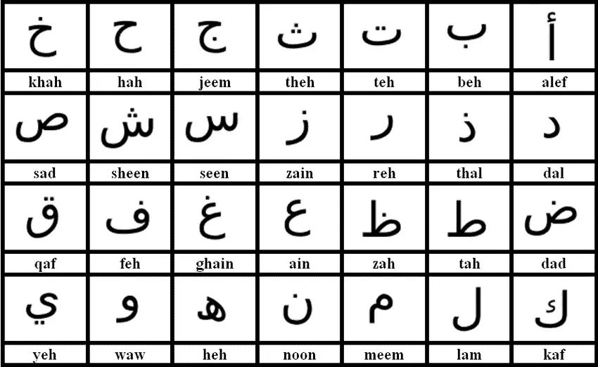
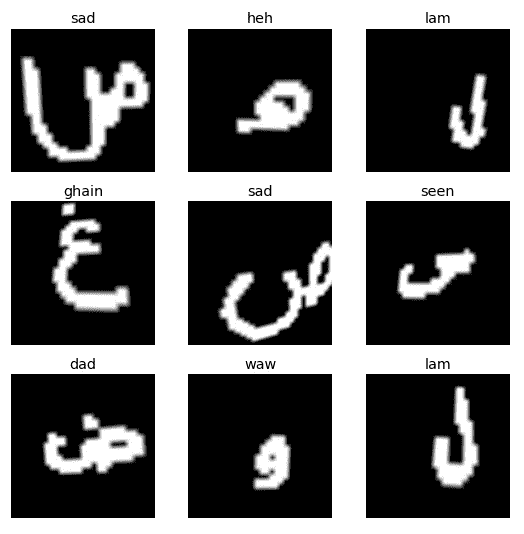
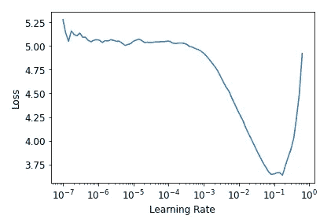
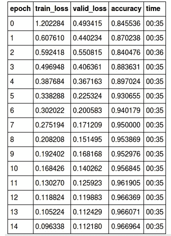
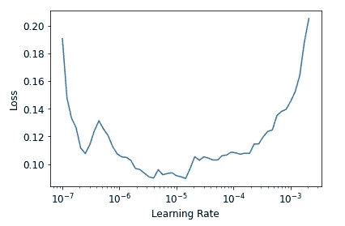
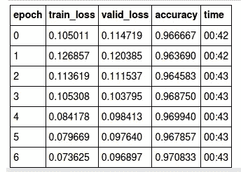
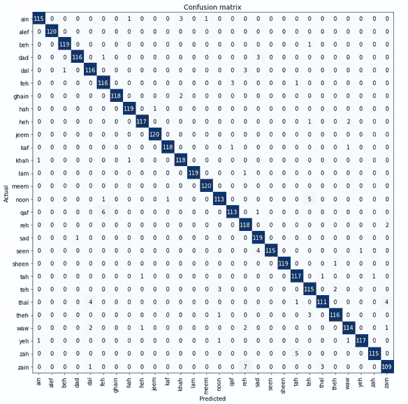
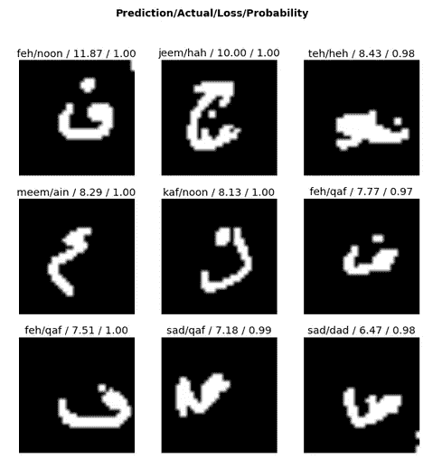

# Fastai v2 —阿拉伯字符识别的端到端深度学习教程

> 原文：<https://medium.com/analytics-vidhya/fastai-v2-an-end-to-end-deep-learning-tutorial-for-arabic-character-recognition-afd42aa218c8?source=collection_archive---------14----------------------->



完整的代码可以在 GitHub 上找到，它有一个多功能的 [jupyter 笔记本](https://github.com/AnelMusic/Arabic_MNIST_Character_Classification/blob/master/Arabic_MNIST_Character_Classification.ipynb)。

# **简单地说:**

随着今天机器学习的快速发展，很难想象即使在几年前，鲁棒的字符识别也会带来真正的挑战。从那以后，著名的 [MNIST](http://yann.lecun.com/exdb/mnist/) 数据集被世界各地的研究人员用来训练新的算法。今天，MNIST 对现代神经网络来说几乎没有挑战。受此启发，2017 年一个研究小组开始对阿拉伯字母进行分类。Ahmed El-Sawy、Mohamed Loey 和 Hazem EL-Bakry 在他们的工作“使用卷积神经网络的阿拉伯手写字符识别，WSEAS，2017”中实现了 94.1%的准确率。我们的目标是展示使用现代训练方法击败 2017 年的这一最先进的研究结果是多么容易。

**本文的目的**:

*   下载并解压缩数据集
*   加载和格式化图像，并编写自定义标签函数
*   将数据集分成训练集、验证集和测试集
*   使用迁移学习和 Resnet18 架构来训练多类分类器
*   使用微调和区别学习率，在 22 个训练周期内达到 97%的准确率
*   策划和解释培训结果

# 步骤 1:获取数据

该数据集包含 16800 幅阿拉伯字母手写字符的图像。每个图像的大小为 32x32 像素。训练集(13440 个图像，每个字符 490 个图像)和验证集(3360 个图像，每个字符 120 个图像)已经预定义。您可以从[这里](https://github.com/AnelMusic/Arabic_MNIST_Character_Classification/blob/master/arabic_mnist_dataset.tar.gz)直接下载数据集。下载后，您可以使用以下命令提取 tar.gz 文件:

```
tar -xzf arabic_mnist_dataset.tar.gz 
```

# 步骤 2:加载数据

导入 fastai 模块后:

```
from utils import *
from fastai2.vision.all import *
```

我们可以通过提供包含提取数据集的目录的完整路径来创建 path 对象:

```
# Show what's inside the directory
path = Path('/notebooks/storage/data/arabic_mnist')
path.ls()
```

**输出**:

(# 3)[Path('/notebooks/storage/data/Arabic _ mnist/train ')，Path('/notebooks/storage/data/Arabic _ mnist/)。ipynb_checkpoints ')、路径('/notebooks/storage/data/Arabic _ mnist/test ')]

这里，我们可以看到数据集由一个训练集和一个测试集组成。为了使用 fastai 的数据集分割方法

***grand parent splitter*(train _ name = ' train '，valid_name='valid')**

我们可以提供包含数据的文件夹的名称，也可以直接重命名文件夹。这里，我们将使用以下内容重命名目录:

```
# Rename test to valid
! mv {path / 'test'} {path / 'valid'}
```

# **步骤 3:查看数据文件名**

为了更好地理解数据和命名约定，我们可以打印训练集的文件名:

```
train_data = path/"train/train"
train_data.ls()[:10], len(train_data.ls())
```

**输出**:

((# 10)[Path('/notebooks/storage/data/Arabic _ Mn ist/train/train/id _ 5374 _ label _ 28 . png ')、Path('/notebooks/storage/data/Arabic _ Mn ist/train/train/id _ 8290 _ label _ 1 . png ')、Path('/notebooks/storage/data/Arabic _ Mn ist/train/id _ 3424 _ label _ 8 . png ')、Path('/notebooks/storage/data/Arabic _ Mn ist/train/train/id _ id _ 8 . png)

我们可以看到数据集的创建者使用了从 0 到 28 的数字标签，其中每个数字代表阿拉伯字母表中的一个字符。虽然使用这些数字标签是完全可能的，但是我们希望使用字符串标签来代替，以便于以后的解释。为此，图像的文件名必须映射到相应的标识符。

我们将首先创建一个简单的列表，其中包含我们想要使用的标签，而不是相应的数字标签:

```
arabic_mnist_labels = ['alef','beh','teh','theh','jeem','hah','khah','dal','thal','reh',
'zain','seen','sheen','sad','dad','tah','zah','ain','ghain','feh',
'qaf','kaf','lam','meem','noon','heh','waw','yeh']
```

现在，我们需要考虑如何将文件名映射到我们的 arabic_mnist_labels 字符串标识符。一种方便的方法是使用正则表达式。

> 正则表达式是一种特殊的字符序列，它使用模式中的特殊语法来帮助您匹配或查找其他字符串或字符串集

我们可以分析路径:*/笔记本/存储/数据/Arabic _ mnist/train/id 5374 label _ 28 . png*并等待"**标签**"后跟下划线" **_** "后跟数字" **28** "后跟"。 **png** “俺只抓数字。

事实证明，定义这种模式的一种方法是使用下面的正则表达式:

```
regex = "label_(.+).png"
```

有了这个正则表达式，我们现在可以定义自己的标签函数，为每个图像文件名返回相应的字符串标签。请记住，数字标签从 1–28 开始，而我们的 arabic_mnist_labels 从索引 0–27 开始。

```
def get_arabic_mnist_labels(file_path):
    regex = "label_(.+).png"
    label = re.search(regex, str(file_path)).group(1)
    return arabic_mnist_labels[int(label)-1] # adapt index
```

# 步骤 4:创建数据块对象

Fastai 的 Datablock 允许我们为我们的训练和验证集设置 Pytorch 的数据加载器，根据我们的需要分割数据并执行转换，如调整大小、旋转和标准化我们的数据。这里，我们将使用一个称为预调整的概念

```
arab_mnist = DataBlock(blocks = (ImageBlock, CategoryBlock),
                 get_items=get_image_files, 
                 splitter=GrandparentSplitter(),
                 get_y=get_arabic_mnist_labels, 
                       item_tfms=Resize(460),
                 batch_tfms=[*aug_transforms(do_flip = False,                    
                 size=224, min_scale=0.85), 
                 Normalize.from_stats(*imagenet_stats)]
                )
#source
dls = arab_mnist.dataloaders(path)
```

> **预调整尺寸**:首先，将图像调整到相对“大尺寸”的尺寸，即明显大于目标训练尺寸的尺寸。
> 
> 第二，将所有常见的扩充操作(包括调整到最终目标大小)组合成一个，并在处理结束时在 GPU 上仅执行一次组合操作，而不是单独执行它们并多次插值。

最后，我们可以检查标签以确保我们的自定义函数使用:

```
dls.show_batch(nrows=3, ncols=3)
```

**输出**:



到目前为止，数据看起来符合预期。我们的标签函数将数字标签映射到字符串标识符。

# 步骤 5:创建神经网络

由于我们的任务是对图像数据进行分类，我们将使用卷积神经网络。更准确地说，我们将使用 ResNet-18 架构:

> ResNet-18 是一个 18 层深的卷积神经网络。您可以加载网络的预训练版本，该网络在 ImageNet 数据库中的超过一百万个图像上进行训练

```
#Setup Neural Net
learn = cnn_learner(dls, resnet18, pretrained=True, loss_func = CrossEntropyLossFlat(), metrics=accuracy, model_dir="/tmp/model/")
```

为了使用功率转移学习，我们可以将 ***预训练*** 参数设置为**真**，尽管默认情况下它是真的。由于我们希望有一个分类器可以对两个以上的类别进行分类，但每个图像仅限于一个标签，因此我们将使用 [**交叉熵**](https://ml-cheatsheet.readthedocs.io/en/latest/loss_functions.html) 作为我们的损失函数。这里 fastai 将再次根据我们的数据块选择适当的损失函数，这里我们特别定义了参数 ***blocks*** 以包含图像和类别的块(*参见步骤 4* )。请记住，计算机需要损失函数来计算梯度，而精确度是我们人类可以理解和解释的度量。

# 第六步:训练神经网络

在我们开始训练神经网络之前，我们可以使用学习率查找器来选择合适的学习率:

```
learn.lr_find()
```

**输出**:



一个好的经验法则是选择接近最陡负斜率的学习率，最陡负斜率接近最小值，但不是最小值本身。在本例中，我们将选择 lr = 1e-2。

> **基本原理**:开始训练模型，同时将学习率从很低提高到很大，当损失开始真正失控时停止。绘制损失与学习率的关系图，选择一个比最小值稍大的值，此时损失仍会改善。

有关学习率查找器的更多信息，请参考莱斯利·n·史密斯的[这篇论文](https://arxiv.org/abs/1506.01186)。

1.  **培训**

首先，我们将使用[一次循环训练策略](https://arxiv.org/pdf/1803.09820.pdf)训练神经网络 15 个时期，并监控*training _ loss*以及 *validation_loss* 以确保我们没有欠拟合或过拟合:

> **单周期策略**:首先将学习速率缓慢增加到最大值(由学习速率探测器提供),然后再次降低，这样可以更快地训练复杂网络，并且精度相同或更高

```
lr = 1e-2
learn.fit_one_cycle(15, lr)
```

**输出**:



结果显示，经过 15 个时期的训练，我们实现了 96.67%的分类准确率，因此已经超过了 2017 年的最高水平。然而，我们可以做得更好。默认情况下，18 层 ResNet-18 的起始层是冻结的，这意味着我们的训练不会影响这些层，相应的权重也不会更新。我们可以解冻这些层来训练完整的神经网络:

> **微调:**微调是一个过程，采用一个已经为给定任务训练过的网络模型，并使其执行第二个类似的任务。

```
learn.unfreeze()
```

现在，我们可以使用学习率查找器选择一个新的学习率:

```
learn.lr_find()
```

**输出:**



由于第一层现在已经解冻，我们将使用区别学习率，这意味着第一层将以较低的学习率进行训练，而需要适应我们特定领域的最后一层将以较高的学习率进行训练。我们可以通过提供一个包含(min_lr 和 max_lr)的 slice 对象来告诉 fastai 使用区别学习率:

```
learn.fit_one_cycle(7, lr_max=slice(10e-6, 1e-4))
```

**输出:**



正如我们所看到的，我们的最终精度达到了 **97.08** %。在这一点上，我们对结果感到满意。如果 *train_loss* 比 *valid_loss 稍小，不要对出现的轻微过拟合感到吃惊。*一些深度学习理论家可能会反对这一点，但在实践中，稍微过度适应实际上是好的。我们最终感兴趣的是我们的度量(这里是准确度)尽可能高，并且有效损失尽可能低。

# 第七步:分析结果

分析结果的一种方法是查看混淆矩阵。

> 混淆矩阵:混淆矩阵，也称为误差矩阵，是一种特定的表格布局，允许算法性能的可视化。矩阵的每一行代表预测类中的实例，而每一列代表实际类中的实例

由于数据集有 28 个类，分析混淆矩阵有点麻烦。

```
interp = ClassificationInterpretation.from_learner(learn)
interp.plot_confusion_matrix(figsize=(12,12), dpi=60)
```

**输出:**



除了矩阵，我们还可以只查看最常相互混淆的类别:

```
interp.most_confused(min_val=3)
```

**输出:**

[('zain '，' reh '，7)、(' qaf '，' feh '，6)、(' noon '，' teh '，5)、(' zah '，' tah '，5)、(' seen '，' sad '，4)、(' thal '，' dal '，4)、(' thal '，' zain '，4)、(' ain '，' khah '，3)、(' dad '，' sad '，3)、(' dal '，' reh '，3)、(' feh '，' qaf '，3)、(' teh '，' noon '，3)、(' theh '，' teh '，3)、(' zain

最后，我们可以查看导致最高损失或对降低模型准确性贡献最大的分类:

```
interp.plot_top_losses(9, figsize=(10,10))
```



在与以阿拉伯语为母语的人交谈后，我们发现清理数据集将显著提高准确性，因此许多字符写得很差。在谷歌上快速搜索证实，上面输出的第一幅图像(feh/noon)也可能被人类错误地分类。

# 最后的话

没有遗言。只要上 GitHub，克隆这个[库](https://github.com/AnelMusic/Arabic_MNIST_Character_Classification)，你就可以开始了。

我希望你喜欢它。