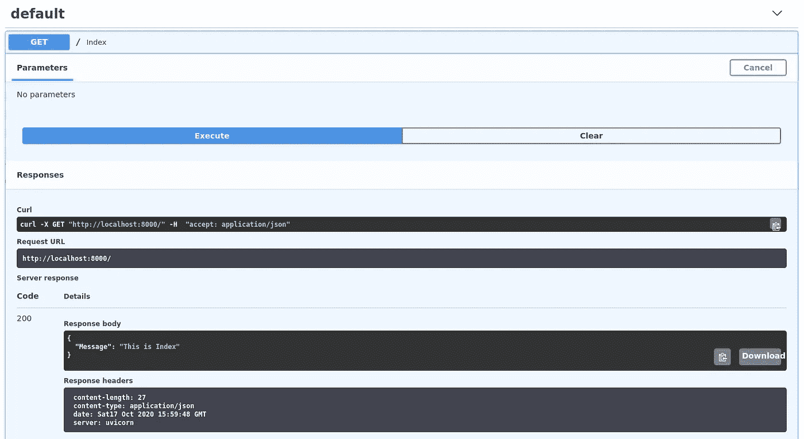

# 使用 FastAPI 逐步部署深度学习模型

> 原文：<https://medium.com/analytics-vidhya/fastapi-for-serve-simple-deep-learning-models-step-by-step-d054cf240a4c?source=collection_archive---------5----------------------->


卢克·切瑟在 [Unsplash](https://unsplash.com?utm_source=medium&utm_medium=referral) 上的照片

[FastAPI](https://fastapi.tiangolo.com) 如今越来越受欢迎，因为它的性能和简单易学。

在本文中，我将展示如何使用 Keras 创建模型，以及如何使用 FastAPI 服务模型。

# 使用 Keras 创建模型

在本节中，我们将学习如何使用 Keras 和深度学习来执行回归。我们将学习如何为回归和连续值预测训练 Keras 模型，特别是在简单函数预测的上下文中。

举个例子，如果你在为这样的函数写代码，你已经知道规则了。

```
def f(x):
    y = (2 * x) - 1
    return y
```

那么，你如何训练一个神经网络来完成同样的任务呢？用数据！通过给它输入 X 的集合，和 Y 的集合，它应该能弄清楚它们之间的关系。

想象一下数据是:

```
xs = np.array([-1.0,  0.0, 1.0, 2.0, 3.0, 4.0], dtype=float)ys = np.array([-3.0, -1.0, 1.0, 3.0, 5.0, 7.0], dtype=float)
```

接下来，我们将创建尽可能简单的神经网络。

```
import tensorflow as tf
import numpy as np
from tensorflow import kerasmodel = tf.keras.Sequential([
   keras.layers.Dense(units=4, input_shape=[1]),
   keras.layers.Dense(units=8),
   keras.layers.Dense(units=1),
   ])model.summary()
```


模型.摘要()

如果你想看模型图，我们可以用 keras utils 来看。

```
tf.keras.utils.plot_model(model, show_shapes=True)
```


Keras 模型图

接下来我们将输入一些数据。在这种情况下，我们取 6x 和 6y。你可以看到它们之间的关系是 y = 2x-1。

```
xs = np.array([-1.0,  0.0, 1.0, 2.0, 3.0, 4.0], dtype=float)
ys = np.array([-3.0, -1.0, 1.0, 3.0, 5.0, 7.0], dtype=float)model.compile(optimizer='sgd', loss='mean_squared_error')model.fit(xs, ys, epochs=100)
```

好了，现在我们有了一个模型，它已经被训练来学习 X 和 Y 之间的关系。你可以使用 **model.predict** 方法来计算出先前未知的 X 的 Y。例如，如果 X = 10，那么你认为 Y 会是多少？

```
print(model.predict([10.0])
```


预测模型的结果([10])

你可能有强硬的 19 权利，但它结束了有点下。为什么？？

记住神经网络处理概率。只有 6 个数据点，我们无法确定答案。因此，10 的结果非常接近 19，但不一定是 19。

然后用 model.save('model ')保存模型。

```
model.save('model')
```

它将创建名为 model 的新文件夹。在下一篇教程中，我们将使用该模型通过 FastAPI 创建 API。

# 带有 Keras 模型的 FastAPI

首先，您必须确保您已经安装了所有的需求。

```
pip install fastapi
pip install uvicorn pip install tensorflow
```

然后在我们之前保存的模型目录下创建一个名为 **main.py** 的新文件。

```
 --your-directory/
    -model/
    -main.py
```

简单快速 api 代码

然后用紫玉米做实验。

```
uvicorn main:app --reload
```

在 **localhost:8000** 打开浏览器。


用浏览器打开

FastAPI 基于 OpenAPI 和 JSON 模式的开放标准。因此，它可以自动为我们的 web API 构建一个 SwaggerUI，而无需任何额外的编码。打开浏览器，打开 **localhost:8000/docs** 。


FastAPI 文档



FastAPI

现在，我们将尝试使用之前训练过模型进行预测。


如果用户输入= 10，则结果为 18.9794

现在我只想给大家展示一下如何使用终端与 FastAPI 进行交互(因为我并不真正擅长现代 Web 框架)。


使用终端的结果。

# 摘要

在本教程中，我们看到了使用 FastAPI 部署机器学习/深度学习模型有多容易。随便问。

我的 github 仓库里的所有源代码。

[](https://github.com/rahmatfaisal/simple-fastapi-kerasModel) [## rahmatfaisal/simple-fastapi-kerasModel

### 此时您不能执行该操作。您已使用另一个标签页或窗口登录。您已在另一个选项卡中注销，或者…

github.com](https://github.com/rahmatfaisal/simple-fastapi-kerasModel) [](https://fastapi.tiangolo.com) [## FastAPI

### FastAPI 框架，高性能，简单易学，快速编码，准备生产文档…

fastapi.tiangolo.com](https://fastapi.tiangolo.com) 

所有神经神经代码都属于劳伦斯·莫罗尼(谷歌首席人工智能倡导者)。

[](https://github.com/lmoroney/dlaicourse) [## lmoroney/dlaicourse

### 此时您不能执行该操作。您已使用另一个标签页或窗口登录。您已在另一个选项卡中注销，或者…

github.com](https://github.com/lmoroney/dlaicourse)