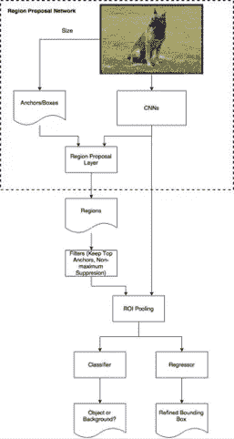
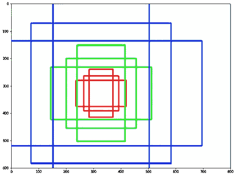

# 更快的 R-CNN:目标检测

> 原文：<https://medium.com/analytics-vidhya/faster-r-cnn-object-detection-7e48e5b9a906?source=collection_archive---------7----------------------->

**简介**

对象检测涉及图像的识别或分类及其分割。分割是通过在感兴趣的对象上绘制边界框来实现的。对象检测通常用于定位图像中的对象。用于检测对象的最流行的方法采用 R-CNN 或 YOLO 架构。

最初设计的 R-CNN 经过多年的发展，已经发展到快速 R-CNN，然后发展到更快的 R-CNN 架构。就运行速度和原始性能而言，每一款都比前一款有所改进。本文的目标是介绍更快的 R-CNN 架构的工作原理和主要组件。

更快的 R-CNN 论文最早发表于 2015 年。快速 R-CNN 是对其前身快速 R-CNN 的改进。快速 R-CNN 使用选择性搜索算法来建议可以找到对象的区域。但在更快的 R-CNN 中，建议是作为卷积运算本身的一部分生成的。这提高了它在执行目标检测的整体任务方面的效率和速度。

更快的 R-CNN 的主要组件是区域提议网络和 ROI 池，以及分类器和回归器头，以获得预测的类别标签和位置。

我们现在将探索更快的 R-CNN 的每个组件。

图 1:更快的 RCNN 架构

**主播**

锚点是可以检测到对象的潜在边界框候选。它们是在训练开始之前根据长宽比和比例的组合预先定义的，并放置在整个图像中。更快的 R-CNN 利用 3 种纵横比和 3 种比例生成 3*3 = 9 种组合。

让我们考虑 0.5 的纵横比和[8，16，32]的比例组合。在将图像通过 conv 池 VGG 网络之后，最终的下采样图像步幅大小是 16。现在，与上面的结果组合将是:-

图 2:锚

这里我们得到 3 个宽度大于高度的矩形。类似地，考虑比率为 1，我们得到正方形的 3 种变体，比率为 2，将有高度大于宽度的矩形的 3 种变体。这形成了总共有 9 种变化的基础锚。

既然我们已经获得了基础锚点，下一步就是为图像生成所有可能的锚点。

如果通过 VGGNet 传递图像后，我们得到的高度、宽度、步幅为 H，W，F，那么原始图像的尺寸为(H x F，W x F)。

基础锚定中心可以位于所有这些位置。[(0，0)，(F，0)，(0，F)，(F，F)..(H x F，W x F)]这导致 H x W x 9 个图像锚点的总数。

每个锚点由(x1，y1，x0，y0)表示，其中 x1，y1 是框的左上角，x0，y0 是框的右下角。

**地区提案网**

RPN 负责从上一步生成的图像锚点中返回一组好的建议。RPN 使用由图像特征提取器生成的特征图，并将其通过两个平行的卷积层，以给出两组输出。

第一个卷积层给出边界框回归器输出。这些输出的目的不是精确定位边界框本身的直接位置，而是预测偏移和比例，这些将应用于图像锚点以改进预测。

RPN 还输出分类输出，指示边界框是前景还是背景的概率。由于有许多图像锚点，因此需要一种方法来选择最有可能检测到对象的框，并丢弃剩余的框。利用许多锚彼此重叠的事实，进行非最大抑制来实现这一点。

**非最大抑制**

非最大抑制(NMS)应用于预测的边界框，使用它们的预测分数作为过滤标准。在将其传递给 NMS 之前，感兴趣区域(ROI)通过剪裁和移除高度、宽度超过阈值的区域来进行预处理。仅取最高的 ROI，并按其置信度得分进行排序。

NMS 的工作方式是一个接一个地选取所有感兴趣区域，并与其他所有感兴趣区域进行比较。如果该比较的 IOU 值大于预定阈值，则从列表中弹出后一个 ROI。这确保了不会有太多多余的盒子塞满图像。重复这个过程，直到没有剩余的盒子。

最终列表中的最高 ROI 被单独传递到下一步。

**投资回报池和 VGG-Head**

接下来在这些选定的 ROI 上进行 ROI 汇集，以产生固定大小的特征图。ROI Pooling 将每个特征映射分割成多个区域，并对它们应用最大池。这样做主要是为了确保所有建议可以使用相同的特征图，从而便于在下一步中将整个图像直接传递给 VGG 头。

VGG 头预测将应用于它们的边界框偏移/比例，用于进一步细化，以及它们的相应分数，指示每个预定义类别标签的概率。

**亏损**

总共有四组损失供模型训练。这 4 个损失从 2 层获得:- RPN 和 ROI 池/头部层。

更快的 R-CNN 对回归变量使用平滑 L1 损失，对分类器使用交叉熵来计算损失。来自这四层的损失被累积并反向传播以训练整个模型。

**RPN**

计算基础真实边界框(GTBb)和图像锚之间的 IOU。

1.  **边界框偏移/比例:-** 预测的偏移/比例用图像锚点解码得到最终的边界框。同样，图像锚以其最大 IOU GTBb 进行编码，以获得失调/比例差异。
2.  **包围盒置信度得分:-** 预测的置信度得分指示对象的存在以及它是背景还是前景。对于基本事实标签，那些有借据的，高于正阈值的用标签 1 标记，低于负阈值的用标签 0 标记。其余的标记为-1，表示可以忽略。

**ROI**

计算地面真实边界框(GTBb)和所选 ROI 之间的 IOU。

1.  **边界框偏移/比例:** VGG 头预测所选感兴趣区域的偏移/比例。为了获得地面真实偏移/比例差异，所选 ROI 用其相应的最大 IOU GTBb 编码。
2.  **边界框标签:** VGG 头预测所选感兴趣区域的标签。必须为每个选定的 ROI 分配一个基础事实类别标签，用于计算损失。每个 GTBb 已经被分配了一个标签。使用相同的方法，计算每个所选 ROI 对应的最大 IOU GTBb，并且该 GTBb 的标签与 ROI 相关联。

**结论**

本文到此结束，重点介绍了更快的 R-CNN 架构的关键组件。继续进行[https://github.com/Sai-Venky/FasterRCNN](https://github.com/Sai-Venky/FasterRCNN)中的代码将为该架构的整体实现提供坚实的基础。

快乐阅读…

**参考文献**

1.  [https://www.alegion.com/faster-r-cnn](https://www.alegion.com/faster-r-cnn)
2.  [https://lei Mao . github . io/blog/Bounding-Box-Encoding-Decoding/](https://leimao.github.io/blog/Bounding-Box-Encoding-Decoding/)
3.  [https://medium . com/@ smallfishbigsea/faster-r-CNN-explained-864d 4 FB 7 E3 f 8](/@smallfishbigsea/faster-r-cnn-explained-864d4fb7e3f8)