# 印度驾驶数据集(IDD)上的快速 RCNN

> 原文：<https://medium.com/analytics-vidhya/faster-rcnn-on-indian-driving-dataset-idd-ddfdaa0f02d7?source=collection_archive---------12----------------------->

## 这个博客解释了更快的 RCNN 以及如何在 IDD 上应用它。

埃里克·韦伯在 [Unsplash](https://unsplash.com?utm_source=medium&utm_medium=referral) 上的照片

# 概观

IDD 数据集由从连接到汽车的前置摄像头获得的图像组成。它由 10，000 幅图像组成，用从印度道路上的 182 个驾驶序列中收集的 34 个类别进行了精细注释。这辆车在海德拉巴、班加罗尔城市及其郊区行驶。这些图像大多是 1080p 分辨率，但也有一些图像具有 720p 和其他分辨率。这是由 IIT 海德拉巴和英特尔赞助的。

[*官网*](https://idd.insaan.iiit.ac.in/dataset/download/) *共有五个数据集。你可能需要注册才能使用它。我用过名为**的数据集数据集名称:IDD- Detection (22.8 GB)** 。我已经在 git 中解释了整个文件夹结构和代码。为了简洁起见，我在这里就长话短说。给定的输入数据是图像和包含图像信息的 xml。*

更快的 RCNN(一种用于深度学习领域的对象检测技术)于 2015 年在 NIPS 发表。出版后，它经历了一些修改。更快的 R-CNN 是 R-CNN 的第三代。我相信 RCNN 在图像分割和边界框目标检测领域是革命性的。下图中带边界框的**对象检测**(通常称为定位)和**分割**的区别。

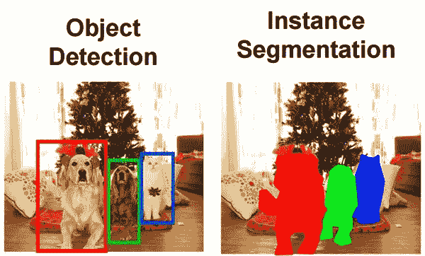

目标检测 vs 分割源([https://miro.medium.com/max/600/0*VX1UNfrNgjRD24Kq.jpg](https://miro.medium.com/max/600/0*VX1UNfrNgjRD24Kq.jpg))

对象检测输出对象和相应的边界框，而另一方面，分割标记对象的像素。

如果您想了解更多关于我如何格式化 IDD 数据的信息，从 xml 解析到图像复制再到为 RCNN 创建 CSV，请访问我的 [git](https://github.com/prabhudayala/IDD-data-set-Faster-RCNN) 并参考 jupyter 笔记本 1 和 2。为了简洁起见，我将在这个博客上解释更快的 RCNN。

# 体系结构

RCNN 架构有点复杂，因为它有许多部分。让我们了解它的所有活动部分，稍后我们将连接这些点。

## 输入和输出

FRCNN 的输入是一个图像，输出由以下三个部分组成。包围盒列表
2。分配给每个边界框
3 的标签。每个标签和边界框的概率

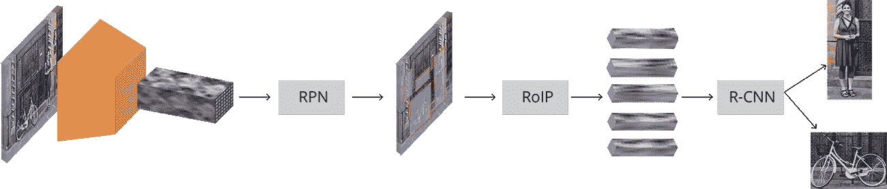

RCNN architechure 来源([https://tryo labs . com/images/blog/post-images/2018-01-18-faster-RCNN/fasterr CNN-architecture . b 9035 CBA . png](https://tryolabs.com/images/blog/post-images/2018-01-18-faster-rcnn/fasterrcnn-architecture.b9035cba.png))

## 基础网络

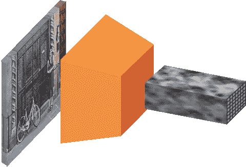

基网来源([https://tryolabs . com/images/blog/post-images/2018-01-18-faster-rcnn/image-to-feature-map . 89 F5 aecb . png](https://tryolabs.com/images/blog/post-images/2018-01-18-faster-rcnn/image-to-feature-map.89f5aecb.png))

输入图像通过预先训练的模型(在我们的例子中是 VGG)向上传递，直到中间层，在那里它获得特征图，该特征图在下一阶段中进一步用作 3d 张量。

## 锚

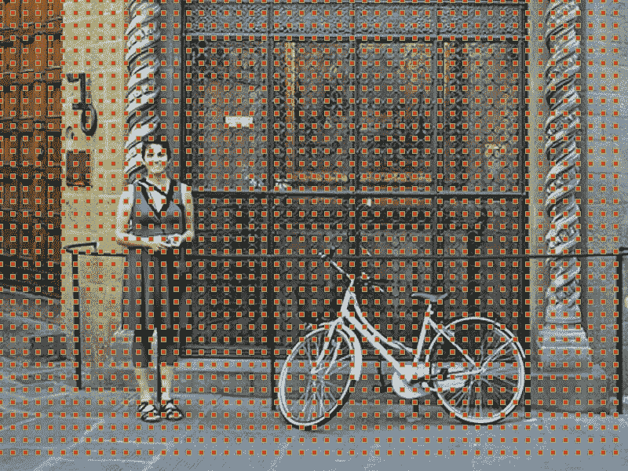

图片来源上的锚点([https://tryolabs . com/images/blog/post-images/2018-01-18-faster-rcnn/anchors-centers . 141181d 6 . png](https://tryolabs.com/images/blog/post-images/2018-01-18-faster-rcnn/anchors-centers.141181d6.png))

锚点是固定的边界框，以不同的大小和比例放置在整个图像中，将在首次预测对象位置时用作参考。如果我们收到尺寸为 *conv* *宽度* × *conv* *高度* × *conv* *深度*的特征图，我们为 *conv* *宽度* × *conv* *高度中的每个点创建一组锚点。*虽然锚点是在特征图上定义的，但它们指的是实际图像的比例。如果我们考虑所有的锚点，它看起来会像这样。

锚点左:单锚点，中:图像上所有比例的单锚点，右:图像源上所有比例的所有锚点([https://tryo labs . com/images/blog/post-images/2018-01-18-faster-rcnn/anchors-progress . 119 e1e 92 . png](https://tryolabs.com/images/blog/post-images/2018-01-18-faster-rcnn/anchors-progress.119e1e92.png))

## 区域提案网络

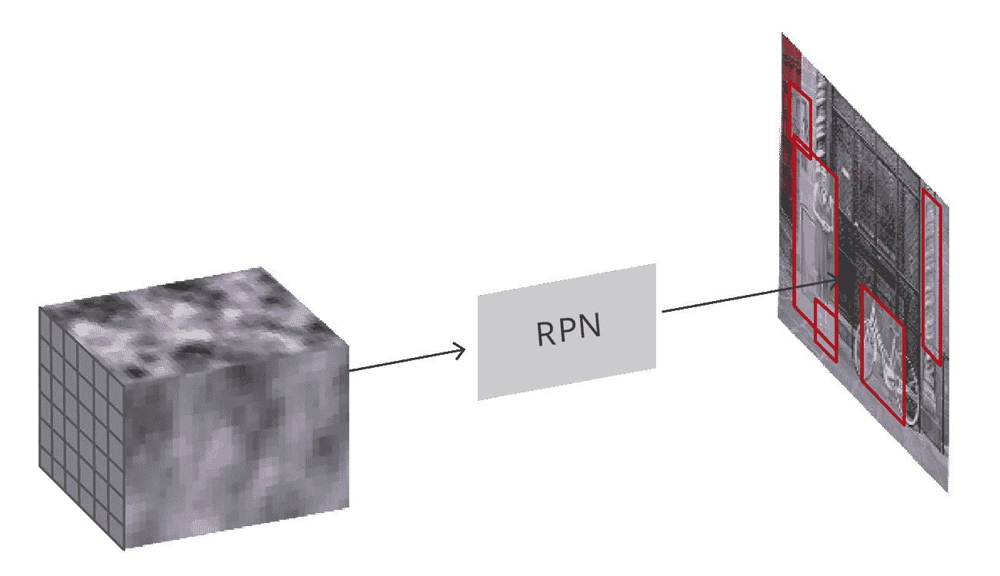

RPN 来源([https://tryo labs . com/images/blog/post-images/2018-01-18-faster-rcnn/RPN-architecture . 99 b6c 089 . png](https://tryolabs.com/images/blog/post-images/2018-01-18-faster-rcnn/rpn-architecture.99b6c089.png))

RPN 取所有参考框(锚点)，输出一组好的对象建议。它通过为每个锚点提供两个不同的输出来实现这一点。
1。区域
2 的客观性分数。用于调整锚点以更好地预测对象的边界框回归

上面的代码创建锚的数量(作为参数传递给方法的数量)并返回建议的客观性分数和实际边界框的 delta 误差。该客观性分数稍后用于接受或拒绝该提议。

## 利息池区域(ROI)

在 RPN 步骤之后，我们有一堆没有指定类的对象提议。我们下一个要解决的问题是如何把这些包围盒分类到我们想要的类别中。我们可以接受每一个建议，对其进行裁剪，并通过预先训练好的网络，然后用它来对图像进行分类，但是这种方法太慢了，因为我们有大量的建议。
更快的 RCNN 通过重用我们从**基网络**输出得到的现有特征图解决了这个问题。它使用兴趣池区域为每个提议提取固定大小的特征地图。

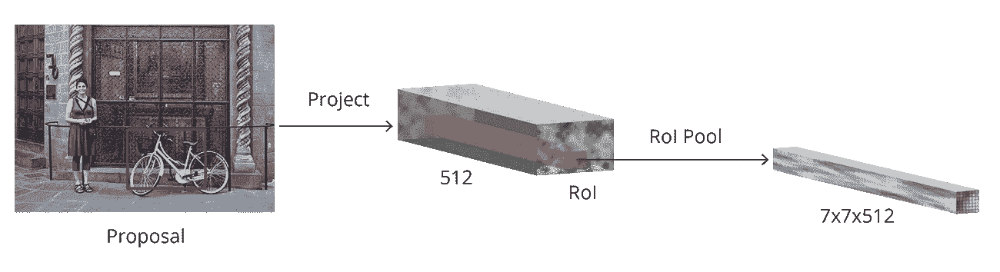

RPN 来源([https://tryo labs . com/images/blog/post-images/2018-01-18-faster-rcnn/ROI-architecture . 7 eaae 6 c 2 . png](https://tryolabs.com/images/blog/post-images/2018-01-18-faster-rcnn/roi-architecture.7eaae6c2.png))

收到建议后，此代码为 ROI 中选择的每个建议选择固定大小(7*7)的特征图。

## 基于区域的卷积神经网络

这是整个模型的最后一层。在从最后一层(7x7x512)获得特征图之后，RCNN 服务于两个目标。
1。将提议归入其中一个类别，外加一个背景类别(用于删除不良提议)。
2。更好地根据预测的类别调整提议的边界框。
而他们就是这样的形象实现的。

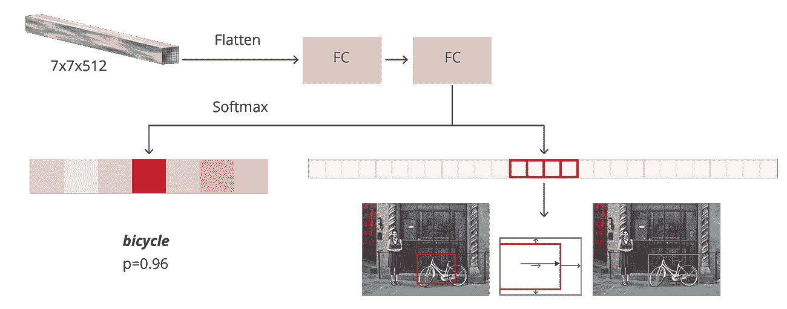

RCNN 最终层-来源([https://tryo labs . com/images/blog/post-images/2018-01-18-faster-RCNN/RCNN-architecture . 6732 b9bd . png](https://tryolabs.com/images/blog/post-images/2018-01-18-faster-rcnn/rcnn-architecture.6732b9bd.png))

这段代码使用 **RoiPoolingConv** 并从它那里接收 7*7 固定大小的输出作为特征映射。稍后，这些输出被展平并用于**将图像分类到类别**并且**调整边界框以更符合实际**。在这样做的同时，它输出两个操作的错误。

## 借据

IOU 代表交集大于并集。这用于决定是否应该接受关于实际边界框的提议边界框。

IOU-source[https://www . pyimagesearch . com/WP-content/uploads/2016/09/IOU _ equation . png](https://www.pyimagesearch.com/wp-content/uploads/2016/09/iou_equation.png)

上面的代码简单地计算两个矩形边界框的面积，并计算交集与并集。

## 非最大抑制

锚定提议在真实案例中经常重叠。为了解决这个问题，使用了 NMS。NMS 采用按分数排序的提案列表，并在排序的列表上迭代，用具有更高分数的提案丢弃那些 IoU 大于某个预定义阈值的提案。

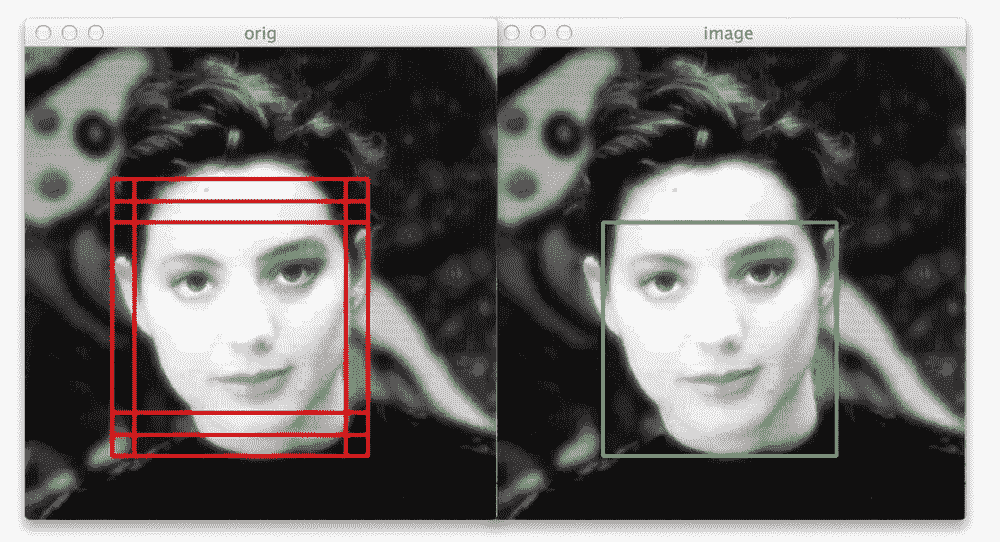

非最大抑制-来源([https://www . pyimagesearch . com/2015/02/16/faster-non-maximum-suppression-python/](https://www.pyimagesearch.com/2015/02/16/faster-non-maximum-suppression-python/))

这段代码将 RPN 提出的边界框和它们的概率( **objectness score** 我在前面描述过)作为输入——并删除重叠的提议。它通过将所有其他边界框的 **IOU** 与具有最大概率的边界框进行比较来实现。如果任何框相对于具有最大概率的框的 **IOU** 大于重叠阈值，则将其删除。

## 损耗

在整个更快的 RCNN 中涉及 4 个损耗。
1。RPN 分类损失(我前面描述过的客观性分数)

2.RPN 回归损失

3.最后一层的分类损失

4.最后一层的回归损失

# 让我们连接所有组件

## 1.获取地面真实数据

我们将采取一个图像的时间，并得到锚地的真相。当我说锚时，你现在必须明白它是边界框。

这段代码采用一个图像路径，并在根据图像缩放比例对边界框进行缩放后返回边界框。例如，如果在 1000*1000 像素的图像中，对象在(10，10，30，30)处，如{xmin，ymin，xmax，ymax}，那么在将图像重新缩放到 100*100 像素之后，相对对象位置将是(1，1，3，3)，如{xmin，ymin，xmax，ymax}。该方法还创建 RPN 建议和损失(目标得分和边界框增量),稍后用于寻找 ROI。

## 2.使用 RPN 模型并找到 ROI

用 RPN 模型预测一些方案，得到一些 ROI。在本部分中,**非最大抑制**用于排除过度重叠的建议。

该方法使用来自 RPN 层的预先计算的建议，进行非最大值抑制，并选择那些不重叠的建议。

## 3.计算欠条

计算 IOU，并基于此选择一些正负样本。负样本在这里意味着没有对象的建议，换句话说，没有背景。

以上是为每个边界框计算的 IOU，并返回相应的 IOU。

## 4.训练整个模型直到收敛。

根据 IOU 值，我们将创建一些正样本(**带对象**)和一些负样本(**不带对象—背景**)，并将它们传递给模型分类器。我们将尝试最小化前面描述的所有 4 个误差的总和。训练直到收敛并保存最好的模型。

## 5.一些误差图。

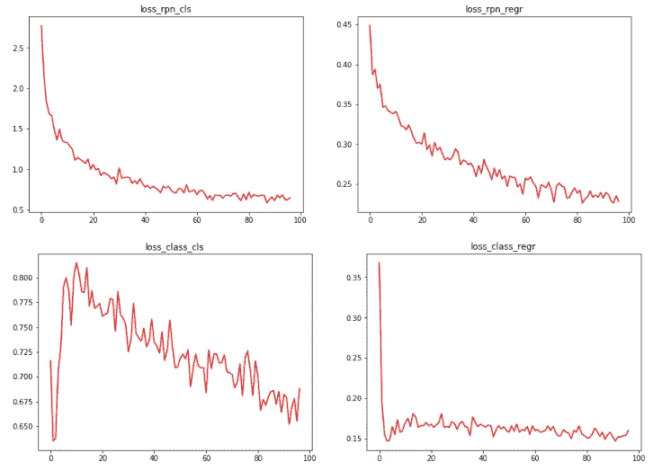

## 6.全损

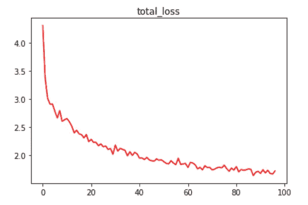

## 7.图像测试

在图像上测试代码与培训非常相似。在我的 [git](https://github.com/prabhudayala/IDD-data-set-Faster-RCNN) 链接中，你可以找到一个名为 Pipeline 的 Jupyter 笔记本，在那里你可以自己测试图像。下面是一些结果。

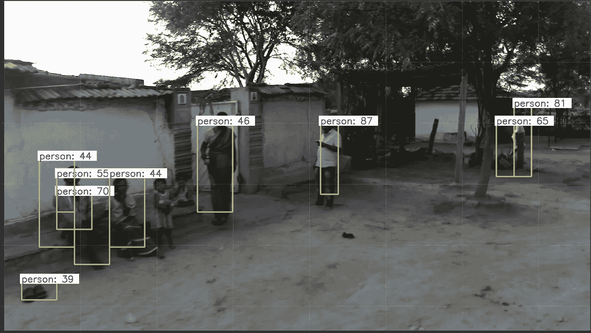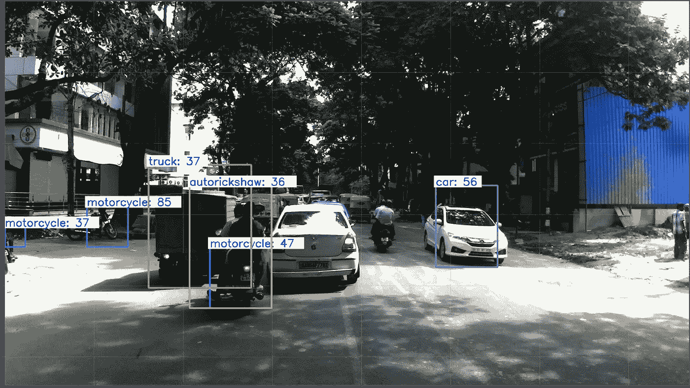

就结果而言，这里有很大的改进余地。**我已经运行这个模型将近 100 个时期了**。这需要大量的时间和大量的 GPU 资源。**尝试跑更多的时代，一定会有更好的模式**。

# 结束注释

快速 RCNN 模型相当复杂，它是许多模型组合和多年研究的结果。如果你觉得代码很难理解，完全没关系。请访问我的 [git](https://github.com/prabhudayala/IDD-data-set-Faster-RCNN) 获取完整代码，并尝试一段一段地运行代码。肯定会有帮助的。如果没有下面提到的参考链接，这个博客是不可能的。

# 参考

1.  [https://tryo labs . com/blog/2018/01/18/faster-r-CNN-down-the-rabbit-hole-of-modern-object-detection/](https://tryolabs.com/blog/2018/01/18/faster-r-cnn-down-the-rabbit-hole-of-modern-object-detection/)
2.  [https://github . com/rocky Xu 66/Faster _ RCNN _ for _ Open _ Images _ Dataset _ Keras](https://github.com/RockyXu66/Faster_RCNN_for_Open_Images_Dataset_Keras)