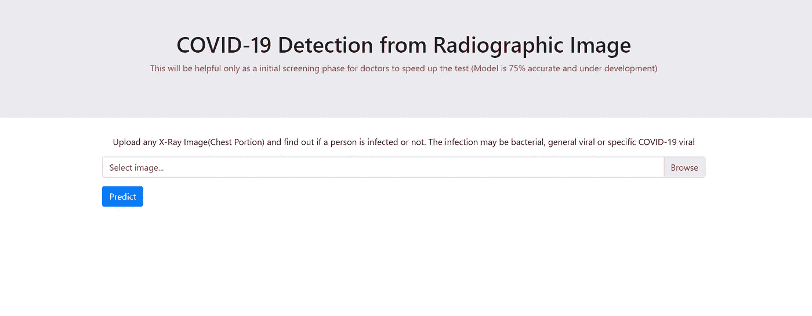
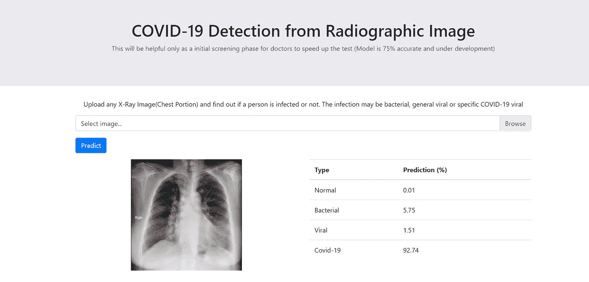

# “我们反应越快，建设越快，赢得新冠肺炎就越快”

> 原文：<https://medium.com/analytics-vidhya/faster-we-react-faster-we-build-faster-we-win-covid-19-65a81f5177f4?source=collection_archive---------42----------------------->

**新冠肺炎**是由**严重急性呼吸综合征冠状病毒 2** ( **新型冠状病毒**)引起的传染病，此前被称为 **2019 新型冠状病毒** ( **2019-nCoV** )，是冠状病毒的一个毒株。首批病例于 2019 年 12 月在中国武汉出现，随后蔓延至全球。2020 年 3 月 11 日，当前的疫情被正式确认为疫情 44。非特异性影像学表现最常见的是非典型或机化性肺炎，通常以双侧、周围和基底分布为主 32。目前没有有效的治疗方法或疫苗(2020 年 4 月)[1]

当检测受冠状病毒影响的患者的试剂盒受到限制时，医生和其他医疗保健专家在检测新冠肺炎方面的斗争就增加了。为了避免或克服这种情况，可以通过不同的方式进行新冠肺炎的检测。其中之一可能是胸透。

> 【COVID 如何出现在肺部【2】

新冠肺炎的影像学表现没有特异性，双侧结节状和周围毛玻璃样阴影和实变应提醒放射科医生新冠肺炎可能确实存在于某些患者中。

> **我们的方法【3】**

因此，我们正在努力开发一个应用程序，给出胸部 x 光片受冠状病毒影响的概率。该应用程序接收具有前后视图的胸部 X 射线，并给出 X 射线正常、受细菌影响、受其他病毒影响和受冠状病毒影响的概率。

这个模型涉及人工智能技术，如在一些 X 射线图像上训练的深度学习。显然，模型即兴创作主要与训练模型的大量数据有关。现有模型在我可获得的 24 次 COVID 阳性胸部 X 射线上有以下成功和失败之处。

1.  **该模型可以成功地说 24 张 x 光照片中有 20 张是 COVID 阳性的。**
2.  在遗漏的四张 x 光片中，两张 x 光片被归类为细菌感染，另外两张 x 光片被归类为病毒感染。
3.  同样，三个正常的 X 射线被归类为新冠肺炎；三种细菌感染的 X 射线被归类为新冠肺炎。
4.  没有一个被病毒感染的 x 光被错误地预测为新冠肺炎

> **网络应用**

为了方便用户，我们创建了一个 web 应用程序。

 [## X 射线图像中的新冠肺炎检测

### 上传任何 x 光图像(胸部)并找出一个人是否被感染。感染可能是细菌性的…

xraycovid19.com](https://xraycovid19.com/) 

主页

预测结果的步骤:

*   从您的笔记本电脑中选择一张 x 光图像
*   点击“预测”按钮，等待几秒钟
*   输出将是这样的

输出页面

到目前为止，该网站是为预测一个图像而创建的，最早我们也计划为多个图像而创建。以便有助于医生一步到位地进行测试。我们希望这个应用程序能对疫情的医生、政府官员和社会工作者有所帮助。

如果应用程序可以用更多的 COVID 阳性 X 射线和结果反馈进行测试，我们将不胜感激。积极和消极的反馈是受欢迎的，因为我们希望随机应变的结果，而不是放弃。最重要的是，如果结果是合理的，请通过提供更多关于 COVID 阳性前后 X 射线的数据来训练模型，从而帮助我们进行即兴创作。

> **参考文献:**

*   [1]https://radiopaedia.org/articles/covid-19-3
*   [2][https://www . itnonline . com/content/how-do-how-新冠肺炎-appear-lungs](https://www.itnonline.com/content/how-does-covid-19-appear-lungs)
*   [3][https://github.com/ieee8023/covid-chestxray-dataset](https://github.com/ieee8023/covid-chestxray-dataset)
*   [https://github.com/lindawangg/COVID-Net](https://github.com/lindawangg/COVID-Net)