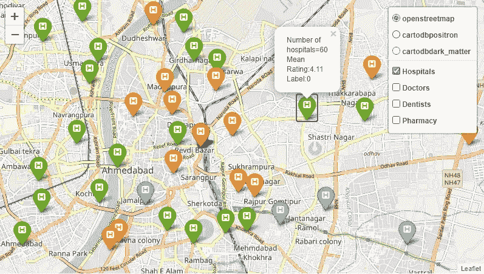
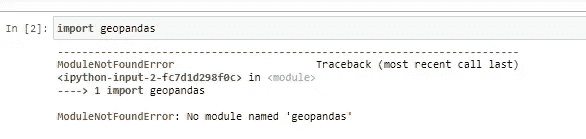
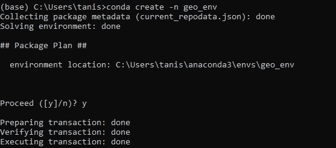
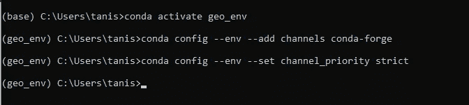
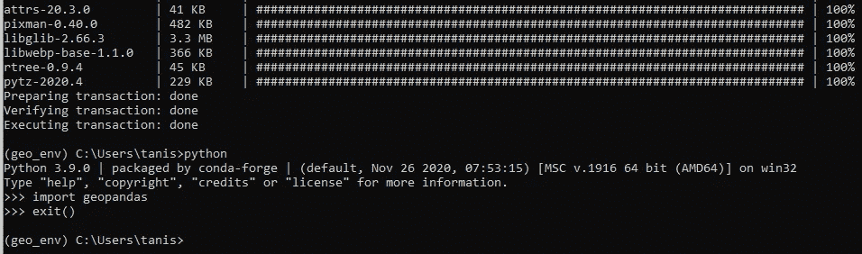
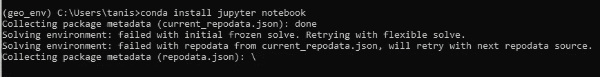
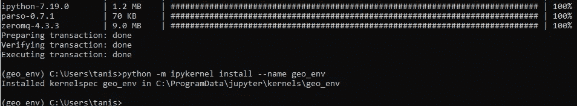
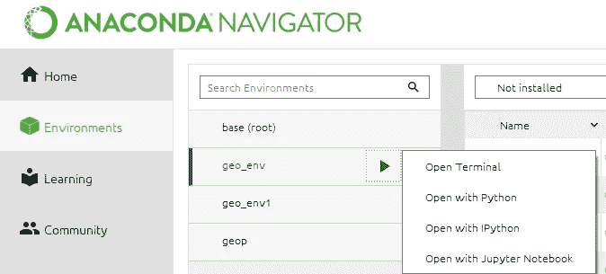
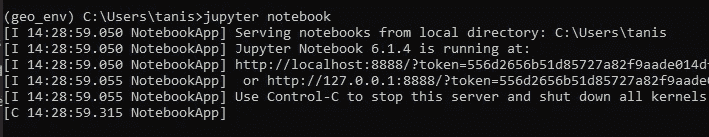
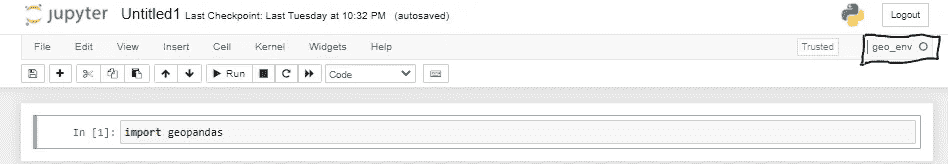

# 在 Windows 上的 jupyter 笔记本中安装 Geopandas 的最快方法

> 原文：<https://medium.com/analytics-vidhya/fastest-way-to-install-geopandas-in-jupyter-notebook-on-windows-8f734e11fa2b?source=collection_archive---------0----------------------->



艾哈迈达巴德(印度)城市可视化由我使用 Geopandas 和树叶。

大家好。最近我在做一个数据科学小组的项目，其中我的部分是制作地理空间可视化，这需要在我的系统中安装 python 库 Geopandas。我有两个选择，要么在 jupyter 笔记本上写，要么在谷歌实验室写。

我选择了 jupyter 笔记本电脑，但在安装 Geopandas 时遇到了很多问题。互联网上没有一个好的资源可以帮助我正确无误地安装 Geopandas。因此，我决定写一篇文章，帮助所有数据科学爱好者轻松安装 Geopandas。

在这篇文章中，我将展示在 Windows 上的 jupyter 笔记本中安装 Geopandas 的最快和最好的方法。那么，我们开始吧。

首先，如果您将导入 geopandas 而不安装它，它将显示此错误，这意味着我们需要先安装它。



# **安装 Geopandas**

按照下面给出的步骤安装 geopandas。

注意——假设您的系统上安装了 Anaconda。

**步骤 1-** 打开 Anaconda 命令提示符，使用下面给出的命令创建新的环境变量，比如“geo_env”。

```
conda create -n geo_env
```



**步骤 2-** 激活该环境“geo_env”并添加和设置 conda-forge 通道。

```
conda activate geo_envconda config  --env --add channels conda-forgeconda config --env --set channel_priority strict
```



**步骤 3-** 在刚刚创建的环境中安装 Geopandas。

```
conda install geopandas
```

通过在您的终端中运行 python，然后运行以下代码，验证它是否已安装。无错误意味着 geopandas 安装成功。

```
import geopandasexit() 
```



**步骤 4-** 下一个任务是在此环境中安装 jupyter 笔记本电脑，因为默认情况下它只安装在“基本”环境中。

```
conda install jupyter notebook
```



注意——如果上面的命令对你不起作用，试试“康达安装笔记本”。

**步骤 5-** 现在将我们的环境添加到 jupyter notenook 中。

```
python -m ipykernel install --name geo_env
```



> 就是这样！Geopandas 已成功安装在您的环境变量中。现在有两种方法可以运行它，要么通过 Anaconda Navigator，要么通过 Anaconda command propmt。

# 在 Jupyter 笔记本中运行 Geopandas。

**第一种方式——使用 Anaconda Navigator。**

打开 Anaconda Navigator，转到 Environments 部分，然后选择环境，在我们的例子中是 geo_env。然后点击“播放”按钮，选择“用 Jupyter 笔记本打开”。



**第二种方式——使用 Anaconda 命令提示符。**

请遵循以下步骤。

**步骤 1** 打开 Anaconda 命令提示符。默认情况下，它处于“基本”环境中。


**步骤 2-** 将其更改为我们创建的环境“geo_env ”,并通过激活该环境来安装 geopandas。

```
conda activate geo_env
```


运行“jupyter notebook”命令，创建一个新文件或者编辑一个现有的 ipynb 文件。确保您在我们创建的环境中工作。



> 感谢阅读这篇文章。
> 
> 如果你有任何疑问，可以写在评论里或者发邮件给我，地址是 tanish@iitbhilai.ac.in。