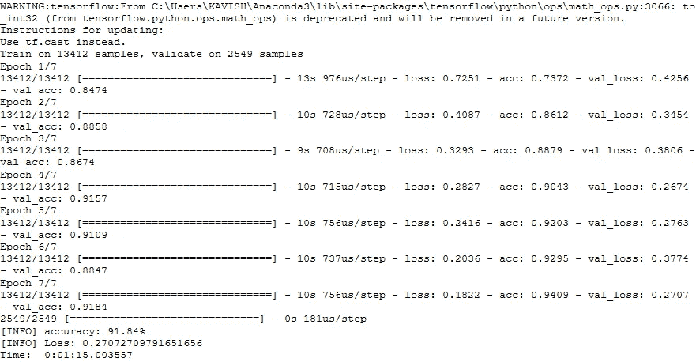

# 基于卷积神经网络的动物图像分类

> 原文：<https://medium.com/analytics-vidhya/fauna-image-classification-using-convolutional-neural-network-30df9e25a010?source=collection_archive---------2----------------------->

*该项目的目的是在茂密的森林环境中开发一种动物图像分类器，以达到所需的准确性，并帮助神经网络/人工智能&动物学领域的生态学家和研究人员进一步研究和/或改善栖息地、环境和灭绝模式。*

使用卷积神经网络进行动物图像分类的框图

**问题陈述**

在野生动物的自然栖息地对其进行有效和可靠的监测，对于制定有关野生动物物种、迁徙模式、栖息地保护的保护和管理决策至关重要，并且有可能对相同动物的物种进行恢复和分组。手动处理从相机陷阱中捕获的大量图像和视频是极其昂贵、耗时且单调的。这给科学家和生态学家在开放环境中监测野生动物带来了很大的障碍。特别是，我们打算使用动物图像数据集，并训练一个卷积神经网络，能够将图像准确地分类到特定的动物类别。因此，这反过来可以加快研究发现，构建更有效的监测系统，以及随后的管理决策，有可能对生态学和图像分析领域产生重大影响。

**简介**

如今，随着人工智能的波动性、必要性和应用的增加，神经网络及其子集、机器学习和深度学习等领域获得了巨大的动力。它已经成为一个以数据为中心的模型，神经网络开发人员正在“训练”网络变得“智能”和“独立”。训练需要软件和工具，如分类器，这些分类器可以输入大量数据，分析这些数据，并提取有用的特征。然后，这些特征被用于观察一种模式，并训练网络在下一次被馈送数据时再次使用类似的数据。卷积神经网络仍然是计算机科学家用于图像识别、处理和分类的最受欢迎的选择。我们提出了一种使用卷积神经网络的动物群图像分类器，该分类器将用于对在茂密森林环境中捕获的不同物种和动物的图像进行分类，以达到所需的准确性，并帮助生态学家和研究人员进一步研究和/或改善栖息地、环境和灭绝模式。一个卷积神经网络被训练和开发用于有效地对这些图像进行分类并得到准确的结果。在野外捕获的图像在分类时是一项具有挑战性的任务，因为它们以不同的姿势、背景混乱、不同的照明和气候条件出现，人的摄影误差会导致大量的失真、不同的角度和遮挡。所有这些挑战都需要一种具有最佳准确度的高效分类算法。最大的问题之一是“阶层失衡”。由于每个样本的图片数量都是奇数，因此与其他类别相比，该算法可以更好地训练某些类别。该项目的范围是基于卷积神经网络训练用于动物图像分类器的神经网络，其具有准确的结果，可用于动物图像数据集，其需要更多的存储器分配、良好的分辨率、属性的一致性和良好的分类。

**设计&分析**

实施布局

在这里，我们提出了一种动物图像分类的方法，这将有助于生态学家和科学家进一步研究和/或改善栖息地、环境和灭绝模式。用于分类的 Animal-10 数据集可从 Kaggle 开源获得。我们已经为我们的模型使用了具有泄漏 ReLU 激活函数和 VGG16 架构的卷积神经网络。系统采取的第一步旨在利用 VGG16 模型创建特征。在训练步骤之前应用图像处理以及加载、测试、训练和验证数据集有助于从图像中去除噪声、障碍、失真和污垢。下一步使用卷积神经网络和 Leaky ReLU 来训练模型，以准确和精确地对动物类别进行分类。为了避免死亡 ReLU 的问题，其中一些 ReLU 神经元对于所有输入基本上死亡，并且无论提供什么输入都保持不活动，这里没有梯度流动，并且如果存在大量死亡神经元，则神经网络的性能受到影响。为了解决这个问题，我们利用了所谓的泄漏 ReLU，其中斜率从 x=0 向左改变，从而导致泄漏并扩大 ReLU 的范围。在训练模型之后，我们绘制模型的训练和验证准确性和损失的图表，以了解模型的训练情况。损失越小，精确度越高。下一步是生成分类矩阵和混淆矩阵，以获得关于模型训练和分类正确程度的准确细节，因为我们不能只依赖准确性。最后，我们用样本数据测试了我们的模型，发现它被准确地分类了。

**实施**

***导入库***

导入库，创建瓶颈文件，加载 VGG16 模型

我们导入了神经网络所需的库，如 Panda 库，它用于提供高性能、易于使用的数据结构和数据分析，NumPy 用于可以对数组执行的数学和逻辑运算，Keras 旨在实现深度神经网络的快速实验，它专注于用户友好、模块化和可扩展等。根据 VGG16 型号要求，图像的宽度和高度分别调整为 224 和 224。创建瓶颈文件是为了鼓励网络压缩要素制图表达以最大限度地适应可用空间，从而在训练过程中获得最小的损失。瓶颈文件系统用于将所有图像像素转换成其对应的数字(NumPy 数组)并存储在存储系统中。我们只是告诉我们的网络图像在我们的存储器中的位置，所以机器知道哪里是什么。我们为神经网络定义了时期和批量大小。我们将图像数据集分类为训练、验证和测试，并将其加载到网络中。我们还加载了一个预训练的 VGG16 模型，因为它仅使用 11 个卷积层，非常容易使用。

***用 VGG16*** 创建权重/特征

使用 VGG16 模型创建权重/特征，用于训练、验证和测试数据集

我们使用 VGG16 模型创建了权重/特征，以微调神经网络，使其在处理输入数据时表现良好。一旦文件被转换并保存到瓶颈文件，我们就为卷积神经网络加载并准备它们。这也是确保我们所有的数据都被加载到一个瓶颈文件中的好方法。数据质量对于确保准确性和可靠性至关重要。

***加载训练、验证和测试数据集***

加载培训、验证和测试数据集

我们正在从我们在前面的步骤中创建的瓶颈文件中加载训练、验证和测试数据集，并为我们的卷积神经网络准备它们。这也是确保所有数据都已加载到瓶颈文件中的好方法。

***训练模型***

使用卷积神经网络和泄漏 ReLU 的训练模型

模型准确率为 91.84%的历元结果

我们训练了神经模型。训练神经网络包括寻找一组权重，以最佳地将输入映射到输出。损失函数告诉我们，我们的神经网络对于某项任务有多好。训练的问题等价于最小化损失函数的问题。用于在神经网络中执行学习过程的过程被称为优化算法(或优化器)。第一步是用 Sequential()初始化模型。之后，我们把我们的数据变平，并添加额外的 3 个隐藏层。然后，在我们创建并编译了我们的模型之后，我们将我们的训练和验证数据与它相匹配。接下来，我们创建一个评估步骤，来检查我们的模型训练集相对于验证集的准确性。一个时期描述了算法查看整个数据集的次数。因此，每当算法看到数据集中的所有样本时，一个时期就完成了。神经网络训练算法包括将整个数据集多次呈现给神经网络。所有训练示例的一个向前传球和一个向后传球。在进入下一个时段之前，每个时段必须完成所有批次。Keras 提供了一种总结模型的方法。可以通过在模型上调用 summary()函数来创建摘要，该函数返回一个字符串，然后可以打印该字符串。该摘要是文本形式的，包括以下信息:

模型中的层及其顺序。
·每一层的输出形状。
·每层中参数(权重)的数量。
模型中参数(权重)的总数。

在卷积层和全连接层之间，有一个展平层。扁平化将二维特征矩阵转换为一个向量，该向量可以输入到完全连接的神经网络分类器中。密集层表示矩阵向量乘法。矩阵中的值是在反向传播期间更新的可训练参数。放弃是一种用于防止模型过度拟合的技术。Dropout 的工作原理是在训练阶段的每次更新时，将隐藏单元(组成隐藏层的神经元)的输出边缘随机设置为 0。

***图形化训练并验证准确度和损耗***

制图培训和验证准确性和损失

我们正在绘制每个时期的训练和验证准确性和损失。在历元期间，跨每个数据项计算损失函数，并且保证给出给定历元的定量损失度量，并且跨迭代绘制曲线仅给出整个数据集的子集的损失。模型评估功能告诉我们刚刚制造的机器可以对看不见的数据进行多好的预测。模型评估表明，我们刚刚制造的机器可以根据看不见的数据进行多好的预测。有两种很好的方法可以检验我们的机器预测或分类的能力。其中一个是分类度量，另一个是混淆矩阵。

***生成分类指标***

生成分类指标

我们实施并展示了分类指标(精确度、召回率、F1 分数、支持度)，以及它们的微观和宏观平均值、加权平均值和样本平均值。为了使用分类度量，我们必须将测试数据转换成不同的 NumPy 格式，NumPy 数组，以便阅读。当分类精度不是模型性能的良好指标时，当您的类分布不平衡时，精度是很好的度量标准。召回率被定义为模型正确预测的一类样本的比例。一个结合了精确度和召回率的流行指标叫做 F1-score。支持度是该类中真实响应的样本数。

Precision = True _ Positive/(True _ Positive+False _ Positive)
；Recall = True _ Positive/(True _ Positive+False _ Negative)
；F1-score = 2 * Precision * Recall/(Precision+Recall)

分数越高，模型越好。为了使用分类度量，我们必须将测试数据转换成不同的 NumPy 格式，NumPy 数组，以便阅读。然后，它转换代码，并通过内置的分类指标执行代码，从而给我们一个整洁的结果。

***生成混淆矩阵***

生成混淆矩阵

我们实现了混淆矩阵，因为我们不能只依赖准确性。混淆矩阵用于评估分类器输出的质量。混淆矩阵是模型预测与事实标签的表格可视化。混淆矩阵的每一行代表预测类中的实例，每一列代表实际类中的实例。对角线元素表示预测标签等于真实标签的点的数量，而非对角线元素是那些被分类器错误标记的点。混淆矩阵的对角线值越高越好，表明有许多正确的预测。我们之前创建的 NumPy 数组放在数据框中。混淆矩阵最适用于数据框。这些图显示了按照类支持大小(每个类中的元素数量)进行归一化和不进行归一化的混淆矩阵。在类不平衡的情况下，这种标准化可能是有趣的，以便对哪个类被错误分类有更直观的解释。

***测试模型上的样本图像***

准确分类到特定动物类别的样本动物图像

最后，最后一个阶段是在样本图像上测试训练的模型，以检查神经网络是否被准确地训练并且无错误地工作。图像被输入到神经网络模型中，并且该模型准确地对动物种类进行分类。def read_image 函数让我们的机器知道它必须加载图像，改变大小，并将其转换为数组。它使用迁移学习的预测模型和迭代函数来帮助正确预测图像。路径是我们定义图像位置的地方，最后根据预测打印出最终结果。我们的神经网络正确地识别了具有不同背景、噪声等的不同动物图像，并以 99.89%的准确度将其分类到动物类别。

**结果&讨论**

提出的模型用 Python 编码，并在 Jupyter Notebook 的 Animal-10 数据集上进行测试，该数据集包含来自 10 个动物类的 26，179 幅图像。该模型对 6 种动物的分类准确率达到 91.84%。神经网络可以成功地识别动物图像，并以 99.89%的准确率将其分类到正确的动物类别。该模型成功检测了 6 个动物类的 1845 幅测试图像、6 个动物类的 13412 幅训练图像和 6 个动物类的 2549 幅验证图像。该项目在 Github 上开源。

**联系人**

[邮箱](mailto:info@kavishsanghvi.tech) | [LinkedIn](https://www.linkedin.com/in/kavishsanghvi) | [网站](https://kavishsanghvi.tech) | [GitHub](https://www.github.com/kavishsanghvi) | [博客](https://kavishsanghviblog.wordpress.com) | [脸书](https://www.facebook.com/kavish.sanghvi.5) | [推特](https://twitter.com/kavishsanghvi25) | [Instagram](https://instagram.com/kavishsanghvi96)

> 感谢您阅读这篇文章。如果你喜欢它或发现它有用，请鼓掌、评论并分享。