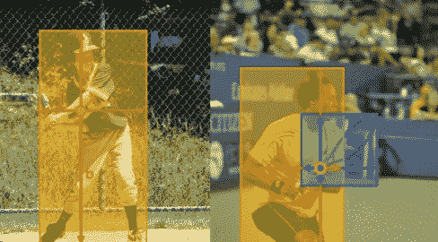
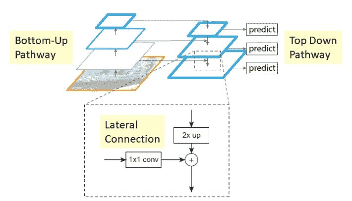
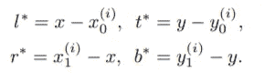
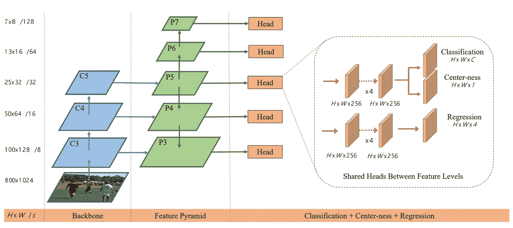
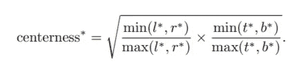
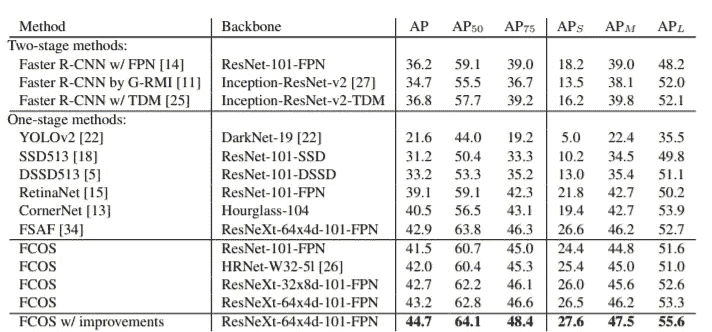

# FCOS——完全卷积一级目标检测

> 原文：<https://medium.com/analytics-vidhya/fcos-fully-convolutional-one-stage-object-detection-ede02244b5ce?source=collection_archive---------12----------------------->

有没有想过用一种相对较新的物体探测技术来启发自己？你来对地方了！阿德莱德大学的学生做了一项关于全卷积一级物体检测的研究，从此被 FCOS 引用。(来源在下面)

> **about** FCOS 是一种以每像素方式预测图像中物体的方法。与使用边界框坐标来计算 IOU 的其他对象检测算法不同，FCOS 高度依赖于中心度阈值和要检测的对象的数量。

图 1，左图:FCOS 正在使用(l，t，r，b)注释。右图:不明确的示例注释

> 如左图(图 1)所示，在地面真相框的监督下，FCOS 通过预测 4D 向量(l，t，r，b)来编码每个前景像素的边界框的位置。右图显示了两个边界框内的一个位置，在这种情况下，必须选择回归哪个边界框。

## **特色金字塔网络(FPN)**

图 2，特征金字塔网络

FCOS 利用了一个特征金字塔网络(图 2)，该网络具有特征集{P3、P4、P5、P6、P7}和类 c，其中 c*是边界框中的对象所属的类。对于特征图上的每个点，如果该点位于地面真值包围盒内，该点将被视为**正样本**。如果一个位置落入多个边界框中，它被认为是一个*模糊样本*。当出现不明确的样本时，它将选择具有最小面积的边界框作为其回归目标。模糊样本看起来是个问题，但实际上，在应用 FPN 后，模糊样本可以减少到 4%。

与其他对象检测模型不同，边界框的回归目标已更改为边界框边缘和点(l，t，r，b)之间的范围，而不是轴(x，y，x，y)。通过这样做，FCOS 能够挑选更多积极的样本来减少失衡。

图 3，公式回归目标

## **网络架构**

图 4，网络架构

FCOS 的网络架构，其中 C3、C4 和 C5 表示主干网络的特征图，P3 至 P7 是用于最终预测的特征层。H × W 是特征图的高度和宽度。/s' (s = 8，16，…，128)。

## **网络输出**

我们网络的最后一层预测分类标签的 80D 向量 **p** 和具有边界框坐标的 4D 向量 **t** = ( *l，t，r，b* )。我们不是训练一个多类分类器，而是训练 c 个二元分类器，其中 c 是类的数量。我们在主干网络的特征映射之后增加了四个卷积层，分别用于分类和回归分支。由于回归目标总是正的，我们使用 exp(x)将任何实数映射到回归分支顶部的(0，∞)。

## **居中度**

FCOS 把地面真理箱中的每一点都当作正样本。这导致远离对象中心的位置产生大量低质量的预测边界框。为了防止这种情况，他们添加了有效的索引来抑制这种被称为**中心度**的预测边界框。中心度是一个描述点到地面真值盒中心距离的指标，作为一个分支添加在特征映射之后。定义如下所示。

图 5，中心性公式

中心度的范围在 0~1 之间。训练时，center-ness 将使用 **BCELoss** (二元交叉熵)计算 Loss_center。并且当模型用于预测时，中心度可以乘以分类分数以抑制低质量的包围盒。结果，这些低质量的包围盒很有可能被最终的非最大值抑制过滤掉，从而显著提高检测性能。

## 培训结果

图 6，结果

图 6，FCOS 与其他最先进的两级或一级检测器的对比(单模型和单标度结果)。在亚太地区，FCOS 在相同的基础上领先基于主播的同行 retina net 2.4%。FCOS 也优于最近的无锚单级检测器 CornerNet，但设计复杂度低得多。

**来源**

[志田、沈春华、陈皓、佟大为。FCOS:完全卷积一级物体检测，2019 年 8 月。](http://openaccess.thecvf.com/content_ICCV_2019/papers/Tian_FCOS_Fully_Convolutional_One-Stage_Object_Detection_ICCV_2019_paper.pdf)