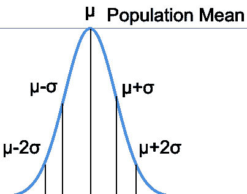
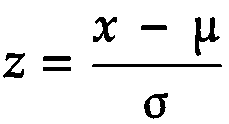
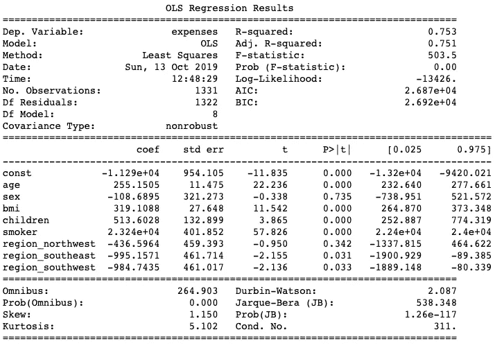
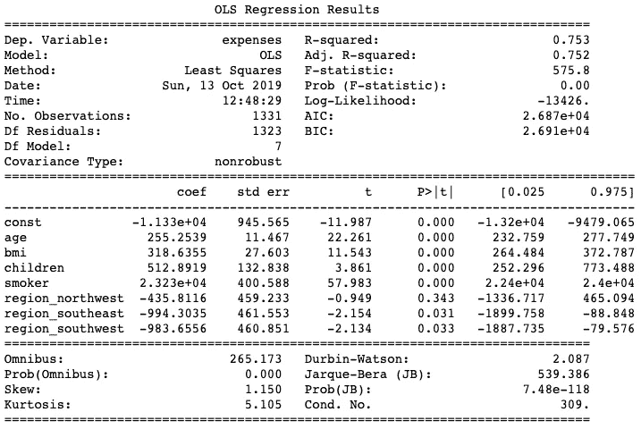
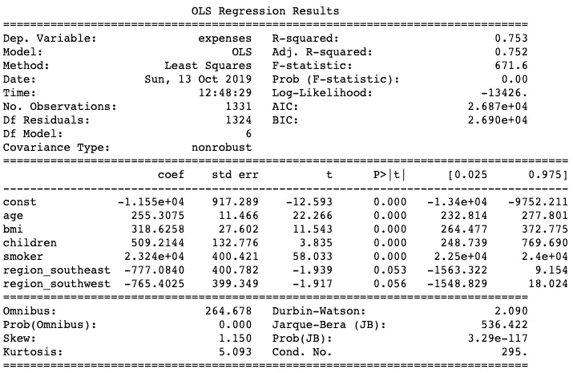

# 使用 p 值消除特征

> 原文：<https://medium.com/analytics-vidhya/feature-elimination-using-p-values-e026489e1569?source=collection_archive---------9----------------------->


在 [Unsplash](https://unsplash.com?utm_source=medium&utm_medium=referral) 上由[路易斯·里德](https://unsplash.com/@_louisreed?utm_source=medium&utm_medium=referral)拍摄的照片

# 介绍

在本帖中，我们将讨论假设检验，p 值是如何计算的，以及它如何通过一个简单的学生分数例子来帮助我们进行假设检验。然后，我们将继续讨论它如何帮助我们消除医疗费用数据集中的特征，然后为其拟合一个模型。

# p 值

> *在统计假设检验中，* p *-* 值*或概率*值*是在假设零假设正确的情况下，获得至少与检验过程中实际观察到的结果一样极端的检验结果的概率。*
> 
> *维基百科*

好吧！我们来分析一下。现在你们中的一些人想知道什么是**假设检验**、 **p 值**和**零假设**在上面由[维基百科](https://en.wikipedia.org/wiki/P-value)给出的 p 值定义中。

## 假设检验

**假设**只不过是一个还没有被检验过的假设，而**假设检验**仅仅是检验这个假设是否正确。

以学校成绩为例，你的老师说学生的平均成绩在 70%或以上，而你想证明它远低于这个数字。

作为一般规则，我们设置零假设(H₀)是我们想要测试的东西的对立面，并替换 hypothesis(Hₐ)是我们想要测试的东西。在我们的例子中，
**:学生平均得分在 70%以上
**:学生平均得分低于 70%。****

****起初，H₀被认为是正确的，就像法庭审判中的被告在被证明有罪之前是无辜的一样。证明被告有罪是检察官的工作。现在 H₀正在受审，我们必须提供证据来拒绝 H₀.的无效假设但是如果我们找不到任何证据来支持我们的主张呢？在这种情况下，我们说我们“未能拒绝零假设”。我们不会因为没有找到合适的证据就说 H₀是真的。可能是因为我们没看对地方吧！****

****那么，我们如何找到证据呢？假设我们有过去几年的学校成绩数据(我们称之为人口数据或简称为人口)。我们从总体中抽取数据样本，试图找出学生平均得分低于 70%的证据。****

****让我们深入了解一下我们到底是如何做到的。假设我们随机抽取了 1000 个样本(这样，就没人能指责我们有问题了！).然后我们取这 1000 个样本的平均值并绘制它们。
现在，有趣的部分是，即使总体不是正态分布的，样本的平均值也总是正态分布曲线，其平均值非常接近总体平均值(更多信息，请阅读中心极限定理)****

********

****正态分布样本均值图****

****这里μ指的是均值，σ指的是标准差。μ-σ至μ+σ覆盖曲线的 95%。在所有情况下都是如此(查看[68–95–99.7 规则](https://en.wikipedia.org/wiki/68%E2%80%9395%E2%80%9399.7_rule) )
现在我们已经绘制了所有样本均值，下一步是什么？****

****现在，我们需要证据来否定我们的无效假设。输入 **P 值**。****

******P 值**简单来说就是**随机机会概率值**。假设零假设是真的(记住，在被证明有罪之前是无辜的)，它告诉我们，仅仅由于随机机会，观察值小于 70 的概率是多少。****

****所以，如果这个值更高，那么我们说这只是一个随机的机会，x <70, and we ‘fail to reject null hypothesis’. But if this value is low, then we say that it is highly unlikely that observed value came out to be lesser than 70 just by random chance and we reject the null hypothesis.****

****But this p-value is quite elusive. To find p-value we must first find Z-value.****

******Z 值**基本上告诉我们观察值离均值有多少标准差。****

********

****z 值公式****

****其中 x=观察值，μ表示平均值，σ表示标准差。****

****计算 Z 值后，我们在 [Z 表](https://www.math.arizona.edu/~rsims/ma464/standardnormaltable.pdf)中获得与每个 Z 值相关的 p 值。****

****假设 p 值为 0.15，甚至 0.05。我们认为什么是门槛？甚至在实验开始之前，我们需要设置一个显著性水平α (0.05)。通常，这是在大多数业务场景中使用的显著性水平。如果问题陈述中没有指定，请使用此选项。****

****如果 p 值达到 0.20 (> α)，这意味着学生随机获得低于 70%平均分的概率为 **20%** ，因此无关紧要。
如果 p 值达到 0.03 ( < α)，那么这意味着学生仅仅通过随机机会获得低于 70%的平均分数的概率仅为 **3%** ，因此具有一定的真实性。****

****在这种情况下，我们可以自信地说，我们已经拒绝了零假设(从而证明了学生平均得分低于 70%的替代假设)。)****

****现在，您已经对什么是 p 值、它意味着什么以及如何在假设检验中使用它有了大致的了解，我们可以继续下去，看看它如何帮助我们在拟合线性回归模型时消除特征。****

# ****使用 p 值消除特征****

****让我们利用医疗保险数据集，根据年龄、性别、体重指数等因素，尝试预测个人的医疗费用。以便保险公司据此制定保费。****

****假设检验和 p 值如何适应这种情况？****

****我们想知道柱子/特征是否确实会影响医疗费用。****

******H₀** :栏目/特色不影响医疗费用。
**:栏目/功能影响医疗费用。******

******所以，如果一列显示 p 值<=0.05 then we reject the null hypothesis and say that ‘ *列/特性影响医疗费用。*’******

******我们不必实际计算每一列的 p 值。我们可以简单地使用 statsmodels.api 中的 OLS，它基本上有助于拟合线性回归模型，并让我们知道 p 值是多少。******

******让我们直接进入代码。******

******导入库。******

```
****import numpy as np 
import pandas as pd 
import matplotlib.pyplot as plt 
import seaborn as sns 
import statsmodels.api as sm 
from sklearn import metrics 
import warnings 
warnings.filterwarnings('ignore') 
%matplotlib inline # Let's load our csv data into DataFrame 
df = pd.read_csv("insurance.csv") df.info()****
```

******输出:******

```
****<class 'pandas.core.frame.DataFrame'>
RangeIndex: 1338 entries, 0 to 1337 
Data columns (total 7 columns): 
age 1338 non-null int64 
sex 1338 non-null object 
bmi 1338 non-null float64 
children 1338 non-null int64 
smoker 1338 non-null object 
region 1338 non-null object 
expenses 1338 non-null float64 
dtypes: float64(2), int64(2), object(3) memory usage: 73.3+ KB****
```

******让我们来看看这些数据******

```
****# Take a peek into data 
df.head()****
```

******输出:******

```
 ****age sex bmi children smoker region expenses 
0 19 female 27.9 0 yes southwest 16884.92 
1 18 male 33.8 1 no southeast 1725.55 
2 28 male 33.0 3 no southeast 4449.46 
3 33 male 22.7 0 no northwest 21984.47 
4 32 male 28.9 0 no northwest 3866.86****
```

******因为清理数据和数据准备不在本文的讨论范围内，所以我跳过了它们。如果你想知道如何使用 one-hot-encoding 技术并删除依赖列上的异常值( **expenses** )，请查看底部我的 Github 链接中的完整笔记本。******

****在数据清理和预处理之后，****

```
**age     sex     bmi     children smoker expenses region_northwest region_southeast region_southwest19  0   27.9    0   1   16884.92    0   0   118  1   33.8    1   0   1725.55     0   1   028  1   33.0    3   0   4449.46     0   1   033  1   22.7    0   0   21984.47    1   0   0**
```

****现在，我们将尝试对此数据拟合一个模型，并尝试预测费用(因变量)。****

```
**x = df[df.columns[df.columns != 'expenses']]y = df.expenses# Statsmodels.OLS requires us to add a constant.x = sm.add_constant(x)model = sm.OLS(y,x)results = model.fit()print(results.summary()**
```

****输出:****

********

****我们可以看到，
R 平方:0.753
adj R 平方:0.752****

> ****P 值可以在 **P > |t|** 下找到****

****对于列 sex，region _ northwestern，我们还有 p 值> 0.05。我们将一个接一个地删除这些列，并检查模型度量的差异。****

```
**x.drop('sex',axis=1, inplace=True) 
model = sm.OLS(y,x) 
results = model.fit() 
print(results.summary())**
```

****输出:****

********

****R 平方:0.753
调整 R 平方:0.752****

****R 平方保持不变，但 Adj. R 平方增加了。这是因为，Adj.R-squared 考虑了列数，而 R-squared 没有考虑。所以在删除/添加列时查看 Adj. R-squared 总是好的。在这种情况下，移除 region _ northwest 改进了模型，因为 Adj. R-squared 增加并向 R-squared 靠拢。****

```
**x.drop('region_northwest',axis=1, inplace=True) 
model = sm.OLS(y,x) 
results = model.fit() 
print(results.summary())**
```

****输出:****

********

****R 平方:0.753
调整 R 平方:0.752****

****我们可以看到 region_southwest 和 region_southeast 的 p 值分别为 0.056 和 0.053。我们可以选择忽略它，因为它非常接近α (0.05)。****

****所以最后，
**预测 _ 费用** = ( **年龄**x 255.3)+(**BMI**x 318.62)+(**子女** x 509.21) + ( **吸烟者**x 23240)——(**地区 _ 东南**x 777.08)——(**地区 _ 西南** x 765.40)吸烟者往往比不吸烟者多支付 23，240 英镑的医疗费用。****

> ****如果你没有从这篇文章中学到什么，至少你会知道吸烟不仅会灼伤你的肺，还会灼伤你的钱包！****

*****原载于 2019 年 10 月 13 日 https://machinelearningmind.com**T21*[。](https://machinelearningmind.com/2019/10/14/feature-elimination-using-p-values/)****

****整个笔记本以及数据集可以在我的 [Github](https://github.com/fahadanwar10/LinearRegression/) 中找到。****

****请查看我的其他帖子****

****[](/analytics-vidhya/introduction-to-linear-regression-e-commerce-dataset-cfa65b2c1213) [## 线性回归简介—电子商务数据集

### 在这篇文章中，我们将了解什么是线性回归，它背后的一点数学知识，并试图拟合一个…

medium.com](/analytics-vidhya/introduction-to-linear-regression-e-commerce-dataset-cfa65b2c1213) [](/analytics-vidhya/gradient-descent-intro-and-implementation-in-python-8b6ab0557b7c) [## 梯度下降 python 中的介绍和实现

### 梯度下降是机器学习中的一种优化算法，用于通过迭代移动…

medium.com](/analytics-vidhya/gradient-descent-intro-and-implementation-in-python-8b6ab0557b7c)****