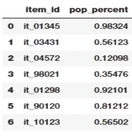

# 特征工程

> 原文：<https://medium.com/analytics-vidhya/feature-engineering-3e5c6dc9432b?source=collection_archive---------16----------------------->

《福布斯》的调查显示，数据科学家 80%的时间都花在数据准备上。由此可见特征工程在数据科学中的重要性。以下是关于功能工程及其重要性的一些有价值的引用:

想出特性是困难的，耗时的，需要专业知识。“应用机器学习”基本上是特征工程——吴恩达教授。

你使用的特性比其他任何东西都更能影响结果。据我所知，没有一种算法能够单独补充正确特征工程所提供的信息增益

**什么是特征工程？**

特征工程是将原始数据转换为更好地代表预测模型潜在问题的特征的过程，从而提高对未知数据的模型准确性。

基本上，所有的机器学习算法都使用一些输入数据来创建输出。该输入数据包括特征，这些特征通常是结构化列的形式。算法需要具有某些特定特征的功能才能正常工作

拥有和设计好的特性将允许我们最准确地表示数据的底层结构，从而创建最好的模型。可以通过分解或拆分外部数据源中的要素，或者聚合或组合要素以创建新要素来设计要素。

**特色工程目标**

特征工程可以分为两种用例

为了获得最好的预测精度:如果目标是拥有一个多产的系统，为预测精度建模是默认的

解码和解释固有的属性:当模型应该易于解释，人们可以获得更好的问题知识

**特征工程是一门艺术**

数据是一个变量，每次都不一样。我们如何分解或聚集原始数据来更好地描述潜在的问题？

表格数据是根据由变量或属性(列)组成的观察值或实例(行)来描述的。属性可以是特征。

独立于属性的特性的概念在问题的上下文中更有意义。特征是对您的问题有用或有意义的属性。这是观察的一个重要部分，用于了解正在建模的问题的结构。

在计算机视觉中，图像是一种观察，但特征可以是图像中的一条线。在自然语言处理中，一个文档或一条推文可以是一个观察，一个短语或字数可以是一个特征。在语音识别中，一个话语可能是一个观察值，但一个特征可能是一个单词。

让我们看一些关于数字、分类和文本列的特性工程的例子。

**分解日期时间**

日期时间包含大量信息，模型很难利用这些信息的原始形式(即 2014–09–20 20:45:40)。

例如，我们可能怀疑一天中的时间和其他属性之间存在关系。

我们可以创建一个新的数字特性，称为一小时中的一小时，这可能有助于回归模型。

我们可以创建一个名为“一天中的一部分”的新的顺序特征，它有 4 个值:上午、中午、下午、晚上，以及您认为相关的任何小时界限。这可能对决策树有用。

我们可以使用类似的方法来找出一周中的时间关系、一个月中的时间关系以及一年中季节性的各种结构。

**百分比**

通常，当处理像比例或百分比这样的连续数字属性时，我们可能不需要精度很高的原始值。因此，将这些高精度百分比四舍五入成数字整数通常是有意义的。然后，这些整数可以直接用作原始值，甚至用作分类(基于离散类)特征。让我们尝试将这个概念应用到一个虚拟数据集中，描述商店商品及其受欢迎程度

项目和受欢迎程度百分比

百分比标度转换后

基于上面的输出，我们可以猜测我们尝试了两种形式的舍入。这些特征以 1-10 和 1-100 两种尺度描述了该商品的流行程度。根据场景和问题，您可以将这些值用作数字特征或分类特征

**分解分类属性**

假设我们有一个分类属性，比如“物品颜色”，可以是红色、蓝色或未知。

未知可能很特别，但对模特来说，它看起来只是另一种颜色选择。更好地公开这些信息可能是有益的。

您可以创建一个名为“有颜色”的新二进制要素，并在项目有颜色时为其赋值“1”，在颜色未知时为其赋值“0”。

更进一步，您可以为项目颜色的每个值创建一个二元要素。这将是三个二元属性:红色、蓝色和未知。

这些额外的特性可以用来代替项目颜色特性(如果您想尝试一个更简单的线性模型)，或者作为它的补充(如果您想从决策树这样的东西中获得更多)。

在这里，我们可以看到如何使用一键编码方法将城市字段转换为要素

**宁滨**

使用原始连续数字要素的问题在于，这些要素中的值分布通常会有偏差。这意味着有些值会经常出现，而有些值会很少出现。除此之外，还有另一个问题是这些特征中的任何一个的值的变化范围。例如，特定音乐视频的观看次数可能异常多，而有些可能很少

宁滨，也称为量化，用于将连续的数字特征转换为离散的数字特征(类别)。这些离散值或数字可以被认为是类别或箱，原始的连续数值被装入或分组到这些类别或箱中。每个面元代表一个特定的强度等级，因此属于它的连续数值的特定范围

宁滨时代的例子

宁滨后的直方图

**分组**

在大多数数据集中，每个实例都由数据集中的一行来表示，其中每一列都显示该实例的不同功能。这种数据叫做“整齐”。像事务这样的数据集很少符合上面整洁数据的定义，因为一个实例有多行。在这种情况下，我们按实例对数据进行分组，然后每个实例仅由一行表示。分组操作的关键是确定特征的聚合函数。

对于数字特征，平均值和总和函数通常是方便的选项，而对于分类特征，则更复杂。

大多数情况下，使用 sum 和 mean 函数对数字列进行分组。根据特征的含义，两者都是优选的。例如，如果要获得比率列，可以使用二进制列的平均值。在同一个示例中，sum 函数也可用于获得总计数。

对于非数字特征，第一个选项是选择频率最高的标签。

**重构数值量**

我们的数据很可能包含数量，这些数量可以被重新构造以更好地揭示相关的结构。这可能是转换成一个新的单位或将一个比率分解成时间和数量部分

例如，我们可能有以克为单位的物品重量，其值类似于 6289。我们可以用 6.289 这样的千克数或 6 这样的整数千克数来创建一个新的特征。如果域是运输数据，那么对于物品重量来说，千克可能就足够了或者更有用(噪音更小)。

物品重量可以分成两个特征:物品重量公斤数和物品重量剩余克数，示例值分别为 6 和 289。

可能存在这样的领域知识，即权重大于 4 的项目招致更高的税率。对于我们的 6289 克的例子，该魔域数可用于创建新的二进制特征 Item_Above_4kg，其值为“1”。

我们也可以将一个数量存储为一个时间间隔的比率或总量。例如，一年内累计的客户购买数量。

在这种情况下，我们可能希望返回到数据收集步骤，并创建除此聚合之外的新功能，并尝试在购买中显示更多的时间结构，例如季节性。例如，可以创建以下新的二进制要素:Purchases_Summer、Purchases_Fall、Purchases_Winter 和 Purchases_Spring。

样品销售和销售日期

重新构建数量后

**功能选择**

维数灾难:有太多特征的问题。更多的特征使模型更有表现力，但并不是所有的特征都是相关的。维度越高，出现虚假特征的可能性就越大

特征选择是解决高维问题的方法之一。这是一个关键概念，利用它我们可以选择对我们的目标变量有最大影响的特征。例如，如果我们的业务问题是预测订单，那么我们应该只选择具有良好方差的相关变量/字段来预测订单，而不是使用所有的变量/字段。

显著的特征选择方法:

监督方法

无人监管的方法

规范化

为功能分配分数，然后可以根据分数对其进行排名。可以选择得分最高的那些特征。

要素重要性分数还可以为您提供信息，您可以使用这些信息来提取或构建新的要素，这些要素与那些被估计为有用的要素相似但不同。

如果某个特征与因变量(被预测的事物)高度相关，则该特征可能是重要的。

**自动特征选择**

监督方法:

过滤方法:计算一些用于估计在类之间进行区分的能力的度量，通常测量特征权重并选择最佳的 n 个特征→监督排序特征选择

得分高的功能

包装方法:在所有可能的特征子集的空间中搜索。每个搜索子集都用一种学习算法进行试验

包装方法通用算法:

1.  初始子集选择
2.  与学习者一起尝试子集
3.  修改特征子集
4.  重新运行学员
5.  衡量差异

转到 2

**优点:**组合特征，忽略冗余/不相关的特征

**缺点:**计算量大 1)初始子集选择，2)子集修改:前向选择和后向排除

无监督方法:无监督的分级特征选择评分函数，根据特征的重要性对特征进行分级…然后只使用前 5% (10%、25%、…)，例如，对于文本数据，使用参考语料库中的单词频率

无监督方法

**文本挖掘的特征工程**

二元模型特征当使用单个单词作为特征时，序列信息通常会丢失，但这可能是潜在的信息源→引入新特征作为两个相邻单词的组合

n 元语法:二元语法可以扩展到两个以上的单词→ n 元语法可以扩展到单词之间有间隔(跳过 n 元语法)

我们可以不处理整篇文章，而是把它分割成单个单词，并试图找到出现次数最多的单词。

例如，我们可以访问某个人力资源部门的数据库。其中一个字段可能是学术头衔。我们可以找到很多东西，像工程学士、理学硕士和哲学博士。但是还会有更多。我们从中可以提取的是没有具体领域的学士、硕士、博士之类的词。比如说，这些跨度是教育水平的四级(没有头衔)分类特征。

一个类似的例子是带标题的全名。在这个领域，我们可以找到像 XXXX 先生、XXXX 夫人和 YYYY 小姐这样的短语。我们可以提取表明性别和婚姻状况的先生、夫人或小姐的头衔。如前所述，有很多方法可以在不使用 NLP 全部功能的情况下使用文本数据，这在计算上非常昂贵。

**参考文献:**

以下是一些普遍相关且有趣的幻灯片:

[https://machine learning mastery . com/discover-feature-engineering-how-to-engineer-features-and-how-to-get-good-it/](https://machinelearningmastery.com/discover-feature-engineering-how-to-engineer-features-and-how-to-get-good-at-it/)

[特征工程与选择](http://www.cs.berkeley.edu/~jordan/courses/294-fall09/lectures/feature/slides.pdf) (PDF)，CS 294: [实用机器学习](http://www.cs.berkeley.edu/~jordan/courses/294-fall09/lectures/feature/)，伯克利

[特征工程](http://kti.tugraz.at/staff/denis/courses/kddm1/featureengineering.pdf) (PDF)，知识发现和数据挖掘 1，作者 Roman Kern，[知识技术研究所](http://kti.tugraz.at/staff/denis/courses/kddm1/)

[特征工程工作室](http://www.columbia.edu/~rsb2162/FES2013/materials.html)，课程讲座幻灯片和材料，哥伦比亚

[特征工程](http://www.cs.princeton.edu/courses/archive/spring10/cos424/slides/18-feat.pdf) (PDF)，利昂·博图，普林斯顿