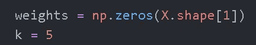

# 特征工程实验-加权 KNN

> 原文：<https://medium.com/analytics-vidhya/feature-engineering-experiment-weighted-knn-3f28dfdf30e1?source=collection_archive---------5----------------------->

使用 KNN 学习特征权重

从如此多的可能性中选择一个

关于机器学习问题，我有一个惨痛的教训，那就是大多数机器学习问题都需要花费大量的时间，而不是数据争论，而是 EDA 和功能探索。

这一关键步骤在大多数课程和演讲中经常被忽视，主要是因为它既是一门科学，也是一门艺术。当我说艺术时，主要是因为如何实现特征工程的可能性，如超参数调整，只受计算资源和时间的限制。

这些方法从用于子集选择的包装器方法到特征提取和特征构造各不相同。其中每个范围从利用 KNNs 到随机森林到方差阈值等等。

本文讨论使用 KNNs 来学习可用特征的权重，然后选择具有最大权重的特征。

**直观地看，这种方法是如何工作的**

1.  对于数据集中的所有观察值，它计算每个观察值和所有其他观察值之间的相似性。它与普通香草 KNN 的不同之处在于相似度是加权的。

在具有欧几里得距离的普通 KNN 中，我们将有——两个观察点 p，q 之间的距离由 d(p，q)给出

但是在加权的形式下，我们会有这样的结果

其中对于每个第 I 个特征，有一个相应的权重 w-i

2.该相似性/距离度量然后被用于选择特定观察的 k 个最近邻居

3.现在像在 KNN 一样，我们用邻居来预测观察值的标号。

4.基于预测，我们可以计算性能指标，如准确性或 AUC 或对数损失。

*这又将作为我们整体特征学习算法的损失函数。*

*ie-我们将不断改变权重使用优化算法，如梯度下降，直到我们能够最小化损失函数。*

让我们用 Python 做一些实验——代码在这里 [#github](https://github.com/abhijeetdtu/Analytics/blob/master/Stats/feature_engineering/knn_weights.py)

导入所需的库

然后使用 **sklearn 的 make_classification** 我们创建了一个包含 300 个观察值的数据集，其中只有 5 个是信息特征

然后使用 np.random.normal，我们添加了 10 个基本上只是噪声的特征

然后，我们将权重初始化为全零，并将 knn 的 k 设置为 5

然后我们将 KNN 算法封装在一个函数中。让我们回顾一下整个方法。

1.  我们正在迭代所有的观察对

2.并计算它们之间的**加权绝对距离**。

3.然后，我们挑选 k 个最近的邻居，并使用它们来为每个观察预测正确的标签。

4.然后，我们使用预测的概率来计算**准确度分数**

下面是 knnWeights 函数的完整代码

然后我们使用 **scipy 的最小化**来学习权重

为了了解学习到的权重有多好，我们可以使用所有特征运行 KNN，并将其与仅使用具有最高权重的 5 个特征的 KNN 运行进行比较(请记住，在创建数据集时，我们将 n _ informative 设置为 5)。我们还随机选择一个特征子集，并比较结果。

*   使用 KNN 分类器的结果具有所有特征

*   使用具有最高权重特征的 KNN 分类器的结果

*   使用随机子集的结果

我们可以将这些指标——准确性和每次实验的 ROC 合并到一个数据框架中，并运行 10 次实验来获得一个总体感觉

10 次实验的结果是

其中，rfa =随机特征子集精度

rfauc =随机特征子集 auc

woa =无特征选择准确性

woauc =无特征选择 auc

wa =特征选择精度

wauc =特征选择精度

为了更好地理解，我们可以把结果汇总起来

我们看到的是，随机特征子集选择的平均性能较差，而使用 KNN 选择的特征具有最高的平均性能。在这两种方法之间，没有特征选择产生性能。