# 图像特征工程:HOG 特征描述符的有价值的介绍

> 原文：<https://medium.com/analytics-vidhya/feature-engineering-for-images-a-valuable-introduction-to-the-hog-feature-descriptor-9f27512e5361?source=collection_archive---------15----------------------->

# 概观

*   了解 HOG 特征描述符背后的内部工作原理和数学原理
*   HOG 特征描述子在计算机视觉中广泛用于目标检测
*   对所有计算机视觉爱好者有价值的特征工程指南

# 介绍

特征工程是机器学习算法领域的游戏规则改变者。这实际上是我作为数据科学家最喜欢的方面之一！这是我们进行实验最多的地方——从现有的功能中设计新的功能，并提高我们模型的性能。

世界上一些顶尖的数据科学家依靠特征工程来提高他们在黑客马拉松中的排行榜分数。我相信您甚至会在结构化数据上使用各种特征工程技术。

我们能否将这种技术扩展到非结构化数据，比如图像？对于计算机视觉爱好者来说，这是一个有趣的谜题，也是我们将在本文中解决的问题。准备好以特征提取的形式对图像数据执行特征工程！

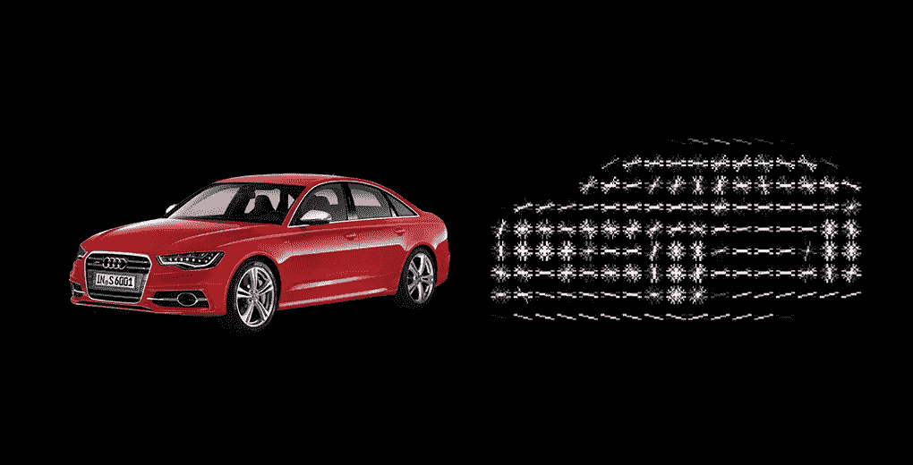

*实际上有多种特征提取技术。我在上一篇文章中提到了三个基本问题，您应该在继续之前阅读一下:*

在本文中，我将向您介绍一种流行的图像特征提取技术——梯度方向直方图，或俗称的 HOG。我们将了解什么是 HOG 特征描述符，它是如何工作的(算法背后的完整数学)，最后，用 Python 实现它。

# 目录

1.  什么是特征描述符？
2.  HOG 特征描述符介绍
3.  计算 HOG
    的过程 3.1 预处理数据
    3.2 计算梯度
    3.3 计算幅度&方向
4.  使用梯度和方向创建直方图的方法
5.  计算 HOG 的过程
    5.1 计算梯度直方图
    5.2 归一化梯度
    5.3 完整图像的特征
6.  在 Python 中实现 HOG 特征描述符

# 什么是特征描述符？

你可能看过标题后就有这个疑问了。所以，在我们进入文章的猪部分之前，让我们先弄清楚这一点。

看看下面的两张图片。你能区分图像中的物体吗？

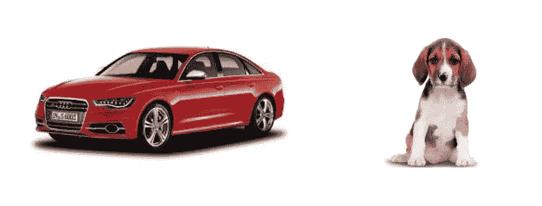

我们可以清楚地看到，这里的右图有一只狗，左图有一辆车。现在，让我把这个任务变得稍微复杂一点——识别下图中显示的对象:

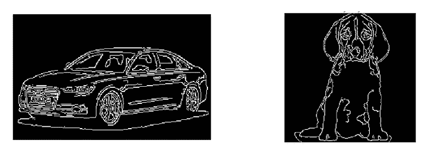

还是很简单，对吧？你能猜出第一个和第二个案例有什么不同吗？第一对图像包含了很多信息，比如物体的形状、颜色、边缘、背景等等。

另一方面，第二对图像的信息要少得多(只有形状和边缘)，但仍足以区分两幅图像。

你明白我的意思了吗？在第二种情况下，我们能够很容易地区分物体，因为它有我们识别物体所需的必要信息。这正是特征描述符的作用:

> 它是图像的简化表示，仅包含关于图像的最重要信息。

有许多特性描述符。以下是几个最受欢迎的:

*   HOG:方向梯度直方图
*   SIFT:尺度不变特征变换
*   SURF:加速的健壮特性

在本文中，我们将重点介绍 HOG 特征描述符及其工作原理。我们开始吧！

# HOG 特征描述符介绍

HOG 或方向梯度直方图是一种特征描述符，通常用于从图像数据中提取特征。它广泛应用于[计算机视觉](https://courses.analyticsvidhya.com/courses/computer-vision-using-deep-learning-version2/?utm_source=blog&utm_medium=understand-math-HOG-feature-descriptor)任务中进行[物体检测](https://www.analyticsvidhya.com/blog/2018/10/a-step-by-step-introduction-to-the-basic-object-detection-algorithms-part-1/?utm_source=blog&utm_medium=understand-math-HOG-feature-descriptor)。

让我们来看看 HOG 与其他特性描述符不同的一些重要方面:

*   HOG 描述符侧重于对象的结构或形状。现在你可能会问，这与我们为图像提取的边缘特征有什么不同？在边缘特征的情况下，我们只识别像素是否是边缘。HOG 也能够提供边缘方向。这是通过提取边缘的**梯度和方向**(或者你可以说幅度和方向)来完成的
*   此外，这些方位在**“局部化”部分**中进行计算。这意味着完整的图像被分解成更小的区域，并且对于每个区域，计算梯度和方向。我们将在接下来的章节中更详细地讨论这一点
*   最后，HOG 将分别为这些区域中的每一个生成一个直方图**。直方图是使用像素值的梯度和方向创建的，因此被命名为“梯度方向直方图”**

给它下一个正式的定义:

> *HOG 特征描述符统计图像局部梯度方向的出现次数。*

使用 OpenCV 之类的工具实现 HOG 非常简单。这只是几行代码，因为我们在 ***skimage.feature*** 库中有一个名为 ***hog*** 的预定义函数。然而，在本文中，我们关注的是这些特性实际上是如何计算的。

# 计算方向梯度直方图(HOG)的过程

我们现在应该对什么是 HOG 特征描述符有了一个基本的概念。是时候深入探究这篇文章背后的核心思想了。我们来讨论一下计算 HOG 的一步一步的过程。

考虑下图的尺寸(180 x 280)。让我们详细看看如何为该图像创建 HOG 特征:

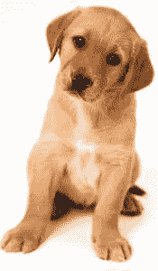

# 步骤 1:预处理数据(64 x 128)

这是你们大多数人都很熟悉的一步。在任何机器学习项目中，预处理数据都是至关重要的一步，在处理图像时也是如此。

我们需要对图像进行预处理，将宽高比降低到 1:2。图像大小最好是 64 x 128。这是因为我们将把图像分成 8*8 和 16*16 的小块来提取特征。具有指定的大小(64 x 128)将使我们所有的计算非常简单。其实这就是[原论文](http://lear.inrialpes.fr/people/triggs/pubs/Dalal-cvpr05.pdf)中使用的确切数值。

回到我们的例子，让我们把 64 x 128 的尺寸作为现在的标准图像尺寸。这是调整后的图像:

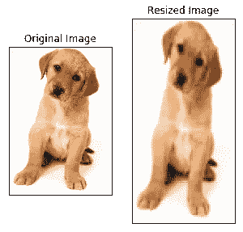

# 步骤 2:计算梯度(x 和 y 方向)

下一步是计算图像中每个像素的梯度。**渐变是 x 和 y 方向的微小变化。**在这里，我将从图像中提取一小块，并计算其梯度:

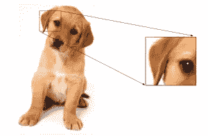

我们将得到这个补丁的像素值。假设我们为给定的补丁生成下面的像素矩阵*(此处显示的矩阵仅用作示例，这些不是给定补丁的原始像素值)*:

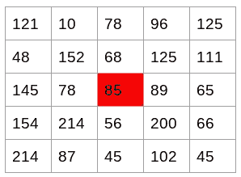

来源:[应用机器学习课程](https://courses.analyticsvidhya.com/courses/applied-machine-learning-beginner-to-professional/?utm_source=blog&utm_medium=understand-math-HOG-feature-descriptor)

我已经突出显示了像素值 85。现在，为了确定 x 方向的梯度(或变化)，我们需要从右边的像素值中减去左边的值。类似地，为了计算 y 方向的梯度，我们将从所选像素上方的像素值中减去下方的像素值。

因此，该像素在 x 和 y 方向上的合成梯度为:

*   X 方向的变化(Gx)= 89–78 = 11
*   Y 方向的变化(Gy)= 68–56 = 8

这个过程将为我们提供两个新矩阵，一个存储 x 方向的梯度，另一个存储 y 方向的梯度。这类似于使用大小为 1 的 Sobel 核。当强度发生急剧变化时，例如在边缘附近，震级会更高。

我们已经分别计算了 x 和 y 方向的梯度。对图像中的所有像素重复相同的过程。下一步将是使用这些值找到震级和方位。

# 第三步:计算震级和方位

使用我们在上一步中计算的梯度，我们现在将确定每个像素值的大小和方向。对于这一步，我们将使用毕达哥拉斯定理(是的，就是你在学校学过的那一个！).

请看下图:

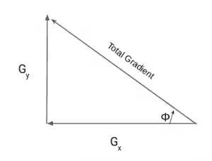

梯度基本上是底部和垂直的。在前面的例子中，Gx 和 Gy 分别为 11 和 8。让我们应用毕达哥拉斯定理来计算总梯度幅度:

总梯度幅度= √[(11) 2+(8) 2] = 13.6

接下来，计算同一像素的方向。我们知道可以为角度写 tan:

tan(φ)= Gy/Gx

因此，角度值为:

φ= atan(Gy/Gx)

当我们插入这些值时，方向是 36。所以现在，对于每个像素值，我们有总梯度(幅度)和方向(方向)。我们需要使用这些梯度和方向来生成直方图。

但是等一下——在我们开始研究如何在 HOG 特征描述符中创建直方图之前，我们需要稍微休息一下。这是整个过程中的一小步。首先，我们将讨论一些使用两个值(梯度和方向)创建直方图的简单方法。

# 使用梯度和方向创建直方图的不同方法

**直方图是显示一组连续数据的频率分布的图。**我们在 x 轴上有变量(以箱的形式),在 y 轴上有频率。这里，我们在 x 轴上取角度或方向，在 y 轴上取频率。

# 方法 1:

让我们从生成直方图的最简单的方法开始。我们将获取每个像素值，找到像素的方向并更新频率表。

下面是高亮像素(85)的处理过程。由于此像素的方向为 36，我们将在角度值 36 处添加一个数字，表示频率:

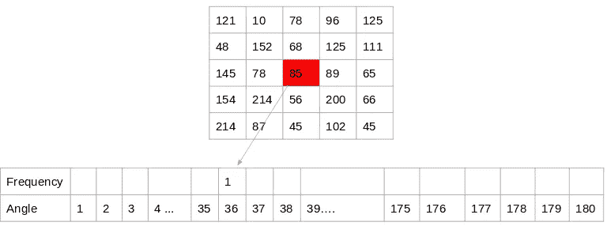

[来源:](https://s3-ap-south-1.amazonaws.com/av-blog-media/wp-content/uploads/2019/08/article-image-10.png) [应用机器学习课程](https://courses.analyticsvidhya.com/courses/applied-machine-learning-beginner-to-professional)

对所有像素值重复相同的过程，我们最终得到一个频率表，它表示图像中的角度和这些角度的出现。该频率表可用于生成直方图，x 轴为角度值，y 轴为频率。

这是创建直方图的一种方法。注意，这里直方图的柱值是 1。因此，我们得到大约 180 个不同的桶，每个桶代表一个方向值。另一种方法是为较高的 bin 值创建直方图特征。

## 方法二:

这个方法类似于前面的方法，除了这里我们有一个大小为 20 的容器。所以，我们在这里得到的桶数是 9。

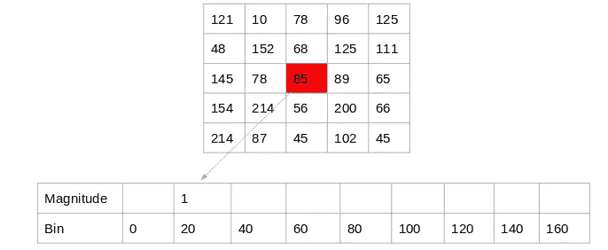

[来源:](https://s3-ap-south-1.amazonaws.com/av-blog-media/wp-content/uploads/2019/08/article-image-10.png) [应用机器学习课程](https://courses.analyticsvidhya.com/courses/applied-machine-learning-beginner-to-professional)

同样，对于每个像素，我们将检查方向，并以 9 x 1 矩阵的形式存储方向值的频率。绘制这个图会给出直方图:

## 方法三:

上述两种方法仅使用方向值来生成直方图，而不考虑梯度值。这里是我们生成直方图的另一种方法— **不使用频率，我们可以使用梯度幅度来填充矩阵中的值。**下面是一个例子:

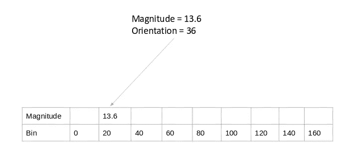

[来源:](https://s3-ap-south-1.amazonaws.com/av-blog-media/wp-content/uploads/2019/08/article-image-10.png) [应用机器学习课程](https://courses.analyticsvidhya.com/courses/applied-machine-learning-beginner-to-professional)

您可能已经注意到，我们使用的方向值为 30，并且只更新 bin 20。此外，我们还应该给另一个箱子一些权重。

# 方法 4:

让我们对上面的方法做一个小小的修改。这里，我们将像素梯度的贡献添加到像素梯度任一侧的箱中。请记住，越靠近方向的面元值贡献越大。

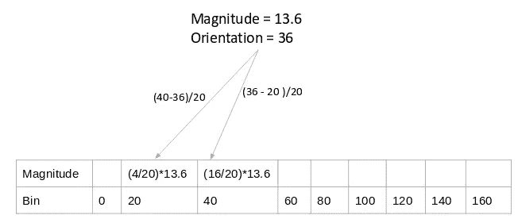

来源:[应用机器学习课程](https://courses.analyticsvidhya.com/courses/applied-machine-learning-beginner-to-professional)

这正是在 HOG 特征描述符中创建直方图的方式。

# 步骤 4:计算 8×8 单元(9×1)的梯度直方图

在 HOG 特征描述符中创建的直方图不是为整个图像生成的。相反，图像被分成 8×8 个单元，并且为每个单元计算方向梯度的直方图。你认为为什么会发生这种情况？

通过这样做，我们得到了代表整个图像的小块的特征(或直方图)。我们当然可以将此处的值从 8 x 8 更改为 16 x 16 或 32 x 32。

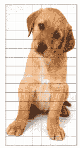

如果我们将图像分成 8×8 个单元并生成直方图，我们将为每个单元得到一个 9×1 的矩阵。这个矩阵是使用我们在上一节中讨论的方法 4 生成的。

一旦我们为图像中的 8×8 小块生成了 HOG，下一步就是归一化直方图。

# 步骤 5:归一化 16×16 单元格(36×1)中的梯度

在我们理解这是如何做到的之前，首先理解为什么这样做是很重要的。

虽然我们已经为图像的 8×8 单元创建了 HOG 特征，但是图像的梯度对整体照明很敏感。这意味着对于特定的图片，图像的某些部分与其他部分相比会非常亮。

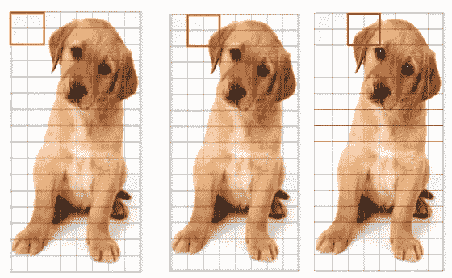

我们不能从图像中完全消除这一点。但是，我们可以通过采用 16×16 块来归一化梯度，从而减少这种光照变化。以下示例可以解释 16×16 块是如何创建的:

这里，我们将组合四个 8×8 单元来创建一个 16×16 块。我们已经知道，每个 8×8 的单元都有一个 9×1 的直方图矩阵。因此，我们将有四个 9×1 矩阵或一个 36×1 矩阵。为了规范化这个矩阵，我们将把这些值除以这些值的平方和的平方根。数学上，对于给定的矢量 V:

V = [a1，a2，a3，….a36]

我们计算平方和的平方根:

k = √(a1)2+ (a2)2+ (a3)2+ …。(a36)2

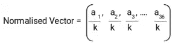

并将向量 V 中的所有值除以这个值 k:

结果将是大小为 36×1 的归一化向量。

# 步骤 6:完整图像的特征

我们现在处于为图像生成 HOG 特征的最后一步。到目前为止，我们已经为图像的 16×16 块创建了特征。现在，我们将结合所有这些来获得最终图像的特征。

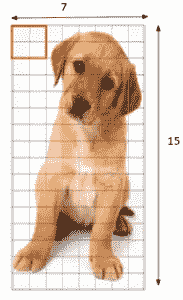

你能猜出给定图像的特征总数是多少吗？我们首先需要找出对于单个 64×128 的图像，我们将得到多少个这样的 16×16 的块:

我们将有 105 (7×15)个 16×16 的块。这 105 个块中的每一个都具有 36×1 的向量作为特征。因此，图像的总特征将是 105×36×1 = 3780 个特征。

我们现在将为单个图像生成 HOG 特征，并验证我们最终是否获得相同数量的特征。

# 在 Python 中实现 HOG 特征描述符

是时候启动 Python 了！我相信，这是本文最令人期待的部分。所以让我们开始吧。

我们将了解如何在单个图像上生成 HOG 特征，以及是否可以在更大的数据集上应用同样的方法。我们将首先加载所需的库和映像，我们将为其创建 HOG 特性:

```
#importing required libraries                       
from skimage.io import imread, imshow                       
from skimage.transform import resize                       
from skimage.feature import hog                       
from skimage import exposure                       
import matplotlib.pyplot as plt                       
%matplotlib inline
                                                                       #reading the image                       
img = imread('puppy.jpeg')                       
imshow(img)                       
print(img.shape)
```

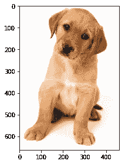

```
(663, 459, 3)
```

我们可以看到图像的形状是 663 x 459。我们将不得不把这张图片的尺寸调整为 64 x 128。注意，我们使用的是 *skimage* ，它将输入作为高度 x 宽度。

```
#resizing image                        
resized_img = resize(img, (128,64))  

imshow(resized_img)                        print(resized_img.shape)
```

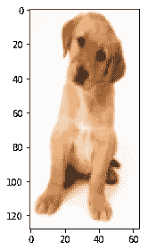

```
(128, 64, 3)
```

这里，我将直接使用 *skimage.features* 中的 hog 函数。所以我们不必单独计算梯度、幅度(总梯度)和方向。hog 函数将在内部计算它并返回特征矩阵。

此外，如果您设置参数' visualize = True '，它将返回猪的图像。

```
#creating hog features                        
fd, hog_image = hog(resized_img, orientations=9,    pixels_per_cell=(8, 8), cells_per_block=(2, 2), visualize=True, multichannel=True)
```

在继续之前，让我给你一个这些超参数代表什么的基本概念。或者，你可以在这里查看来自官方文件[的定义。](https://scikit-image.org/docs/dev/api/skimage.feature.html#skimage.feature.hog)

*   *方向*是我们想要创建的桶的数量。因为我想有一个 9 x 1 的矩阵，我将设置方向为 9
*   *pixels_per_cell* 定义我们为其创建直方图的单元格的大小。在本文的示例中，我们使用了 8 x 8 个单元格，这里我将设置相同的值。如前所述，您可以选择更改该值
*   我们有另一个超参数 *cells_per_block* ，它是我们归一化直方图的块的大小。这里，我们提到的是每块的单元数，而不是像素数。因此，这里我们将使用 2 x 2，而不是 16 x 16

来自函数的特征矩阵存储在变量 *fd* 中，图像存储在 *hog_image* 中。让我们检查特征矩阵的形状:

```
fd.shape(3780,)
```

正如预期的那样，我们有 3，780 个图像特征，这验证了我们之前在步骤 7 中所做的计算。您可以选择改变超参数的值，这将为您提供不同大小的特征矩阵。

让我们最后看看猪的形象:

```
fig, (ax1, ax2) = plt.subplots(1, 2, figsize=(16, 8), sharex=True, sharey=True) ax1.imshow(resized_img, cmap=plt.cm.gray)                        ax1.set_title('Input image') # Rescale histogram for better display                        hog_image_rescaled = exposure.rescale_intensity(hog_image, in_range=(0, 10)) ax2.imshow(hog_image_rescaled, cmap=plt.cm.gray)                        ax2.set_title('Histogram of Oriented Gradients')                                               plt.show()
```

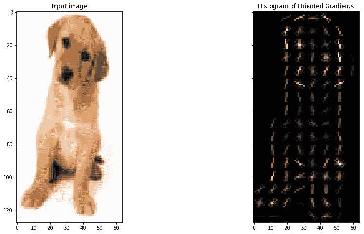

# 结束注释

本文的目的是让您了解 HOG 特征描述符背后实际发生了什么，以及这些特征是如何计算的。整个过程分为 7 个简单的步骤。

下一步，我会鼓励你在一个简单的[计算机视觉](https://courses.analyticsvidhya.com/courses/computer-vision-using-deep-learning-version2/?utm_source=blog&utm_medium=understand-math-HOG-feature-descriptor)问题上尝试使用 HOG 特性，看看模型性能是否有所提高。请在评论区分享你的结果！

*原载于 2019 年 9 月 4 日*[*https://www.analyticsvidhya.com*](https://www.analyticsvidhya.com/blog/2019/09/feature-engineering-images-introduction-hog-feature-descriptor/)T22。