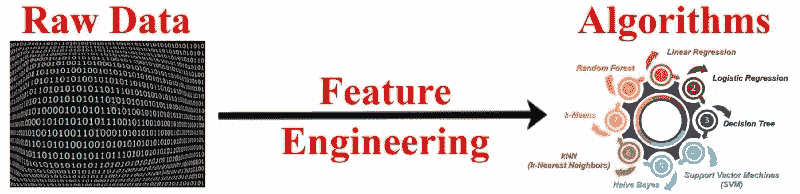

# 机器学习中的特征工程

> 原文：<https://medium.com/analytics-vidhya/feature-engineering-for-machine-learning-e3c34d6c8055?source=collection_archive---------12----------------------->

处理缺失值、编码技术、处理异常值、变换技术、特征选择技术等。


谷歌照片

> 在这篇文章中，我将讨论特征工程及其技术。与此相关的代码在我的 [GitHub](https://github.com/abhashpanwar/machine-learning/tree/master/Feature%20Engineering) 里。



F 特征工程是机器学习中的过程，在该过程中，我们使用领域知识从原始数据中提取特征。这些特征可以用来提高机器学习算法的性能。特征工程包括数据清洗、特征提取、特征选择、预处理等。

在本文中，我将深入讨论一些特性工程技术并做一些简要介绍。


# 为什么选择特征工程:

1.  数据中的特征/列将直接影响您使用的预测模型以及您可以实现的结果。
2.  提高模型性能。
3.  模型不能在原始数据上执行，因此需要进行数据清理。

# 主要功能工程包括:

1.  处理缺失值(在处理缺失值和目标变量之前找到它们之间的关系)
2.  编码分类变量
3.  处理异常值
4.  处理不平衡的数据集
5.  转换(如标准化或规范化)
6.  特征选择技术

# 1)处理缺失值

## 1.1)均值/中值/众数替换:

*   如果一个特征有很多 ***NaN*** 值，用中位数或者均值替换当且仅当该特征与目标变量有关系或者数据完全随机缺失时([](https://en.wikipedia.org/wiki/Missing_data#Missing_completely_at_random)*)。*
*   *在分类变量的情况下，估算 ***模式*** 。*

**

*[图片由 Panwar Abhash Anil 拍摄](https://www.linkedin.com/in/abhash-panwar-85126976/)*

*蓝线(原始数据)不同于红线(估算数据)，因此，我们可以得出结论，数据的分布是不一样的。*

## ****优点:****

*   *易于实现(对异常值具有鲁棒性)。*
*   *获取完整数据集的更快方法。*

## *缺点:*

*   *原始方差的变化或失真。*
*   *影响相关性。*

## *1.2)随机样本插补:*

*   *随机样本插补包括从数据集中进行随机观察，我们使用该观察来替换 NaN 值。*
*   *我们应该什么时候使用？它假设数据完全随机缺失(MCAR)。*
*   *包括数字和分类特征。*

**

*[图片由 Panwar Abhash Anil 拍摄](https://www.linkedin.com/in/abhash-panwar-85126976/)*

*原始数据(蓝线)与估算数据(绿线)重叠。插补前后的分布是相同的。*

## *优势*

*   *容易实现。*
*   *失真不变性更小。*

## *不足之处*

*   *在任何情况下，随机性都不会起作用。*

## *1.3)使用新功能捕获 NAN 值:*

*   *如果数据不是完全随机丢失([*【MAR】*](https://en.wikipedia.org/wiki/Missing_data#Missing_not_at_random))并且当有更多数量的 NaN 值时，它工作得很好。*
*   *它抓住了 NaN 价值观的重要性。*
*   *主要是分类特征。*

> *df[' feature _ NAN ']= NP . where(df[' feature ']。isnull()，1，0)*

## *优势*

*   *容易实现。*
*   *捕捉缺失值的重要性。*

## *不足之处*

*   *创建附加特征(维数灾难)。*

# *1.4)分布终点插补:*

*   *如果丢失的值不是随机的，那么获取该信息就很重要。*
*   *我们取第三个标准之后的值。*
*   *用于数字特征。*

**

*[图片由 Panwar Abhash Anil 拍摄](https://www.linkedin.com/in/abhash-panwar-85126976/)*

## *优势*

*   *它很快。*
*   *捕捉丢失值的重要性(如果有人怀疑丢失的数据有价值)。*

## *不足之处*

*   *扭曲变量。*
*   *如果遗漏不重要，掩盖预测能力。*
*   *如果缺失数据很大，隐藏真实的异常值。*

## *1.5)任意值插补:*

*   *这项技术源于卡格尔竞赛。它包括用任意值替换 NAN。*
*   *对于数字特征。*

## *优势*

*   *容易实现。*
*   *抓住了错过的重要性，如果有的话。*

## *不足之处*

*   *扭曲变量的原始分布。*
*   *如果遗漏不重要，它可能会通过扭曲原始变量的分布来掩盖其预测能力。*
*   *很难决定使用哪个值。*

## *1.6)频繁的类别插补:*

*分类特征由特征的类别的频率来估算。*

## *优势*

*   *容易实现。*

## *不足之处*

*   *由于我们使用更频繁的标签，如果有许多 n an，它可能会以过度表示的方式使用它们。*
*   *它扭曲了最频繁标签的关系。*

## *1.7)将类别的 NaN 值视为新类别:*

*   *当测试数据集确实包含训练数据集中不存在的类别时，这种技术将很有帮助。所以未知类别被当作一个新的类别。*
*   *分类特征。*

# *2)编码技术的类型*

*在将数据提供给模型之前，**分类变量**必须**转换**为数值，因为模型进行数学计算，所以需要数值。*

## *2.1)标称编码:*

***名义数据**定义为**数据**，用于命名或标注变量，无任何量化值。*

## *2.1.1)一个热编码(如性别):*

*这种技术为每个类别创建一个二进制列，并返回一个稀疏矩阵或密集数组。*

**

*[图片由 Panwar Abhash Anil 拍摄](https://www.linkedin.com/in/abhash-panwar-85126976/)*

## *2.1.2)一个具有多个分类的热编码(如密码):*

*   *假设一个变量有超过 20 个类别，那么我们不能直接应用一个热编码*
*   *查找重复最频繁的前 k 个类别*
*   *然后获取 k 个类别并创建 k 个新特征。*

## *2.1.2)平均编码:*

*分类特征的类别由它们的平均值代替。*

## ***优势:***

*   *捕捉标签内的信息，从而提供更多预测功能*
*   *创建变量和目标之间的单调关系*

## ***缺点:***

*   *这可能会导致模型中的过度拟合。*

## *2.2)顺序编码:*

***顺序数据**是一种分类数据**类型，其中变量具有自然的有序类别，类别之间的距离未知。例如:评级、等级等。***

## *2.2.1)标签编码:*

***标签编码**只是将一列中的每个值转换成一个数字。*

**

*[图片由 Panwar Abhash Anil 拍摄](https://www.linkedin.com/in/abhash-panwar-85126976/)*

*自然，教育顺序如下:学士->学士->博士*

*所以标签编码会是:(BE->0，BSs->1，Phd->2)。*

## *2.2.2)目标导向的顺序编码:*

*   *标签是根据平均值给出的。平均值最高，标签最高*
*   *根据目标变量对标签进行排序。*
*   *用联合概率代替标签。*

## *2.3)计数编码:*

*   *用计数替换类别。*
*   *当一个变量有很多类别时，就要用到它*
*   *它不会创建新特征。*
*   *缺点:如果相同的标签有相同的计数，然后被相同的计数替换，我们将丢失一些有价值的信息。*

# *3)异常值:*

## *3.1)如果特征呈正态分布，我们使用:*

```
*uppper_boundary=df['Age'].mean() + 3* df['Age'].std() 
lower_boundary=df['Age'].mean() - 3* df['Age'].std()*
```

**

*[图片由 Panwar Abhash Anil 拍摄](https://www.linkedin.com/in/abhash-panwar-85126976/)*

## *3.2)如果特征倾斜，我们使用以下技术:*

```
*IQR=df.Fare.quantile(0.75)-df.Fare.quantile(0.25) 
lower_bridge=df['Fare'].quantile(0.25)-(IQR*1.5) 
upper_bridge=df['Fare'].quantile(0.75)+(IQR*1.5)*
```

**

*[图片由 Panwar Abhash Anil 拍摄](https://www.linkedin.com/in/abhash-panwar-85126976/)*

# *4)处理不平衡数据集:*

1.  *增加班级权重*
2.  *采样不足-减少最大值标签的点数*
3.  *过采样*
4.  *SMOTETomek:使用 SMOTE 和 Tomek 链接组合过采样和欠采样。*
5.  *合奏技巧[更多细节](https://en.wikipedia.org/wiki/Oversampling_and_undersampling_in_data_analysis)*

# *5)特征的转换:*

## *为什么要进行功能缩放*

*   *按比例缩小的功能很容易运行和计算变得容易。*
*   *所有基于树的模型都不需要缩放。*

1.  *规范化和标准化*
2.  *高斯变换:对数变换[log(x)]，倒数变换[1/x]和平方根变换[sqrt(x)]*
3.  *指数变换(e^x)*
4.  *Box-Cox 变换:它用于修改一组数据的分布形状，使其更符合正态分布。[更多详情](https://www.statisticshowto.com/box-cox-transformation/#:~:text=A%20Box%20Cox%20transformation%20is,a%20broader%20number%20of%20tests.)*

# *6) **特征选择技巧:***

1.  *单变量选择:
    单变量特征选择通过基于单变量统计测试选择最佳特征来工作。我们将每个特征与目标变量进行比较，以查看它们之间是否有任何统计上的显著关系。*
2.  *特征重要性
    这项技术为你的数据的每个特征打分，分数越高，相关性越强。*
3.  *相关性:对于数字特征*

# *要点:*

1.  *移除分类变量的高基数。*
2.  *条形图适用于离散值。*
3.  *直方图适用于连续值。*
4.  *如果数值变量有偏差，则执行对数正态分布。*

*感谢阅读。我希望这有助于你理解特征工程。*

*跟我上 [**中**](/@abhashpanwar) 。一如既往，我欢迎反馈，可以通过 [**Linkedin**](https://www.linkedin.com/in/abhash-panwar-85126976/) 联系。*

# ***参考:***

*我从下面的 youtube 播放列表中学到了大部分东西。*