# ML 中的特征工程-第 1 部分

> 原文：<https://medium.com/analytics-vidhya/feature-engineering-in-ml-part-1-9e6563dc9036?source=collection_archive---------13----------------------->

# 介绍

特征工程被认为是任何数据科学项目生命周期中最重要的一步。项目的这一部分最终决定了你的机器学习或深度学习模型的命运，因为你的模型的准确性在很大程度上取决于你在特征工程中所做的事情。事实上，大多数问题解决者将他们的大部分时间花在对特性进行工程化上。但是什么是特征工程，为什么它很重要？

让我们首先了解一个特性的基本含义，以及它与我们的 ML 模型的关系。

## 特征

特征只不过是对我们的模型的输出有影响的一个属性或一条信息。

假设我有一个由 50 个人的身高和体重组成的数据集，我必须创建一个 ML 模型来确定这个人是否肥胖。在这个例子中，身高、体重、肥胖列被认为是特征。

## 身高和体重是决定一个人是否肥胖的两个参数，所以它们被称为独立特征，而肥胖被认为是一个从属特征，因为它的值取决于身高和体重。

特征基本上可以是任何东西**取决于**环境**而不仅仅是数字:**

1.  数字
2.  类别(性别)
3.  文本
4.  图像
5.  音频和视频

*对特征有了基本的了解之后，让我们来理解特征工程的概念。*

# 特征工程

***特征工程是将原始形式的数据转换成更合适的格式或特征的过程，以便我们的算法能够理解数据，并从看不见的数据中预测模式。***

*让我通过一个基本的现实生活例子来解释这个问题:*

想象一下，你被邀请去你姑姑家参加一个聚会，你看到一个四岁的孩子坐在那里，手里拿着一本图画书。你的阿姨递给你一本有图片和数字的书，让你教那个孩子水果的图片。那么，你怎么接近他？

你从基础水平开始教他，并以他理解的方式展示你关于水果的信息(数据)。你给他看各种各样的例子，直到他学会并能够预测看不见的水果的答案。

这就是特征工程中发生的事情，你不断从数据中提取信息，并检查哪种数据适合你的模型的准确性。

我们从第三方资源获得的数据是不干净的，而且是原始的。我们的工作是对这样的数据进行操作，并使其更具代表性。

所有 ML 模型的成功取决于我们呈现数据的方式。我们能够从数据中提取的信息越多，模型的性能就越好。

**重要性**

如果我们已经很好地执行了特征工程，那么即使是错误的模型或者不太复杂的模型也能给我们带来好的结果。这给了我们在选择模型及其参数时所需的灵活性。

# 特征工程步骤

以下是数据预处理的 6 个步骤，他处理原始数据的方式以及我们如何将它转换成更合适的格式。这里*我们将了解我们将向模型提供的输入类型。*让我们详细了解一下他们每一个人。

1.  处理数据中的缺失值
2.  对分类(名义和顺序)数据进行编码
3.  剔除异常值
4.  特征选择
5.  特征缩放
6.  变量变换

# 处理数据中的缺失值

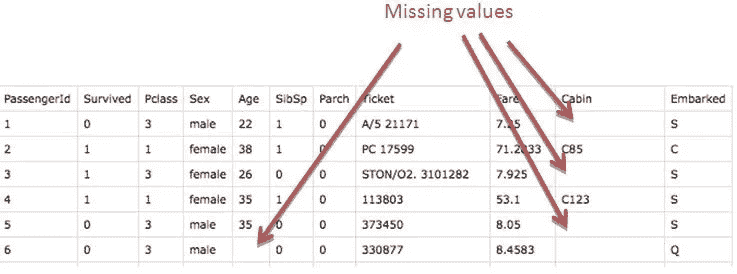

缺失数据

缺失数据是数据集中最常见的错误之一。我们的第一项工作是检查数据集是否有空值。我们使用 pandas 的 isnull()函数来检查缺失值。

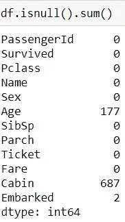

我们可以推断年龄列有 177 个缺失值，上船列有 2 个缺失值，而船舱有 687 个缺失值。由于不正确的调查填写和不正确的信息，我们通常会看到缺失的值。

## 缺失值的类型

1.  **完全随机缺失(MCAR):** 如果缺失的概率对所有观测值都相同，则变量为 MCAR。b/w 缺失数据和观测值绝对没有关系。
2.  **非随机缺失数据(MNAR):** 如果缺失数据与所有其他观察值之间存在某种关系，则变量为 MNAR。

因此，基于丢失值的类型，我们选择处理丢失值的技术。处理缺失值没有一个固定的公式，因此我列出了我遵循的两种方法

1.  **平均中位数插补**

在这种方法中，我们倾向于用某一列的观察值的平均值或中值来代替该列的缺失值。

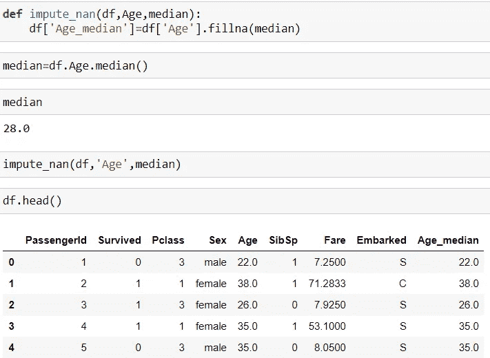

中位数插补

在这里，我为中值创建了一个单独的列，然后删除了原始的 Age 列，并替换为不带空值的 Age_median 列。

## 平均中位数插补的缺点

这种方法的一个主要问题是中位年龄组会改变或扭曲原始方差。下图显示了标准偏差的减少。这种方法也不能保持变量之间的关系或影响关系的种类。

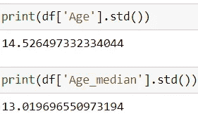

*于是出现了第二种处理缺失值的方法，克服了上述问题，那就是* ***随机样本插补*** *。*

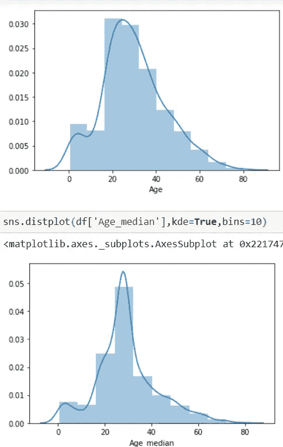

标准差的差异

**2。随机样本插补**

这种方法很像中值插补，但它包括从无空值数据集中取随机观察值来代替空值。

为此，我们首先应用 dropna()函数来消除空值，然后使用 sample 函数提供空值作为参数来获取所有空值的样本值。

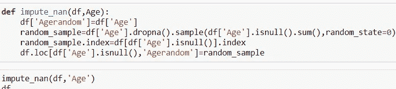

随机样本插补

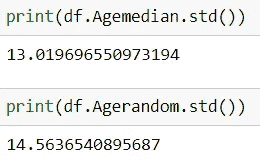

随机样本的标准差

从上图中我们可以看到，我们在中位数插补中所面临的缺点已经被这种方法克服了。

这证明随机样本插补方法远优于中位数插补方法，因为它不会使方差失真太多。

处理完缺失值后，下一个重要步骤是处理分类数据。

# 2)对分类数据进行编码:

带有分类数据**的是**算法不理解类别，因此我们将类别特征转换为 1 和 0，称为虚拟变量。将分类值转换为连续值的过程称为一次热编码。

基于特征中的数字类别，创建了许多列，并且仅考虑 n-1 列，因为第三列可以在其他两列的帮助下表示。这被称为虚拟变量陷阱。

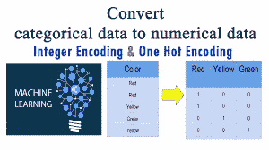

*仅当类别不遵循任何特定顺序或等级(如性别)时，才执行一次热编码。不遵循任何等级分类变量称为* ***名义变量。***

*另一方面，当类别遵循特定的顺序或等级时，它们被称为***。对于顺序变量，我们执行* ***标签编码*** *，其中我们分配等级而不是一个热编码。**

*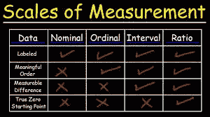*

*这就是分类数据，现在让我们进入下一个重要步骤， ***特征缩放。****

# *特征缩放*

*特征缩放是将特征的值按比例缩小到类似比例的过程，以便于计算过程和快速评估过程。*

*让我们详细了解一下为什么需要进行特征缩放，以及这个过程是如何进行的。*

*在数据集中，我们有多个要素，如 f1、f2、f3…fn，每个要素都有两个属性:*

1.  *重要*
2.  *单位*

**量级是特定特性的值，单位是测量该特性的尺寸。**

*现在，不同的特征具有不同的量值和不同的单位，因此在计算点之间的距离时，距离变得太大，最终会占用时间。*

*考虑一个例子，我把身高和体重作为我的两个特征，这两个特征在大小上有很大的不同。因此，在这种情况下，我们倾向于将值缩小到类似的比例，以保持欧氏距离最小。*

*有两种方法可以缩小数值:*

1.  ****【最小最大缩放器】*** :在这种技术中，我们在相同的比例中，在 0 和 1 之间按比例缩小特征值的幅度和单位。*
2.  ****标准化(标准缩放器)*** :该技术帮助我们基于标准正态分布重新缩放特性的值，其中均值为 0，标准差为 1。它转换平均值为 0、标准差为 1 的数据。*

*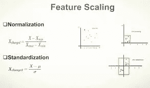*

***特征缩放在哪里使用？***

****特征缩放用于使用欧几里德距离计算点之间距离的算法，如 KNN、线性和逻辑回归。****

*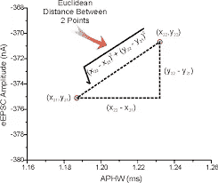*

*欧几里德距离*

*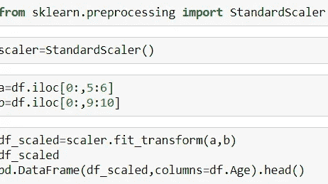*

*标准缩放器*

*这都是关于功能扩展，以及它在哪里使用，为什么它是必要的。*

*现在让我们讨论下一个被称为**特征选择的特征工程技术。***

# *特征选择*

****选择对因变量有直接影响的相关特征的最佳子集的过程称为特征选择。****

*一个数据集中有数百万个特征可能会导致所谓的 ***维数灾难。****

***维数灾难:**这是一个观察到的现象，每当我们增加数据集中的特征数量时，准确性也会增加，因为它有足够的数据量来推断输出，但这并不总是必要的。*

*存在一个阈值，在该阈值之后，如果我们继续以指数方式添加特征，则精度会降低。*

***为什么会这样？***

*在阈值之前，模型能够从数据中学习越来越多的信息，但当特征开始以指数方式增加时，模型会变得混乱，因为我们给了它太多。*

*这就是为什么我们只选择对输出有影响的几个特征，而忽略不相关的特征。*

*我们如何选择那些相关的特征？*

*正确的选择有多种方法，但这里我将讨论两种主要方法:*

1.  ***正向选择** : *正向选择是一种迭代方法，我们从模型中没有特征开始。在每一次迭代中，我们不断添加提高模型精度的特征，直到添加的新特征不再提高。**
2.  ***向后消除:** I *n 我们从所有特征开始，并在每次迭代中从后面移除最不重要的特征，这提高了模型的性能。我们重复这一过程，直到在删除数据方面没有观察到改进。**

*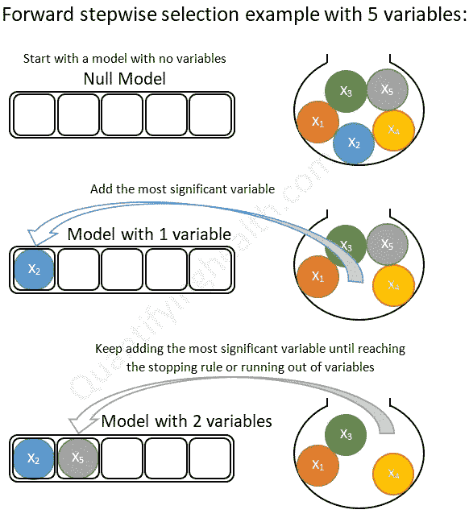*

*预选*

**虽然这种方法并不真正适合大数据集，因为它会花费很多时间，所以还有另一种我最常用的方法是* ***特征重要性。****

*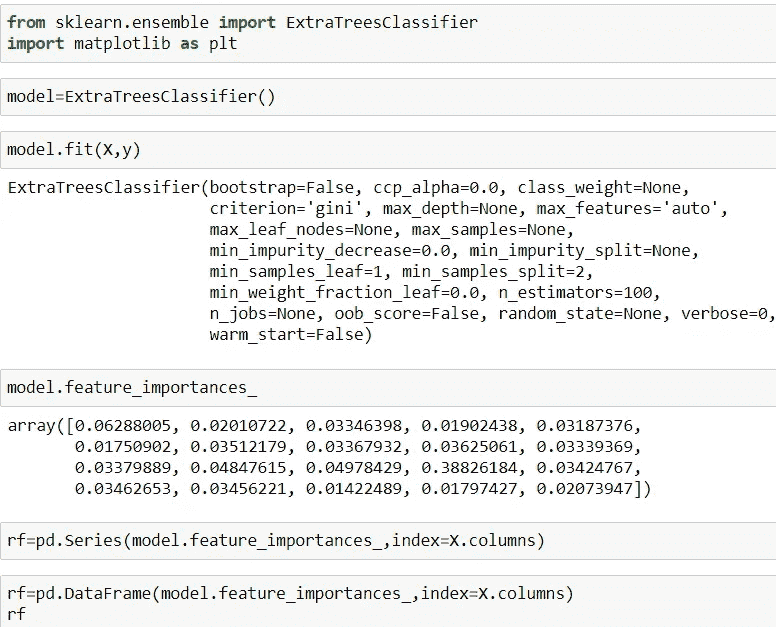**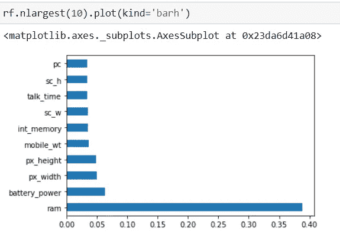*

*上图显示了基于分数的不同特征的重要性，基于此，我们可以删除对输出变量没有太大影响的特征。*

***功能选择的优势***

1.  *减少过度拟合*
2.  *提高准确性，减少误导性数据，并降低模型的复杂性。*

*让我们讨论一下特征工程中的下一个因素:*

# *结论*

*在特征工程中还有其他 1 或 2 个步骤，比如离群值和高斯变换，我将在下一篇文章中讨论。*

*这些是工程特性中遵循的一些最重要的步骤，最终提高了我们模型的准确性！*

*您可以在我的 LinkedIn 个人资料上与我联系，查看更多精彩项目。*

*[https://www.linkedin.com/in/sameer-kumar-20988b1a6?里皮= urn % 3Ali % 3a page % 3Ad _ flagship 3 _ profile _ view _ base _ contact _ details % 3 bagbg 55 feqwmzrouolvderq % 3D % 3D](https://www.linkedin.com/in/sameer-kumar-20988b1a6?lipi=urn%3Ali%3Apage%3Ad_flagship3_profile_view_base_contact_details%3BAgbG55feQWmzROuOlvderQ%3D%3D)*