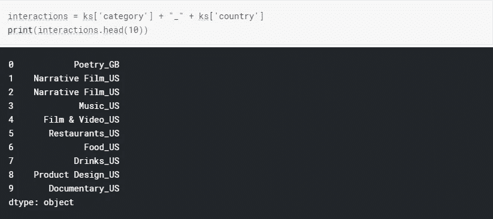
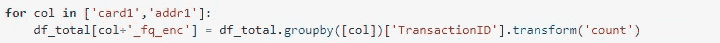
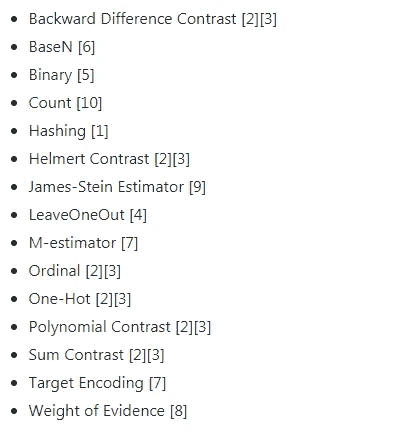
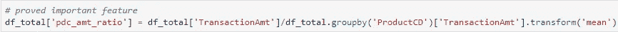

# 带有代码示例的特征工程方法

> 原文：<https://medium.com/analytics-vidhya/feature-engineering-method-with-code-examples-b016fc9f1e9a?source=collection_archive---------8----------------------->


[来源](https://interestingengineering.com/craft-a-successful-career-with-these-inspiring-success-stories-by-mechanical-engineers)

# 介绍

特征工程是机器学习的一个非常重要的方面。特征工程是充分利用数据的可靠方法。这通常比找到最佳模型和超参数更有效。

最近发现 kaggle 提供的一个非常好的关于特征工程师的[教程](https://www.kaggle.com/learn/feature-engineering)。所以这篇文章基本上是我从本教程和我在参考资料部分列出的一些其他资源中学到的东西。

# 分类特征

## 编码分类特征

要将分类特征转换为数值，我们可以进行因式分解或热编码。

*   **因式分解**

因式分解意味着用数字替换唯一值。我们可以使用 Pandas `factorize`或 scikit-learn `LabelEncoder`来获得相同的结果。

或者在 scikit-learn 的情况下`LabelEncoder`

```
from sklearn.preprocessing import LabelEncoder
encoder = LabelEncoder()
*# Apply the label encoder to each column*
df[categorical_col] = df[categorical_col].apply(encoder.fit_transform)
```

*   **一个热编码**

在一个热编码的情况下，特征被扩展到唯一值的数量。

## 相互作用

生成新分类特征的一个简单方法是将两个分类特征相加。



## 分类特征的计数编码

计数编码将每个分类值替换为它在数据集中出现的次数。

我们可以简单地使用 group-transform-count 方法或`[categorical-encodings](https://github.com/scikit-learn-contrib/categorical-encoding)` [包](https://github.com/scikit-learn-contrib/categorical-encoding)来获得这种编码。

```
import category_encoders as ce
cat_features = ['category', 'currency', 'country']
**count_enc = ce.CountEncoder()**
count_encoded = count_enc.fit_transform(ks[cat_features])

data = baseline_data.join(count_encoded.add_suffix("_count"))

*# Training a model on the baseline data*
train, valid, test = get_data_splits(data)
bst = train_model(train, valid)
```

或者简单地像这样:



## 目标编码

目标编码将分类值替换为该特征值的目标平均值。

然而，使用这种方法，我们需要非常小心“目标泄漏”问题。我们应该只从训练数据集中学习目标编码，并将其应用到其他数据集中。

```
import category_encoders as ce
cat_features = ['category', 'currency', 'country']

*# Create the encoder itself*
target_enc = ce.TargetEncoder(cols=cat_features)

train, valid, _ = get_data_splits(data)

*# Fit the encoder using the categorical features and target*
target_enc.fit(train[cat_features], train['outcome'])

*# Transform the features, rename the columns with _target suffix, and join to dataframe*
train = train.join(target_enc.transform(train[cat_features]).add_suffix('_target'))
valid = valid.join(target_enc.transform(valid[cat_features]).add_suffix('_target'))

train.head()
bst = train_model(train, valid)
```

或者我们可以使用 [beta 目标编码](https://mattmotoki.github.io/beta-target-encoding.html)来进一步减少泄漏。

## CatBoost 编码

根据[本笔记本](https://www.kaggle.com/matleonard/categorical-encodings):

> catboost 类似于目标编码，因为它基于给定值的目标概率。然而，对于 CatBoost，对于每一行，目标概率只从它前面的行计算。

而我们可以从这里的公文[中了解到。然而，我还没有找出文件中的例子。所以我暂时先不说了。如果你明白了，请留言。](https://catboost.ai/docs/concepts/algorithm-main-stages_cat-to-numberic.html)

[分类编码](https://github.com/scikit-learn-contrib/categorical-encoding)中提供了很多其他方法，我还没有经历过:



## 分类特征的组特征

另一种常用的方法是按分类特征对数据进行分组，并计算其他特征的聚合值。在这种情况下，转换方法非常有用。



# 连续特征

## 改变

关于连续特征的一种非常常见的技术是用一些函数对其进行变换。因为当特征是正态分布时，一些模型工作得更好，所以它可能有助于转换目标值。

常见的选择是平方根和自然对数。这些转换也有助于约束离群值。但是，这不会影响树模型。

## 旋转

对于具有时间序列索引的值，尝试一些滚动功能是个好主意。比如滚动平均，计数等等。

# 最后，特征选择

在我们创建了大量的新特征之后，选择那些最能提高计算效率和减少过度拟合问题的特征是至关重要的。我写过两篇关于特性选择的文章:

## [下一级特征选择方法及代码示例](https://towardsdatascience.com/next-level-feature-selection-method-with-code-examples-2ba4edb40cd3?source=your_stories_page---------------------------)

## [特征选择方法及代码示例](/analytics-vidhya/feature-selection-methods-with-code-examples-a78439477cd4?source=your_stories_page---------------------------)

希望我们会得到一个好的模型^-^

# 参考

 [## 类别编码器-类别编码器最新文档

### 一套 scikit-learn 风格的转换器，用于使用不同的技术将分类变量编码成数字…

contrib.scikit-learn.org](http://contrib.scikit-learn.org/categorical-encoding/index.html) [](https://www.kaggle.com/matleonard/categorical-encodings) [## 分类编码

### 下载数千个项目的开放数据集+在一个平台上共享项目。探索热门话题，如政府…

www.kaggle.com](https://www.kaggle.com/matleonard/categorical-encodings)  [## 用于本地测试的 IEEE - FE

### 下载数千个项目的开放数据集+在一个平台上共享项目。探索热门话题，如政府…

www.kaggle.com](https://www.kaggle.com/kyakovlev/ieee-fe-for-local-test)