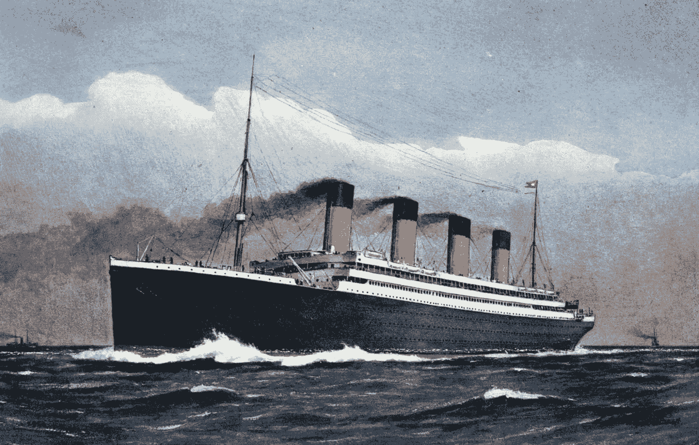

# 泰坦尼克号的特征工程:用 python 从灾难中学习机器。

> 原文：<https://medium.com/analytics-vidhya/feature-engineering-of-titanic-machine-learning-from-disaster-with-python-6db12dcad4ff?source=collection_archive---------25----------------------->

## 在开始任何 ML/数据科学项目之前，你需要建立数据，大多数情况下，正确的数据和简单的机器学习算法可以完成正确的任务，我们将使用 titanic Kaggle 数据集。

[https://cdn . Britannica . com/72/153172-050-eb2f 2d 95/titanic . jpg](https://cdn.britannica.com/72/153172-050-EB2F2D95/Titanic.jpg)