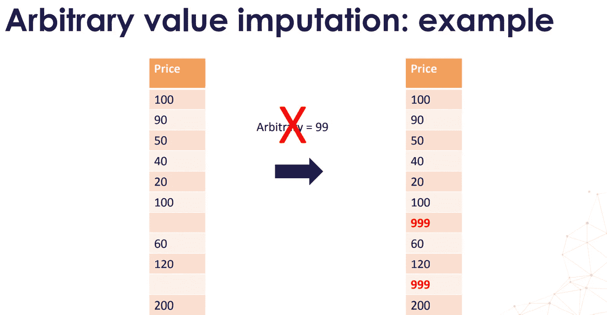
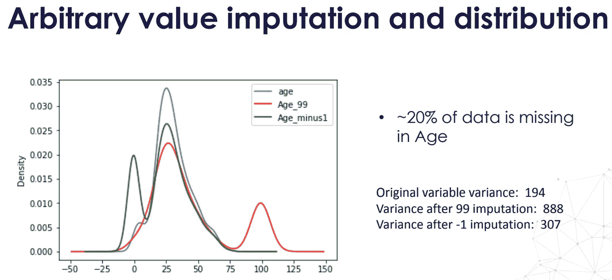

# 特征工程第一部分任意值插补

> 原文：<https://medium.com/analytics-vidhya/feature-engineering-part-1-arbitrary-value-imputation-e81444bd79b2?source=collection_archive---------10----------------------->

使用特征引擎理解任意值插补和实现背后的直觉..！

任意插补

# 任意值插补:

任意值插补包括用任意值替换变量中所有缺失值(NA)。

通常使用的任意值是 0，999，-999(或其他 9 的组合)或-1(如果分布为正)。

适用于数值和分类变量

# 我可以用任意值估算哪些变量？

分类变量和数值变量都可以用任意值来估算。

对于分类变量，这相当于用一个名为‘Missing’的附加标签替换 NA 的所有实例，这是一种非常常见的做法。

# 使用哪个任意值？

任意值插补

例如，值 99 可能是该分布的一个正常值。如你所见，价格值介于 20 和 200 之间，所以 99 正好在中间。所以，这个值不适合替换丢失的数据。理想情况下，我们希望寻找分布末端的值。

# 假设:

数据不是随机丢失的。

如果是这种情况，我们希望用一个不同的(任意的)值来标记丢失的值，而不是用代表最常见值的平均值或中值来替换那些出现的值。

# 优势:

易于实施

快速获取完整数据集的方法

可以集成到生产中(在模型部署期间)

抓住了“缺失”的重要性(如果有的话)

# 局限性:

原始变量分布的失真

原始变量分布的失真

原始方差的失真

数据集剩余变量的协方差失真

协方差失真

如果任意值位于分布的末端，它可能会掩盖或产生异常值

极端值

需要注意的是，不要选择与均值或中值(或变量分布的任何其他常见值)过于相似的任意值。

# 何时使用任意值插补:

当有理由相信 NA 不是随机丢失时，应使用任意值替换 NA。在这种情况下，我们不想用中间值或平均值来代替它，从而使 NA 看起来像我们的大多数观察值。相反，我们想要标记观察缺失的事实。

# 履行

 [## 阿鲁纳姆巴拉/特征工程

### 在 GitHub 上创建一个帐户，为 ArunAmballa/功能工程开发做出贡献。

github.com](https://github.com/ArunAmballa/Feature-Engineering/tree/master/Imputation%20Techniques/Arbitrary%20Number%20Imputer) 

大家在评论里讨论一下，如果发现帖子有什么不妥或者有什么补充:P
谢谢。

鼓掌