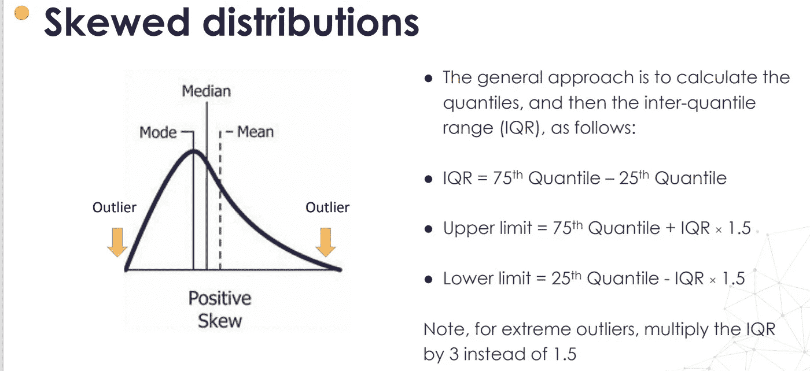

# 特征工程第 1 部分尾部插补结束。

> 原文：<https://medium.com/analytics-vidhya/feature-engineering-part-1-end-of-tail-imputation-c5069a41869a?source=collection_archive---------14----------------------->

使用特征引擎理解尾部填充和实现背后的直觉..！

在 [Unsplash](https://unsplash.com?utm_source=medium&utm_medium=referral) 上由 [Aron 视觉](https://unsplash.com/@aronvisuals?utm_source=medium&utm_medium=referral)拍摄的照片

# 尾部插补结束:

# 尾部插补结束:定义

尾部末端插补等同于任意值插补，但在变量分布的末端自动选择任意值。

如果变量是正态分布的，我们可以用均值正负 3 倍标准差。

如果变量是偏斜的，我们可以使用 IQR 邻近规则。

合适的数值变量。

# 我可以用任意值估算哪些变量？

这种方法适用于数值型变量。

# 尾部插补结束:如何进行

如果变量是正态分布的，我们可以用均值正负 3 倍标准差。

正态分布

如果变量是偏斜的，我们可以使用 IQR 邻近规则

偏斜分布

# 假设:

MNAR 值不会随机丢失。

如果该值不是随机缺失的，我们不想用它来代替平均值/中值，因此使该观察看起来像我们的大多数观察。相反，我们希望将该观察值标记为不同，因此我们在分布的尾部分配一个值，在这里观察值很少出现在总体中。

# 优势:

易于实施

快速获取完整数据集的方法

可以集成到生产中(在模型部署期间)

抓住了“缺失”的重要性(如果有的话)

# 缺点:

原始变量分布的失真

原始方差的失真

数据集剩余变量的协方差失真

这种技术可以掩盖分布中真正的异常值

# 履行

 [## 阿鲁纳姆巴拉/特征工程

### 在 GitHub 上创建一个帐户，为 ArunAmballa/功能工程开发做出贡献。

github.com](https://github.com/ArunAmballa/Feature-Engineering/tree/master/Imputation%20Techniques/End%20of%20Tail%20Imputation) 

如果您发现帖子中有任何错误或有任何补充，请在评论中讨论:P
谢谢。

鼓掌