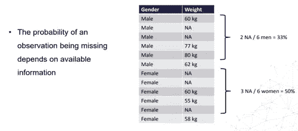

# 特征工程第 1 部分-插补技术。

> 原文：<https://medium.com/analytics-vidhya/feature-engineering-part-1-imputation-techniques-eafce8f341bc?source=collection_archive---------9----------------------->

了解不同的缺失数据机制并完成案例分析。

卢卡·奥尼博尼在 [Unsplash](https://unsplash.com?utm_source=medium&utm_medium=referral) 上的照片

# **🪐Missing 数据:**

当变量中没有存储某个观察值的数据时，就会出现丢失数据或丢失值的情况。

> 在大多数数据集中，缺失数据是常见现象
> 
> 缺失数据会对从数据中得出的结论产生重大影响。

在许多组织中，信息是由与客户通电话的人或在线填写表格的客户收集到表格中的。通常，输入数据的人不会完成表单中的所有字段。许多字段不是必填的，这可能会导致缺少值。

省略信息的原因可能各不相同:可能该人不想透露某些信息，例如收入，或者他们不知道答案，或者答案不适用于特定情况，或者相反，组织中的人员希望节省客户一些时间，因此省略了询问他们认为不太相关的问题。

在其他情况下，某个变量的值不存在。例如，在变量“总债务占总收入的百分比”(在财务数据中非常常见)中，如果此人没有收入，则总百分比 0 不存在，因此它将是一个缺失值。

了解缺失数据是如何引入数据集中的，即缺失信息是如何引入数据集中的，这一点很重要。根据不同的机制，我们可以选择以不同的方式处理丢失的值。此外，通过了解丢失数据的来源，我们可以选择采取措施来控制该来源，并在数据收集期间减少丢失的信息量。

# **💥数据缺失:原因**

> 丢失:值丢失，因为它被遗忘、丢失或未正确存储。
> 
> 不存在:一个变量由两个变量相除而成，分母取 0。
> 
> 未找到:当根据邮政编码或出生日期匹配数据以增加更多变量时，如果邮政编码或出生日期错误或不存在，新变量将采用 NA。

# **🧡Missing 数据:影响**

> 与 Scikitlearn 不兼容
> 
> 缺失数据插补可能会扭曲变量分布。
> 
> 影响所有机器学习模型。

# 💫缺失数据:机制:

了解缺失数据的机制可以帮助我们选择正确的缺失数据插补技术。3 种机制导致数据丢失，其中 2 种机制涉及随机或几乎随机丢失数据，第三种机制涉及数据的系统性丢失。

# 1.完全随机缺失数据(MCAR):

> 对于所有的观测值，丢失的概率是相同的
> 
> 数据集中缺失的数据与任何其他值(观察到的或缺失的)之间没有关系
> 
> 如果一个变量在所有的观测值中缺失的概率是相同的，那么这个变量就是完全随机缺失的(MCAR)。当数据为 MCAR 时，缺失的数据与数据集中观察到的或缺失的任何其他值之间没有关系。换句话说，那些丢失的数据点是数据的随机子集。没有什么系统性的事情会让一些数据比其他数据更容易丢失。如果观察值完全随机缺失，那么忽略这些情况不会使推断产生偏差。

# 2.随机缺失数据(MAR):

随机丢失数据

> 在随机缺失中，数据以一定的速率缺失，但是该速率取决于数据中的一些其他变量。
> 
> 尽管我们总体上确实有缺失数据，但如果我们知道上述情况中的某些其他因素(性别),缺失数据的比率就可以得到完美的解释。
> 
> 当缺失值的倾向与观察到的数据之间存在关系时，就会出现 MAR。换句话说，观察值缺失的概率取决于可用信息(即数据集中的其他变量)。例如，如果男性比女性更有可能透露他们的体重，体重就会被标记。对于那些不透露体重的男性和女性来说，体重信息会随机丢失，但由于男性更倾向于透露体重，所以女性丢失的值会比男性多。
> 
> 在类似上述的情况下，如果我们决定继续处理具有缺失值的变量(在本例中为权重)，我们可能会受益于包括性别以控制缺失观察值的权重偏差。

# 3.非随机缺失数据:

> 一个值缺失的倾向和它的值之间有关系。换句话说，当一个变量的缺失值与该变量本身的值相关时，即使在控制了其他变量之后，数据也不是随机缺失的。一个例子是关于药物使用的调查。如果被调查的个人由于害怕被起诉而使用了目前非法的药物，他们可能会将字段留空。因此，这些字段并不是随机留空的，而是故意留空的。

丢失的数据不是随机的

> 当数据集中引入缺失值的机制或原因存在时，缺失数据不是随机的(MNAR)。例如，如果人们因为他们的抑郁水平而没有填写抑郁调查，就会发生 MNAR。这里，缺失的数据与结果有关，抑郁症。
> 
> 同样，当金融公司要求客户提供银行和身份证件以防止身份欺诈时，通常情况下，冒充他人的欺诈者不会上传文档。他们没有，因为他们是诈骗犯。所以，丢失的文件和我们要预测的目标:诈骗之间有一个系统的关系。
> 
> 了解数据缺失的机制对于决定使用哪种方法来估算缺失值非常重要。

# 🚩缺失数据插补:

> 插补是用缺失值的统计估计值替换缺失数据的行为。
> 
> 任何插补技术的目标都是生成可用于训练机器学习模型的完整数据集。

# 💛数字变量

1.均值/中位数插补

2.任意值插补

3.尾部插补结束

# 💙分类变量

1.频繁类别插补或模式插补

2.添加“缺失”类别

# 🧡两者

1.完整的案例分析

2.添加“缺失”指标

3.随机样本插补

# 🌌完整的案例分析:

> 完全病例分析(CCA)，也称为病例的“列表式删除”,包括丢弃任何变量中的值缺失的观察值。
> 
> 在完全病例分析中，我们只分析那些数据集中所有变量都有信息的观察值。

# 我可以用 CCA 估算哪些变量？

CCA 可以应用于分类变量和数值变量

完整的案例分析

# 假设:

当数据完全随机缺失时，CCA 工作良好(MCAR)。如果我们有理由相信数据是随机丢失的，我们应该使用 CCA，否则就不用 CCA。当数据为 MCAR 时，排除具有缺失信息的观测值本质上与从数据集中随机排除一些观测值相同。因此，CCA 后的数据集是原始数据集的合理表示。

# 优势:

> 易于实施
> 
> 不需要数据操作
> 
> 保留变量分布(如果数据为 MCAR，则缩减数据集的变量分布应与原始数据集中的分布相匹配)

# 缺点:

> 它可以排除原始数据集的很大一部分(如果缺失数据很多)
> 
> 排除的观察值可以为分析提供信息(如果数据不是随机丢失的)
> 
> 如果完整病例与原始数据不同(例如，当缺失信息是 MAR 或 NMAR，而不是随机缺失时)，CCA 将创建有偏数据集。
> 
> 当在生产中使用我们的模型时，模型不知道如何处理丢失的数据

# 何时使用 CCA:

> 数据完全随机丢失
> 
> 不超过总数据集的 5%包含缺失数据
> 
> 实际上，当丢失的信息量很小时，CCA 可能是一种可接受的方法。不幸的是，没有经验法则来确定有多少丢失的数据是小的或可忽略的。然而，作为一般指导，如果丢失数据的总量是原始数据集的 5%或更少，CCA 是一个可行的选择。
> 
> 在许多现实生活的数据集中，缺失数据的数量从来都不小，因此 CCA 通常不是一个选项。

# 💚CCA 和生产中的模型:

使用 CCA 时，我们会删除所有包含缺失信息的观察值。然而，我们想要用模型评分的数据可能确实包含缺失的信息。当在实际系统中使用我们的模型时，或者当将或模型投入生产时，这将带来一个问题:当一个观察包含缺失数据时，模型将无法处理它。为了避免这个问题，在将模型投入生产时，我们需要做以下两件事情中的一件:要么我们不为缺失数据的观测值评分，要么我们用另一个数字替换缺失值。我们可以从插补技术中选择任何一种。

# 履行

 [## 阿鲁纳姆巴拉/特征工程

### 在 GitHub 上创建一个帐户，为 ArunAmballa/功能工程开发做出贡献。

github.com](https://github.com/ArunAmballa/Feature-Engineering) 

大家在评论里讨论一下，如果发现帖子有什么不对的地方或者有什么要补充的。谢谢。

鼓掌