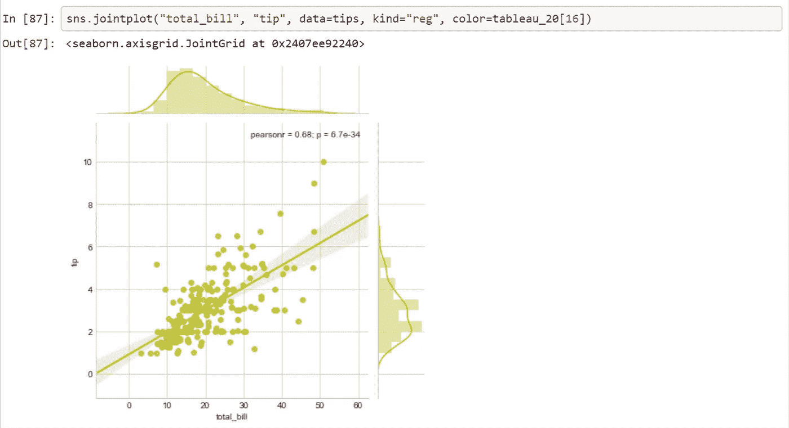
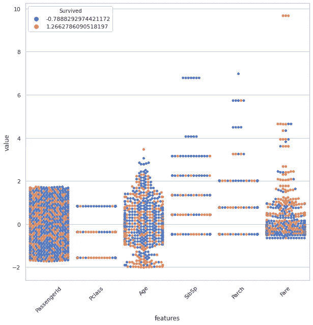

# 借助数据可视化的特征工程

> 原文：<https://medium.com/analytics-vidhya/feature-engineering-with-the-help-of-data-visualization-69c359f5bba5?source=collection_archive---------8----------------------->


**为什么特性工程很重要？**

您数据中的**特征**将直接影响您模型的准确性。更好的特性使你的测试数据更加准确。你选择的**功能**越好，你取得的结果就越好。

# **ML 中的特征减少**

一般认为增加更多的特征可以提高模型/分类器的性能。

**让我们看看为什么不是这样:**

*   维度的诅咒:

选择更多的特征通常会降低分类器的性能。


维度的诅咒

*   有限的训练数据
*   有限的计算资源
*   添加不相关/不必要的特征会导致计算成本增加和性能下降。

# **功能选择:**

有 n 个初始特征，就有可能选择 features(2^n 子集的(2^n)组合。

我们只是不能检查所有可能的(2^n)子集。

特征选择是一个优化问题

*   搜索可能子集的空间。
*   选择最适合的一个**。**

**评估特征子集**

*   **监督学习:**

当在选定的子集上训练时，我们使用验证集中的估计误差进行评估。

*   **无监督学习:**

查看输入并选择包含更多信息的子集。

## 选择子集

*   选择所有相关和不相关的特征。
*   通过添加每个特征来估计分类/回归误差，并选择能最大程度改善验证误差的特征。
*   删除所有对错误影响较小的特征。

**选择特征的单变量方法**

*   皮尔逊相关系数

范围从-1 到+1，如果该值接近+1，则两个要素高度相关，因此可以移除任何一个要素。如果它更接近-1，则两个特征是高度负相关的。

让我们使用 *seaborn* 绘制相关矩阵

```
**import** **seaborn** **as** **sns** f, ax = plt.subplots(figsize=(10,10))
sns.heatmap(data.corr(), annot=**True** ,linewidth=0.5,     fmt='.1f',ax=ax);
```


如果任何两个变量具有超过 0.7 的相关系数，我们可以说两个特征都是高度相关的，并且一个可以被去除。

*   我们可以使用 J **点图**来检查任何两个特征之间的相关性

压力、握杆角度是两个特征

```
sns.jointplot(data.loc[:,'pressure'],
              data.loc[:,'grip_angle'],
              kind ='regg',
              color= 'blue'
             );
```


观察该图，可以说它们没有很好的相关性，如果它们相关，数据点将被很好地分类如下。



可以使用更多的图来确定特征是否可以通过标准化来很好地对数据进行分类。

1.  箱形图

```
data1 = data.drop(['state','timestamp'],axis =1)
data_std = (data1 - data1.mean()) / data1.std()
data1 = pd.melt(data1,id_vars ="status",var_name = "features",value_name="value")
plt.figure(figsize=(5,5))
sns.boxplot(x="features",y="value",hue="status",data = data1)
plt.xticks(rotation=45);
```


2)群体图

```
sns.set(style='whitegrid',palette='muted')
data = train_data.drop(['Name','Ticket','Embarked','Sex','Cabin'],axis=1)
data_std = (data - data.mean()) / data.std()
data = data_std
data = pd.melt(data,id_vars ="Survived",var_name = "features",value_name="value")
plt.figure(figsize=(10,10))
plt.figure(figsize=(10,10))
sns.swarmplot(x="features",y="value",hue="Survived",data = data)
plt.xticks(rotation=45);
```



3)小提琴情节

```
data = train_data.drop(['Name','Ticket','Embarked','Sex','Cabin'],axis=1)
data_std = (data - data.mean()) / data.std()
data = data_std
data = pd.melt(data,id_vars ="Survived",var_name = "features",value_name="value")
plt.figure(figsize=(10,10))
sns.violinplot(x="features",y="value",hue="Survived",data = data)
plt.xticks(rotation=60);
```

