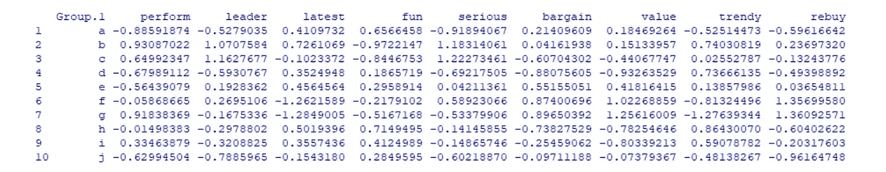
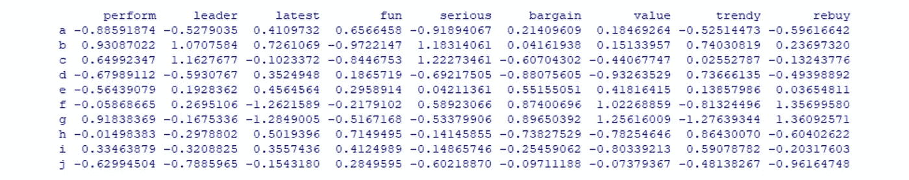
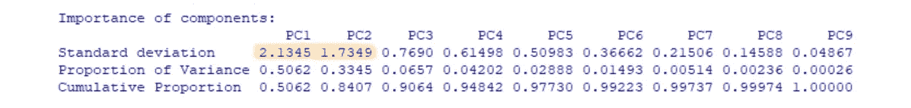
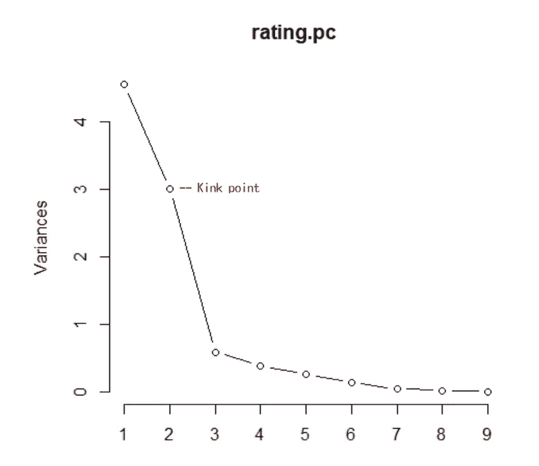
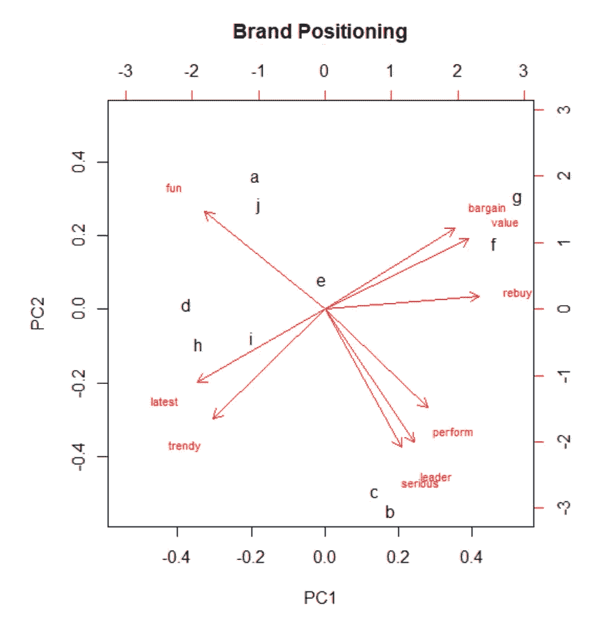

# R 中基于主成分分析的特征提取和品牌感知映射

> 原文：<https://medium.com/analytics-vidhya/feature-extraction-and-brand-perceptual-map-using-pca-in-r-31477002fdf2?source=collection_archive---------6----------------------->


照片由[捕捉人心。](https://unsplash.com/@dead____artist?utm_source=medium&utm_medium=referral) on [Unsplash](https://unsplash.com?utm_source=medium&utm_medium=referral)

在之前的文章《R 中使用因子分析的[特征提取》中，我们提到除了因子分析之外，主成分分析也是一种常用的降维方法。所以在这里，我将使用相同的数据来介绍 PCA，并在感知图上显示其结果。](/analytics-vidhya/feature-extraction-using-factor-analysis-in-r-86fa4f01a43c)

# 什么是 PCA？

一种无监督学习数学过程，使用正交变换将一组可能相关的变量的观察值转换为一组线性不相关的主分量。

由于 PCA 计算数据集的新投影，并且新轴基于变量的标准偏差，因此有必要在执行 PCA 之前对数据进行**归一化，以便所有变量由于相同的标准偏差而具有相同的权重。**

首先，我们使用与之前相同的步骤:首先导入数据，缩放数据，然后使用聚合函数计算 10 个品牌的平均值。

```
#read data
rating <- read.csv(“http://goo.gl/IQl8nc")#scale data
rating.sc <- rating
rating.sc[,1:9] <- scale(rating[,1:9])#compute mean
brand.mean <- aggregate(rating.sc[,1:9], list(rating.sc[,10]), mean)
```



接下来，在做 PCA(用 prcomp 函数)之前，把行名改成品牌名，排除品牌列。

```
rownames(brand.mean) <- paste("",letters,sep="")[1:10]
(brand.mean <- brand.mean[,-1] )
rating.pc <- prcomp(brand.mean, scale=TRUE)
summary(rating.pc)
```



特征值等于标准差的平方。因此，我们得到了两个关键变量，可以解释 84%的数据。关键变量也可以通过找到扭结点来确定。

```
plot(rating.pc, type="l")
```



很明显，前两个部分占了最大的比例，这意味着这两个部分可以解释更多的数据，剩下的部分相对不重要。但是，不能保证这些维度是可解释的。换句话说，我们不知道什么特征或特征组合代表关键组件。

# 为什么映射？

这为营销人员了解品牌、产品或行业之间的竞争结构提供了一个有用的图表。因此，对于这样的品牌评级数据，执行感知地图可以让我们了解每个品牌在人们心目中的相对**定位**。这也有助于制定营销策略，使**区别于其他竞争品牌。**

```
#positioning
biplot(rating.pc, main=”Brand Positioning”, cex=c(1,0.7))
```



从图中我们可以看到，接近的品牌在市场上存在竞争关系，如 a 和 j、c 和 b、g 和 f。因此，作为品牌经理，您可以进行竞争产品分析，以创造差异和特色。或者，如果你是市场新手，你可以将自己的品牌定位于较少品牌投入精力的方面(如时尚、表演)(图中较空的位置)。

**多维标度(MDS)** 是品牌感知地图的另一个工具。它与使用 PCA 的思路是一样的:关注消费者的感知)，但它不是计算标准差，而是计算一对物品之间的距离(相异度)，并输出一个坐标矩阵。

```
brand.dist <- dist(brand.mean)
(brand.mds <- cmdscale(brand.dist))#differentiation
plot(brand.mds, type=”n”, main=”Brand Differentiation”)
rownames <- paste(“”,letters,sep=””)[1:10]
text(brand.mds, rownames, cex=1)
```


对“品牌差异化”地图的解释类似于“品牌定位”地图。综上所述，两个品牌的定位越接近，越有可能竞争；一个品牌在某个相关维度上越孤立，它就越被认为是独一无二的。此外，考虑到公司的实力和资源，营销人员能够考虑将品牌推向某些目标理想点。

# 关于我

嗨，我是 Kelly，一名具有新闻和传播背景的商业分析研究生，喜欢分享探索数据和有趣发现的生活。如果您有任何问题，请随时联系我，电话:[k*elly.szutu@gmail.com*](mailto:kelly.szutu@gmail.com)