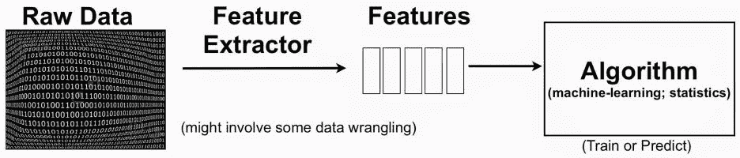

# 特征提取和挑战

> 原文：<https://medium.com/analytics-vidhya/feature-extraction-and-challenges-a1e4f3f4cb53?source=collection_archive---------9----------------------->

当数据集具有大量特征时，训练机器学习模型变得复杂。特征越少，模型的性能越好。

特征工程。图片来源:[一名数据分析师](https://adataanalyst.com/machine-learning/comprehensive-guide-feature-engineering/)

# 维度的诅咒

对于给定数据集，机器学习模型在超过最大特征数量时开始表现不佳，而不是有所改善。这是因为通过丢弃少量特征而丢失的信息被低维空间中的精确映射所补偿。

有两种降维方法，特征提取和特征选择。

# 特征抽出

特征提取包括将现有特征转换成少量特征。换句话说，特征提取是通过组合现有特征来创建特征的子集。

特征提取的一个缺点是生成的新特征不能被人类理解。新变量中的数据在人眼看来就像随机数。

**主成分分析**

主成分分析是一种流行的降维和无监督学习技术。它通过将多个特征组合成几个特征来降低数据集的维数。PCA 在创建新特征时保留了大部分差异。

主成分分析使我们能够识别数据集中的相关性和模式，以便可以将它转换成维度显著降低的数据集，而不会丢失任何重要信息。

PCA 通过去除冗余和保持高度相关的特征来实现它。

PCA 涉及的步骤:

1.数据标准化——

标准化基本上是以这样一种方式重新调整数据，即所有变量和它们的值都在同一尺度上。

2.协方差计算

有时计算协方差是为了了解变量是一起移动还是反向移动。协方差显示变量之间的关系。它可以告诉变量是正相关还是负相关。

3.确定主成分

主成分(第一主成分和第二主成分)是从初始变量集导出的新变量集。它们压缩并拥有分散在数据集中变量之间的最有用的信息。

**线性判别分析**

LDA 是另一种解决分类问题的流行降维技术。LDA 用于通过最大化类别可分性来减少特征。与 PCA 类似，LDA 通过将初始特征投影到最大化类别分离的分量轴上来减少特征。

在 PCA 中，我们确定保留数据中最大方差的分量轴。而在 LDA 中，我们也寻找最大化类之间的差异(可分性)。

**特征提取的挑战**

在特征提取中创建的新特征不是人类可读的。如果要保留数据集中的初始要素，请使用“要素选择”方法。

另一个挑战是可扩展性。如果数据集很大，一些特征提取算法将无法运行。特别是复杂的非线性特征提取方法是不可行的。线性特征提取方法的缩放主要依赖于矩阵近似和线性代数算法。而线性特征提取方法的计算瓶颈通常是特征的数量。在内核化的非线性方法中，瓶颈是实例的数量。

# 参考

[1][http://vision . psych . umn . edu/users/sch rater/sch rater _ lab/courses/pattrecog 09/LEC 17 patt rec 09 . pdf](http://vision.psych.umn.edu/users/schrater/schrater_lab/courses/PattRecog09/Lec17PattRec09.pdf)

[2]https://www.youtube.com/watch?v=n7npKX5zIWI

[3][http://proceedings.mlr.press/v44/storcheus2015survey.pdf](http://proceedings.mlr.press/v44/storcheus2015survey.pdf)