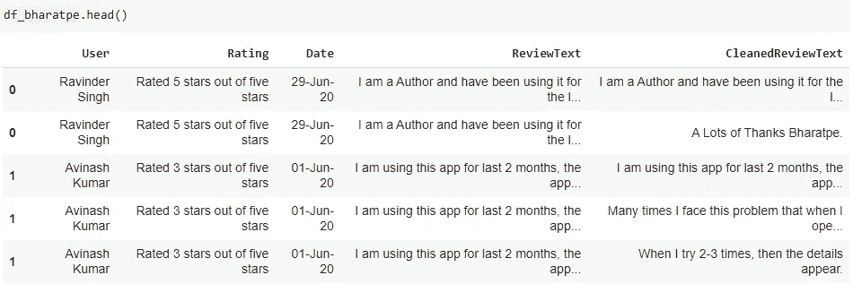

# 印度 3 款应用评论的特征提取和情感分析

> 原文：<https://medium.com/analytics-vidhya/feature-extraction-and-sentiment-analysis-of-reviews-of-3-apps-in-india-84b665e1a887?source=collection_archive---------5----------------------->

## python 中的基本自然语言处理

接受客户反馈是打造优秀产品的关键。网上评论加速了这一过程。然而，随着在线评论系统产生的大量数据，在广义的客户反馈系统中提取关于产品具体特征的信息仍然是一个挑战。

在这篇文章中，我部署了一个基本的方法来分析印度 3 个支付应用的在线评论(来自 Google playstore)——巴拉特普、BHIM 和 Paytm。该分析旨在了解从大量数据中获取意义所面临的挑战，以便可以进一步微调流程以提高准确性。这里，每个应用程序的 **5000** 条评论(按最相关排序)是使用 python 编码的爬虫抓取的。

## **算法:**

特征提取和情感分析的算法如下图所示。


作者图片:算法

搭配是异常频繁地共同出现的表达方式。NLTK 工具包已经被用来实现这个算法(【https://www.nltk.org/howto/collocations.html】T4)。

情感分析已经使用文本块和 VADER 完成。

下面解释了用于特征提取和寻找句子中的特征的代码。(github repo 中提供了完整的代码)

```
#reading the csv file
df_bharatpe=pd.read_csv("/content/BharatPeforMerchants_reviews_list.csv")
```


这是我们开始的数据框架。

```
#how does the length of ReviewText vary with Ratingsdf_bharatpe['ReviewText'] = df_bharatpe['ReviewText'].astype(str)
df_bharatpe['ReviewLength'] = df_bharatpe['ReviewText'].apply(len)
sns.set_style('white')
g=sns.FacetGrid(df_bharatpe,col='Rating')
g.map(plt.hist,'ReviewLength')
```


```
#Cleaning the text
#The function below removes replaces the ? and ! with .
#When "." is repeated multiple times together as in text "It is ok..." ,it retains only one occurrence 
#Lastly, formatting is done to ensure that a dot is followed by a spacedef clean_text(text):
   text=re.sub(r"\?", ".", text)
   text=re.sub(r"\!", ".", text)
   text=re.sub(r'([.])\1+', r'\1', text)
   rexp=r"\.(?=[A-Za-z]{1,15})"
   text=re.sub(rexp, ". ", text)
   return text#example is shown below
```


```
#we apply the function to clean text on ReviewsText followed by #sent_tokenize from nltk which gives the list of sentencesdf_bharatpe['CleanedReviewText'] =            
                       df_bharatpe['ReviewText'].apply(clean_text)df_bharatpe['CleanedReviewText'] = 
              df_bharatpe['CleanedReviewText'].apply(sent_tokenize)
```


```
#opening the list as different rows
df_bharatpe = 
       df_bharatpe.explode('CleanedReviewText', ignore_index=False)
```



```
#this function extracts lemmas of nouns, verbs and adjectivesdef lemma_words_pos_filtered(text):
     word_list=[]
     lemmatizer = WordNetLemmatizer()
     tokens = nltk.word_tokenize(text)
     pos_tokens=nltk.pos_tag(tokens)
     for pos in pos_tokens:
         if (pos[1].startswith('N')):
             word_list=word_list+[lemmatizer.lemmatize(pos[0].lower(), wordnet.NOUN)]
         if (pos[1].startswith('V')):
             word_list=word_list+[lemmatizer.lemmatize(pos[0].lower(), wordnet.VERB)]
         if (pos[1].startswith('J')): word_list=word_list+[lemmatizer.lemmatize(pos[0].lower(), wordnet.ADJ)] word_list=[word for word in word_list if word not in  
                                        stopwords.words('english') ] return  " ".join(word_list)df_bharatpe['lemma_words_pos_filtered']
   =df_bharatpe['CleanedReviewText'].apply(lemma_words_pos_filtered)
```

接下来，我们使用 5 的窗口大小找到前 30 个最可能的二元模型

```
bigram_measures = nltk.collocations.BigramAssocMeasures()
finder = BigramCollocationFinder.from_words( 
        " ".join(df_bharatpe['lemma_words_pos_filtered']).split(),
        window_size=5)#keeping bigrams that occur at least 5 times
finder.apply_freq_filter(5)
bigram_list_tuples=finder.nbest(
                     bigram_measures.likelihood_ratio, 30)
```


```
#to keep only unique tuples
def unique_tuples(list_of_tuples):
     list_ = [tuple(sorted(t)) for t in list_of_tuples]
     list_ = list(set(list_))
     return list_bigram_features=unique_tuples(bigram_list_tuples)length_features2=len(bigram_features)
```

接下来，我们将在句子中找到二元组元组的出现，我们将对其应用情感评分(通过 TextBlob 和 Vader)来推断对所提取特征的情感。

```
def findbigramsintext(text):
      mylist=nltk.word_tokenize(text)
      list1=[x for x in mylist]
      feature_list = []
      for i in range(length_features2):
      # In each iteration, add an empty list to the main list      
             feature_list.append([]) i=0
# bigram_features is the list of unique set of bigrams found after collocation
      for l in bigram_features:
              list2=[x for x in l]
              result =  all(elem in list1  for elem in list2)
              if result: 
                  feature_list[i].append(' '.join(list2))
              i=i+1
      return feature_listdf_bharatpe['bigram_list'] = df_bharatpe['lemma_words_pos_filtered'].apply(findbigramsintext)
```

这将返回如下列表


空列表对应于在句子中找不到的 bigram_features 中的元组。我们将删除这些空列表，并展平列表。

```
def keepnonempty(list1):
       mylist= [x for x in list1 if x != []]
       return mylistdef flatten_list(row_list):
        l = [item for inner_list in row_list for item in inner_list]
        return ldf_bharatpe['bigrams']=df_bharatpe['bigram_list'].apply(keepnonempty)
df_bharatpe['bigrams']=df_bharatpe['bigrams'].apply(flatten_list)
```

上述操作将列更改为:


```
#Sentiment scores are calculated using libraries TextBlob and Vaderdf_bharatpe['polarity'] = 
             df_bharatpe['CleanedReviewText'].apply(lambda x: 
                                           TextBlob(x).sentiment[0])
```

接下来，我们将提取的二元模型列表扩展到单独的行中，并使用 groupby 计算平均情感分数

```
df_bharatpe = df_bharatpe.explode('bigrams', ignore_index=False)
```


执行类似的步骤来提取三元模型特征。

## **结果:**

下面的图表描绘了底部 20 个特征(使用搭配找到的 30 个特征中的独特二元模型和三元模型)的情感得分(极性)的平均值。使用下表阅读图表。


作者图片:图表 1


作者图片:图表 2


作者图片:图表 3


作者图片:图表 4


作者图片:图表 5


作者图片:图表 6


作者图片:图表 7


作者图片:图表 8


作者图片:图表 9


作者图片:图表 10


作者图片:图表 11


作者图片:图表 12

## **限制和未来工作的范围:**

1)**拼写检查**是一项具有技术特征的挑战。我没有在最终代码中使用拼写检查，这可能会导致信息丢失。当拼写检查运行时，观察到错误，例如，邮资已付被替换为明信片。

2)使用 TextBlob 和 VADER 的**情感分析**准确性不是很令人信服(即使在两者之间，也观察到变化)。人工检查发现了如下错误:


情感分析对于无监督学习来说更是一个挑战。此外，印度评论需要一个自己的分类器:-)

3) **网上评论中常见的选择偏差**在这里也可以看到。用户在体验非常好或者非常差的时候都会留下评论。


BharatPe 应用程序的评论长度

4)相似的特征应该被分类在一起，以给出更好的画面(这不应该非常耗时。)此外，在这里，最终的情感分数没有针对特征的频率进行调整。

5)我们需要高精度的算法来检测**astro turing**(虚假评论)。

参考资料:

[1]用户如何喜欢这个功能？对应用评论的精细情感分析(Emitza Guzman，Walid Maalej，2014)

[https://github.com/sangfroid13/AppReviewsNLP](https://github.com/sangfroid13/AppReviewsNLP)

版本 1:增加了对 2021 年 8 月 21 日代码的解释。如果您发现不正确或不够清晰，请留下评论或留言。