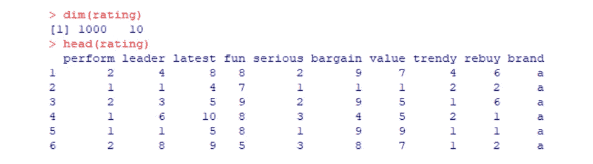
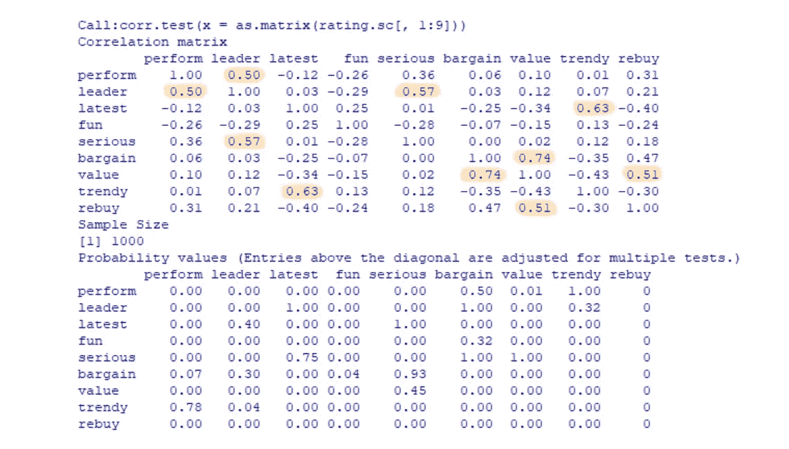
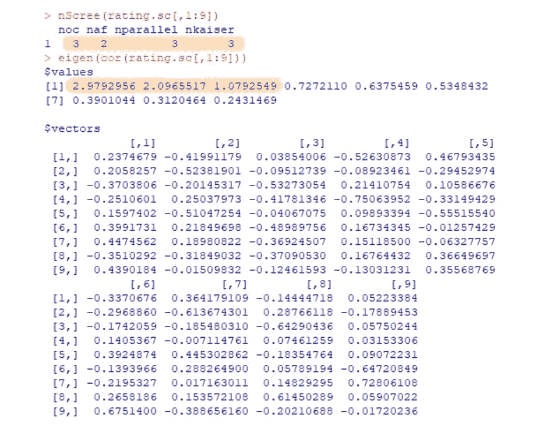
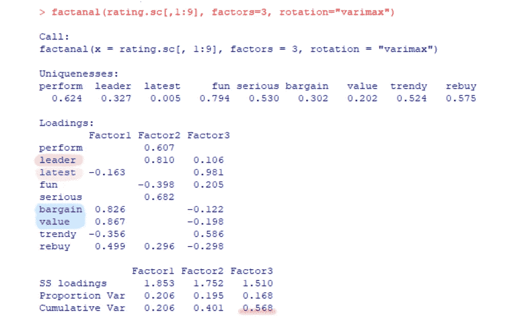
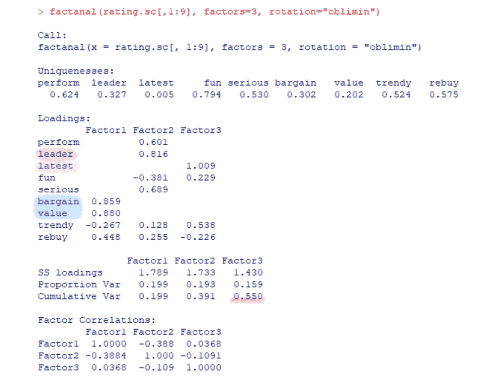
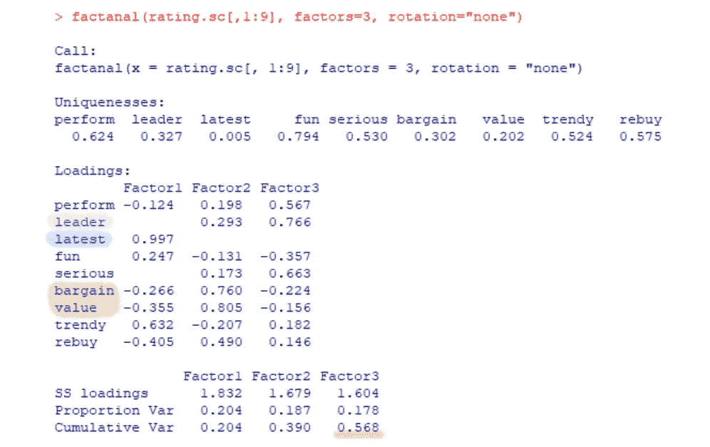
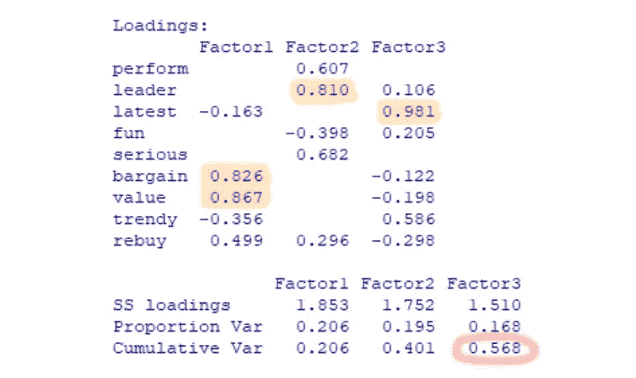
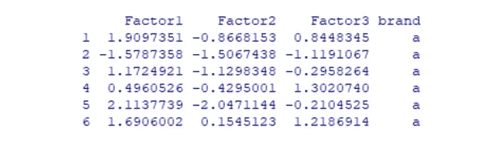
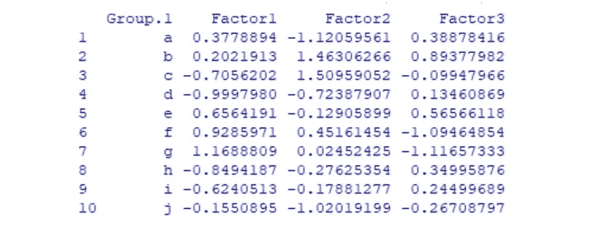

# R 中基于因子分析的特征提取

> 原文：<https://medium.com/analytics-vidhya/feature-extraction-using-factor-analysis-in-r-86fa4f01a43c?source=collection_archive---------9----------------------->


比尔·牛津在 [Unsplash](https://unsplash.com?utm_source=medium&utm_medium=referral) 上的照片

**什么是特征提取？**通过从现有要素创建新要素来减少数据集中要素数量的过程。新的缩减子集能够概括包含在原始特征集中的大部分信息。

特征提取有两种方法:因子分析和主成分分析。在这篇文章中，我首先谈谈因素分析。

为了消除大量变量之间的相关性，我们使用**因子分析**来寻找代表其相关因子的根因子。在我们简化数据的同时，我们也希望保留尽可能多的信息。这里，我用“品牌评级”数据(由 Christopher N. Chapman，Elea McDonnell Feit，Springer 的*“R for Marketing Research and Analytics”提供)*作为例子。

```
rating <- read.csv("http://goo.gl/IQl8nc")
dim(rating)
head(rating)
```



该数据有 1000 行和 10 列。每行代表消费者在不同方面(第 1 至 9 列)对某品牌(第 10 列)的评分。

为了使数据更加一致并具有相似的标度，我们首先使用标度函数来标准化评级。

```
rating.sc <- rating
rating.sc[,1:9] <- scale(rating[,1:9])
head(rating.sc)
summary(rating.sc)
```

然后，我们做统计检验，看每个自变量之间的相关性。这将为我们提供一个相关矩阵和一个 p 值表。

```
library(psych)
corr.test(as.matrix(rating.sc[,1:9]))
```



从相关矩阵中，我们可以看到有些值大于 0.5(或者有些将使用 0.6 作为索引)，这意味着这里存在共线性问题。

# 根本因素

假设有一些相似的变量，接下来，我们要用 scree 检验和特征值检验来估计因子的个数。先看结果吧。

```
library(nFactors)
nScree(rating.sc[,1:9]) 
eigen(cor(rating.sc[,1:9]))
```



**Scree test** 包含四个测量指标:光学坐标(oc)、加速因子(af)、平行分析(parallel)和凯泽法则(kaiser)。这些值表示可以选择多少因子，但是，有时它们并不相同(就像结果显示的那样)。然后，我们可以采取模式(在这种情况下，3 个因素)或检查特征值。

**特征值测试**是另一种确定因子个数的方法。通常我们保留特征值为> 1 的因子(或者有的会采用> 2)。因此，这里有三个因素。

# 因子**旋转**

知道要使用的因子数后，我们将它(因子= 3)应用于因子分析。我们可以尝试三种旋转类型:varimax、斜角、无。

```
library(GPArotation)
factanal(rating.sc[,2:6], factors=3, rotation=”varimax”) 
factanal(rating.sc[,2:6], factors=3, rotation=”oblimin”)
factanal(rating.sc[,2:6], factors=3, rotation=”none”)
```

**1。****【Varimax(默认)】**:一种正交旋转方法，可以最小化高负载变量的数量。它导致不相关的因素。



**2。倾斜**:轴不保持直角，允许因子之间的关联(有时可以简化因子模式矩阵)。



**3。无**:无旋转的因子分析。



在上面的图片中，我把因素 1 的属性用蓝色阴影，因素 2 的用绿色，因素 3 的用粉红色。我们可以看到，在这种情况下，无论是否调整旋转，因素属性和%累积加载的顺序都略有不同。(总体模式相似)

下面，我采用 rotation="varimax "和 scores = "Bartlett "进行下面的分析解释。

```
factor_res = factanal(rating.sc[,1:9], factors=3, scores=”Bartlett”)
```

# 因素负荷

因子加载显示了决定每个因子如何影响每个属性的权重。这些载荷(取其绝对值)有助于将属性分配给因子，并确定最能描述因子的名称。



通过解释加载矩阵，我们知道属性“廉价”和“价值”对因素 1 的贡献很大，因此“领先”对因素 2 的贡献也很大，而“最新”对因素 2 的贡献也很大。因此，我们可以得出结论，这些变量是根本因素。此外，累积负载表明，57%的数据可以用因子 1、2 和 3 来解释。换句话说，在这种情况下，当将 9 个因素减少到 3 个因素时，有 43%的信息损失。

# 因子得分

接下来，让我们获得因素得分，并在每个因素上为每个人添加匹配的品牌名称。

```
brand.scores <- data.frame(factor_res$scores) 
brand.scores$brand <- rating.sc$brand
head(brand.scores)
```



最后，我们计算各品牌每个因素的平均值，并做一些描述性分析。

```
(brand.mean <- aggregate(brand.scores[,1:3], list(brand.scores[,4]), mean))
```



我们可以发现，品牌 f 和 g 表现出很强的性价比(因素 1)，而它们被定位为不太新的品牌(因素 3)。此外，品牌 b 和 c 被视为领先品牌(因素 2)。

# 关于我

嗨，我是 Kelly，一名具有新闻和传播背景的商业分析研究生，喜欢分享探索数据和有趣发现的生活。如果您有任何问题，请随时通过[k*elly.szutu@gmail.com*联系我](mailto:kelly.szutu@gmail.com)