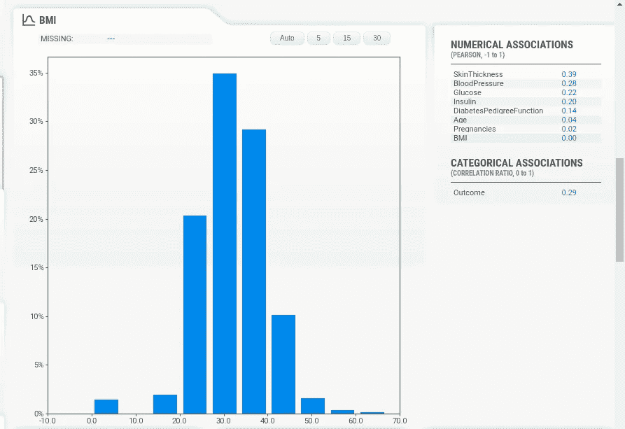
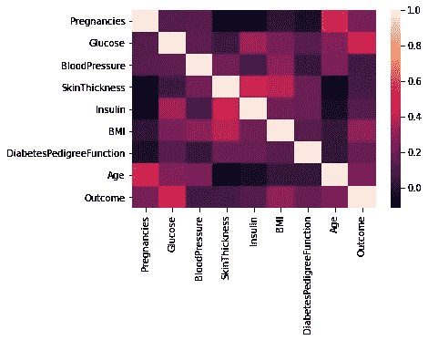

# 使用 Sweetviz 库进行特征提取

> 原文：<https://medium.com/analytics-vidhya/feature-extraction-using-sweetviz-library-3c6d88df6246?source=collection_archive---------16----------------------->

一个非常有效的特征提取工具。

图片由邓衍成拍摄。

# 介绍

Sweetviz 是一个开源 Python 库，可通过一行代码为 kickstart EDA(探索性数据分析)生成美观、高密度的可视化效果。该系统围绕快速可视化目标值和比较数据集而构建。它的目标是帮助快速分析目标特征、训练与测试数据以及其他类似的数据表征任务。根据[pypi.org](https://pypi.org/project/sweetviz/)，Sweetviz 库的不同用途如下-

*   目标分析
*   想象和比较
*   混合型协会
*   摘要信息(与缺失值相关)
*   数值分析

Sweetviz 对于从数据集中提取特征非常有效。在本博客中，我们将在著名的疾病检测数据集 **PIMA Indian Diabetes 数据集上发现 Sweetviz 库的不同功能。(** [**链接**](https://www.kaggle.com/uciml/pima-indians-diabetes-database) **)。**

# **关于特征提取的一些见解-**

特征提取是一个降维的过程，通过该过程，原始数据的初始集合被减少到更易管理的组以便处理。这些大型数据集的一个特征是需要大量计算资源来处理的大量变量。特征提取是选择和/或组合变量到特征中的方法的名称，有效地减少了必须处理的数据量，同时仍然准确和完整地描述了原始数据集。

# **方法论**

我们将在上述数据集上实现 Sweetviz 库，并讨论如何高效地提取特征。让我们来理解进行方法论过程所需的步骤-

**步骤 1:** 为特定数据集创建 HTML 格式的报告。

**步骤 2:** 对于每个属性，检查数字关联和类别关联。

**步骤 3:** 检查每个属性的数值关联的最高值。按照数字关联的降序列出前三个属性。观察所选属性的分类关联(相关比率)。

**第四步:**具有最高值的所选属性将被视为特征，并可用于进一步的数据分析。

**第五步:**使用热图对选择的属性进行交叉验证。

# **实施**

让我们在 PIMA Indian 糖尿病数据集上实现这个方法。

**步骤 1:** 报告 Sweetviz 库的创建。在这一步中，我们将导入诸如 NumPy、Pandas 和 Seaborn 以及 Sweetviz 等库。

**步骤 2:** 检查数据集所有属性的数值关联和类别关联。

**数值关联和相关比分析。**

**第三步:**检查完数值关联和类别关联后，选择类别关联值最高的三个属性。PIMA 印度数据集的三个属性如下

*   葡萄糖- 0.47
*   身体质量指数- 0.29
*   年龄- 0.24

**步骤 4:** 获得的类别关联最大值为葡萄糖，其类别关联值为 0.47。因此，属性“葡萄糖”将被用作特征，并且特征提取过程完成。

**步骤 5:** 然而，热图可用于交叉检查整个程序。可以证实，红色的浅色调在 0.40-0.60 的范围内。

**皮马印度数据集热图。**

# **结论**

我们了解到，Sweetviz 是一款出色的工具，可用于特征提取和探索性数据分析。它可以节省宝贵的时间用于数据预处理过程。它提供了一个强大的 HTML 报告文件，其中包含几个像计数图，条形图和热图可视化。整个系统基于报告的形成是基于两个原则，即**类别关联(不确定系数)**和**数值关联(相关比率)**。因此，可以得出结论，sweetviz 库是一个可以用于特征提取过程的综合工具。

# **参考文献**

[1] **Sweetviz 官方链接**-[https://pypi.org/project/sweetviz/](https://pypi.org/project/sweetviz/)

[2] **研究论文-** 吴，h，杨，s，黄，z，何，j .，【】王，X. (2018)。*基于数据挖掘的二型糖尿病糖尿病预测模型。开启医学信息学，10，100–107。*doi:10.1016/j . IMU . 2017 . 12 . 006

[3] **研究论文-** *周志华与袁强。* [*NeC4.5:基于神经集成的 C4.5*](http://rexa.info/paper/e6315f170eea3cc52ade688d0abb40f3372ec35d) *。IEEE Trans。知道了。数据工程，16。2004.*

[4] **特征提取博客**-[https://towards data science . com/Feature-extraction-techniques-d 619 b 56 e 31 be](https://towardsdatascience.com/feature-extraction-techniques-d619b56e31be)