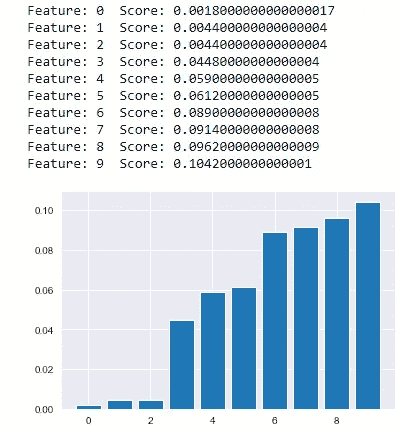
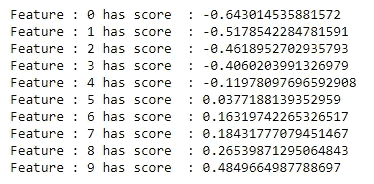
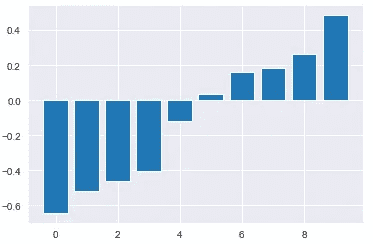
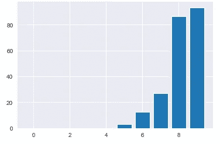
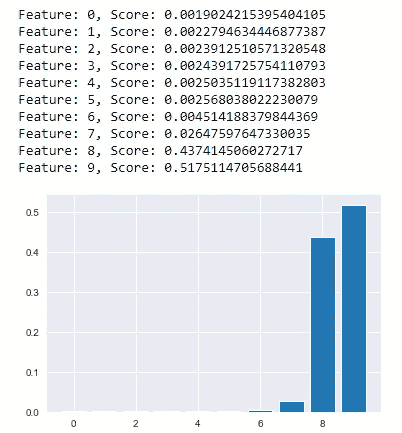

# 解释了功能重要性

> 原文：<https://medium.com/analytics-vidhya/feature-importance-explained-bfc8d874bcf?source=collection_archive---------0----------------------->


[来源](https://www.google.com/search?q=selection&sxsrf=ALeKk01iWPWYWnza3HDTmkksNF1MEIfyrg:1607154041483&source=lnms&tbm=isch&sa=X&ved=2ahUKEwjhnfetq7btAhWQbSsKHWmYAm0Q_AUoAnoECBYQBA&biw=1366&bih=625#imgrc=vWpaCP5g1DXMNM)

> **什么是特征重要性？**

它根据输入要素的重要性来分配输入要素的分数，以预测输出。负责预测输出的特征越多，它们的得分就越大。我们可以在分类和回归问题中使用它。假设你有一桶 10 个水果，你想从中挑选芒果，荔枝，橘子，所以这些水果对你来说很重要，就像机器学习中的特征重要性一样。在这个博客中，我们将了解各种特性重要性方法。

## 1.排列特征重要性:

对于那些本身不支持特征重要性的算法是最好的。它独立于使用模型计算相对重要性分数**。**这是进行特征选择的最佳技术之一，让我们来理解它；

**步骤 1 : -** 它随机选取一个特征，改变该特征中的变量，并进行预测。

**步骤 2 :-** 在该步骤中，使用损失函数找出损失，并检查预测产量和实际产量之间的可变性。

**第三步:-** 将特征变量恢复到原来的顺序或取消洗牌。

**步骤 4 :-** 对数据集中存在的所有特征执行上述三个步骤。

**步骤 5 :-** 将通过比较个人得分和平均重要性得分来计算最终重要特征。

该特征选择模型克服了基于树的特征选择技术中最常见的过度拟合。

```
from sklearn.datasets import make_classification
from sklearn.neighbors import KNeighborsClassifier
from sklearn.inspection import permutation_importance
from matplotlib import pyplot
# define dataset
X, y = make_classification(n_samples=1000, n_features=10, n_informative=5, random_state=1)
# define the model
model = KNeighborsClassifier()
# fit the model
model.fit(X, y)
# perform permutation importance
results = permutation_importance(model, X, y, scoring='accuracy')
# get importance
importance = results.importances_mean
importance=np.sort(importance)
# summarize feature importance
for i,v in enumerate(importance):
    print('Feature: {}  Score: {}' .format(i,v))
# plot feature importance
pyplot.bar([x for x in range(len(importance))] ,importance)
pyplot.show()
```



排列重要性

## **2。作为特征重要性的系数:**

在线性模型(逻辑回归、线性回归、正则化)的情况下，我们通常会找到系数来预测输出。让我们通过代码来理解它。

**a .线性模型中分类问题的特征重要性**

```
import pandas as pd
import numpy as np
from sklearn.datasets import make_classification
from sklearn.linear_model import LogisticRegression
import matplotlib.pyplot as plt
import seaborn as sns
X, y = make_classification(n_samples=1000, n_features=10, n_informative=5, n_redundant=5, random_state=1)
model=LogisticRegression()
model.fit(X,y)
importance=model.coef_[0]
importance=np.sort(importance)
importance[out]>> aarray([-0.64301454, -0.51785423, -0.46189527, -0.4060204 , -0.11978098,0.03771881,  0.16319742,  0.18431777,  0.26539871,  0.4849665 ])
```

按升序打印所有重要特征

```
for index,val in enumerate(importance):
    print("Feature : {} has score  : {} ".format(index,val))
```



图 1

```
#plotting the features and their score in ascending order
sns.set_style("darkgrid")
plt.bar([i for i in range (len(importance))],importance)
plt.show()
```



图 2

b.线性模型中回归问题的特征重要性

```
import pandas as pd
import numpy as np
from sklearn.datasets import make_regression
from sklearn.linear_model import LinearRegression
import matplotlib.pyplot as plt
import seaborn as sns
X, y = make_regression(n_samples=1000, n_features=10, n_informative=5, random_state=1)
model=LinearRegression()
model.fit(X,y)
importance=model.coef_
importance=np.sort(importance)
#plotting the features and their score in ascending order
sns.set_style("darkgrid")
plt.bar([i for i in range (len(importance))],importance)
plt.show()
```



图 3

## 3 .决策树作为特征的重要性:

决策树使用 CART 技术来找出其中存在的重要特征。所有基于决策树的算法都使用相似的技术来发现重要的特征。

```
#decision tree for feature importance on a regression problem
from sklearn.datasets import make_regression
from sklearn.tree import DecisionTreeRegressor
import matplotlib.pyplot as plt
import seaborn as sns
import numpy as np
X, y = make_regression(n_samples=1000, n_features=10, n_informative=5, random_state=1)
# define the model
model = DecisionTreeRegressor()
# fit the model
model.fit(X, y)
# get importance
importance = model.feature_importances_
importance=np.sort(importance)
# summarize feature importance
for i,v in enumerate(importance):
    print('Feature: {}, Score: {}'.format(i,v))
# plot feature importance
plt.bar([x for x in range(len(importance))], importance)
plt.show()
```



图 4

我们在决策树中发现重要特征的方法与在随机森林和 Xgboost 中发现特征重要性的方法相同。

> **为什么特性重要性如此重要？**

特征重要性给了我们更好的数据可解释性。

让我们来理解解释能力；

假设你有一个医院的数据集，现在所有者想知道哪种症状的人会再次来医院。每种疾病(特征)如何使他们获利。人们对这家医院的治疗有什么看法？这些都被称为可解释性。这也有助于我们找到最重要的预测特征。

结论:-

这些都是我的观点，如果你有任何建议，请在下面评论。