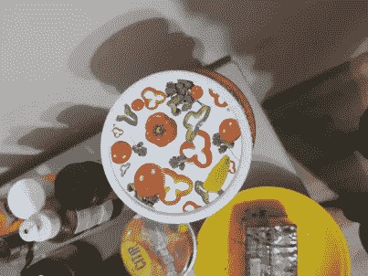

# 使用 BRISK 进行特征匹配

> 原文：<https://medium.com/analytics-vidhya/feature-matching-using-brisk-277c47539e8?source=collection_archive---------5----------------------->

SIFT 的开源替代品


左图像边框在右图像中的位置上的投影

我想要一个应用程序，可以拍摄两张图像，并在第二张图像中检测第一张图像的位置，我也不想使用人工智能。

我需要做的可以总结为三步:
1。在第一幅图像上找到好的关键点(或特征)2。在第二张图片
3 上做同样的操作。将第一幅图像的关键点与第二幅图像的关键点进行匹配

很简单，你说呢？！让我们看看我们的选择

对于这么简单的任务，我不想使用人工智能，我刚刚开始学习人工智能，我是一个完全的新手，下一个最好的东西是一种叫做 SIFT 的算法！

## **筛**

尺度不变特征变换( **SIFT** )是计算机视觉中检测和描述图像局部特征的一种特征检测算法，由 David Lowe 于 1999 年开发，该算法及其开发者在 CV 领域都非常著名，**但是，**它已经申请了专利！

## **轻快**

BRISK 是一种具有尺度不变性和旋转不变性的特征点检测和描述算法，于 2011 年开发，作为 SIFT 的免费替代，并在 OpenCV 等著名的 CV 库中易于实现

## 第一步:寻找特征

为了说明这一点，我将使用下面两张图片:



图片 1


图片 2

## 说明

我们需要计算两幅图像上的特征点，这些是算法感兴趣的点。

```
detector = cv.BRISK_create()kp1, desc1 = detector.detectAndCompute(img1, None)
```

我们初始化一个检测器对象，并用它来计算每个点的特征和描述符，描述符将帮助我们匹配图像之间的点，下面是第一步的结果


图像 1 的特征点

图像 2 也是如此


图像二的特征点

*请注意，如果您使用的是大图像，这可能需要更多时间，因此请考虑调整图像大小。*

现在到了有趣的部分，我们把两张图片匹配起来，

```
FLANN_INDEX_LSH    = 6flann_params= dict(algorithm = FLANN_INDEX_LSH,table_number = 6, *# 12*key_size = 12,     *# 20*multi_probe_level = 1) *#2*matcher = cv.FlannBasedMatcher(flann_params, {})raw_matches = matcher.knnMatch(desc1, trainDescriptors = desc2, k = 2)
```

FLANN 是一个 matcher 对象，它会给我们可能包含一些不准确的匹配，为了消除不准确的点，我们使用 Low 的比率测试，这里我为它做了一个函数

我还想围绕检测到的对象绘制一个边界框，我将使用单应来完成，简单地说，我将把第一个图像的边界投影到第二个图像的新位置上，这就是看起来的样子


我做了一个函数来做单应，下面是它的样子:

你可以在这里找到完整的代码，其中大部分是不言自明的，但是如果你有问题，请随时问我。