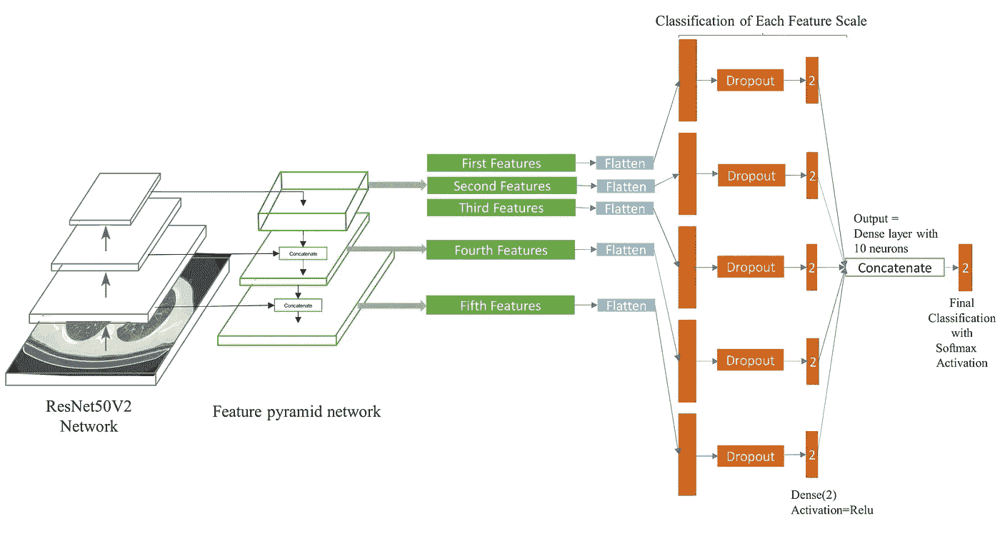

# 用于图像分类的特征金字塔网络

> 原文：<https://medium.com/analytics-vidhya/feature-pyramid-network-for-image-classification-aa6dd22a4844?source=collection_archive---------7----------------------->

目标检测是计算机视觉中的主要问题之一，当图像中存在多尺度目标时，目标检测可能会失败。使用要素金字塔有助于解决这个问题。

一些先前的研究试图使用不同种类的特征金字塔来改进对象检测。一种方法是将不同大小的输入图像输入到深度网络，以观察不同比例的物体。这种方式也有助于改善对象检测，但增加了计算成本和处理时间，因此效率不高。

[***特征金字塔网络***](https://arxiv.org/abs/1612.03144)***【FPN】***由宗-林逸等人提出，为深度卷积目标检测器增强了目标检测精度。FPN 通过从不同比例的网络生成要素生成具有横向连接的**自下而上和自上而下要素等级来解决这个问题。这有助于网络生成更多的语义特征，因此当图像中存在各种比例的对象时，使用 FPN 有助于提高检测精度，同时不改变检测速度。**

***在这里，我旨在介绍一种基于 FPN 的新架构来提高分类精度。这个架构是我在*** [***论文***](https://doi.org/10.1101/2020.06.08.20121541) ***中提出的。***

如上所述，FPN 有助于从输入图像中提取多尺度特征，从而更好地呈现不同尺度的对象。我们设计了一个架构，利用 FPN 来更好地理解图像中可能以不同大小存在的重要部分。

在下图中，您可以看到我们建议的架构。这种架构被开发用于将患者 CT 扫描图像分类为正常和新冠肺炎。研究人员可以修改这个架构，用于不同的数据集和类。

该图显示了我们的模型，该模型使用 ResNet50V2 作为主干，并应用特征金字塔网络和设计的层来将图像分类为两类。

有一个骨干网络可以是任何深度卷积网络，这里使用的是 **ResNet50V2** 。

注意，在这种架构中，使用了两个神经元层，因为有两类图像可用。其他研究人员必须根据他们的数据集类别来设置密集层中的神经元数量。

我们使用的 FPN 就像 FPN 的原始版本。由于这种差异，我们根据作者的经验，在特征金字塔网络中使用了 ***级联层*** 而不是 ***增加层*** 。

> *FPN 提取五个最终特征***，每个特征以不同的尺度呈现输入图像特征。之后，我们实现了* ***【脱层(避免过拟合)*** *，接着是第一个分类层。注意，我们没有对第一分类层使用* ***softmax 函数*** *，因为我们想将它们提供给最终的分类层，并且由于 softmax 函数根据其他输出神经元的比率来计算每个输出神经元，所以它不适合这个地方。* ***Relu 激活功能*** *更合适。**
> 
> **在架构的最后，我们将* ***这五个分类层*** *(每个由两个神经元组成)串联起来，做了一个* ***十个神经元的密集层*** *。然后我们将这一层连接到最终的分类层，它应用了* ***softmax 函数*** *。**

*通过运行该过程，网络利用基于各种尺度特征的不同分类结果。因此，网络将能够更准确地对图像进行分类。*

**研究人员可以使用我们提出的模型在其他案例和数据集上运行分类，以改善分类结果。**

*该架构的代码可在以下位置找到:*

* [## mr7495/COVID-CT 代码

### permalink dissolve GitHub 是超过 5000 万开发人员的家园，他们一起工作来托管和审查代码，管理…

github.com](https://github.com/mr7495/COVID-CT-Code/blob/master/COVID_Train%26Validation.ipynb) 

链接到源文件:

 [## 一个全自动的基于深度学习的网络，用于从新的大型肺部 CT 检测新冠肺炎…

### 新冠肺炎是一个严重的全球性问题，人工智能可以通过监测和监控在防止损失方面发挥重要作用

doi.org](https://doi.org/10.1101/2020.06.08.20121541)*