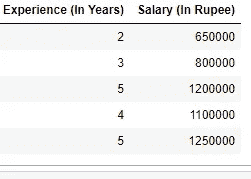
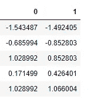
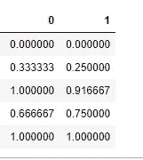

# 特征缩放。

> 原文：<https://medium.com/analytics-vidhya/feature-scaling-128cd3d2fcb8?source=collection_archive---------16----------------------->


图片来自谷歌。

**什么是特征缩放？**

对数据集进行特征缩放，将所有不同类型的数据转换成一个 ***单一格式*** 。在**独立变量**上完成。

**我们为什么要进行功能扩展？**

例如:假设一个数据框架有两列“经验”和“薪水”。



**经历**以 ***年*** 的形式表现。

**工资**以 ***卢比*** 的形式表示。

*   当我们映射这两列时，记录之间的距离很大。
*   在数量和单位上变化很大。
*   **量级**:列中的值。例:年有 ***2、3、5*** 经验有 ***1100000、1250000*** 这些都是量级。
*   **单位** : ***年*** 和 ***卢比*** 都是单位。

有些算法，使用**的欧几里德距离**来计算目标。如果数据的大小和单位不同，自变量之间的距离会更大。所以，以这样一种方式带来数据，独立变量看起来是一样的，在数量上没有太大的变化。

```
from sklearn.preprocessing import StandardScaler
df_scaled = StandardScaler().fit_transform(df.values)
df_scaled = pd.DataFrame(df_scaled)
df_scaled
```



标准标量的输出。

特征缩放的类型:

*   最小最大缩放器。
*   标准定标器。
*   最大 Abs 定标器。
*   鲁棒的定标器。
*   分位数变压器缩放器。
*   电力变压器定标器。
*   单位向量定标器。

常用的缩放技术是最小最大标量和标准标量。

**最小最大标量:**

*   它在 0 和 1 之间缩放和转换数据。
*   当使用最小最大标量对数据进行缩放时，人工神经网络表现良好。

```
from sklearn.preprocessing import MinMaxScalerdf_minmax = MinMaxScaler().fit_transform(df.values)
df_minmax = pd.DataFrame(df_minmax)
df_minmax
```



最小最大标量的输出

**标准标量:**

*   它根据 ***平均值= 0*** 和 ***标准差= 1 对数据进行缩放和转换。***

```
from sklearn.preprocessing import StandardScaler
df_scaled = StandardScaler().fit_transform(df.values)
df_scaled = pd.DataFrame(df_scaled)
df_scaled
```

预处理时算法使用特征缩放:

1.  线性回归。
2.  梯度下降。
3.  k 均值
4.  k 最近邻。
5.  主成分分析

*   如果我们缩放该值，那么**很容易**得到**全局极小点**。

算法在预处理时不需要特征缩放。

1.  决策树。
2.  随机森林。

*   **所有基于树的算法**。根节点根据数据点分割值。