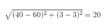

# 机器学习的特征缩放:理解标准化与规范化的区别

> 原文：<https://medium.com/analytics-vidhya/feature-scaling-for-machine-learning-normalization-vs-standardization-34daa2d4f707?source=collection_archive---------13----------------------->

# 特征缩放简介

我最近在处理一个数据集，该数据集包含多个要素，这些要素的大小、范围和单位各不相同。这是一个重大障碍，因为一些机器学习算法对这些特征非常敏感。

我敢肯定，你们大多数人在项目或学习过程中肯定都面临过这个问题。例如，一个特征完全以千克为单位，而另一个以克为单位，另一个以升为单位，等等。当这些功能在呈现内容上有如此大的差异时，我们该如何使用它们呢？

> 这就是我转向特征缩放概念的地方。这是数据预处理阶段的一个关键部分，但我看到许多初学者忽略了它(这对他们的机器学习模型不利)。

关于特征缩放，有一件奇怪的事情——它(显著)提高了一些机器学习算法的性能，但对其他算法根本不起作用。这种怪癖背后的原因可能是什么？

还有，规范化和标准化有什么区别？这是机器学习中最常用的两种特征缩放技术，但在它们的理解中存在一定程度的模糊性。什么时候应该使用哪种技术？

我将在这篇关于特性扩展的文章中回答这些问题以及更多问题。我们还将在 Python 中实现特性缩放，让您实际了解它如何适用于不同的机器学习算法。

*注:我假设你熟悉 Python 和核心机器学习算法。如果你是新手，我建议你参加以下课程:*

*   [*用于数据科学的 Python*](https://courses.analyticsvidhya.com/courses/introduction-to-data-science?utm_source=blog&utm_medium=feature-scaling-machine-learning-normalization-standardization)
*   [*所有免费机器学习课程由 Analytics Vidhya*](https://courses.analyticsvidhya.com/collections?category=free)
*   [*应用机器学习*](https://courses.analyticsvidhya.com/courses/applied-machine-learning-beginner-to-professional?utm_source=blog&utm_medium=feature-scaling-machine-learning-normalization-standardization)

# 目录

1.  为什么要使用特征缩放？
2.  什么是正常化？
3.  什么是标准化？
4.  最大的问题是——正常化还是标准化？
5.  在 Python 中实现要素缩放

*   使用 Sklearn 进行规范化
*   使用 Sklearn 实现标准化

6.将特征缩放应用于机器学习算法

*   k-最近邻(KNN)
*   支持向量回归机
*   决策图表

# 为什么要使用特征缩放？

我们需要解决的第一个问题是——为什么我们需要调整数据集中的变量？一些机器学习算法对特征缩放很敏感，而其他算法对特征缩放几乎不变。让我更详细地解释一下。

# 基于梯度下降的算法

**机器学习算法像** [**线性回归**](https://www.analyticsvidhya.com/blog/2017/05/neural-network-from-scratch-in-python-and-r/?utm_source=blog&utm_medium=feature-scaling-machine-learning-normalization-standardization)**[**逻辑回归**](https://www.analyticsvidhya.com/blog/2017/05/neural-network-from-scratch-in-python-and-r/?utm_source=blog&utm_medium=feature-scaling-machine-learning-normalization-standardization)**[**神经网络**](https://www.analyticsvidhya.com/blog/2017/05/neural-network-from-scratch-in-python-and-r/?utm_source=blog&utm_medium=feature-scaling-machine-learning-normalization-standardization) **等。使用梯度下降作为优化技术需要对数据进行缩放。**看看下面的梯度下降公式:****

********

****公式中特征值 X 的存在将影响梯度下降的步长。特征范围的差异将导致每个特征的不同步长。为了确保梯度下降平滑地向最小值移动，并确保梯度下降的步长以相同的速率更新所有要素，我们在将数据输入模型之前对其进行了缩放。****

> ****具有相似尺度的特征可以帮助梯度下降更快地向最小值收敛。****

# ****基于距离的算法****

****像 [KNN](https://www.analyticsvidhya.com/blog/2018/03/introduction-k-neighbours-algorithm-clustering/?utm_source=blog&utm_medium=feature-scaling-machine-learning-normalization-standardization) 、 [K-means](https://www.analyticsvidhya.com/blog/2019/08/comprehensive-guide-k-means-clustering/?utm_source=blog&utm_medium=feature-scaling-machine-learning-normalization-standardization) 和 [SVM](https://www.analyticsvidhya.com/blog/2017/09/understaing-support-vector-machine-example-code/?utm_source=blog&utm_medium=feature-scaling-machine-learning-normalization-standardization) 这样的距离算法受特征范围的影响最大。这是因为在幕后，他们使用数据点之间的距离来确定它们的相似性。****

****例如，假设我们有包含学生高中 CGPA 分数(从 0 到 5)和他们未来收入(以千卢比计)的数据:****

********

****由于这两个要素的比例不同，因此可能会对具有较高幅度的要素赋予较高的权重。这将影响机器学习算法的性能，显然，我们不希望我们的算法偏向一个特征。****

> *****因此，在采用基于距离的算法之前，我们对数据进行了缩放，以便所有特征对结果的贡献相等。*****

********

****当我们比较学生 A 和 B 的数据点之间以及 B 和 C 的数据点之间在缩放前后的欧几里德距离时，缩放的效果是明显的，如下所示:****

*   ****缩放前的距离 AB:****

********

*   ****缩放前的距离 BC:****

********

*   ****缩放后的距离 AB:****

********

*   ****缩放后的距离 BC:****

********

****缩放将两个特征都带入了画面，距离现在比应用缩放之前更具可比性。****

# ****基于树的算法****

****[另一方面，基于树的算法](https://www.analyticsvidhya.com/blog/2016/04/tree-based-algorithms-complete-tutorial-scratch-in-python/?utm_source=blog&utm_medium=feature-scaling-machine-learning-normalization-standardization)对特征的规模相当不敏感。想一想，决策树只是基于单一特征拆分一个节点。决策树在增加节点同质性的特征上分割节点。特征上的这种分割不受其他特征的影响。****

****因此，实际上剩余特征对分割没有影响。这就是为什么它们对特征的比例不变！****

# ****什么是正常化？****

******标准化是一种缩放技术，其中值被移动和重新缩放，以使它们最终在 0 和 1 之间变化。这也称为最小-最大缩放。******

****这是归一化的公式:****

********

****这里，Xmax 和 Xmin 分别是特征的最大值和最小值。****

*   ****当 X 的值是列中的最小值时，分子将是 0，因此 X '是 0****
*   ****另一方面，当 X 的值是列中的最大值时，分子等于分母，因此 X’的值是 1****
*   ****如果 X 的值在最小值和最大值之间，那么 X’的值在 0 和 1 之间****

# ****什么是标准化？****

******标准化是另一种标度技术，其中数值以平均值为中心，具有单位标准偏差。这意味着属性的平均值变为零，结果分布有一个单位标准偏差。******

****这是标准化的公式:****

********

****注意，在这种情况下，这些值不限于特定的范围。****

****现在，你心中的大问题一定是什么时候应该使用规范化，什么时候应该使用标准化？让我们来了解一下！****

# ****最大的问题是——正常化还是标准化？****

****规范化 vs .标准化是机器学习新人中永恒的问题。让我在这一节详细阐述一下答案。****

*   ******当您知道数据的分布不符合高斯分布时，可以使用归一化**。这在不假设任何数据分布的算法中很有用，例如 K-最近邻和神经网络。****
*   ******另一方面，标准化**在数据遵循高斯分布的情况下会很有帮助。然而，这并不一定是真的。此外，与标准化不同，标准化没有边界范围。因此，即使您的数据中有异常值，它们也不会受到标准化的影响。****

****然而，最终，选择使用规范化还是标准化将取决于您的问题和您使用的机器学习算法。没有硬性的规则告诉你什么时候规范化或标准化你的数据。**您总是可以从将您的模型与原始的、标准化的和标准化的数据进行拟合开始，并比较性能以获得最佳结果。******

*****在训练数据上安装定标器，然后用它来转换测试数据，这是一个很好的做法。这将避免模型测试过程中的任何数据泄漏。此外，通常不需要目标值的缩放。*****

# ****在 Python 中实现要素缩放****

****现在有趣的部分来了——把我们学到的东西付诸实践。我将在[大市场数据集](https://datahack.analyticsvidhya.com/contest/practice-problem-big-mart-sales-iii/?utm_source=blog&utm_medium=feature-scaling-machine-learning-normalization-standardization)上对一些机器学习算法应用特征缩放，我已经采用了 [DataHack](https://datahack.analyticsvidhya.com/contest/all/?utm_source=blog&utm_medium=feature-scaling-machine-learning-normalization-standardization) 平台。****

****我将跳过预处理步骤，因为它们超出了本教程的范围。但是你可以在这篇[文章](https://www.analyticsvidhya.com/blog/2016/02/bigmart-sales-solution-top-20/?utm_source=blog&utm_medium=feature-scaling-machine-learning-normalization-standardization)中找到它们的清晰解释。这些步骤将使您能够进入 hackathon 排行榜的前 20%，因此值得一试！****

****因此，让我们首先将数据分成训练集和测试集:****

****在进入特性缩放部分之前，我们先来看一下使用 **pd.describe()** 方法得到的数据细节:****

********

****我们可以看到，在我们的数字特征中存在着一个巨大的值范围差异: **Item_Visibility** 、 **Item_Weight、**Item _ MRP、**Outlet _ Establishment _ Year**。让我们尝试使用功能缩放来解决这个问题！****

*****注意:您将注意到 Item_Visibility 特性中的负值，因为我已经采用了对数变换来处理该特性中的偏斜度。*****

# ****使用 sklearn 进行规范化****

****为了规范化您的数据，您需要从 [sklearn](https://courses.analyticsvidhya.com/courses/get-started-with-scikit-learn-sklearn?utm_source=blog&utm_medium=feature-scaling-machine-learning-normalization-standardization) 库中导入 *MinMaxScalar* 并将其应用到我们的数据集。所以，让我们这样做吧！****

****让我们看看标准化是如何影响我们的数据集的:****

********

****现在，所有特征的最小值为 0，最大值为 1。完美！****

****接下来，让我们尝试标准化我们的数据。****

# ****使用 sklearn 实现标准化****

****为了标准化您的数据，您需要从 sklearn 库中导入 *StandardScalar* ，并将其应用到我们的数据集。你可以这样做:****

****您可能已经注意到，我只对我的数字列应用了标准化，而没有对其他的[一键编码](https://www.analyticsvidhya.com/blog/2020/03/one-hot-encoding-vs-label-encoding-using-scikit-learn/?utm_source=blog&utm_medium=feature-scaling-machine-learning-normalization-standardization)特性应用标准化。标准化独热编码特征意味着给分类特征分配一个分布。你不会想那么做的！****

****但是为什么我没有在标准化数据时做同样的事情呢？因为独热编码特征已经在 0 到 1 的范围内。因此，规范化不会影响它们的值。****

****好的，让我们看看标准化是如何改变我们的数据的:****

********

****数字特征现在以平均值为中心，具有单位标准偏差。厉害！****

# ****比较未缩放、规范化和标准化的数据****

****可视化您的数据以了解当前的分布总是很棒的。我们可以使用箱线图来比较未缩放数据和缩放数据。****

*****您可以在这里 *了解更多关于数据可视化* [。](https://www.analyticsvidhya.com/blog/tag/data-visualization/?utm_source=blog&utm_medium=feature-scaling-machine-learning-normalization-standardization)*****

********

****您可以注意到缩放要素是如何让一切变得清晰可见的。这些功能现在更具可比性，并将对学习模型产生类似的影响。****

# ****将缩放应用于机器学习算法****

****现在是时候在我们的数据上训练一些机器学习算法，以比较不同缩放技术对算法性能的影响。我想看看缩放对三种算法的影响:K 近邻、支持向量回归机和决策树。****

******K-最近邻******

****正如我们之前看到的，KNN 是一种基于距离的算法，它受要素范围的影响。让我们看看它在扩展前后对我们的数据的表现如何:****

********

****你可以看到缩放特征降低了我们的 KNN 模型的 RMSE 分数。具体来说，标准化数据的性能比标准化数据好一点。****

*****注意:我在这里测量 RMSE，因为这个比赛评估的是 RMSE。*****

******支持向量回归机******

****[SVR](https://www.analyticsvidhya.com/blog/2020/03/support-vector-regression-tutorial-for-machine-learning/?utm_source=blog&utm_medium=feature-scaling-machine-learning-normalization-standardization) 是另一种基于距离的算法。因此，让我们来看看规范化和标准化哪个效果更好:****

********

****我们可以看到，缩放功能确实降低了 RMSE 分数。并且标准化数据比标准化数据表现得更好。你觉得为什么会这样？****

****sklearn 文档指出，使用 RBF 核的 SVM 假设所有特征都以零为中心，方差也是相同的数量级。这是因为方差大于其他特征的特征会阻止估计器从所有特征中学习。太好了！****

******决策树******

****我们已经知道决策树对于特征缩放是不变的。但我想展示一个它如何处理数据的实际例子:****

********

****你可以看到 RMSE 分数在缩放特征上没有移动一英寸。因此，当您对数据使用基于树的算法时，请放心！****

# ****结束注释****

****本教程讲述了对数据使用要素缩放的相关性，以及规范化和标准化如何对机器学习算法的工作产生不同的影响****

****请记住，对于何时使用规范化而非标准化，没有正确的答案，反之亦然。这完全取决于你的数据和你使用的算法。****

****下一步，我鼓励你尝试用其他算法进行特征缩放，并找出哪种算法效果最好——规范化还是标准化？我建议你使用 [BigMart 的销售数据](https://datahack.analyticsvidhya.com/contest/practice-problem-big-mart-sales-iii/?utm_source=blog&utm_medium=feature-scaling-machine-learning-normalization-standardization)来保持这篇文章的连续性。别忘了在下面的评论区分享你的见解！****

# ****你也可以在分析 Vidhya 的 Android 应用上阅读这篇文章****

********

*****原载于 2020 年 4 月 3 日 https://www.analyticsvidhya.com**[*。*](https://www.analyticsvidhya.com/blog/2020/04/feature-scaling-machine-learning-normalization-standardization/)*****