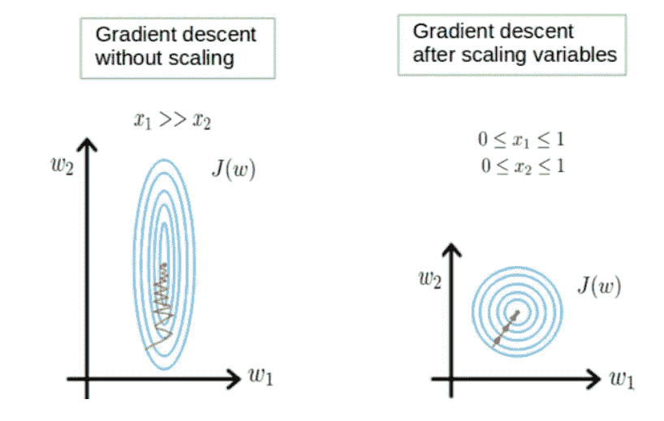
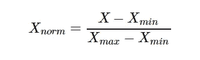
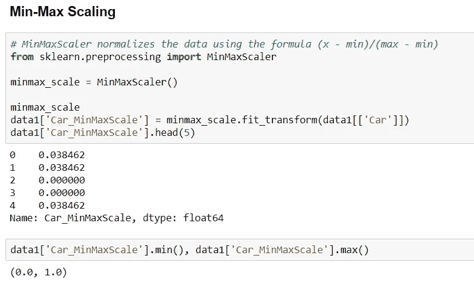
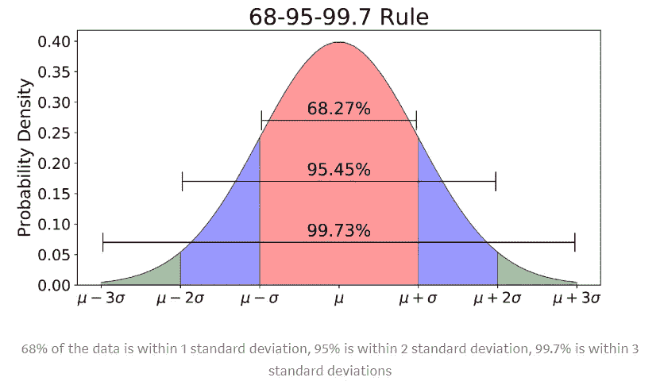
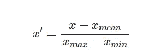
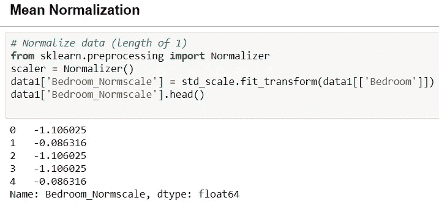
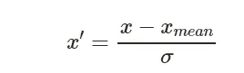
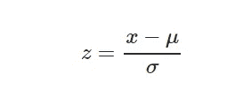
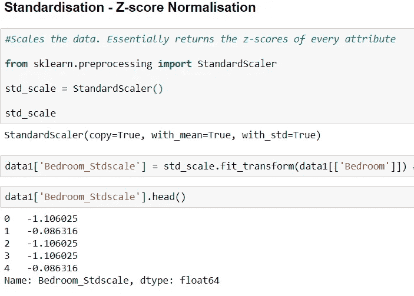
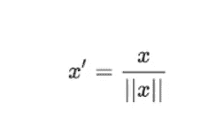

# 特性缩放:-规范化、标准化和缩放！

> 原文：<https://medium.com/analytics-vidhya/feature-scaling-normalization-standardization-and-scaling-c920ed3637e7?source=collection_archive---------6----------------------->

当您的数据由不同比例的属性组成时，许多机器学习算法可以从重新调整属性的比例以使所有属性具有相同的比例中受益。这通常被称为规范化，属性通常被重新调整到 0 和 1 之间的范围内。

在梯度下降中缩放到相同的幅度

这是一种将独立变量标准化到一个固定范围的技术，目的是使所有值达到相同的大小。通常在数据预处理步骤中执行，也有助于加速算法中的计算。**用于线性回归、K-means、KNN、PCA、梯度下降等。**

**为什么需要缩放？**

特征缩放应在大小、单位和范围不同的独立变量上进行，以标准化为固定范围。
如果没有缩放，那么机器学习算法会将较高的权重分配给较大的值，而不考虑值的单位。由于原始数据的值的范围变化很大，在一些机器学习算法中，如果不进行归一化，目标函数将无法正常工作。**例如:-**

m1 认为值 1000 克> 2 千克或值 3000 米大于 5 千米，因此算法将给出错误的预测。

特征重量不匹配

许多分类器通过欧几里德距离计算两点之间的距离。如果其中一个要素的值范围很大，则距离将由该特定要素决定。
因此，所有特征的范围应进行归一化，以使每个特征对最终距离的贡献大致成比例。应用特征缩放的另一个原因是，使用特征缩放时梯度下降的收敛速度比不使用特征缩放时快得多。**简而言之，我们缩小到同样的规模。**

**不是基于距离的算法不受特征缩放的影响。朴素贝叶斯**

主要是四种类型的特征缩放:-

1.  **最小-最大定标(定标):-** 它不同于归一化，因为这里唯一的动机是改变数据范围，而在归一化/标准化中，唯一的动机是归一化分布形状曲线，并使其成为完美的高斯曲线。与标准化相比，拥有这个有界范围的代价是，我们最终会得到更小的标准差，这可以抑制异常值的影响。

**用于深度学习、图像处理和卷积神经网络。**

2.**均值归一化:-** 归一化的意义在于改变你的观察值，使其可以被描述为正态分布。正态分布(高斯分布)，也称为**钟形曲线**，是一种特定的统计分布，其中大致相等的观察值落在平均值之上和之下。在-1 到 1 之间变化，平均值= 0。

3.**标准化(Z 分数标准化):-** 转换数据，使结果分布的平均值为 0，标准差为 1。 **μ=0，σ=1。主要用于 KNN 和 K-means。**

其中，μ是平均值，σ是平均值的标准差；样本的标准分数(也称为 ***z*** 分数)计算如下:

4.**将数据二进制化(Make Binary) :-**
你可以使用二进制阈值来转换你的数据。所有高于阈值的值都标记为 1，所有等于或低于阈值的值都标记为 0。这被称为二值化你的数据或阈值化你的数据。当你有可能想得到清晰的值时，它会很有用。当特征工程和你想要增加新的特征来表示一些有意义的东西时，它也是有用的。您可以使用 scikit-learn 和**二进制化器类**在 Python 中创建新的二进制属性

**# binary ization from sk learn . preprocessing 导入二进制化器**
http://scikit-learn . org/stable/modules/generated/sk learn . preprocessing . normalizer . html[http://scikit-learn . org/stable/modules/generated/sk learn . binary izer . html](http://scikit-learn.org/stable/modules/generated/sklearn.preprocessing.Binarizer.html)

5.**单位向量:-** 考虑到整个特征值为单位长度，进行缩放。当处理具有硬边界的特征时，这非常有用。例如，当处理图像数据时，颜色的范围可以从 0 到 255。

在这里跟随我的例子 jupyter 笔记本代码:- [github](https://github.com/NishantKumar61988/nishucode/blob/master/Feature_Scaling_Tutorial.ipynb)

***万事如意！快乐编码…..***

[脸书](https://www.facebook.com/NishuArt-109507937410651/?modal=admin_todo_tour) | [Instagram](https://www.instagram.com/datasciencewithmemes/)