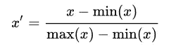
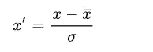

# 特征缩放:为什么和如何？

> 原文：<https://medium.com/analytics-vidhya/feature-scaling-why-and-how-5247fb257887?source=collection_archive---------15----------------------->

F 特征缩放是指改变数值特征范围(归一化)的过程。它也被称为“数据规范化”，通常在机器学习流水线的数据预处理步骤中执行。

缩放前后达到全局最小值

有不同的方法来进行特征缩放。但是首先，你为什么需要这么做？(停止阅读，猜答案)

是的，你是对的。当机器学习算法测量数据点之间的距离时，结果可能由特征的大小(比例)而不是它们的值决定。将要素缩放到某个范围可以解决此问题。**对于基于梯度的算法，归一化提高了收敛速度。**

当算法计算距离(K-最近邻和支持向量机)或用梯度
下降(回归)训练时，使用特征缩放。

我们如何进行特征缩放？我们将使用以下合成数据来比较不同的缩放技术方法。

**最小-最大归一化:**

最小-最大缩放是缩放数据的最简单且广泛使用的归一化方法之一。它在[0，1]范围内缩放每个变量/特征。

最小-最大缩放

示例:最小-最大缩放器

缩放分布不会重叠太多，它们的形状保持不变(除了法线)。
** *这种方法保留了原始分布的形状，对异常值很敏感。*

**标准化:**

此方法通过移除平均值并除以标准差来重新缩放要素。它产生以 0 为中心的分布，标准偏差为 1。一些机器学习算法(SVM)假设特征在这个范围内。

标准缩放

示例:标准缩放

结果分布严重重叠。而且，它们的形状要窄得多。

** *该方法“使得”特征呈正态分布。对于异常值，数据将被缩放到一个小的区间。*

**鲁棒缩放:**

这种方法非常类似于最小-最大方法。每个特征都按以下比例缩放:

稳健缩放

其中 Q 是四分位数。四分位间距使这种方法对异常值(因此得名)具有鲁棒性。

示例:稳健缩放

所有分布的大部分密度都在 0 左右，形状也大致相同。
** *当你有离群值，想把它们的影响降到最低时，就用这个方法。*

希望你对机器学习中缩放的目的有所了解。感谢您阅读这篇文章。

代码:[https://github . com/vivekpandian 08/feature-scaling-why-and-how-](https://github.com/vivekpandian08/feature-scaling-why-and-how-)

参考资料:

1.  [《https://en.wikipedia.org/wiki/Feature_scaling》](https://en.wikipedia.org/wiki/Feature_scaling)
2.  Andrew NG——机器学习
3.  https://www.curiousily.com/