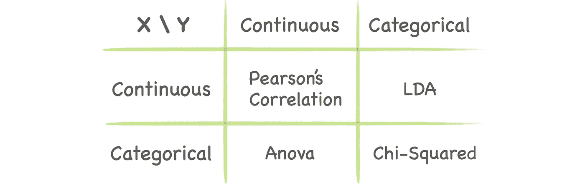
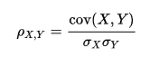
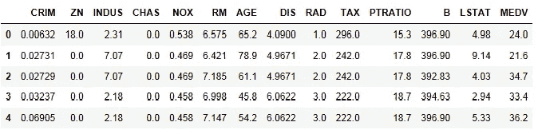
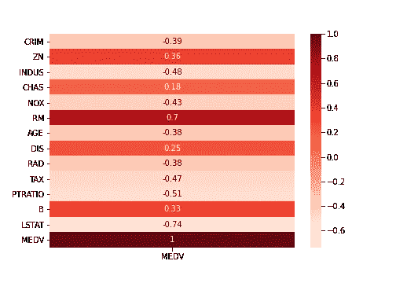
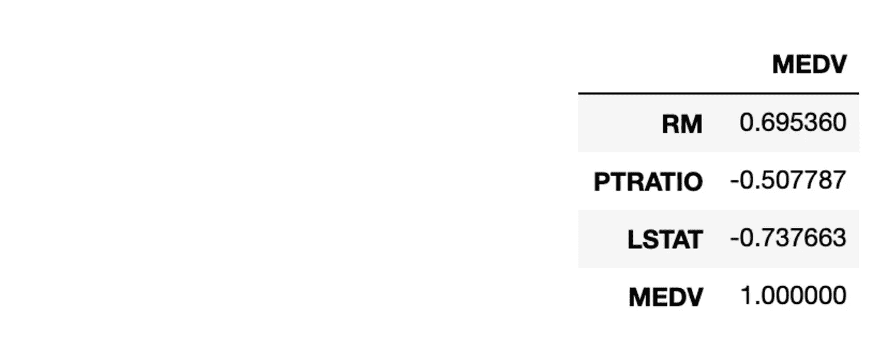
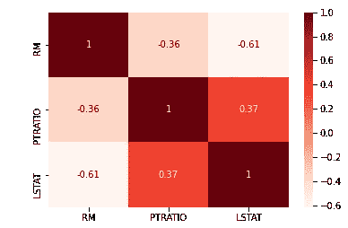
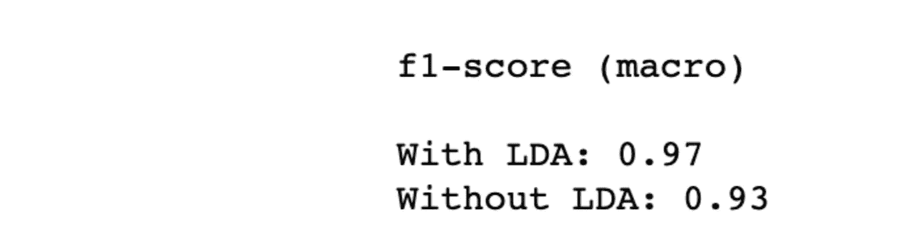
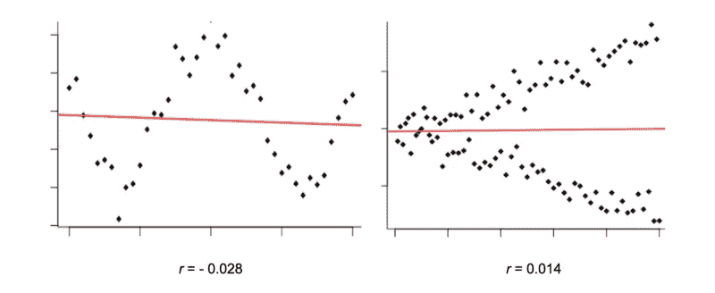

# 特征选择:过滤方法

> 原文：<https://medium.com/analytics-vidhya/feature-selection-73bc12a9b39e?source=collection_archive---------5----------------------->

## 权威指南

## 4 种基于过滤器的方法来选择相关特征


照片由[法鲁尔·阿兹米](https://unsplash.com/@fahrulazmi)拍摄

## 目录

*   [什么，什么时候&为什么](#bf65)
*   [滤波方法](#1a92)
    - [皮尔逊相关](#f29a)
    -[LDA](#6ba8)-
    -[ANOVA](#1ce6)
    -[卡方](#dd6f)
*   非线性关系呢？
*   [PCA 不是特征选择](#3260)
*   [功能选择#不](#16d4)

特征选择是面试时非常受欢迎的问题；不考虑 ML 域。这篇文章是关于特性选择的博客系列的一部分。看看 Wrapper([*part 2*](/analytics-vidhya/feature-selection-85539d6a2a88)*)和 Embedded(*[*part 3*](https://tzinie.medium.com/feature-selection-embedded-methods-a7940036973f)*)方法。*

# 什么，什么时候，为什么

你熟悉[鸢尾花数据集](https://en.wikipedia.org/wiki/Iris_flower_data_set)吗？即使是现存的最简单的算法也能产生如此美妙的结果，这难道不令人惊讶吗？

嗯…很抱歉让你失望了，但这是不现实的。大多数情况下，特征的数量(p)比样本的数量(N)多得多(p > > N)——这也被称为 [*维数灾难*](https://towardsdatascience.com/the-curse-of-dimensionality-minus-the-curse-of-jargon-520da109fc87) *。但是，为什么这是一个问题呢？*

高维数据可能导致以下情况:

*   训练时间长
*   过度拟合

即使 p>>N 不是这样，也有一长串的机器学习算法做出了自变量的假设。应用特征选择方法将移除相关特征。此外，将特征空间的维度减少到相关特征的子集将降低训练的计算成本，并且可以提高模型的泛化性能。

**特征选择**是从数据集中移除不相关和冗余特征的过程。反过来，模型的复杂性将会降低，从而更容易解释。

> “有时候，越少越好！”
> 
> —罗汉·拉奥

# **过滤方法**


基于特征与目标变量的关系来选择特征的子集。该选择不依赖于任何机器学习算法。相反，过滤方法通过统计测试测量特征与输出的*【相关性】*。可以参考下表:



## 皮尔逊相关

衡量两个连续变量之间线性相关性的统计量。它从-1 到+1 不等，其中+1 对应正线性相关，0 对应无线性相关，1 对应负线性相关。



皮松河

**数据集**:波士顿房价[数据集](https://scikit-learn.org/stable/modules/generated/sklearn.datasets.load_boston.html)。它包括 13 个连续特征和以千美元为单位的自有住房中值(目标变量)。



```
import pandas as pd
import matplotlib.pyplot as plt
import seaborn as sns
from sklearn.datasets import load_bostonX, y = load_boston(return_X_y=**True**)
feature_names = load_boston().feature_namesdata = pd.DataFrame(X, columns=feature_names)
data['MEDV'] = y# compute pearson's r
target_correlation = data.corr()[['MEDV']]# we only care about the target variable
plt.figure(figsize=(7,5))
sns.heatmap(target_correlation, annot=True, cmap=plt.cm.Reds)
plt.show()
```



```
# extract the most correlated features with the output variable
target_correlation[abs(target_correlation)>0.5].dropna()
```

**相关性**系数的幅度在 **0.5** 和 0.7 之间，表示可以认为是中度相关的变量，因此我们将阈值设置为 0.5。



在 13 个特征中，只有 3 个与目标高度相关(*相关特征*)；RM、PTRATIO 和 LSTAT。然而，我们只检查了每个特性与输出变量的相关性。由于许多算法，如线性回归，假设输入特征是不相关的，我们必须计算前 3 个特征之间的皮尔逊 r。

```
sns.heatmap(data.corr().loc[['RM', 'PTRATIO', 'LSTAT'], ['RM', 'PTRATIO', 'LSTAT']], annot=True, cmap=plt.cm.Reds)
plt.show()
```



RM 和 LSTAT 相互关联，因此我们选择其中之一(删除 ie RM 相当于删除*冗余特征*)。因为 LSTAT 与目标变量 MEDV 之间的相关性高于与 RM 之间的相关性，所以我们选择 LSTAT。

## 皱胃向左移

线性判别分析是一种受监督的线性算法，它将数据投影到一个更小的子空间 k (k < N-1) while maximising the separation between the classes. More specifically, the model finds linear combinations of the features that achieve maximum separability between the classes and minimum variance within each class.

**数据集** : [乳腺癌威斯康星(诊断)数据集](https://www.kaggle.com/uciml/breast-cancer-wisconsin-data)，其中包括 569 条记录，每条记录由 30 个特征描述。任务是将肿瘤分类为恶性或良性。

```
import pandas as pd
from sklearn.linear_model import LogisticRegression
from sklearn.preprocessing import LabelEncoder
from sklearn.discriminant_analysis import LinearDiscriminantAnalysis
from sklearn.model_selection import StratifiedKFold, cross_val_score
from sklearn.pipeline import Pipelinedf = pd.read_csv('breast_cancer.csv').iloc[:,1:-1]
X = df.drop(['diagnosis'], axis=1)le = LabelEncoder()
y = le.fit_transform(df.diagnosis)
labels = le.classes_steps = [('lda', LinearDiscriminantAnalysis()), ('m', LogisticRegression(C=10))]
model = Pipeline(steps=steps)# evaluate model
cv = StratifiedKFold(n_splits=5)
n_scores_lda = cross_val_score(model, X, y, scoring='f1_macro', cv=cv, n_jobs=-1)model = LogisticRegression(C=10)
n_scores = cross_val_score(model, X, y, scoring='f1_macro', cv=cv, n_jobs=-1)# report performance
print('f1-score (macro)\n')
print('With LDA: %.2f' % np.mean(n_scores_lda))
print('Without LDA: %.2f' % np.mean(n_scores))
```



使用 LDA 作为预处理步骤，性能提高了 4%。

## 方差分析

方差分析是一种统计方法，它检验不同的输入类别对于输出变量是否有显著不同的值。`sklearn`中的`f_classif`方法允许对多组数据进行分析，以确定样本之间和样本内部的可变性，从而获得关于因变量和自变量之间关系的信息([了解更多](http://www.mit.edu/~6.s085/notes/lecture6.pdf))。例如，我们可能想测试两个过程，看哪一个在收益方面比另一个执行得更好。

```
from sklearn.feature_selection import f_classif, SelectKBestfs = SelectKBest(score_func=f_classif, k=5)

X_new = fs.fit(X, y)
```

> 注意:之前，我们只是设置 k=5。如果不是 5，是 4 呢？我们可以通过使用 k-fold 交叉验证执行网格搜索来微调所选特征的数量

```
from sklearn.model_selection import StratifiedKFold, GridSearch
from sklearn.pipeline import Pipeline
from sklearn.linear_model import LinearRegressioncv = StratifiedKFold(n_splits=5)pipeline = Pipeline(steps=[('anova',fs), ('lr', LinearRegression(solver='liblinear'))])
params = {['anova__k']: [i+1 for i in range(X.shape[1])]}search = GridSearchCV(pipeline, params, scoring='accuracy', n_jobs=-1, cv=cv)results = search.fit(X, y)
print('Best k: %s' % results.best_params_)
```

## χ²

卡方检验使用频率分布来检验特定特征和特定类的出现是否独立。无效假设是这两个变量是独立的。然而，较大的χ值表明应该拒绝零假设。在选择特征时，我们希望提取那些高度依赖于输出的特征。

**数据集** : [梦想房屋融资](https://www.kaggle.com/burak3ergun/loan-data-set)一家公司经营所有房屋贷款，希望自动化贷款资格流程。该数据集包含 11 个描述客户特征的分类和数字特征。目标变量是二元的——客户是否有资格获得贷款。

```
from sklearn.feature_selection import chi2, SelectKBestloan = pd.read_csv('loan_data_set.csv')
loan = loan.drop('Loan_ID', axis=1) # irrelevant feature#Transform the numerical feature into categorical feature
loan['Loan_Amount_Term'] = loan['Loan_Amount_Term'].astype('object')
loan['Credit_History'] = loan['Credit_History'].astype('object')#Dropping all the null value
loan.dropna(inplace = True)#Retrieve all the categorical columns except the target
categorical_columns = loan.select_dtypes(exclude='number').drop('Loan_Status', axis=1).columnsX = loan[categorical_columns].apply(LabelEncoder().fit_transform)
y = LabelEncoder().fit_transform(loan['Loan_Status'])fs = SelectKBest(score_func=chi2, k=5)
X_kbest = fs.fit_transform(X, y)
```

## 非线性关系呢？



[来源](https://www.freecodecamp.org/news/how-machines-make-predictions-finding-correlations-in-complex-data-dfd9f0d87889/)

到目前为止，我们一直在讨论假设两个元素 X，y 之间存在线性关系的方法。这些方法无法捕捉除此之外的任何关系。为了解决这个问题，我们可以看一下特征和目标变量之间的**互信息***(MI)*。MI 的范围从 0(无互信息)到 1(完全相关)。Sklearn 提供了回归和分类任务的实现。**

```
**from sklearn.feature_selection import mutual_info_regression, mutual_info_classif, SelectKBestfs = SelectKBest(score_func=mutual_info_classif, k=5) # top 5 features
X_subset = fs.fit_transform(X, y)**
```

**你可以在这里阅读更多关于捕捉两个变量之间非线性关系的其他方法[。](https://www.freecodecamp.org/news/how-machines-make-predictions-finding-correlations-in-complex-data-dfd9f0d87889/)**

## **可以用主成分分析吗？**

****

**[来源](https://stats.stackexchange.com/questions/2691/making-sense-of-principal-component-analysis-eigenvectors-eigenvalues)**

**你当然可以。但是请不要混淆特征提取和特征选择。PCA 是一种**无监督** **线性变换技术**。这是另一种降低维度的方法，但要小心，在这种方法中，我们不选择特征，而是通过将数据投影到一个低维空间来转换特征空间，同时保持最大方差。该技术产生不相关的变量(主成分),它们是旧变量的线性组合。不幸的是，您并不真正知道这些新特性代表了什么，所以尽管您在降维方面有所收获，但在可解释性方面肯定会有所损失。**

> **注意:不要犯年轻 ML 从业者常犯的一个最常见的错误:对非连续特征应用 PCA。我知道当你对离散变量运行 PCA 时，代码不会中断，但这并不意味着你应该中断([简短解释](https://stackoverflow.com/questions/40795141/pca-for-categorical-features))。**

## **功能选择#否**

****

**[来源](http://giphy.com)**

**虽然我们已经看到了很多进行特征选择的方法(还有更多；查 blog2，blog3)，总有答案****我不会做*** *。我知道这听起来可能很奇怪，尤其是当它来自这篇文章的作者时，但我需要给出所有可能的答案，这是其中之一。****

**特性选择需要时间，你可以考虑不投入时间和精力。你必须永远记住两件事:1。您将丢失信息，因为您正在删除特征和 2。即使您尝试了所有的技术，也可能看不到模型性能的重大改进。**