# 特征选择:包装方法

> 原文：<https://medium.com/analytics-vidhya/feature-selection-85539d6a2a88?source=collection_archive---------4----------------------->

## 权威指南

## 5 基于包装器的方法来选择相关特性


马里乌斯·马萨拉尔在 [Unsplash](https://unsplash.com?utm_source=medium&utm_medium=referral) 上的照片

## 目录

*   [包装方法](#8fe7)
*   [正向选择](#ad20)
*   [落后淘汰](#e920)
*   [博鲁塔](#dedb)
*   [遗传算法](#e676)

*这篇文章是关于特性选择的博客系列的第二部分。看看过滤(*[*part 1*](https://tzinie.medium.com/feature-selection-73bc12a9b39e)*)和嵌入(*[*part 3*](https://tzinie.medium.com/feature-selection-embedded-methods-a7940036973f)*)的方法。*

# 包装方法


流程图

在第 1 部分中，我们讨论了过滤方法，它帮助你选择与目标变量相关的特征。然而，我觉得我们遗漏了一些东西…哦，对了，实际的机器学习算法！

这实际上是 Filter 和 Wrapper 方法之间的核心区别之一。后者通过实际训练一个模型来测量特征子集的重要性。

整个想法建立在*贪婪搜索*和*评估标准*之上。*贪婪*因为该方法在每次迭代中选择局部最优的特征子集。然后，*评价标准*起到评判的作用。它实际上是我们在训练模型时使用的性能指标。我们都知道这完全取决于任务。对于*回归*，可以是 p 值或 R 平方，而对于*分类*，可以是精度或 f1 分。最后，根据*评估标准，*将选择给出最佳结果的特征组合。

## 选择最佳模型

我们需要一种方法来找到给定评估标准的最佳模型。为此，我们需要将注意力转向测试误差。众所周知，训练误差可能是对测试误差的不良估计，因此，我们关注**交叉验证**(CV)；一种估计测试误差的有效方法。

对于每种方法，我们使用 [**信用卡欺诈检测数据集**](https://www.kaggle.com/mlg-ulb/creditcardfraud) **:** 该数据集包含信用卡进行的交易；它们被贴上欺诈或真实的标签。数据集包括 30 个特征，它们是主成分分析的结果。由于保密问题，不提供原始功能。这是一个数据集非常不平衡的分类任务，因此，我将使用`f1-score (macro avg)`作为评估指标。

# **正向选择**

我们有一个*零模型*(一个没有预测器的模型)作为起点。第一轮我们用 k 倍 CV 30 型号训练(为什么是 30？因为我们有 30 个特征/变量)。然后，我们将变量添加到给出最低测试误差的空模型中。在第二轮中，我们重复同样的想法拟合 29 个模型，并将第二个变量添加到单变量模型中，从而得到一个双变量模型。这种方法一直持续到拟合没有统计上的显著改善为止(*停止标准*)。

```
import pandas as pd
from mlxtend.feature_selection import SequentialFeatureSelector
from sklearn.linear_model import LogisticRegression
from sklearn.model_selection import StratifiedKFold, train_test_splitcredit = pd.read_csv('creditcard.csv')
X = credit.loc[:, credit.columns != 'Class']
y = credit['Class']X_train, X_test, y_train, y_test = train_test_split(X, 
                                                    y, 
                                                    test_size=0.2,
                                                    stratify=y,
                                                    random_state=42)scv = StratifiedKFold(n_splits=5)# create the SequentialFeatureSelector object
sfs = SequentialFeatureSelector(LogisticRegression(C=10,
max_iter=10000), k_features=8, 
                 forward=True, 
                 floating=False,
                 verbose=2,               
                 scoring='f1_macro',
                 cv=scv,
                 n_jobs=-1)# fit the object to the training data
sfs = sfs.fit(X, y)selected_features = wine.columns[list(sfs.k_feature_idx_)]
print(selected_features)
```

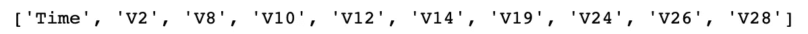

选定的功能

我们现在使用这些特征来训练模型:

```
# Build full model with selected features
clf = LogisticRegression(C=10, max_iter=10000)
clf.fit(X_train[:, feat_cols], y_train)y_test_pred = clf.predict(X_test[:, feat_cols])
print(classification_report(y_test, preds))
```

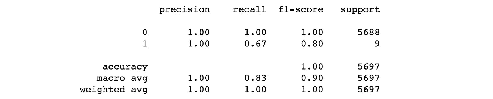

分类报告；空军上士

# 反向消除

也被称为*递归特征消除*。这种方法与前一种方法相反。我们从所有变量入手，一次去掉一个变量，这是最不重要的。代码完全相同，但有一点不同；我们需要在`SequentialFeatureSelector`中将参数`forward`改为 False。

当我们在这个子集上训练时，这些是最重要的特征和分类报告:

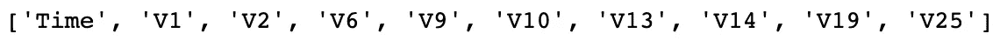

选定的功能

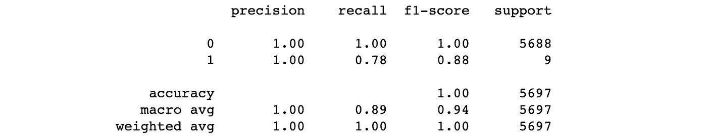

分类报告；存在

## 向前与向后

如果特征数量>样本数量，则不能使用向后消除，而总是可以使用向前选择。主要原因是因为在这种情况下，可约误差和不可约误差的大小变为零。然而，这是不可能的，因为这意味着你对数据有一个完美的拟合。所以，实际上发生的是你过度适应了。这不是向前选择的问题，因为您开始时没有特征，然后一次连续添加一个特征。

另一方面，前向选择是一种贪婪的方法，可能会在早期包含后来变得多余的变量。

# 博鲁塔

[算法](https://github.com/scikit-learn-contrib/boruta_py)非常有趣，如果你问我，我认为它非常聪明。到目前为止，包装器方法的整体思想是特性在最终子集中相互竞争位置。相反，在博鲁塔**中，这些特征与随机版本的自身** *(阴影特征)*竞争。**仅当一个特性的表现优于最佳表现的随机特性**时，才选择该特性。

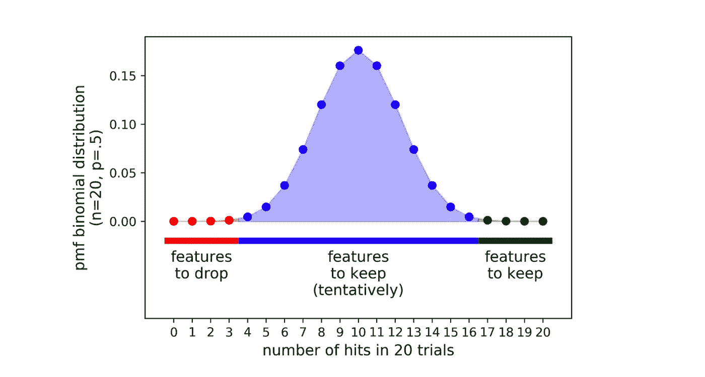

[来源](https://towardsdatascience.com/boruta-explained-the-way-i-wish-someone-explained-it-to-me-4489d70e154a)

该过程重复 N 次(试验次数),最后一步是使用二项式分布比较特征优于其阴影特征的次数。对于蓝色区域的特征，Boruta 算法是不确定的，而绿色和红色区域的特征应该分别被选择和消除。你可以在这里阅读更多信息[。](https://www.datacamp.com/community/tutorials/feature-selection-R-boruta)

```
import pandas as pd
from boruta import BorutaPy
from mlxtend.feature_selection import SequentialFeatureSelector
from sklearn.ensemble import RandomForestClassifier
from sklearn.model_selection import StratifiedKFold, train_test_splitcredit = pd.read_csv('creditcard.csv')
X = credit.loc[:, credit.columns != 'Class']
y = credit['Class']X_train, X_test, y_train, y_test = train_test_split(X, 
                                                    y, 
                                                    test_size=0.2,
                                                    stratify=y,
                                                    random_state=42)clf = RandomForestClassifier(n_estimators=200, class_weight='balanced', max_depth=4, n_jobs=-1)boruta = BorutaPy(estimator = clf, n_estimators = 'auto', max_iter = 100) # number of trials to performboruta.fit(X_train.to_numpy(), y_train)green_area = X.columns[boruta.support_].to_list()
blue_area = X.columns[boruta.support_weak_].to_list()
print('Green area:', green_area)
print('Blue area:', blue_area)
```

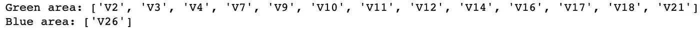

选定的功能

```
clf = RandomForestClassifier(n_estimators=200, class_weight='balanced', max_depth=4, n_jobs=-1)
clf.fit(X_train[green_area].to_numpy(), y_train)
preds = clf.predict(X_test[green_area].to_numpy())
print(classification_report(y_test, preds))
```

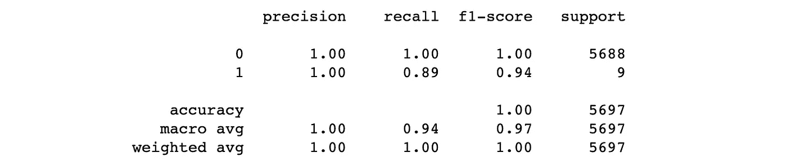

分类报告；博鲁塔

> 注意:Boruta 需要一个具有属性`feature_importances_`的分类器或回归器

# 遗传算法

更高级的方法，但在我看来非常有趣。进化算法这个术语听起来耳熟吗？如果是，那么你已经知道这是怎么回事了，如果不是读[这个](https://towardsdatascience.com/introduction-to-evolutionary-algorithms-a8594b484ac)。长话短说，科学家从遗传学和自然选择中获得灵感，提出了进化算法，从种群中确定最适合的个体。有 5 个阶段:

## 初始化

以随机方式创建一个解决方案群体——任意数量的不同特征子集，即 n 个，但它看起来像什么呢？它只是一个 dim =特征数量的二元向量。1 表示特性存在，0 表示不存在。例如，向量`[1,0,0,1]`指示我们总共有 4 个特征，并且该群体成员是特征 0 和 3 的子集。

## 健身任务

现在是时候评估我们人口中的每个成员了。为此，我们训练 N 个模型，每个模型都有一个来自总体的成员，并计算误差。如果误差大，则适合度低。对单个 N 模型的所有误差进行排序，但是**适应值完全取决于个体在等级中的位置，而不是误差**。
适应值:`Φ(i) = k•R(i)`，k 是属于[1，2]中的常数，R(i)是个体 I 的秩，误差越小，秩越高，所以适应值越大。

## 选拔过程

我们如何选择？*轮盘赌*或最不好玩的名字随机抽样与替换。这种方法将群体中的所有成员放在轮盘赌上，轮盘赌的面积与他们的适应度成比例。然后我们通过“转动轮盘”随机选择一半的人口。

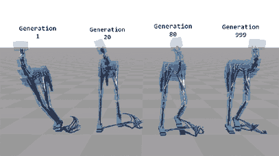

[选举过程](https://towardsdatascience.com/introduction-to-evolutionary-algorithms-a8594b484ac)

## 交叉操作

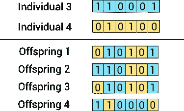

在这一步中，我们随机选择 2 个成员，结合他们的特征，为新的种群获得 4 个后代。然后，我们与其他 2 名成员重复，以此类推。我们什么时候停止？当我们产生和第一步一样多的人口时。

## 变异操作

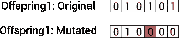

这一步是因为后者而存在的。在杂交过程中，很有可能产生与其祖先非常相似的后代，这**导致了低多样性**。因此，我们通过随机改变后代某些特征的值来变异后代。

你不断重复，直到下一代与上一代没有明显的不同。然后选择产生最低错误的成员。

```
import pandas as pd
from genetic_selection import GeneticSelectionCV
from sklearn.linear_model import LogisticRegression
from sklearn.model_selection import StratifiedKFold, train_test_splitcredit = pd.read_csv('creditcard.csv')
X = credit.loc[:, credit.columns != 'Class']
y = credit['Class']X_train, X_test, y_train, y_test = train_test_split(X, 
                                                    y, 
                                                    test_size=0.2,
                                                    stratify=y,
                                                    random_state=42)scv = StratifiedKFold(n_splits=5)selector = GeneticSelectionCV(LogisticRegression(C=10, max_iter=10000, random_state=42),
                              cv=scv,
                              verbose=2,
                              scoring="f1_macro",
                              max_features=5,
                              n_population=50,
                              crossover_proba=0.5,
                              mutation_proba=0.2,
                              n_generations=40,
                              crossover_independent_proba=0.5,
                              mutation_independent_proba=0.05,
                              tournament_size=3,
                              n_gen_no_change=10,
                              caching=True,
                              n_jobs=-1)selector = selector.fit(X_train, y_train)# get the selected features
cols = X.columns.tolist()
selected_feats = [cols[i] for i in np.where(selector.support_)[0]]# train and test
clf = LogisticRegression(C=10, max_iter=10000, random_state=42)
clf.fit(X_train[selected_feats], y_train)preds = clf.predict(X_test[selected_feats])
print(classification_report(y_test, preds))
```


选定的功能

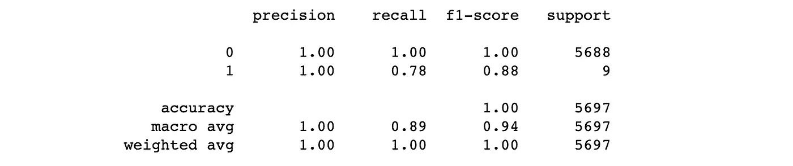

分类报告；通用航空

如果我们什么都不做，会发生什么？如果我们不删除任何功能…

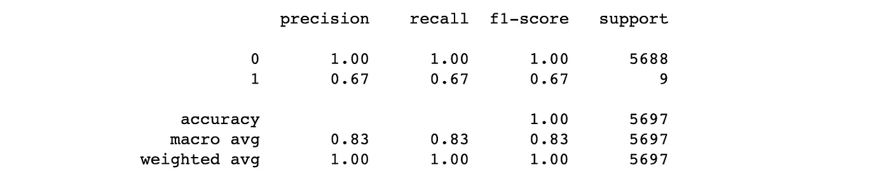

分类报告；无特征选择

显然，通过使用上述任何一种方法，我们在 f1 得分(宏观平均值)上获得了 7–14%的收益。

# 结论

包装器方法基于其有用性来测量特征的重要性，同时在其上训练机器学习模型。另一方面，[过滤方法](/analytics-vidhya/feature-selection-73bc12a9b39e)根据与目标变量的关系选择特征。不幸的是，没有现成的方法可循。您可能希望使用筛选方法，因为它们的计算成本较低，或者是筛选和包装方法的组合；又称*混合特征选择*。首先，使用过滤方法消除冗余特征，然后使用包装方法选择有用的子集。然而，这一切都归结于数据；这将决定你的方法。