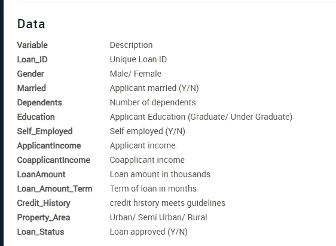
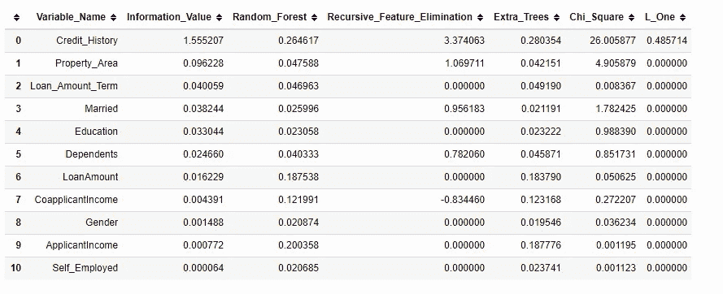
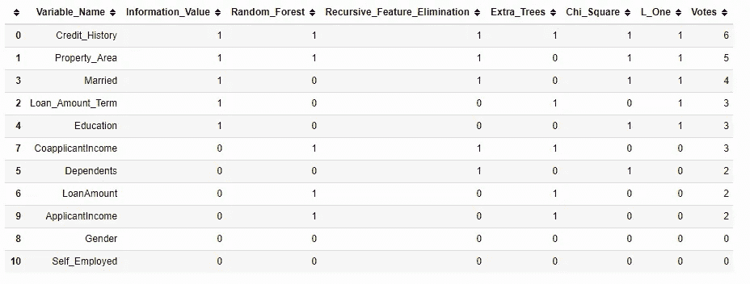

# 利用投票方法进行特征选择

> 原文：<https://medium.com/analytics-vidhya/feature-selection-by-using-voting-approach-e0d1c7182a21?source=collection_archive---------5----------------------->

## 如何应用多种技术来选择 Xverse 包的特性？


特征选择是自动或手动选择对您感兴趣的预测变量或输出贡献最大的那些特征的过程。
一个主要原因是，机器学习遵循 ***【垃圾进垃圾出】*** 的规则，这就是为什么你需要非常关注输入模型的特征。

在你的数据中有不相关的特征既可以增加建模的计算成本 ***降低模型的******精度*** 又可以让你的模型基于不相关的特征进行学习。这意味着您只需选择 ***重要特征*** 在模型训练期间展示。

**应用功能选择的主要原因有:**

*   它使机器学习算法能够更快地训练。
*   它降低了模型的复杂性，使其更容易解释。
*   如果选择了正确的子集，就可以提高模型的准确性。
*   它减少了过度拟合。

> “我通过选择所有特征准备了一个模型，我得到了大约 65%的精确度，这对于一个预测模型来说不是很好，在做了一些特征选择和特征工程后，没有对我的模型代码做任何逻辑更改，我的精确度跃升到了 81 %,这是非常令人印象深刻的。”Raheel Shaikh

**特征选择方法**旨在减少特征数量，使其被认为对模型最有用/最重要，从而预测目标特征。有不同的功能选择方法可以帮助您选择重要的功能。最流行的方法是。

*   [皮尔逊相关系数](https://scikit-learn.org/stable/modules/generated/sklearn.feature_selection.f_regression.html)。
*   斯皮尔曼等级系数。
*   [方差分析相关系数。](https://scikit-learn.org/stable/modules/generated/sklearn.feature_selection.f_classif.html)
*   [卡方检验。](https://scikit-learn.org/stable/modules/generated/sklearn.feature_selection.chi2.html)
*   机器学习算法(随机森林和额外树)。
*   [相互信息。](https://thuijskens.github.io/2017/10/07/feature-selection/)
*   热图相关矩阵。

你可以从 [Scikit 学习库](https://scikit-learn.org/stable/modules/feature_selection.html)阅读更多关于特征选择方法的内容。

这些方法的挑战之一是**确定**应该在数据集中应用哪种方法来选择重要的特征。每种方法都有自己识别重要特征的方式。例如，某个特征可以在一种方法中被选为重要特征，而在另一种方法中不被选为重要特征。

Xverse 包可以帮你解决这个问题。

> “最终，一些机器学习项目会成功，一些会失败。有什么区别？最重要的因素无疑是所使用的功能。”佩德罗·多明戈斯

# Xverse 是什么？

Xverse 代表 X Universe，它是用于机器学习的 python 包，用于帮助数据科学家进行特征转换和特征选择。Xverse 是由 [Sundar Krishnan](https://twitter.com/MSundarKrishnan) 创作的。

## 它是如何工作的？

Xverse 应用各种技术来选择特性。当一个算法选择一个特征时，它会为这个特征投票。最后，Xverse 会计算每个功能的总票数，然后根据投票选出最佳功能。这样，我们最终在特征选择过程中以最小的努力挑选出最佳变量。


Xverse 使用以下方法来选择重要的特性。

*   使用证据权重的信息价值。
*   使用随机森林的可变重要性。
*   递归特征消除。
*   使用额外树分类器的可变重要性。
*   卡方最佳变量。
*   基于 L1 的特征选择。

## 装置

封装需要`numpy, pandas, scikit-learn, scipy`和`statsmodels`。此外，该包在 Python 版本 3.5 及更高版本上进行了测试。

运行以下命令来安装 Xverse。

```
pip install xverse
```

我将使用贷款数据集来寻找最佳特征，这些特征有助于在预测客户是否应该获得贷款时获得良好的准确性。你可以点击下载数据集[。](https://github.com/Davisy/Feature-Selection-by-using-Voting-Approach/blob/master/data/loans_data.csv)

为此问题导入重要包。

加载贷款数据集。

```
Loan_ID
Gender
Married
Dependents
Education
Self_Employed
ApplicantIncome
CoapplicantIncome
LoanAmount
Loan_Amount_Term
Credit_History
Property_Area
Loan_Status
```

我们有 12 个独立的特性和一个目标(Loan_Status)。你可以在这里阅读每个特性的描述。



特征定义

我创建了一个简单的 python 函数来处理缺失数据和特征工程。

让我们对贷款数据集进行预处理。

```
data = prepocessing(data)
```

分割成独立的特征和目标。

现在是时候从 Xverse 调用 VotingSelector，并训练它使用投票方法找到最佳特性。

我已经设置了 *minimum_votes= 2* ，这意味着要选择的特性必须从 Xverse 中呈现的六种特性选择方法中获得至少总共 *2 票*。总计 *2 票*以下的功能将被忽略。

在训练之后，我们可以看到在训练期间使用的每个特征选择方法中的特征重要性。



输出显示了每种方法中的所有特性及其重要性值。

现在我们来观察一下这些特征选择方法的投票情况。



输出显示了*变量名、特性选择方法列表及其投票*，最后显示了每个特性的总投票*。
首先显示投票数多的功能，然后显示投票数少或为零的功能。*

*可以看到***Credit_History***总共有 ***6 票，*** 也就是说 Credit _ History 对于这个贷款问题是一个非常重要的特征。但是 ***性别*** 和 ***个体户*** 特征都有 ***0 票、*** 这意味着我们可以忽略这两个特征，因为它们对预测客户是否应该获得贷款的贡献非常低。*

*现在，我们可以转换数据，只保留重要的选定要素。*

# ***结论***

*Xverse 正在积极开发中。目前，xverse 包只处理二进制目标。*

*这篇文章的代码可以在 [Github](https://github.com/Davisy/Feature-Selection-by-using-Voting-Approach) 上找到。*

*如果你学到了新的东西或者喜欢阅读这篇文章，请分享给其他人看。也可以随意发表评论。在那之前，下一篇文章再见！也可以通过 Twitter [@Davis_McDavid](https://twitter.com/Davis_McDavid) 找到我*