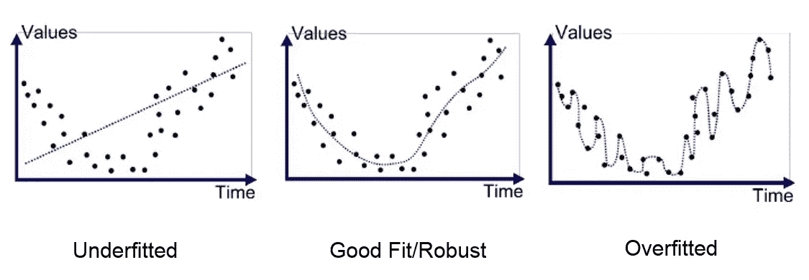
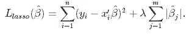
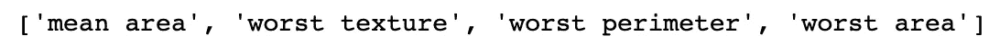
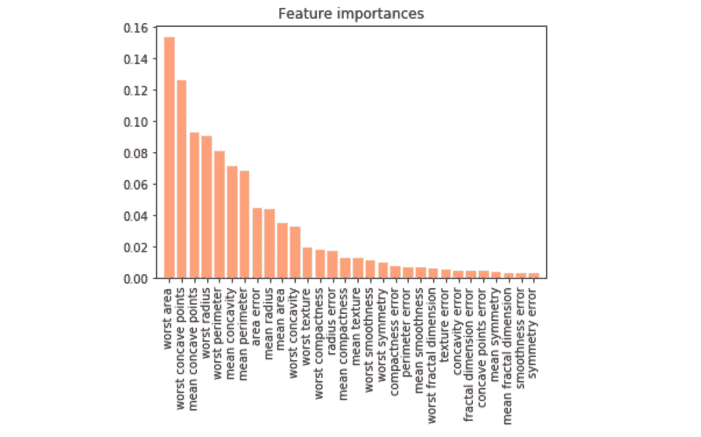
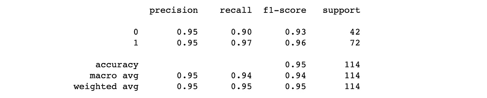
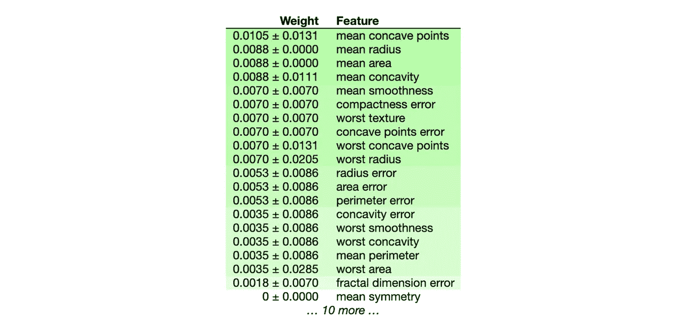

# 特征选择:嵌入式方法

> 原文：<https://medium.com/analytics-vidhya/feature-selection-embedded-methods-a7940036973f?source=collection_archive---------2----------------------->

## 权威指南

## 3 基于嵌入式方法选择相关特性


照片由[edu·格兰德](https://unsplash.com/@edgr?utm_source=medium&utm_medium=referral)在 [Unsplash](https://unsplash.com?utm_source=medium&utm_medium=referral) 上拍摄

## 目录

*   [嵌入方法](#e412)
*   [套索](#3998)
*   [功能重要性](#a430)
*   [结论](#bc99)

*这篇文章是关于特性选择的博客系列的第三部分，也是最后一部分。看看滤镜(*[*part 1*](https://tzinie.medium.com/feature-selection-73bc12a9b39e)*)和包装器(*[*part 2*](/analytics-vidhya/feature-selection-85539d6a2a88)*)的方法。*

# 嵌入式方法

嵌入式方法结合了过滤器和包装器方法的优点。如果您仔细研究这三种不同的方法，您可能会想知道包装方法和嵌入方法之间的核心区别是什么。

乍一看，两者都是基于机器学习模型的学习过程来选择特征。然而，包装方法基于评估度量反复考虑不重要的特征，而**嵌入式方法并行执行特征选择和算法训练**。换句话说，特征选择过程是分类/回归模型的组成部分。

包装器和过滤器方法是离散的过程，从某种意义上说，特征要么被保留，要么被丢弃。然而，这通常会导致较高的方差。另一方面，嵌入式方法更加连续，因此不会受到高可变性的影响。

# 套索

最小绝对收缩和选择算子(LASSO)是一种同时执行变量选择和正则化的*收缩*方法。我知道，这听起来很奇怪，但很快你就会意识到这只是 L1 正则化的线性回归。但是让我们一次做一件事，从 L1 正则化开始。

正则化是*将系数(权重)向零收缩*的过程。这到底是什么意思？这意味着你在惩罚更复杂的模型以避免过度拟合。



如果你没注意到，我们想要中间的那个。

但是这如何转化为特征选择呢？您可能听说过其他正则化技术，如岭回归或弹性网，但 LASSO 允许将系数设置为 0。如果系数为零，则不考虑该特征，因此，它在某种程度上被丢弃。

> 注:弹性网是套索和岭回归的结合。这意味着它还可以执行特征选择。岭回归不能做到这一点，因为它只允许系数非常接近零，但实际上永远不会为零。



套索目标:第一任期；RSS |第二学期；L1 常模

复杂度参数λ(λ)是非负的，并且控制收缩量。其值越大，收缩量越大，您构建的模型就越简单。当然，它的值是一个您应该调整的超参数。

> 惩罚的思想被用在许多算法中，包括神经网络；我们称之为*重量衰减*。

让我们看一个例子……我从 [sklearn](https://scikit-learn.org/stable/modules/generated/sklearn.datasets.load_breast_cancer.html) (二元分类任务)中选择了乳腺癌数据集。数据集中只有 569 个样本，因此，我们将对每个步骤进行分层交叉验证。

```
from sklearn.linear_model import LassoCV
from sklearn.datasets import load_breast_cancer
from sklearn.model_selection import StratifiedKFoldcancer = load_breast_cancer()X = cancer.data
y = cancer.targetskf = StratifiedKFold(n_splits=10
lasso = LassoCV(cv=skf, random_state=42).fit(X, y)print('Selected Features:', list(cancer.feature_names[np.where(lasso.coef_!=0)[0]]))
```



套索:选定的特征

```
lr = LogisticRegression(C=10, class_weight='balanced', max_iter=10000, random_state=42)
preds = cross_val_predict(lr, X[:, np.where(lasso.coef_!=0)[0]], y, cv=skf)
print(classification_report(y, preds))
```


分类报告；套索

# 特征重要性

*的特色重要性*有印象吗？

通过几行代码，我们真的可以得到特征空间的要点——提取有用的信息——从而得到一个更好、更易解释的模型。我们有两条路可以走；基于树的方法和排列重要性。

## 基于树的方法

决策树、RandomForest、ExtraTree、XGBoost 是可以用来获得特征重要性的一些基于树的方法。我最喜欢的是 RandomForest 和 Boosted Trees (XGBoost，LightGBM，CatBoost ),因为它们通过引入随机性来改善简单决策树的方差。

**但是怎么做呢？**

为了回答这个问题，我继续选择随机森林作为我的算法。随机森林使用**均值减少杂质** *(基尼指数)* 来估计一个特征的重要性。值越低，特性越重要。基尼指数的定义是:


基尼指数公式

其中第二项是样本`i`的每类概率的平方和。为使用特征`j`的树的每个节点测量特征`j`的基尼指数，并对集合中的所有树进行平均。如果到达该节点的所有样本都与单个类相链接，那么该节点可以被称为**纯**。点击阅读更多相关信息[。](https://towardsdatascience.com/gini-index-vs-information-entropy-7a7e4fed3fcb)

```
from sklearn.datasets import load_breast_cancer
from sklearn.model_selection import train_test_split
from sklearn.ensemble import RandomForestClassifier
from sklearn.feature_selection import SelectFromModel
import matplotlib.pyplot as pltcancer = load_breast_cancer()X = cancer.data
y = cancer.targetX_train, X_test, y_train, y_test = train_test_split(X, y, test_size=**0.2**, random_state=42, stratify=y)rf = RandomForestClassifier(n_estimators = 100, class_weight='balanced', random_state=42)
rf.fit(X_train, y_train)importances = rf.feature_importances_
indices = np.argsort(importances)[::-1]plt.figure()
plt.title("Feature importances")
plt.bar(range(X_train.shape[1]), importances[indices],
        color="lightsalmon", align="center")
plt.xticks(range(X_train.shape[1]), cancer.feature_names[indices], rotation=90)
plt.xlim([-1, X_train.shape[1]])
plt.show()
```



特征重要性；随机森林

当根据要素的重要性选择要素时，这可以很好地估计您想要设置的阈值。我选择 0.06，这导致 7 个特征。

```
sfm = SelectFromModel(rf, threshold=0.06)sfm.fit(X_train, y_train)X_important_train = sfm.transform(X_train)
X_important_test = sfm.transform(X_test)rf = RandomForestClassifier(n_estimators = 100, class_weight='balanced', random_state=42)rf.fit(X_important_train, y_train)
y_pred = rf.predict(X_important_test)print(classification_report(y_test, y_pred))
```



分类报告；随机森林

> 你可以简单地用`XGBClassifier()`替换`RandomForestClassifier()`，对任何提升树算法重复同样的操作

## 排列重要性

一个不太出名但仍然值得探索的想法。该方法改变一个特征的值，然后测量模型误差的增加。当且仅当洗牌导致增加时，该特征才是重要的。这些步骤如下:

1.  照常训练模型。估算误差:`L(y, f(X))`；`L`:丢失，`y`:真实目标向量，`f(X)`；估计目标向量。
2.  对于输入特征向量中的每个特征`j`，生成一个新的输入矩阵`X'`，其中特征`j`被置换——以断开特征`j`与目标变量`y`的关联。用新的输入矩阵再次估算误差:`L(y, f(X'))`。通过简单的操作计算重要性:`L(y, f(X'))-L(y, f(X))`。
3.  根据要素的重要性对其进行排序。

```
from sklearn.datasets import load_breast_cancer
from sklearn.model_selection import train_test_split
from sklearn.ensemble import RandomForestClassifierimport eli5
from eli5.sklearn import PermutationImportancecancer = load_breast_cancer()X = cancer.data
y = cancer.targetX_train, X_test, y_train, y_test = train_test_split(X, y, test_size=**0.2**, random_state=42, stratify=y)rf = RandomForestClassifier(n_estimators = 100, class_weight='balanced', random_state=42)
rf.fit(X_train, y_train)perm = PermutationImportance(rf, random_state=42).fit(X_test, y_test)eli5.show_weights(perm, features_names=cancer.feature_names)
```



我选择重要性高于 0.08 的特征。

```
rf = RandomForestClassifier(n_estimators = 100, class_weight='balanced', random_state=42)
preds= cross_val_predict(rf, X[:, np.where(perm.feature_importances_>=0.008)[0]], y, cv=skf)
print(classification_report(y, preds))
```


分类报告；排列重要性

这种方法很少用于选择特征，而是出于可解释性的原因。

如果我们不执行特征选择会发生什么？


分类报告；无特征选择

嗯🤔…好吧，性能方面没有明显优势。但是，请始终记住，每种方法都会导致更小的特征空间，从而导致更快的训练和更多可解释的模型。因此，虽然我们在性能上没有改进，但我们通过使用 4 个功能而不是 30 个功能获得了相同的结果！

# 结论

到本系列的结尾，我们可以得出结论，特性选择就是通过我们在不同文章中描述的过程，自动保持相关和有用的特性。我们从不同的角度研究特征选择任务；从统计学到机器学习方法。总的来说，它可以产生更好的模型，实现更高的性能和更好的可解释性。最后但并非最不重要的是，拥有一个特征子集使机器学习算法能够更快地训练。