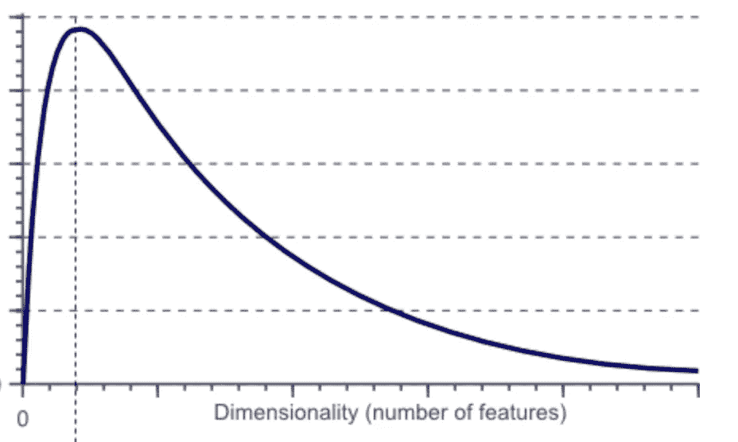

# 特征选择—(探索研究)

> 原文：<https://medium.com/analytics-vidhya/feature-selection-exploration-study-e4b11b9e0672?source=collection_archive---------16----------------------->

这些天来，世界上有一种炒作，如果一个人有更多的特征，那么我们在模型中就有更好的辨别能力，但这种假设不会在所有情况下都成立。实际上，当特性数量增加时，模型相对于特性数量的性能会降低，看起来像这样

在基于实例的学习方法(如 k-means)中，特征非常重要，在 k-means 的情况下，额外的特征将在距离计算中添加噪声。为了处理这个问题，我们应该在选择特征时避免不相关的特征，因为它们会给模型学习增加噪声。当我们的训练数据集有限时，这些额外的功能通常会影响性能。在数据科学领域，我们称之为**维数灾难**

> 简而言之，维数灾难是指当我们拥有大量训练特征的训练数据集和更多要学习的计算资源时。

解决这一大威胁的唯一办法是减少功能。有两种方法可以进行特征约简

1.  特征选择
2.  特征抽出

在本模块中，我们将探讨特征约简的特征选择方法。特征选择是我们必须从所有特征中选择特征集的方式，这样它将是更大特征集的子集。

特征约简集存在 2^n 可能性。如果 n 是特征集的大小。要开始此过程，您必须首先创建一个数据集，其中所有要素高度不相关。

**功能选择:**

做这个过程有两种方式存在:

1.  **向前选择:**在这里，我们将从空特性列表开始，我们将尝试每个特性组合，并选择最佳组合。
2.  **向后选择:**在这里，我们将从完整的功能列表开始，我们将尝试每个功能组合，并选择最佳组合。

到目前为止，我们正在处理这些特性的多种组合，并尝试优化模型。我们可以逐个使用特性，给它们打分，然后选择那些将清除截止点的特性，这些特性将是最佳解决方案/模型的最佳选择。

当我们尝试单项功能时，有许多方法可以给出分数，这将有助于选择最佳功能，这些功能是:

1.  皮尔逊相关系数
2.  f 分数
3.  卡方检验
4.  信噪比
5.  交互信息

这些方法将帮助你选择真正有用的功能。

我希望这一切能帮助你选择特征空间和建立最好的模型。