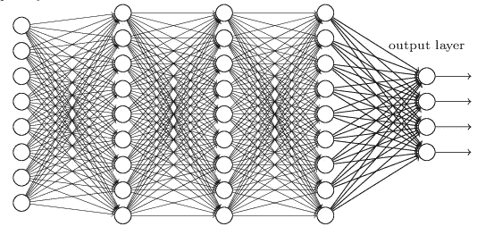
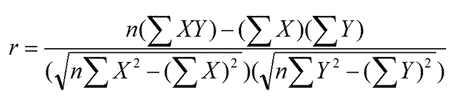
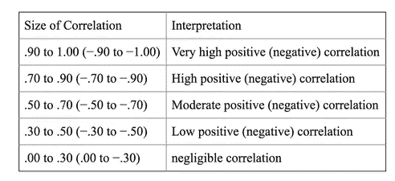
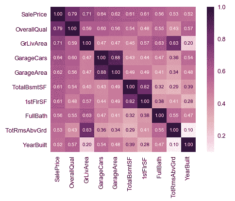
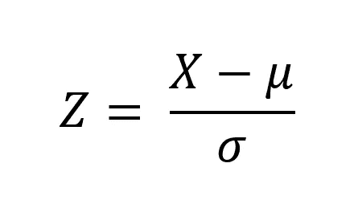
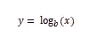
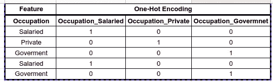
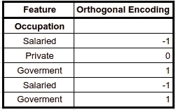

# 特征选择和特征工程

> 原文：<https://medium.com/analytics-vidhya/feature-selection-feature-engineering-3bb09c67d8c5?source=collection_archive---------5----------------------->

数据科学视角中的特征，也称为维度、独立变量、列。这些特征的选择和处理是任何机器学习模型构建的最重要的部分之一。各种方法可用于处理反过来直接影响准确度、召回率、精确度等的特征。一个机器学习模型。这里的想法是详细了解这些技术，以制作一个更好的模型。

# **功能选择**

特征选择基本上是在给定数据集上应用的方法，以从数据集中识别对因变量有高度影响的潜在或重要特征。特征选择的好处是优化数据集、降低内存消耗、提高模型性能等。

*   ***领域专长:*** 这是在领域或业务专家的帮助下，识别数据内重要变量的人工方法。在这里，领域专家可以对业务有一个粗略的了解，在这里分析师可以理解和识别重要的特性，或者如果分析师足够幸运的话，他们可以从领域专家那里得到构建模型所需的确切的重要特性。
*   ***缺失值:*** 缺失值的奇案。因此，无论哪个特征列包含超过 40%到 50%的缺失值，这些特征列都可以被直接删除，因为使用中心趋势定理的插补在这里没有帮助。其余特征将用于建模目的。
*   ***相关性*** :当独立特征彼此相关时，则出现共线性问题。简而言之，相关性扰乱了模型在训练时生成的权重的平衡。相关系数通过皮尔森的 r 公式计算:

皮尔逊相关系数

R 的范围在-1 到+1 之间，其中-1 表示完全负相关，0 表示不相关，+1 表示完全正相关。

相关系数解释

相关矩阵热图

*   ***多重共线性:*** 多重共线性是另一种形式的相关性，其中值位于负无穷大到正无穷大之间，这会严重影响回归模型系数的计算。这可以通过 VIF(变动通货膨胀系数)来检查，它可以解释为:

1 =不相关；1 至 5 =中度相关；> 5 =高度相关

*   ***零方差检查:*** 如果任何特征的方差为零，则需要删除这些特征，因为这些特征不允许模型对数据进行归纳，或者不提供自变量和因变量之间的任何关系。
*   ***特征派生:*** 特征可以从已有的特征中派生出来也称为特征拆分。例如，由时间&日期(dd/mm/yy hh:mm:ss)组成的列可以拆分为两个独立的特性，即日期和时间。同样，可以将两个特征组合起来生成一个新的单个特征，而不是两个特征。例如，一列包含售价&另一列包含成本价，因此可以通过组合这两个特征来生成一个称为利润的新特征，并且可以直接用于模型构建，而不是两个特征。

# **特色工程**

特征工程基本上是应用于特征的方法论，以特定的方式处理它们，其中特定的机器学习模型将能够消费它们。特征工程或特征处理有助于减少过拟合、欠拟合、权重优化等。

****

**归一化的最小-最大标量**

*   *****标准化:*** 这也是一种最常用的特征缩放技术，它以这样一种方式对数据进行标准化，即新生成的分布将具有**平均值 0** 和**标准偏差 1** 。标准化公式也称为 Z 得分公式，它将正态分布转换为标准正态分布。**

****

**z 分数**

***两种归一化&标准化都是特征缩放技术，但在选择其中一种时必须小心，因为归一化会受到异常值的影响，而标准化不受异常值的影响，被认为是分析行业内有利的缩放技术。***

*   *****日志转换:*** 这是另一种数据标准化的技术。它将数据带入一个特定的范围。这些变换通常用于偏态数据，其中较高的量级局限于中心。**

****

**对数变换**

*   *****特征编码:*** 特征编码是利用各种编码技术将分类特征转换成数值。分析行业中最常用的特征编码方法是一键编码、正交编码、虚拟编码等。**

****

**一键编码**

****

**正交编码**

*   *****主成分分析:*** 俗称 PCA 是一种用于降维的技术。它采用所有相关或不相关的特征，并生成称为主成分的新特征，这些主成分彼此正交或本质上不相关。只有当特征的数量更多时，才应该使用 PCA。**
*   *****数据插补:*** 列中缺失的值可以利用中心倾向定理进行插补。对于**数字**特征，可使用平均值和中值，而对于**分类**特征，可使用模式估算空值。除了这几个技术之外，其他技术也是可用的，如零填充、反向填充、正向填充等。**