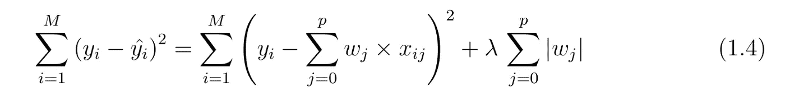
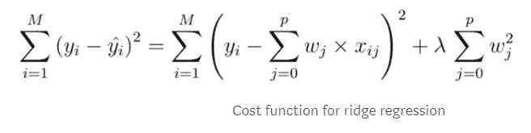
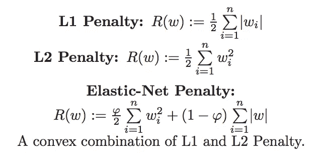

# 降维的特征选择(嵌入式方法)

> 原文：<https://medium.com/analytics-vidhya/feature-selection-for-dimensionality-reduction-embedded-method-e05c74014aa?source=collection_archive---------2----------------------->


在机器学习中选择数据中的重要特征是整个周期的重要部分。

传递带有不相关要素的数据可能会影响模型的性能，因为模型会学习传递给它的不相关要素。

# 特征选择的需要:

*   它有助于简化模型，使它们更容易和更快地训练。
*   减少培训次数。
*   帮助避免维度的[诅咒](https://en.wikipedia.org/wiki/Curse_of_dimensionality)，
*   通过减少[过拟合](/analytics-vidhya/over-fitted-and-under-fitted-models-f5c96e9ac581)(形式上，减少[方差](/analytics-vidhya/bias-variance-tradeoff-2b19a4926e7d))来增强通用性

# 特征选择方法

## 有三种一般的特征选择方法:

1.  [过滤方法](/analytics-vidhya/feature-selection-for-dimensionality-reduction-filter-method-201cc9eaa3b5)
2.  [包装方法](/analytics-vidhya/feature-selection-for-dimensionality-reduction-wrapper-method-9979fffd0166)
3.  嵌入式方法


# 嵌入式方法

1.  在**嵌入式方法**中，特征选择算法被集成为学习算法的一部分。
2.  嵌入式方法结合了过滤器和包装器方法的优点。
3.  它是由算法实现的，算法中有自己的特征选择方法。
4.  学习算法利用其自身的变量选择过程，同时执行特征选择和分类/回归。
5.  最常见的嵌入式技术是树算法，如 RandomForest、ExtraTree 等。
6.  树算法在树生长过程的每个递归步骤中选择一个特征，并将样本集分成更小的子集。子集中同一类中的子节点越多，特征的信息量就越大。
7.  其他嵌入方法是使用 L1 罚函数的套索和使用 L2 罚函数的岭来构建线性模型。这两种方法将许多特征缩小到零或几乎接近零。

## 嵌入式方法的优势:

*   它们像包装方法一样考虑了特性的交互。
*   它们像过滤方法一样更快。
*   它们比过滤方法更准确。
*   他们为被训练的算法找到特征子集。
*   他们更不容易过度拟合。

# 嵌入式方法的途径:

## 正规化方法:

正则化方法包括套索(L1 正则化)和岭(L2 正则化)以及弹性网(L1 和 L2)

**→拉索(L1 正则化)**

*   最小绝对收缩和选择算子(Lasso)是帮助对给定数据执行正则化和要素选择的强大方法之一。
*   它惩罚了模型中的β系数。
*   套索方法对模型参数值的总和进行限制。
*   总和必须小于特定的固定值。
*   这将一些系数缩小到零，表明某个预测值或某些特征将乘以零来估计目标。
*   在此过程中，收缩后具有非零系数的变量被选择作为模型的一部分。
*   它还向模型的成本函数添加了一个惩罚项，其中 lambda 值必须进行调整。

这就是套索如何帮助减少过度拟合造成的，以及在功能选择的帮助。



> 当(**λ**)λ为 0 时，方程被简化，这导致没有消除参数。
> 增加 **λ** 导致偏差增加，减少 **λ** 导致方差增加。

→ **山脊(L2 正则化)**

*   岭因β系数太大而对其不利，但是它不会将系数降低(缩小)到零，而是将系数降低到接近零。
*   它有助于降低模型的复杂性，并处理数据中的任何多重共线性。
*   当数据包含大量要素而其中只有少数要素实际上很重要时，岭并不可取，因为它可能会使模型更简单，但构建的模型精度会很差。
*   岭降低了模型的复杂性，但没有减少变量的数量，因为它不会导致系数为零，而只会使其最小化。因此，这种模型不适合特征约简。



→ **弹力网(L1 和 L2):**

Lasso 是一种用于高维数据变量选择的流行算法。但是，它有时会过度正则化数据。

因此，问题出现了:如果我们可以使用 L1 和 L2 正则化？
弹性网被引入作为这个问题的解决方案。

弹性网平衡套索和山脊惩罚。

Lasso 将消除特征，并减少线性模型中的过度拟合。岭将减少在预测目标值时不重要的特征的影响。

这是在超参数 alpha(α)的帮助下完成的。如果α变为 1，模型将变成套索，当α变为 0 时，模型将变成山脊。

为了调整超参数α，可以使用交叉验证。



> 这里的φ是α超参数

## 基于算法的方法:

*   这可以使用任何一种基于树的算法来完成，比如决策树、RandomForest 或 ExtraTree、XGBoost 等等。
*   分割发生在算法中的特征上，以找到正确的变量。
*   该算法尝试了所有要素的所有可能的分割方法，并选择了最能分割数据的方法。这基本上意味着它使用了包装器方法，因为所有可能的特性组合都被尝试过了，并且选出了最好的一个。
*   对于分类，分裂通常发生在基尼不纯或信息增益/熵，对于回归，分裂发生在方差的帮助下。
*   借助于这种方法，我们可以找到特征的重要性，并可以删除低于一定阈值的特征。

```
from sklearn.ensemble import RandomForestmodel = RandomForest().fit(x,y)important_features = pd.DataFrame((etr.feature_importances_*100), index = x.columns, columns=['importance']).sort_values('importance', ascending=**False**)#Same can be done with ExtraTree too.
```

*这些嵌入式方法有助于选择重要特征，以构建性能更好的模型。* **快乐学习！！！！**

喜欢我的文章？请为我鼓掌并分享它，因为这将增强我的信心。此外，我每周日都会发布新文章，所以请保持联系，以了解数据科学和机器学习基础系列的未来文章。

另外，请务必在 LinkedIn 上与我联系。


由[亚历克斯](https://unsplash.com/@alx_andru?utm_source=medium&utm_medium=referral)在 [Unsplash](https://unsplash.com?utm_source=medium&utm_medium=referral) 上拍摄的照片