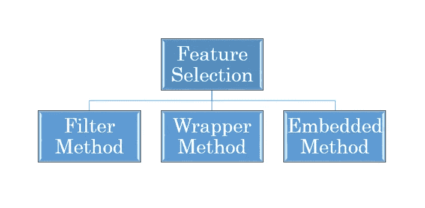
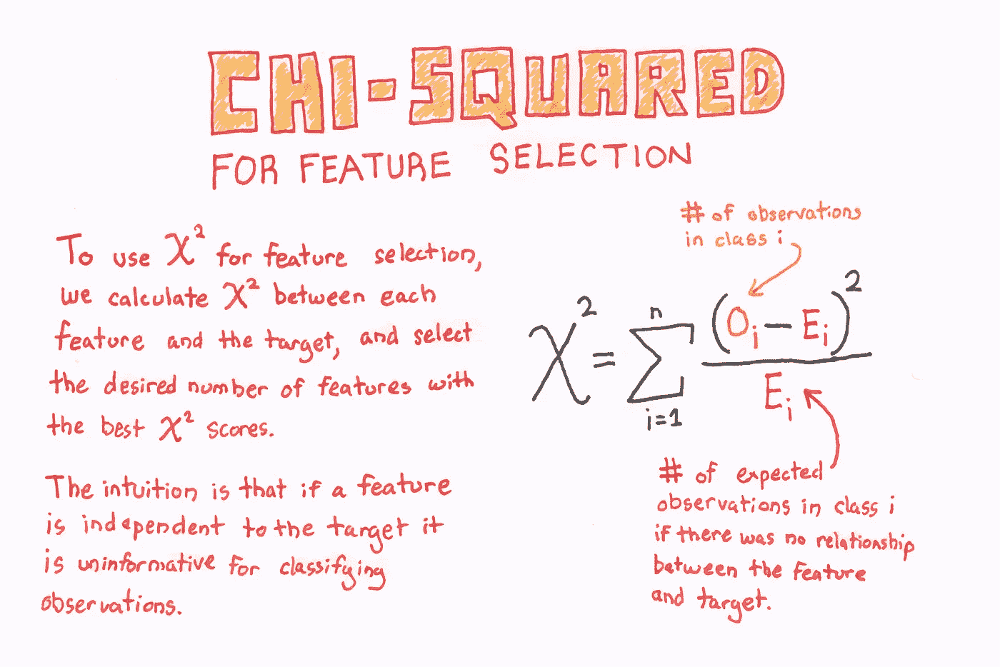
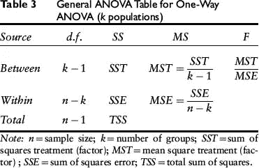
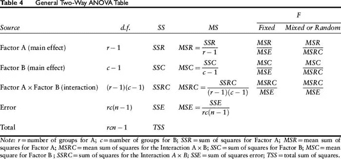

# 降维的特征选择(过滤方法)。

> 原文：<https://medium.com/analytics-vidhya/feature-selection-for-dimensionality-reduction-filter-method-201cc9eaa3b5?source=collection_archive---------7----------------------->

在机器学习中选择数据中的重要特征是整个周期的重要部分。

传递带有不相关要素的数据可能会影响模型的性能，因为模型会学习传递给它的不相关要素。

## 特征选择的需要:

*   它有助于简化模型，使它们更容易和更快地训练。
*   减少培训次数。
*   帮助避免维度的[诅咒](https://en.wikipedia.org/wiki/Curse_of_dimensionality)，
*   通过减少[过拟合](/analytics-vidhya/over-fitted-and-under-fitted-models-f5c96e9ac581)(形式上，减少[方差](/analytics-vidhya/bias-variance-tradeoff-2b19a4926e7d))来增强通用性

# 特征选择方法

## 有三种一般的特征选择方法:

1.  过滤方法
2.  [包装方法](/analytics-vidhya/feature-selection-for-dimensionality-reduction-wrapper-method-9979fffd0166)
3.  [嵌入方法](/@abhigyan.singh282/feature-selection-for-dimensionality-reduction-embedded-method-e05c74014aa)

# 过滤方法

1.  这种方法通常是在传递数据以构建模型之前的预处理步骤之一。
2.  执行各种统计测试，并根据得分选择特征。
3.  过滤方法不太精确，但计算速度更快。
4.  对于较大的数据集，最好使用过滤方法，因为计算速度更快。
5.  过滤方法有利于理论框架和理解数据的结构。

## 不同的方式有:

*   **相关法:**
    →用于衡量两个连续变量 X 和 y 之间的线性相关性
    →范围在-1 到 1 之间，其中值越接近 1 表示高度相关，值越接近-1 表示负相关。
    →相关性方法有助于识别哪些变量与另一个变量非常相似。
    →不同的相关方法包括:
    *皮尔逊相关系数。
    *斯皮尔曼相关系数。

> 皮尔逊和斯皮尔曼都是完全不同的测试。皮尔逊相关有助于发现变量之间的“线性关系”,而斯皮尔曼相关有助于发现变量之间的“单调关系”。
> 大多数情况下，皮尔逊相关是首选，然而，我喜欢测试皮尔逊和斯皮尔曼。如果 Spearman 检验结果大于 Pearson 检验结果，则表明变量之间表现出更多的单调关系而不是线性关系。

*   **卡方检验:
    →** *卡方检验*用于数据集中的分类特征。
    →我们计算每个特征和目标之间的卡方，并选择所需数量的具有最佳卡方得分的特征。
    →确定样本中两个分类变量之间的关联是否反映了它们在总体中的真实关联。

*   **Anova:
    →方差分析**是一种统计方法，用于检验两个或两个以上组之间存在显著差异的均值。假设假设为
    ** Null:所有组的均值相等。
    *备选:至少有一个组的平均值不同。* → 通过比较不同样本的均值来检查一个或多个因素的影响。
    → Anova 和 T-test 在只对两个样本进行测试时基本上执行相同的操作，但是，如果比较两个以上的样本，则使用 Anova，因为使用 T-test 会对错误率产生影响。
    →对两个以上的样本进行 T 检验将产生大约 15%的误差率，而使用方差分析将使误差率在 95%置信区间内保持在 5%。

> 置信区间是样本统计值所在的范围。

*   **方差膨胀因子(VIF):
    →** 方差膨胀因子(VIF)提供了多元回归模型中独立变量之间多重共线性的度量。
    →检测多重共线性很重要，因为虽然它不会降低模型的解释能力，但会降低独立变量的统计显著性。
    →独立变量上的大 VIF 表示与其他变量之间的高度共线关系，在模型结构和独立变量选择中应予以考虑或调整。
    → VIF 可以通过我们得到的值来解释:
    * 1 —显示非共线性
    * 1 到 5 —显示存在一定程度的共线性
    * > 5 —存在高度共线性
    →借助于确定系数(R 平方)值来确定。
    R 平方值[越高](/analytics-vidhya/r-squared-and-adjusted-r-squared-408aaca84fd5)越接近 1。

> 在这里，1-R2 也被称为宽容。

有许多**过滤方法**决定选择哪个特征。理解何时使用来自实践的东西。但是，我建议尝试不同的方法，看看哪种方法最有助于选择特性，而不会对模型的准确性产生太大的影响。上面给出的是一些基本方法，在学习其他方法之前，应该彻底理解它们。

下周将介绍特征选择的包装方法。

## 快乐学习！！！！

喜欢我的文章？请为我鼓掌并分享它，因为这将增强我的信心。此外，我每周日都会发布新文章，所以请保持联系，以了解数据科学和机器学习基础系列的未来文章。

另外，如果你想的话，可以在 linkedIn 上联系我。

[Alex](https://unsplash.com/@alx_andru?utm_source=medium&utm_medium=referral) 在 [Unsplash](https://unsplash.com?utm_source=medium&utm_medium=referral) 上的照片