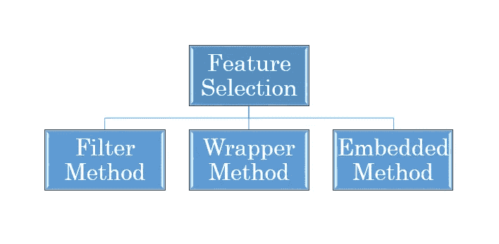

# 降维的特征选择(包装方法)

> 原文：<https://medium.com/analytics-vidhya/feature-selection-for-dimensionality-reduction-wrapper-method-9979fffd0166?source=collection_archive---------11----------------------->


在机器学习中选择数据中的重要特征是整个周期的重要部分。

传递带有不相关要素的数据可能会影响模型的性能，因为模型会学习传递给它的不相关要素。

# 特征选择的需要:

*   它有助于简化模型，使它们更容易和更快地训练。
*   减少培训次数。
*   帮助避免维度的[诅咒](https://en.wikipedia.org/wiki/Curse_of_dimensionality)，
*   通过减少[过拟合](/analytics-vidhya/over-fitted-and-under-fitted-models-f5c96e9ac581)(形式上，减少[方差](/analytics-vidhya/bias-variance-tradeoff-2b19a4926e7d))来增强通用性

# 特征选择方法

# 有三种一般的特征选择方法:

1.  [过滤方法](/analytics-vidhya/feature-selection-for-dimensionality-reduction-filter-method-201cc9eaa3b5)
2.  包装方法
3.  [嵌入方法](/@abhigyan.singh282/feature-selection-for-dimensionality-reduction-embedded-method-e05c74014aa)



## 包装方法

1.  包装器方法基于贪婪搜索算法，因为它们评估所有可能的特征组合，并为特定的机器学习算法选择产生最佳结果的组合。
2.  这种方法的缺点是测试所有可能的特征组合在计算上非常昂贵，特别是当特征集非常大时。
3.  不利的一面是，这些特征集可能并不是所有其他机器学习算法的最佳选择。

**特征选择的包装方法可分为三类:**

*   **向前一步特征选择:
    →** 向前一步特征选择从评估每个单独的特征开始，并选择导致最佳执行的所选算法模型。
    →最佳完全取决于定义的评估标准(AUC、预测准确性、RMSE 等)。).
    →前向选择是一种迭代方法，我们从模型中没有特征开始。
    →在每次迭代中，我们不断添加最能改善我们模型的特性，直到添加新变量不能改善模型的性能。
    *在第一步中，针对每个特征单独评估分类器的性能，并从所有特征中选择性能最佳的特征。
    *在第二步中，结合所有剩余特征尝试模型的第一个选定特征，并选择产生最佳算法性能的两个特征的组合。
    *从不同的特征组合中评估和选择最佳执行方法的过程重复进行，直到选定一定数量的特征。

```
from mlxtend.feature_selection import SequentialFeatureSelector
from sklearn.linear_model import LinearRegression,LogisticRegression#FOR REGRESSION MODEL
feature_select = SequentialFeatureSelector(LinearRegression(),
                                           k_features=,
                                           forward=True,
                                           floating=False,
                                           scoring='r2',
                                           cv=)
feature_select.fit(x,y)
feature_select.k_feature_names_ #FOR CLASSIFICATION MODEL
feature_select = SequentialFeatureSelector(LogisticRegression(),
                                           k_features=,
                                           forward=True,
                                           floating=False,
                                           scoring='roc_auc',
                                           cv=)
feature_select.fit(x,y)
feature_select.k_feature_names_
```

> 可以使用任何模型来代替线性和逻辑回归。
> **k_features:** 为需要选择的特征数量的数值。
> **评分:**需要通过模型评估的指标。
> **cv:** k 倍交叉验证

*   **后退特征选择:
    →后退特征选择**与前进特征选择相反，正如您可能已经猜到的那样，从整个特征集开始向后工作，删除特征以找到预定义大小的最佳子集。
    *在第一步中，移除一个特征，这是通过移除一个特征并计算模型的性能来完成的。基本上，这些功能是以循环方式删除的。
    *这个过程一直持续到剩下指定数量的特征。

```
from mlxtend.feature_selection import SequentialFeatureSelector
from sklearn.linear_model import LinearRegression,LogisticRegression#FOR REGRESSION MODEL
feature_select = SequentialFeatureSelector(LinearRegression(),
                                           k_features=,
                                           forward=False,
                                           floating=False,
                                           scoring='r2',
                                           cv=)
feature_select.fit(x,y)
feature_select.k_feature_names_ #FOR CLASSIFICATION MODEL
feature_select = SequentialFeatureSelector(LogisticRegression(),
                                           k_features=,
                                           forward=False,
                                           floating=False,
                                           scoring='roc_auc',
                                           cv=)
feature_select.fit(x,y)
feature_select.k_feature_names_
```

> 仅仅将函数中的向前取为假就给出了向后选择

*   **穷举特征选择:
    →** 这是一种最贪婪的算法，旨在找到性能最佳的特征子集。
    →它重复创建模型，并在每次迭代中保留最佳或最差的性能特征。
    →针对数据集中所有可能的特征组合评估算法的性能。
    →然后根据消除的顺序对特征进行排序。因为它检查所有可能的组合，所以计算量非常大，并且通常避免使用。

```
from mlxtend.feature_selection import ExhaustiveFeatureSelector
from sklearn.linear_model import LinearRegression,LogisticRegression#FOR REGRESSION MODELS
feature_select = ExhaustiveFeatureSelector(LinearRegression(),             
                                           min_features=,
                                           max_features=,
                                           scoring='R2',
                                           print_progress=**True**,
                                           cv=5)
feature_select = feature_select.fit(X, y)
print('Best accuracy score: %.2f' %feature_select.best_score_) 
print('Best subset (indices):', feature_select.best_idx_) 
print('Best subset (name):', feature_select.best_feature_names_)#FOR CLASSIFICATION MODELS
feature_select = ExhaustiveFeatureSelector(LogisticRegression(),             
                                           min_features=,
                                           max_features=,
                                           scoring='roc_auc',
                                           print_progress=**True**,
                                           cv=5)
feature_select = feature_select.fit(X, y)
print('Best accuracy score: %.2f' %feature_select.best_score_) 
print('Best subset (indices):', feature_select.best_idx_) 
print('Best subset (name):', feature_select.best_feature_names_)
```

> 包装器方法在计算上非常昂贵，因为特性是以循环方式传递的。
> 
> 要执行包装器方法，请确保您已经编码了所有的分类特征。

下周我们将讨论特征选择的嵌入式方法。
**快乐学习！！！！**

喜欢我的文章？请为我鼓掌并分享它，因为这将增强我的信心。此外，我每周日都会发布新文章，所以请保持联系，以了解数据科学和机器学习基础系列的未来文章。

另外，请务必通过 LinkedIn 与我联系。


马库斯·斯皮斯克在 [Unsplash](https://unsplash.com?utm_source=medium&utm_medium=referral) 上拍摄的照片