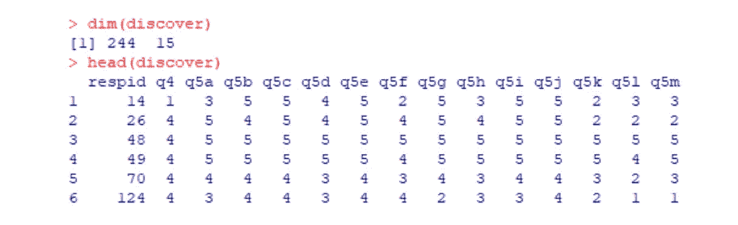

# R 中使用包装器方法的特征选择

> 原文：<https://medium.com/analytics-vidhya/feature-selection-in-r-9bfae551d22b?source=collection_archive---------11----------------------->


照片由[edu·格兰德](https://unsplash.com/@edgr?utm_source=medium&utm_medium=referral)在 [Unsplash](https://unsplash.com?utm_source=medium&utm_medium=referral) 上拍摄

**什么是特征选择？**从数据集中过滤不相关或冗余特征的过程。通过这样做，我们可以降低模型的复杂性，使其更容易解释，并且如果选择了正确的子集，还可以提高准确性。

在本文中，我将首先通过使用 r 来演示使用包装器方法的特性选择。

```
cardData = read.csv(“Discover_step.csv”, head=TRUE)
dim(cardData)
head(cardData)
```



在这个 244 x 15 的数据集中，第二列“q4”是我们的因变量，表示总体满意度，其他是从调查中挑选出来的问题。(您可以在下面找到选择的调查问题)

然后我们检查是否有共线性。有共线性是指多元回归的多个自变量高度相关时。这给解释可能有偏差的系数估计带来了困难。

```
library(psych)
IVs <- as.matrix(cardData[,3:15])
corr.test(IVs)
```


有阴影的单元格是大于 0.6 的值，这意味着它们有很强的相关性。我们仍然不确定这是否真的会影响结果，所以让我们运行线性回归来检查一下。

```
model <- lm(q4~., data=cardData[,-1]) #remove 1st column “id”
summary(model)
```


事实上，我们可以从结果中看到，只有少数自变量是显著的(p <0.05). Proves that the collinearity and overfitting problem is in this model. Hence, we do the variable selection to pick the key factors. There are three ways to use:

# **前向选择**

从方程中没有独立变量开始，成功地一次增加一个变量，直到没有剩余变量做出显著贡献。

```
library(MASS)
step_for <- stepAIC(model, direction=”forward”)
summary(step_for)
```


前向选择似乎不足以适用于这种情况。我们可以看到结果与原来的没有什么不同，存在的问题仍然存在。

# 反向选择

从模型中所有潜在的独立变量开始，在每次迭代中删除最不重要的变量，直到进一步的决策弊大于利。

```
step_back <- stepAIC(model, direction="backward")
summary(step_back)
```


经过选择，我们得到了四个关键问题，它们是“q5f”、“q5g”、“q5h”和“q5m”。虽然 R 平方较低，但它在 BIC (BIC = 667.36)和调整后的 R 平方(调整后的 R 平方= 0.2)上给我们提供了更好的性能。

# 逐步选择

与正向选择非常相似，只是它还考虑了可能的删除(删除模型中已经变得无关紧要的变量，并用其他变量替换)。

```
step_both <- stepAIC(model, direction=”both”)
summary(step_both)
```


逐步回归是一种贪婪算法，在每一轮添加最佳特征或删除最差特征。如此往复通常有助于我们选择更合适的变量，因此，它成为传统回归分析中最流行的特征选择形式。

在接下来的几篇文章中，我将展示其他有用的方法:特征提取中的因子分析和主成分分析。

> **选择的调查问题**


# 关于我

嗨，我是 Kelly，一名具有新闻和传播背景的商业分析研究生，喜欢分享探索数据和有趣发现的生活。如果您有任何问题，请随时联系我，电话:[k*elly.szutu@gmail.com*](mailto:kelly.szutu@gmail.com)