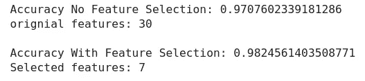

# 数据科学的特征选择方法(仅几个)

> 原文：<https://medium.com/analytics-vidhya/feature-selection-methods-for-data-science-just-a-few-fca3086eb445?source=collection_archive---------2----------------------->


## 为什么特性选择很重要

在我们开始之前，让我们看看为什么特性选择应该是你的模型的一部分。特征选择有两个主要原因。首先，更简单的模型(通常)更好。它们更容易理解和扩展，并且从长远来看运行起来更便宜。通过选择要素来减少要素的数量，您就能够识别出模型在减小整个数据集的同时需要良好运行的重要要素。第二，您可能会使用太多的特征导致过度拟合，这意味着您的模型在训练数据集上学习得很好，但在以前没有见过的新数据上表现不佳。

一些基本的特征选择方法可以使用简单的皮尔逊相关或卡方方法，但出于本文的目的，我们将重点关注其他一些方法。

# 方法

## 1.[递归特征消除](https://scikit-learn.org/stable/modules/generated/sklearn.feature_selection.RFE.html) (RFE)

RFE 的目标是“通过递归地考虑越来越小的特征集来选择特征”本质上，这种方法根据原始数量的特征训练模型，并赋予每个特征一个重要性。最不重要的特征被剔除，然后对指定数量的特征重复该过程。请参见图 1，了解 RFE 是如何工作的。


图 1:递归特征消除方法

## 例子

我们将查看一个简单模型的 sklearn 乳腺癌数据集。我的完整代码可以在我的 GitHub 上通过点击[这里](https://github.com/svideloc/Feature-Selection-Blog)找到，但是为了这篇博客，我将只展示部分代码。

让我们看看没有递归特征选择的逻辑回归的代码。

```
#No Feature Selection
lr = LogisticRegression(class_weight = 'balanced', solver = 'lbfgs', random_state=42, n_jobs=-1, max_iter=500)lr.fit(X_train, y_train)
y_guess = lr.predict(X_train)
y_score = lr.predict(X_test)
```

现在让我们看看 RFE 的情况:

```
from sklearn.feature_selection import RFE
rfe = RFE(lr, n_features_to_select=7)
rfe.fit(X_train, y_train)
y_guess = rfe.predict(X_train)
y_score = rfe.predict(X_test)
```

让我们看看这些的结果:



原始模型与 RFE 选定特征模型

从这里你可以看到，我们实际上在 RFE 版本中得分更高，可能是因为在数据中丢弃了一些噪声。此外，RFE 模型仅使用了 7 个特征，这比原始模型更有效。

**好处**

这种方法对于大多数线性类型的模型来说应该工作得很好，并且运行起来相对较快，这是一个额外的好处。RFE 的计算复杂度也比我们将看到的下一个特征选择方法要低。

**弊端**

请注意参数' n_reatures_to_select 'RFE 不是最聪明的特征选择方法，所以你需要告诉模型你想要选择多少特征。它将运行其消除，直到它使用您指定的功能数量。这意味着你必须调整这个数字一点，看看功能的甜蜜点在哪里，这就是我如何得到 7 个功能。您还可以为此编写一个 for 循环来尝试不同数量的特性！

如果你不指定一些功能，RFE 将删除一半的功能。这可能会有问题，因为您可能会删除太多或不够的功能。这就是为什么您必须谨慎选择参数的原因。

## 2.[顺序特征选择器](http://rasbt.github.io/mlxtend/user_guide/feature_selection/SequentialFeatureSelector/) (SFS)

来自文档:SFA 的“基于分类器性能，一次删除或添加一个特征，直到达到所需大小的特征子集 *k* ，k 是小于原始维度特征空间的特征数量，d。在下面的图 2 中，模型首先将每个特征作为自己的模型运行，然后选择特征 2 作为最佳特征。然后，它将功能 2 与其他功能配对，并确定功能 2 和功能 3 的性能最佳。它将它们分组并再次添加每个特征，并发现 2、3 和 1 具有最佳模型。它将以这种方式不断迭代。


图 2:顺序特征选择方法

## 例子

再一次，让我们看同一个例子，但是这次我们将使用顺序特征选择。

```
# Sequential Feature Selection
from mlxtend.feature_selection import SequentialFeatureSelector
sfs = SequentialFeatureSelector(lr, k_features='best', forward = False, n_jobs=-1)sfs.fit(X_train, y_train)features = list(sfs.k_feature_names_)
lr.fit(X_train[features], y_train)
y_score = lr.predict(X_test[features])
```

让我们来看看这个方法的结果:


原始模型与 SFS 选定功能模型

好了，我们排除了 7 个特征，用 SFS 得到了一个稍微差一点的分数。然而，我不需要像在 RFE 那样手动尝试和优化功能的数量，所以我们现在有了一个更具可扩展性的模型。

**好处**

SFS 的运行时间比 RFE 稍长，但易于管理。主要的好处是，这种方法可以自行选择，比 RFE 更智能。如果你懒，SFS 比 RFE 做得多一点思考。

**弊端**

用户对这种方法的控制有点少，可能倾向于不选择绝对最佳的特性组合，正如我们在上面的例子中看到的那样。尽管如此，它仍然会很好地减少你的数据集的维数。

## 2.[详尽的特征选择器](http://rasbt.github.io/mlxtend/user_guide/feature_selection/ExhaustiveFeatureSelector/) (EFS)

详尽的特征选择将是这篇博客中所涉及的三种方法中最健壮的。这是对每个功能子集的强力评估，意味着它会尝试所有可能的功能组合，并选择性能最佳的模型。在图 3 中，我们有四个特性。然后，EFS 使用这些特性尝试每一种可能的组合，在图表中发现特性 1、3 和 4 具有最佳模型。


图 3:详尽的特性选择方法

**好处**

如果你有计算能力，你一定会优化你的功能选择使用详尽的功能选择。然而，由于运行时间的原因，我还没有在实践中使用这种方法。如果您使用一种更简单的要素选择方法来减少要素，然后在数据集中的要素少得多时尝试这种方法，这可能也很有用。

**弊端**

如前所述，EFS 将需要大量的计算能力。对于一个只有四个特征的模型，这个方法需要模型运行 15 次，如图 3 所示。随着功能数量的增加，这将会变成数量极大的模型。

对于我们的 30 个特征乳腺癌数据集的例子，这意味着模型将必须尝试 107，3741，823 种不同的组合(2 ⁰-1).这可能不是一个好主意！

请注意，使用此方法时，您可以指定用作参数的最大要素数，但模型仍有许多迭代要运行。

# 结论

在数据科学中，对于一个问题，从来没有放之四海而皆准的解决方案，特征选择也是如此。这篇文章中概述的方法提供了一些选项，可能有助于尝试和消除模型中过多的特征，但还有无数其他方法来尝试和减少特征。在调整模型时，结合使用多种方法也是非常合理的。