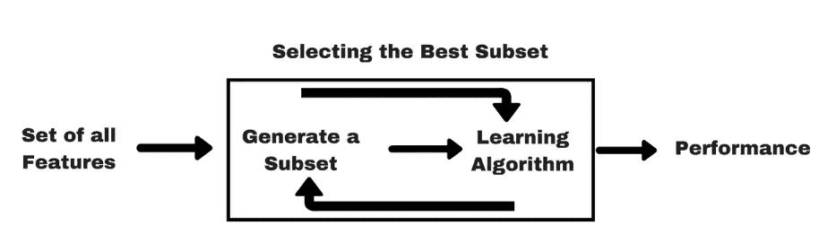

# 带有代码示例的特征选择方法

> 原文：<https://medium.com/analytics-vidhya/feature-selection-methods-with-code-examples-a78439477cd4?source=collection_archive---------2----------------------->


# 为什么选择功能？

要素选择是在数据集中查找和选择最有用的要素的过程。这是机器学习管道中至关重要的一步。我们应该关心特征选择方法的原因与我们的模型中有不必要的特征的不良影响有关:

*   过度拟合，降低测试集的泛化性能。
*   降低训练速度
*   降低模型的可解释性

# 特征选择工具的主要类型

一般来说，有三种类型的特征选择工具(虽然我不知道是谁定义的):

*   ***基于过滤:*** 过滤方法使用排序或分类算法来过滤掉那些不太有用的特征。
*   ***基于包装器:*** 包装器方法将一组特征的选择视为一个搜索问题。包装方法通常通过直接测试特性对模型性能的影响来选择特性。
*   ***嵌入式:*** 嵌入式方法使用具有内置特征选择方法的算法。例如，套索。

现在，让我们更详细地看一下每种方法。

# 1-基于过滤器的方法

过滤方法通常用作预处理步骤。


[来源](https://www.analyticsvidhya.com/blog/2016/12/introduction-to-feature-selection-methods-with-an-example-or-how-to-select-the-right-variables/)

## 1.1 —差异阈值

方差阈值移除值在不同观测值之间变化不大的要素(即其方差低于阈值)。这些功能没有什么价值。我们可以使用 sklearn 特征选择工具轻松应用这种方法。

```
from sklearn.feature_selection import VarianceThreshold
```

## **1.2 —相关阈值**

相关性阈值移除与其他要素高度相关的要素(即其值的变化与另一个要素非常相似)。这些功能提供了冗余信息。

首先，我们计算所有的成对相关性。然后，如果一对特征之间的相关性高于给定的阈值，我们将删除与其他特征具有较大平均绝对相关性的特征。

## [1.3 —单变量特征选择](https://blog.datadive.net/selecting-good-features-part-i-univariate-selection/)

单变量特征选择单独检查每个特征，以确定该特征与响应变量的关系强度。单变量选择有许多不同的选项。

*   **皮尔逊相关性**

理解特征与响应变量关系的最简单方法之一是[皮尔逊相关系数](http://en.wikipedia.org/wiki/Pearson_product-moment_correlation_coefficient)，它测量两个变量之间的线性相关性。

*   **卡方检验**


[来源](https://chrisalbon.com/machine_learning/feature_selection/chi-squared_for_feature_selection/)

在该方法中，我们计算目标和数值变量之间的卡方度量，并且仅选择具有最佳卡方值的期望数量的变量。

```
**from** **sklearn.feature_selection** **import** SelectKBest
**from** **sklearn.feature_selection** **import** chi2
chi2_selector = SelectKBest(chi2, k=**2**)
X_kbest = chi2_selector.fit_transform(X, y)
```

*   [**方差分析 F 值**](https://chrisalbon.com/machine_learning/feature_selection/anova_f-value_for_feature_selection/)

如果特征是分类的，计算每个特征和目标向量之间的卡方(χ2)统计。但是，如果特征是定量的，则计算每个特征和目标向量之间的方差分析 F 值。

当我们按目标向量对数值特征进行分组时，F 值分数检验每组的均值是否有显著差异。

```
**from** **sklearn.feature_selection** **import** SelectKBest
**from** **sklearn.feature_selection** **import** f_classif
fvalue_selector = SelectKBest(f_classif, k=**2**)
X_kbest = fvalue_selector.fit_transform(X, y)
```

*   **互信息和最大信息系数(MIC)**

相关性估计的一个更健壮的选项是[互信息](https://en.wikipedia.org/wiki/Mutual_information)，它测量变量之间的相互依赖性。

但是，由于两个原因，直接使用特性排名可能不太方便。首先，它不是一个度量，也没有归一化(即，不在固定范围内)，因此两个数据集之间的 MI 值可能是不可比的。第二，对于连续变量的计算可能是不方便的:通常变量需要通过宁滨离散化，但是互信息分数可能对箱选择相当敏感。

[最大信息系数](http://en.wikipedia.org/wiki/Maximal_information_coefficient)是为解决这些缺点而开发的技术。它搜索最优宁滨，并将互信息得分转换为位于范围[0；1].在 python 中，MIC 在 [minepy](http://minepy.sourceforge.net/) 库中可用。

# **2 —基于包装器的方法**

包装器方法基于贪婪搜索算法，因为它们评估所有可能的特征组合，并为特定的机器学习算法选择产生最佳结果的组合。这种方法的缺点是测试所有可能的特征组合在计算上非常昂贵，特别是当特征集非常大时。

很明显，这是一种计算量很大的寻找性能最佳的特征子集的方法，因为它们必须多次调用学习算法。



[来源](https://www.analyticsvidhya.com/blog/2016/12/introduction-to-feature-selection-methods-with-an-example-or-how-to-select-the-right-variables/)

## **2.1 —向前搜索**

在向前步进特征选择的第一阶段，针对每个特征评估分类器的性能。从所有特征中选择表现最佳的特征。

在第二步中，结合所有其他特征来尝试第一个特征。选择产生最佳算法性能的两个特征的组合。该过程继续进行，直到选择了指定数量的特征。

```
from sklearn.ensemble import RandomForestRegressor, RandomForestClassifier
from sklearn.metrics import roc_auc_score 
**from mlxtend.feature_selection import SequentialFeatureSelector** feature_selector = SequentialFeatureSelector(RandomForestClassifier(n_jobs=-1),
                          k_features=15, forward=True, 
                          verbose=2, scoring=’roc_auc’, cv=4)
```

## **2.2 —向后搜索**

顾名思义，后退特征选择与我们在上一节中学习的前进特征选择正好相反。在后退特征选择的第一步中，以循环方式从特征集中移除一个特征，并评估分类器的性能。

产生最佳性能的功能集将被保留。在第二步中，再次以循环方式移除一个特征，并且评估除了这两个特征之外的所有特征组合的性能。此过程将一直持续到数据集中剩余指定数量的要素。

```
from sklearn.ensemble import RandomForestRegressor, RandomForestClassifier
from sklearn.metrics import roc_auc_score 
from mlxtend.feature_selection import SequentialFeatureSelectorfeature_selector = SequentialFeatureSelector(RandomForestClassifier(n_jobs=-1),
                          k_features=15, **forward=False**, 
                          verbose=2, scoring=’roc_auc’, cv=4)
```

## **2.3 —递归特征消除**

这是一种贪婪的优化算法，旨在找到性能最佳的特征子集。它重复地创建模型，并在每次迭代中保留性能最好或最差的特性。它用剩下的特征构造下一个模型，直到所有的特征都用完。然后，它根据要素被消除的顺序对其进行排序。

```
**>>> from** **sklearn.datasets** **import** make_friedman1
**>>> from** **sklearn.feature_selection** **import** RFE
**>>> from** **sklearn.svm** **import** SVR
**>>>** X, y = make_friedman1(n_samples=50, n_features=10, random_state=0)
**>>>** estimator = SVR(kernel="linear")
**>>>** selector = RFE(estimator, 5, step=1)
**>>>** selector = selector.fit(X, y)
```

# **3 —嵌入式方法**


[来源](https://www.analyticsvidhya.com/blog/2016/12/introduction-to-feature-selection-methods-with-an-example-or-how-to-select-the-right-variables/)

嵌入式方法使用具有内置特征选择方法的算法。比如 Lasso 和 RF 都有自己的特征选择方法。套索正则化强制许多要素权重为零。

我们还可以使用 RandomForest 根据特性的重要性来选择特性。我们也可以使用 LightGBM。或者 XGBoost 对象，只要它有一个`feature_importances_`属性。

# 参考

[](https://blog.datadive.net/selecting-good-features-part-i-univariate-selection/) [## 特征选择-第一部分:单变量选择

### 对特征选择/排序有很好的理解对于数据科学家或机器学习来说是一笔巨大的财富…

blog.datadive.net](https://blog.datadive.net/selecting-good-features-part-i-univariate-selection/) [](https://www.analyticsvidhya.com/blog/2016/12/introduction-to-feature-selection-methods-with-an-example-or-how-to-select-the-right-variables/) [## 结合实例介绍特征选择方法(或者如何选择合适的变量？)

### 简介我学习机器学习的最好方法之一是用最好的数据对自己进行基准测试…

www.analyticsvidhya.com](https://www.analyticsvidhya.com/blog/2016/12/introduction-to-feature-selection-methods-with-an-example-or-how-to-select-the-right-variables/) [](https://towardsdatascience.com/the-5-feature-selection-algorithms-every-data-scientist-need-to-know-3a6b566efd2) [## 每个数据科学家都应该知道的 5 种特征选择算法

### 额外收获:是什么让一个优秀的足球运动员变得伟大？

towardsdatascience.com](https://towardsdatascience.com/the-5-feature-selection-algorithms-every-data-scientist-need-to-know-3a6b566efd2)  [## 克里斯·阿尔邦

### 我是一名数据科学家，有十年应用统计学习、人工智能和软件的经验…

chrisalbon.com](https://chrisalbon.com/)  [## 机器学习中的特征选择方法概述

### Feature Selection 是在模型构建过程中选择最相关、最有利于提高预测效果的特征子集的过程 机器学习中的特征选择（Feature Selection）也被称为 Variable Selection 或 Attribute…

jasonlian.github.io](https://jasonlian.github.io/2017/03/13/ML2-Feature-Selection/) [](https://scikit-learn.org/stable/modules/feature_selection.html) [## 1.13.功能选择-sci kit-了解 0.21.3 文档

### sklearn.feature_selection 模块中的类可用于…上的特征选择/维度缩减

scikit-learn.org](https://scikit-learn.org/stable/modules/feature_selection.html)  [## 在 Python 中应用包装器方法进行要素选择

### 在上一篇文章中，我们研究了如何使用过滤方法为机器选择特征…

stackabuse.com](https://stackabuse.com/applying-wrapper-methods-in-python-for-feature-selection/)  [## 特征工程和选择:预测模型的实用方法

### 预测建模的一个主要目标是找到一个可靠和有效的预测之间的关系。

bookdown.org](https://bookdown.org/max/FES/)