# 特征选择技术

> 原文：<https://medium.com/analytics-vidhya/feature-selection-techniques-2614b3b7efcd?source=collection_archive---------0----------------------->

卢卡斯·布拉塞克在 [Unsplash](https://unsplash.com?utm_source=medium&utm_medium=referral) 上的照片

**特征选择技术**

特征选择是机器学习的核心概念之一，它会极大地影响模型的性能。您用来训练机器学习模型的数据特征对您可以实现的性能有着巨大的影响。

**识别相关特征的问题**

我们都可能面临这样的问题:从一组数据中识别相关特征，并删除不相关或不太重要的特征，而这些特征对我们的目标变量没有太大贡献，以便实现我们模型的更高精度。

更少的属性是可取的，因为它降低了模型的复杂性，并且更简单的模型更容易理解和解释。

**特征选择可以通过多种方式完成，但大致有 3 类:**
1。过滤方法
2。包装方法
3。嵌入式方法

1.  **过滤方法**

在这种方法中，您只需过滤并提取相关要素的子集。模型是在选择特征之后构建的。这里的过滤是使用相关矩阵完成的，最常用的是使用[皮尔逊相关](https://en.wikipedia.org/wiki/Pearson_correlation_coefficient)和 VIF

**答】皮尔逊相关**

皮尔逊相关是一个介于-1 和 1 之间的数字，表示两个变量线性相关的程度。皮尔逊相关也被称为“乘积矩相关系数”(PMCC)或简称为“相关性”

皮尔逊相关性仅适用于[度量变量](https://www.spss-tutorials.com/measurement-levels/#metric-variable)

相关系数的值在-1 到 1 之间

*   越接近 0 的值意味着相关性越弱(精确的 0 意味着没有相关性)
*   越接近 1 的值意味着越强的正相关性
*   越接近-1 的值意味着越强的负相关性

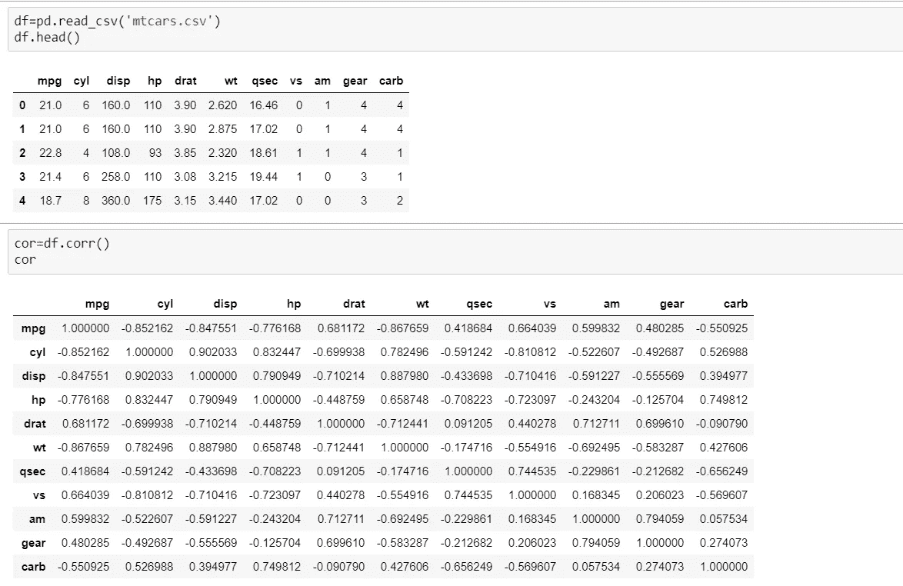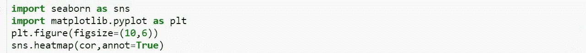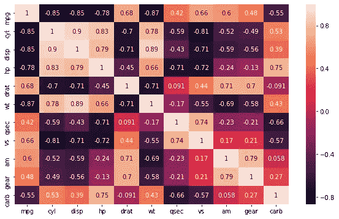

这里，我们的目标(因变量)是 mpg，从上图中，我们找出了与自变量的强相关性和弱相关性，并设置了阈值

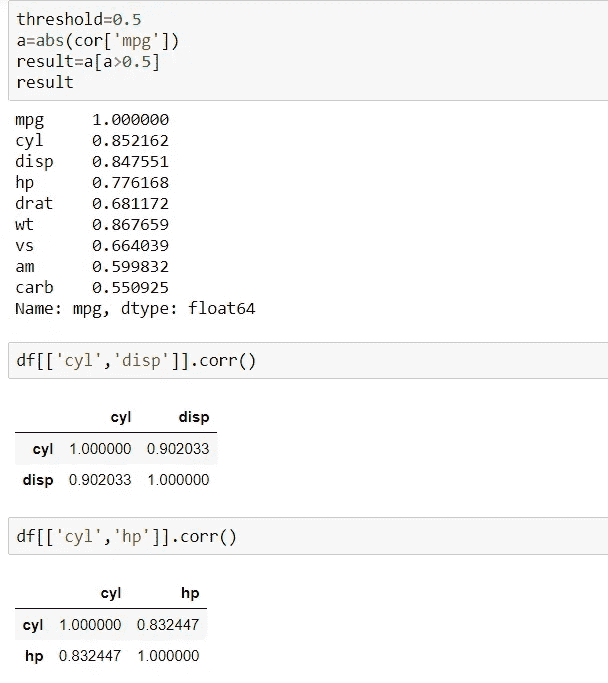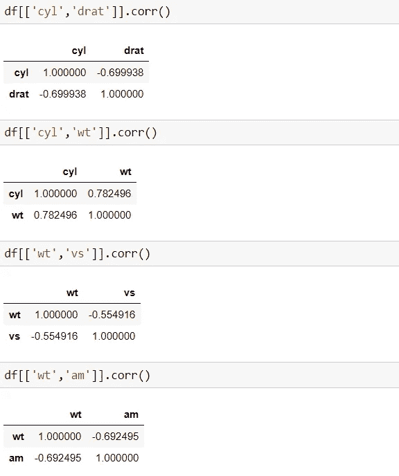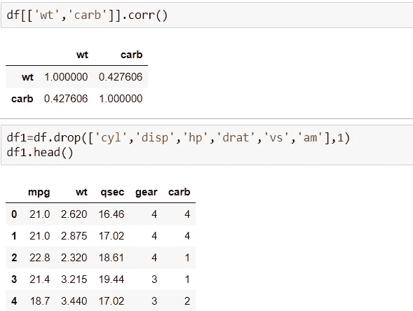

从上面的代码可以看出，变量 cyl 和 disp 彼此高度相关(0.902033)。因此，我们与目标变量进行比较，其中目标变量 mpg 与 cyl 高度相关，因此会保留和删除另一个变量。然后我们检查其他变量，直到最后一个变量，我们剩下四个特征 wt，qsec，gear，carb。这些是皮尔逊相关给出的最终特征。

**B】方差通货膨胀系数(VIF)**

共线性是指两个变量高度相关，并且包含给定数据集中有关方差的相似信息的状态。要检测变量之间的共线性，只需创建一个相关矩阵，并找到绝对值较大的变量。

**实施 VIF 的步骤**

*   计算 VIF 因子。
*   检查每个预测变量的因子，如果 VIF 在 5-10 之间，则可能存在多重共线性，您应该考虑删除该变量。

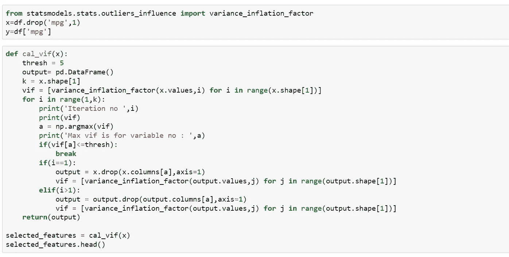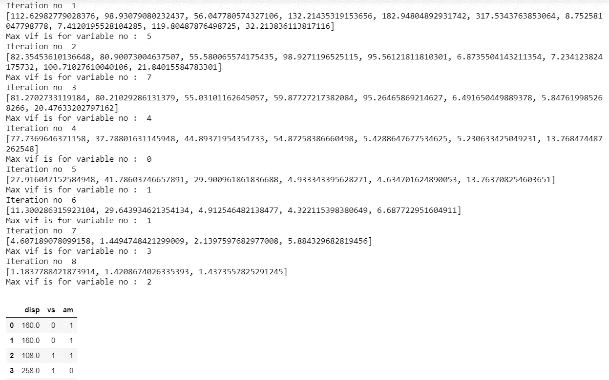

VIF 方法选择了 3 个特征 disp，vs，am。这些是 VIF 给出的最终特征。

**2。包装方法**

*   包装器方法需要一个机器学习算法，并使用其性能作为评估标准。
*   将特征馈送到所选的机器学习算法，并基于模型性能添加/移除特征。
*   这是一个迭代且计算量大的过程，但比滤波方法更精确。

**向前选择一步**

前向选择是一种迭代方法，我们从模型中没有特征开始。在每一次迭代中，我们不断地添加最能改进我们模型的特性，直到添加一个新变量不能改进模型的性能。

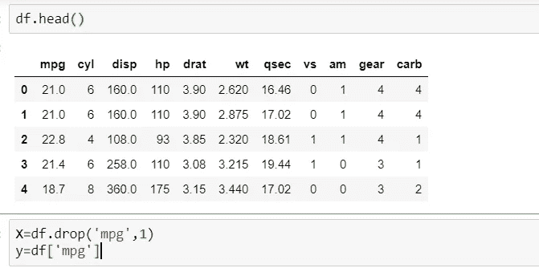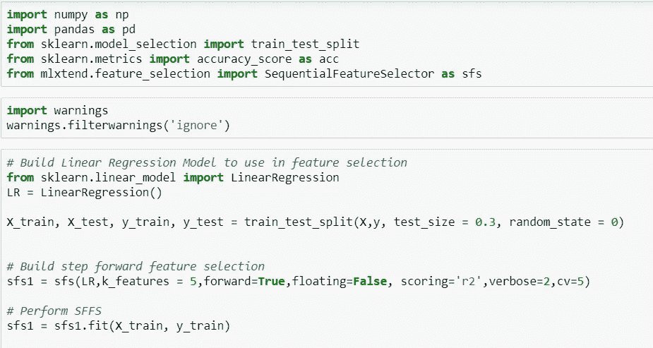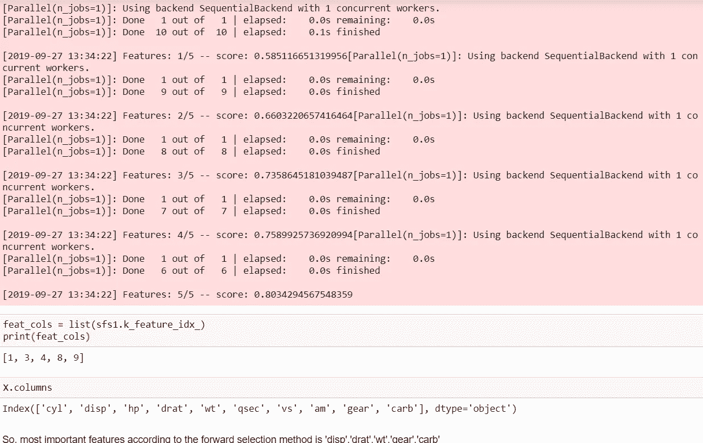

**B】落后淘汰**

在向后消除中，我们从所有特征开始，并在每次迭代中移除最不重要的特征，这提高了模型的性能。我们重复这一过程，直到在删除特征时没有观察到改进。

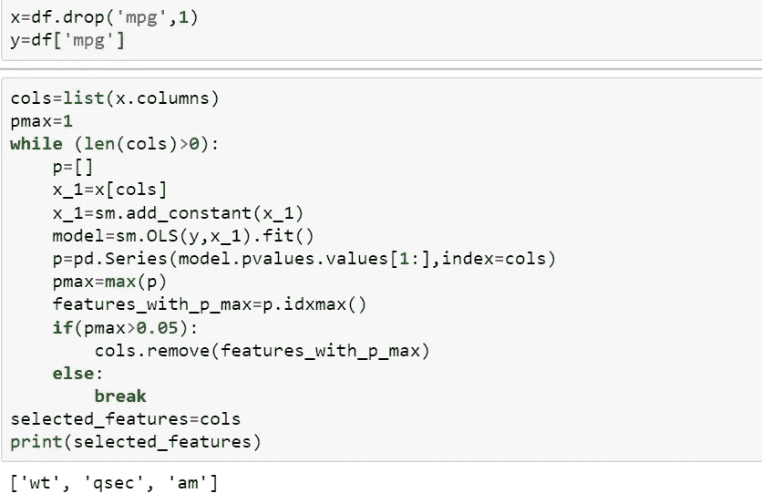

后向淘汰法选取了 3 个特征 wt，qsec，am。这些是反向消去法给出的最终特征。

**C】递归特征消除**

这是一种贪婪的优化算法，旨在找到性能最佳的特征子集。它重复地创建模型，并在每次迭代中保留性能最好或最差的特性。它用剩下的特征构造下一个模型，直到所有的特征都用完。然后，它根据要素被消除的顺序对其进行排序。

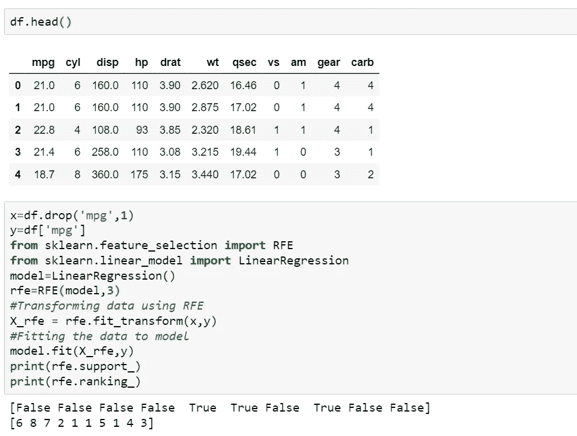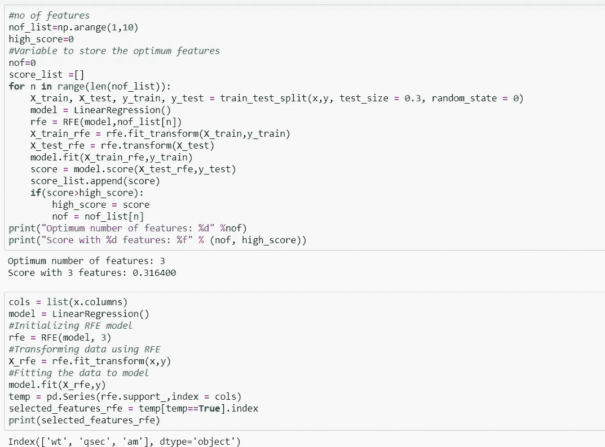

递归特征消除法选取了 3 个特征 wt，qsec，am。这些是递归特征消除给出的最终特征。

# 3.嵌入式方法

嵌入式方法在某种意义上是迭代的，它负责模型训练过程的每次迭代，并仔细提取那些对特定迭代的训练贡献最大的特征。正则化方法是最常用的嵌入式方法，其在给定系数阈值的情况下惩罚特征。这里我们将使用套索正则化进行特征选择。如果特征是不相关的，lasso 惩罚它的系数并使其为 0。因此，系数= 0 的特征被移除，其余的被采用。

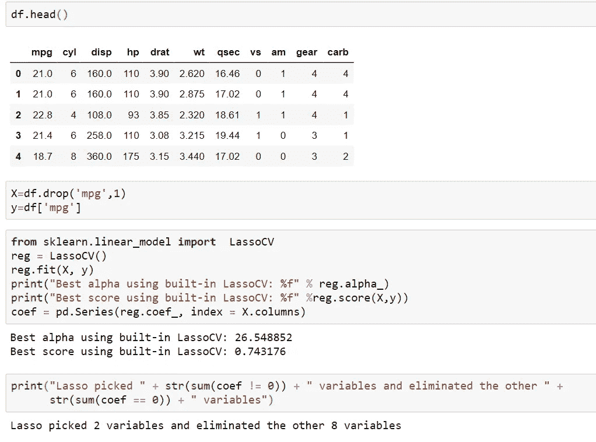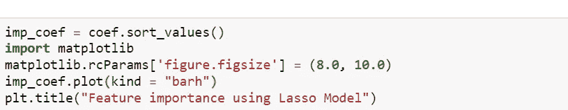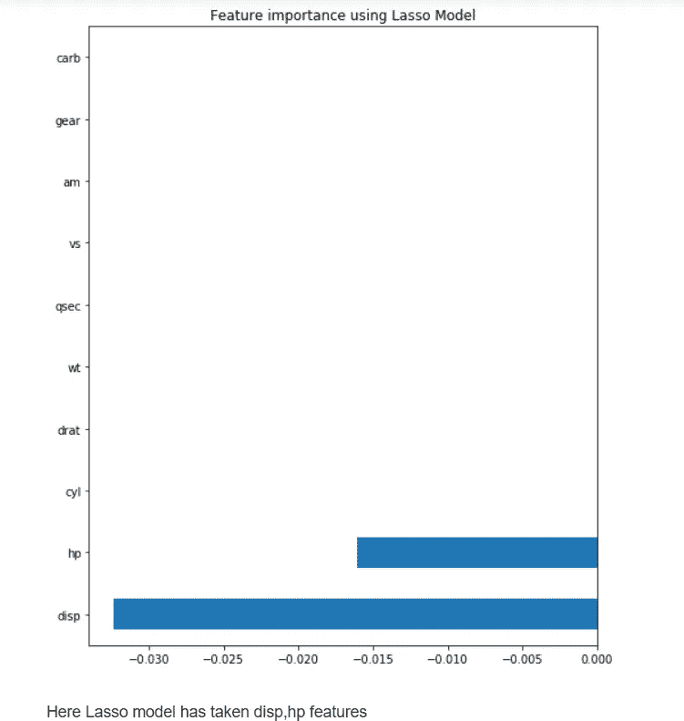

# 结论:

过滤器方法不结合机器学习模型来确定特征是好是坏，而包装器方法使用机器学习模型并训练它的特征来决定它是否重要。

与包装器方法相比，过滤器方法要快得多，因为它们不涉及训练模型。另一方面，包装器方法在计算上是昂贵的，并且在大规模数据集的情况下，包装器方法不是要考虑的最有效的特征选择方法。