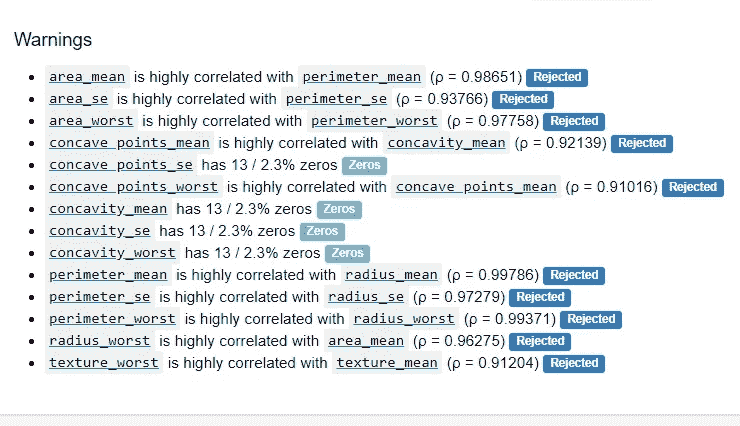
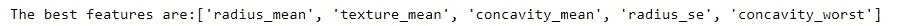
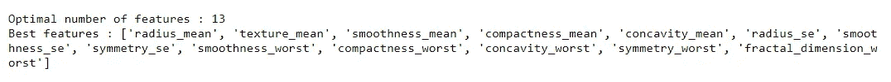
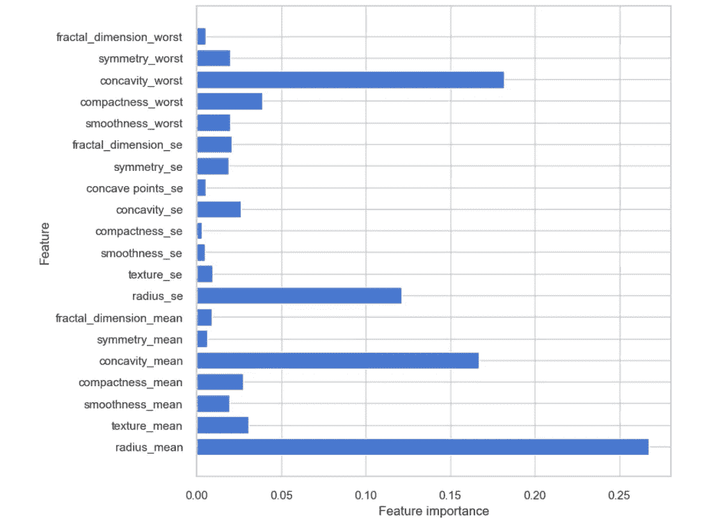

# 使用 Scikit-learn 进行功能选择

> 原文：<https://medium.com/analytics-vidhya/feature-selection-using-scikit-learn-5b4362e0c19b?source=collection_archive---------3----------------------->


詹·西奥多在 [Unsplash](https://unsplash.com?utm_source=medium&utm_medium=referral) 上的照片

特征选择是机器学习中最重要的步骤之一。它是在不丢失全部信息的情况下缩小预测建模中要使用的特征子集的过程。有时，特征选择会被误认为是降维。这两种方法都倾向于减少数据集中的要素数量，但方式不同。降维通过创建新特征作为现有特征的组合来减少特征的数量。所有的功能结合起来，创造了一些独特的功能。另一方面，特征选择的工作原理是消除不相关的特征，只保留相关的特征。

以下是特征选择的主要优点:

*   它提高了模型的性能:当你的数据中有不相关的特征时，这些特征就像噪音一样，这使得机器学习模型的性能很差。
*   它导致更快的机器学习模型。
*   它避免了过度拟合，从而增加了模型的通用性。

功能选择可以通过多种方式完成，我们将在这里看到一些 [Scikit-learn](https://scikit-learn.org/stable/modules/feature_selection.html) 功能选择方法。

**数据集**

对于这篇博客，我将使用[乳腺癌威斯康星州(诊断)数据集](https://archive.ics.uci.edu/ml/datasets/Breast+Cancer+Wisconsin+%28Diagnostic%29)。它共有 32 个特征，包括 id &响应变量(诊断)。

```
df = pd.read_csv (‘breast cancer data.csv’)
y =df['diagnosis'].map({'B':0,'M':1})# target variable
X= df.drop((['diagnosis','id']), axis=1) # features after dropping the  target (diagnosis) & ID
```

**多重共线性**

在要素选择过程中，检查多重共线性是一个非常重要的步骤。多重共线性会显著降低模型的性能。移除多重共线特征将减少特征的数量并提高模型的性能。

将数据运行到 pandas profiling 后，报告显示由于多重共线性，从要素列表中删除了 10 个要素。

```
**pandas_profiling.ProfileReport(df)**
```



熊猫概况报告——多共线特征

让我们从前面的列表中删除这些特性，然后继续下一个特性选择方法。

```
# variables rejected due to high correlation
**rejected_features= list(profile.get_rejected_variables())** 
X_drop= X.drop(rejected_features,axis=1)
X_drop.shape 
```

**1。单变量特征选择**

单变量特征选择通过使用诸如卡方检验的单变量统计测试来选择最佳特征。它单独检查每个特征，以确定该特征与响应变量的关系强度。 [**SelectKBest**](https://scikit-learn.org/stable/modules/generated/sklearn.feature_selection.SelectKBest.html#sklearn.feature_selection.SelectKBest) 是一种单变量方法，除了指定数量的最高得分特征之外，删除所有特征。

拆分数据

```
# split data train 70 % and test 30 %**from sklearn.model_selection import train_test_split**
**x_train, x_test, y_train, y_test = train_test_split(X_drop, y, test_size=0.3, random_state=42)**
```

然后运行 SelectKbest 来选择 5 个最佳特性

```
**from sklearn.feature_selection import SelectKBest, chi2**
**X_5_best= SelectKBest(chi2, k=5).fit(x_train, y_train)****mask = X_5_best.get_support()** #list of booleans for selected features
**new_feat = [] 
for bool, feature in zip(mask, x_train.columns):
 if bool:
 new_feat.append(feature)**
**print(‘The best features are:{}’.format(new_feat))** # The list of your 5 best features
```



**2。递归特征消除(RFE)**

与单变量方法不同， [**RFE**](https://scikit-learn.org/stable/modules/generated/sklearn.feature_selection.RFE.html#sklearn.feature_selection.RFE) 首先对整个特征集拟合一个模型，并计算每个预测因子的重要性分数。然后移除最弱的特征，重新拟合模型，并再次计算重要性分数，直到使用了指定数量的特征。通过模型的 coef_ 或 feature_importances_ attributes，并通过递归地消除每个循环中的少量特征，对特征重要度进行排序。

```
**from sklearn.feature_selection import RFE**
**estimator = RandomForestClassifier(random_state = 42)**
**selector = RFE(estimator, 5, step=1)**
**selector = selector.fit(x_train, y_train)****rfe_mask = selector.get_support()** #list of booleans for selected features
**new_features = []** **for bool, feature in zip(rfe_mask, x_train.columns):
 if bool:
 new_features.append(feature)
new_features** # The list of your 5 best features
```

**3。交叉验证递归特征消除(RFECV)**

RFE 要求保留指定数量的特征，但是通常事先并不知道有多少特征是有效的。为了找到最佳数量的特征，交叉验证与 RFE 一起用于对不同的特征子集进行评分，并选择最佳评分的特征集合。

```
**from sklearn.feature_selection import RFECV
cv_estimator = RandomForestClassifier(random_state =42)
X_train,X_test,Y_train,Y_test = train_test_split(X, y, test_size=0.3, random_state=42)
cv_estimator.fit(X_train, Y_train)
cv_selector = RFECV(cv_estimator,cv= 5, step=1,scoring=’accuracy’)
cv_selector = cv_selector.fit(X_train, Y_train)
rfecv_mask = cv_selector.get_support()** #list of booleans**rfecv_features = []** **for bool, feature in zip(rfecv_mask, X_train.columns):
 if bool:
 rfecv_features.append(feature)****print(‘Optimal number of features :’, cv_selector.n_features_)
print(‘Best features :’, rfecv_features)
n_features = X_train.shape[1]
plt.figure(figsize=(8,8))
plt.barh(range(n_features), cv_estimator.feature_importances_, align='center') 
plt.yticks(np.arange(n_features), X_train.columns.values) 
plt.xlabel('Feature importance')
plt.ylabel('Feature')
plt.show()**
```



最佳特征数量



最后，功能的数量减少到 13 个，我们有了这些功能的名称。下一步是使用这些特征来拟合模型并检查性能。

感谢阅读！

*参考文献:*

[*11.3 递归特征消除|特征工程和选择:预测模型的实用方法*](https://bookdown.org/max/FES/recursive-feature-elimination.html)

[*https://towards data science . com/feature-selection-techniques-in-machine-learning-with-python-f 24 e 7 da 3 f 36 e*](https://towardsdatascience.com/feature-selection-techniques-in-machine-learning-with-python-f24e7da3f36e)

[*https://medium . com/@ contact sunny/what-is-feature-selection-and-why-do-we-need-it-in-machine-learning-28a 28520607 c*](/@contactsunny/what-is-feature-selection-and-why-do-we-need-it-in-machine-learning-28a28520607c)

[https://towards data science . com/feature-selection-using-python-for-class ification-problem-b 5 f 00 a1 c 7028](https://towardsdatascience.com/feature-selection-using-python-for-classification-problem-b5f00a1c7028)