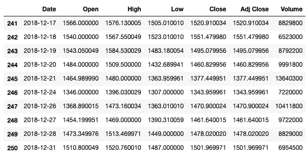
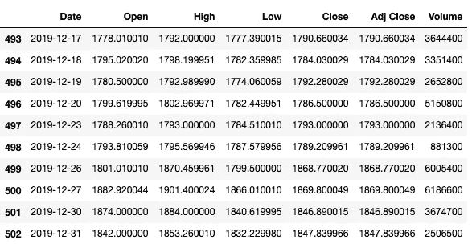
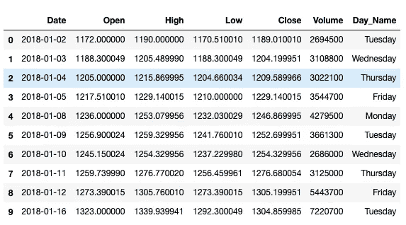

# 熊猫的特征及其功能

> 原文：<https://medium.com/analytics-vidhya/features-of-pandas-and-their-functionality-603ef1c52e74?source=collection_archive---------16----------------------->


每一个与数据科学相关的问题都是从探索性数据分析(EDA)开始的。那么 EDA 是什么？

探索性数据分析是一种数据分析方法，采用各种技术从现有数据中获取尽可能多的见解。一些洞见是检测重要变量，检测异常值等

我的 EDA 之旅主要得益于两个库(pandas 和 NumPy)以及与它们相关的特性。我们将探索 Pandas 的一些特性和功能(因为 Pandas 依赖于 NumPy 并与之互操作)

## 用一些随机值创建一个序列

```
np.random.seed(1)
X = np.random.randint(low=1, high=100, size=10)
A = pd.Series(X)
```

> ***一个数据帧是一系列*** 的集合

*   **创建带有两个标签的数据帧**

每个标签代表其系列

*   第二系列

```
np.random.seed(2)
X = np.random.randint(low=0,high=100,size=10)
B = pd.Series(X)
```

*   使用字典方法创建数据帧

```
df = pd.DataFrame({
    "A" : A,
    "B" : B
})
```

*   使用 zip 创建数据帧

```
df = pd.DataFrame(list(zip(A,B)), columns=["A","B"])
```

*   数据帧的索引值

```
df.index = [
    "Row-1","Row-2","Row-3","Row-4","Row-5",
    "Row-6","Row-7","Row-8","Row-9","Row-10"
]
```

## 查看数据框中的数据

*   数据帧的大小

```
size_of_df = df.shapeno_of_rows = df.shape[0]no_0f_columns = df.shape[1]
```

*   前 5 行

```
df.head()
```

*   最后 5 行

```
df.tail()
```

*   前 4 行

```
df.head(4)
```

*   列

```
df.columns
```

## 向数据框架添加另一列

```
np.random.seed(3)
C = np.random.randint(low = 0, high=100, size=10)
df["C"] = C
```

## 使用列标签选择数据

*   选择列 A

```
df["A"]
```

*   选择 B 列和 C 列

```
df[["B","C"]]
```

*   使用选择 B 列和 C 列。通信线路（LinesofCommunication）

```
df.loc[:,["B","C"]]
```

*   从列 B & C 中选择行 3 和行 6

```
df.loc[["Row-3","Row-6"],["B","C"]]
```

*   选择第 4 行和第 8 行之间的数据

当使用 loc 对行进行切片时，第一个值和最后一个值都包含在内。

```
df.loc["Row-5" : "Row-7"]
```

*   选择第 4 行和第 8 行之间以及 B & C 列中的数据

```
df.loc["Row-5":"Row-7","B" :"C"]
```

## 通过定位选择数据

*   选择列 A

```
df.iloc[:,0]
```

*   选择 B 列和 C 列

使用 iloc 对列进行切片时，第一个值是包含性的，最后一个值是排他性的。这里，列索引 1 是包含性的，3 是排他性的。

```
df.iloc[:,1:3]
```

*   选择第 4 行和第 8 行之间的数据

当像普通 python 列表一样使用 iloc 对行进行切片时，第一个值是包含性的，最后一个值是排他性的。这里，行索引 4 是包含性的，而 8 是排他性的。

```
df.index[4] = "Row-5"df.index[7] = "Row-8"df.iloc[4:7]
```

*   选择第 4 行和第 8 行之间以及 B & C 列中的数据

```
df.iloc[4:7,1:3]
```

## 删除

*   删除第 5 行

```
df.drop(labels=["Row-5"],axis=0)
```

*   删除 B 列

```
df.drop(columns=["B"],axis=1)
```

*   删除第 5 行和第 B 列

```
df.drop(columns=["B"], index=["Row-5"])
```

## 应用

*   创建一个返回该数字平方的函数

```
`square = lambda x: x*x
```

*   通过在序列级别应用函数来计算 A 列中所有元素的平方

```
df["A"].apply(lambda x: square(x))
```

*   通过在数据帧级别应用函数来计算 A 列中所有元素的平方

```
df.apply(lambda x: square(x["A"]), axis=1)
```

*   通过在数据帧级别应用函数来计算 B 列和 C 列中所有元素的平方

```
df.apply(lambda x: square(x[["B","C"]]), axis=1)
```

## 串联

*   创建新的数据框架

```
np.random.seed(4)
X = np.random.randint(low=1, high=100, size=(5,3))
new_df = pd.DataFrame(X, columns=["A","B","C"])
```

*   合并两个数据帧

```
df = pd.concat((df,new_df),ignore_index=True)
```

## 分组

*   向 DataFrame 添加一个新列，该列包含三个不同的值。该数据帧由 15 个元素组成

```
np.random.seed(5)
D = np.random.randint(low = 1, high=4, size=15)df["D"] = D
```

*   提取数据帧中 D 列为 1 的所有值

```
df.groupby("D").get_group(1)
```

*   提取数据帧中列 D 为 2 或 3 的所有值

```
pd.concat(
    (
        df.groupby("D").get_group(2),
        df.groupby("D").get_group(3)
    )
)
```

*   B 列中所有值的总和，其中 D 列为 2

```
df.groupby("D").get_group(2)["B"].sum()
```

*   C 列中所有值的平均值，其中 D 列为 3

```
df.groupby("D").get_group(3)["C"].mean()
```

***我们将借助亚马逊股票数据来探究这些操作***


## 这些数据包含什么？

*   该数据集包含从 2018 年 1 月 1 日到 2018 年 12 月 31 日的股票记录

```
df.shape
```

*   它包含 251 条记录

```
df.tail(10)
```



2018 年 AMZN 股票数据

## 合并数据集

*   加载 2019 年的股票数据集

```
new_df = pd.read_csv("AMZN_2019.csv")
```

*   合并两个数据集

```
df = pd.concat((df,new_df),ignore_index=True)
```

*   新数据集

```
df.tail(10)
```



亚马逊储存了 2018 年 1 月 1 日至 2019 年 12 月 31 日的数据

*   提取由不同的“关闭”和“调整关闭”值组成的记录

```
df[df['close'] != df['Adj Close'] ]
```


没有记录包含不同的“关闭”和“调整关闭”值

因为收盘值和调整收盘值相同，所以我们删除调整收盘列

```
df.drop(["Adj Close"], axis=1, inplace=True)
```

*   **提取前 10 天数据**

```
df.iloc[:10]
```

*   **提取最近 10 天的数据**

```
df.iloc[-10:]
```

*   **提取最近 10 天的记录，仅包含开盘价和收盘价**

```
df.iloc[-10:,[1,4]]
```

*   **提取收盘值大于开盘值的最后 10 条记录**

```
df[df["Close"] > df["Open"]].iloc[-10:]
```

## **创建一个新列，其中包含与日期**相对应的日名称

*   创建一个函数，将普通日期转换为日期名称。

```
sample_date = '2020-01-31'
```

*   创建***convert _ date _ to _ day _ name(date)***函数，以 sample_date 格式的数据作为输入

```
import datetimeimport calendardef convert_date_to_day_name(date):
    year, month, day = date.split("-")
    dt_idx = datetime.date(int(year),int(month),int(day)).weekday()
    return calendar.day_name[dt_idx]
```

*   创建一个包含日名称的新列

```
df["Day_Name"] = df.apply(
    lambda x:convert_date_to_day_name(x["Date"]),
    axis=1
)
```

## **更新后的数据集**

```
df.head(10)
```



*   **提取星期一的所有记录**

```
df.groupby("Day_Name").get_group("Monday")
```

*   **提取周一最低价值的股票**

```
monday_df = df.groupby("Day_Name").get_group("Monday")
monday_df["Low"].min()
```

*   **提取周二最高值的股票**

```
tuesday_df = df.groupby("Day_Name").get_group("Tuesday")
tuesday_df["High"].max()
```

*   **提取以盈利结束的周五的数量**
*   星期五的所有记录

```
friday_df = df.groupby("Day_Name").get_group("Friday")
```

*   周四的所有记录

```
thursday_df = df.groupby("Day_Name").get_group("Thursday")
```

*   创建一个将日期从字符串类型更改为日期时间类型的函数

```
def convert_into_datetime_format(date):
    year,month,day = date.split("-")
    return datetime.datetime(int(year),int(month),int(day))
```

*   在所有星期四记录上迭代所有星期五记录

使用***convert _ into _ datetime _ format***函数检查星期五的日期和星期四的日期之间的差异。如果是 1 天，则考虑周五和周四的记录，以便进一步处理

```
def day_difference(x,y):
    x = convert_into_datetime_format(x)
    y = convert_into_datetime_format(y)
    return (x-y).days
```

计算星期五收盘价和星期四收盘价之间的差值

```
result = []
for f in friday_df.values:
    for t in thursday_df.values:
        condition = day_difference(f[0],t[0])
        if(condition == 1):
            result.append(f[4]-t[4])
```

以盈利结束意味着收盘价高于前一天的收盘价

```
import numpy as npresult = np.array(result)
(result > 0).sum()
```

## 结论

这是对熊猫不同操作员及其功能的简要介绍。我们还简要地研究了其他库，如 DateTime 和 calendar。 ***您将在***[***GitHub***](https://github.com/ambatiashok60/Medium/blob/master/Features%20of%20Pandas%20and%20their%20Functionality/Features%20of%20Pandas.ipynb)找到与我们的讨论相关的完整代码和数据文件