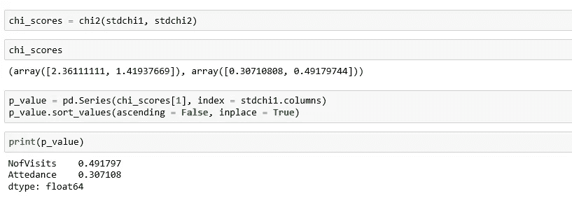

# 机器学习建模中的特征选择。

> 原文：<https://medium.com/analytics-vidhya/features-selection-in-machine-learning-model-building-f938de5e4e68?source=collection_archive---------9----------------------->

## 使用 python 进行卡方检验。

图片由图书馆 Raghu Bayya 提供

特征选择是机器学习主题中的一个重要概念，因为使用它可以提高模型的性能，还可以减少输入变量的数量。不相关的特征会对机器学习模型的性能产生负面影响。在训练模型之前执行特征选择。

通过执行特征选择，它将找出与模型训练相关的特征，这些特征最适合我们的模型，可以更好地执行，减少训练时间并提高性能。

从上一篇文章[第 2 部分](/@bayyaraghu08/machine-learning-algorithm-for-student-grade-prediction-and-visualization-using-decision-tree-7bfeb10c2ee8)中，我们使用学生数据集来寻找可以用来训练我们的模型的特征。

> **什么是卡方检验**

在了解什么是卡方检验之前，术语你应该记住。

1.  陈述假设(零假设和替代假设)。
2.  统计显著性。
3.  列联表。
4.  显著性水平。
5.  自信的程度。
6.  自由度。
7.  p 值。
8.  临界值。
9.  阿尔法值。

> ***分析篇论及，你所知道的。统计学处理你没有处理的东西。***

卡方统计是一种测试，用于衡量期望值与实际观察数据的对比情况。并且用于确定在一个或多个类别中预期频率和观察频率之间是否存在显著差异。

为了进行假设检验，通常使用卡方检验。**假设是我们要检验的一个前提或主张**或一个**为支持证据开始(得出)进一步分析而做出的事实和证据解释。使用假设检验我们检查赫尔假设 H0 和替代假设 H1。**

现在，我们使用学生数据集来寻找用于训练模型的特征(也称为变量或属性选择)，这里我们使用该特征选择变量来预测学生成绩，以获得准确的结果。

> **导入包并加载数据集。并为卡方分析准备数据。**

来源:Jupyter 笔记本

为了进行卡方检验分析，所有特征或变量应组织到 [**列联表**](http://mathworld.wolfram.com/ContingencyTable.html) 中。从上图中，我们需要将*咨询*转换为分类值。

来源:Jupyter 笔记本

来源:Jupyter 笔记本

对于任何统计分析，使用数值都很重要，使用 [**标签编码器**](https://scikit-learn.org/stable/modules/generated/sklearn.preprocessing.LabelEncoder.html) 将分类值转换为数值。

来源:Jupyter 笔记本

> **卡方检验统计**

[*从 sklearn.feature_selection 导入 chi2*](https://scikit-learn.org/stable/modules/generated/sklearn.feature_selection.chi2.html)

来源:Jupyter 笔记本

> **P 值**(概率值)

来源:Jupyter 笔记本

用于模型训练可视化特征选择变量。

来源:Jupyter 笔记本

从上图可以看出，**就诊次数**的 P 值最高，图中说明**就诊次数**与**出勤率**无关，不能考虑用于模型训练。

来源:-关于 GitHub 的更多信息

 [## bayyaraghu/用例

### 此时您不能执行该操作。您已使用另一个标签页或窗口登录。您已在另一个选项卡中注销，或者…

github.com](https://github.com/bayyaraghu/Usecase/blob/master/Untitled4.ipynb) 

**关于作者** : Raghu Bayya，数据科学家 ML/Deep Learning。

大数据专家