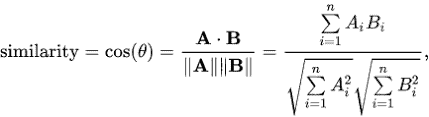

# 文本数据的特征

> 原文：<https://medium.com/analytics-vidhya/featurization-of-text-data-bow-tf-idf-avgw2v-tfidf-weighted-w2v-7a6c62e8b097?source=collection_archive---------2----------------------->

## BOW，TF-IDF，Word2Vec，TF-IDF 加权 Word2Vec

## 1 —一袋单词

它首先构建一个包含文本中所有单词的字典。它由文本中所有独特的单词组成。它将 word 表示为一个稀疏矩阵。

对于每个文档(行)，查找唯一的单词，其中每个单词是一个不同的维度。每个单元格由单词在相应行中出现的次数组成。

*d* 将非常大，其中大部分单元格的值为零。这就是形成稀疏矩阵的原因。

如果两个向量非常相似，那么它们会非常接近。

所以两个向量之间的长度是 d=|(Term1-Term2)|范数等于 d 的平方根。

代码:

**缺点:**

BOW 不考虑语义。《出埃及记》美味和可口有着相同的含义，但弓认为是分开的。

## 二元、三元和多元

[http://sci kit-learn . org/stable/modules/generated/sk learn . feature _ extraction . text . count vectorizer . html](http://scikit-learn.org/stable/modules/generated/sklearn.feature_extraction.text.CountVectorizer.html)

在构建 n 元语法之前，应该避免删除像“not”这样的停用词。它将单词表示为密集向量。

**ngram _ range**:*tuple(min _ n，max_n)*

要提取的不同 n 元文法的 n 值范围的下限和上限。使 min_n <= n <= max_n will be used.

# TF-IDF (term frequency-inverse document frequency)

TF- the number of times the word *t* 出现在文档 *d* 中的所有 n 值除以文档 *d* 中的总字数。换句话说，就是在文档 d 中找到一个单词的概率。

如果一个单词出现在更多的文档中，则 IDF 减少。单元值是 TF * IDF 的乘积。文档中的生僻词更重要，如果某个词在文档/评论中出现频率较高，则更重要。

代码:

tf-idf 矢量化的密集输出。[https://stack overflow . com/questions/48429367/appending-2-dimensional-list-dense-output-of-tfi df-result-into-pandas-data fram](https://stackoverflow.com/questions/48429367/appending-2-dimensional-list-dense-output-of-tfidf-result-into-pandas-datafram)

**缺点::**

仍然不理解单词的意思。

# word 2 矢量

Word2vec 基本上以这样的方式将单词放置在特征空间中，即它们的位置由其含义决定，即具有相似含义的单词被聚集在一起，并且两个单词之间的距离也具有相同的含义。

**余弦相似度**

让我们首先了解什么是余弦相似度，因为 word2vec 使用余弦相似度来找出最相似的单词。余弦相似性不仅可以判断两个向量之间的相似性，还可以检验向量的正交性。余弦相似度由公式表示:

如果角度接近于零，那么我们可以说向量彼此非常相似，如果θ为 90 度，那么我们可以说向量彼此正交(正交向量彼此不相关)，如果θ为 180 度，那么我们可以说两个向量彼此相反。

#[http://ka vita-gan esan . com/gensim-word 2 vec-tutorial-starter-code/# . xxpersgza 01](http://kavita-ganesan.com/gensim-word2vec-tutorial-starter-code/#.XXpERSgza01)

***案例 1:想训练自己的 W2V***

#[http://ka vita-gan esan . com/gensim-word 2 vec-tutorial-starter-code/# . w17 srfazzpy](http://kavita-ganesan.com/gensim-word2vec-tutorial-starter-code/#.W17SRFAzZPY)
你可以对这个整个单元格进行注释，也可以根据需要更改这些变量。

***Case2::想在 google news 上训练 Google w2v train***

#在这个项目中，我们使用 google 的预训练模型
#它的 3.3G 文件，一旦你将它加载到你的内存中
#它占用大约 9Gb，所以请只在你有> 12G 的 ram
时才执行这个步骤#我们将提供一个 pickle 文件，它包含一个 dict，
#它包含我们所有的 courpus 单词作为键，model[word]作为值
#要使用这个代码片段，请下载" GoogleNews-vectors-negative 300 . bin

要检查单词出现的次数:

## 平均单词 2 矢量

我们需要给出大型文本语料库，其中每个单词都有一个向量。它试图从原始文本中自动学习向量之间的关系。向量的维数越大，它的信息量就越大。

属性:

1.  如果字 w1 和 w2 相似，则向量 v1 和 v2 会更接近。
2.  自动学习单词/矢量之间的关系。

我们正在观察男女关系图，我们观察到男人和女人之间的距离与国王(男人)和王后(女人)之间的距离相同，不仅性别不同，而且如果我们观察同性，我们观察到王后和女人之间的距离与国王和男人之间的距离相同(国王和男人，王后和女人代表同性比较，因此它们必须是相等的距离)

**如何把每个文档转换成矢量？**

假设在一个文档(行)中有 w1，w2，…wn 单词。以便转换成矢量。

每个单词都有一个向量，我们将平均 word2vec 转换为除以文档中的单词数。

代码:

# TFIDF 加权 Word2Vec

在这个方法中，我们首先计算每个单词的 tfidf 值。然后按照与上一节相同的方法，将 tfidf 值乘以相应的字，然后将总和除以 tfidf 值总和。

代码:

# TF-IDF 加权 Word2Vec

=======================================

在给定链接的[Amazon _ Fine _ Food _ Reviews _ analysis . ipynb](https://github.com/ranasingh-gkp/Applied_AI_O/blob/master/Assignments_AFR_2018/Amazon_Fine_Food_Reviews_Analysis.ipynb)笔记本中找到代码。[https://github . com/Rana Singh-gkp/Applied _ AI _ O/tree/master/Assignments _ AFR _ 2018](https://github.com/ranasingh-gkp/Applied_AI_O/tree/master/Assignments_AFR_2018)

=====================================

## 参考:

1.  谷歌图片
2.  应用人工智能
3.  Kaggle.com/amazon 食品评论