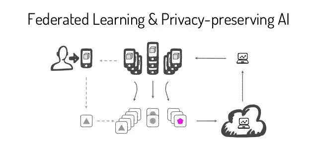
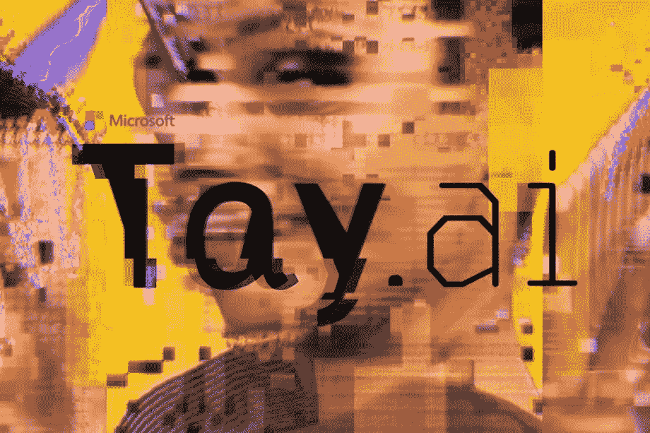
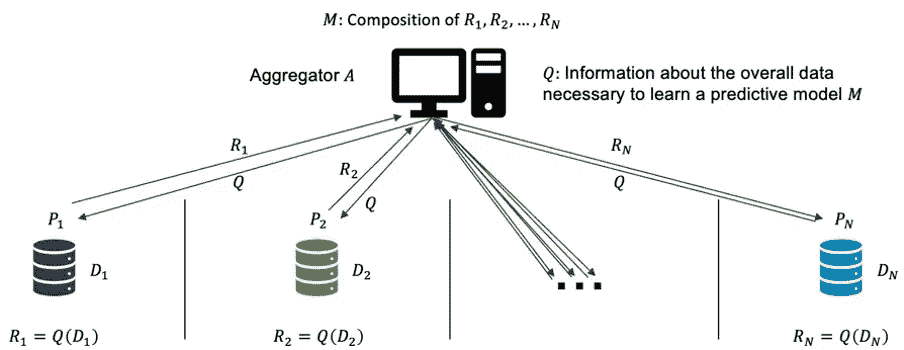
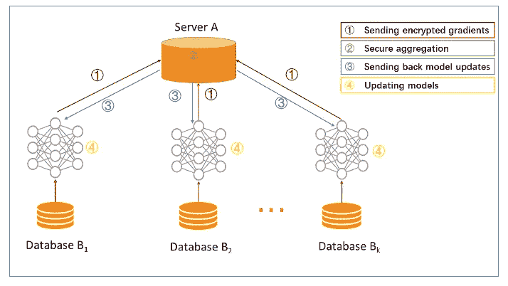
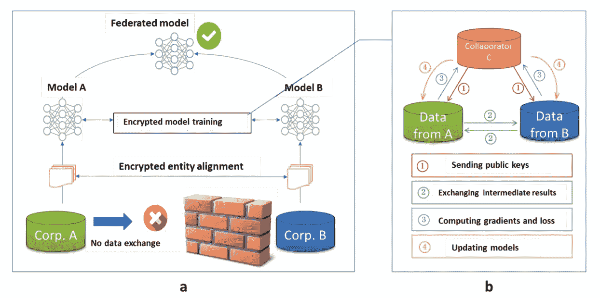
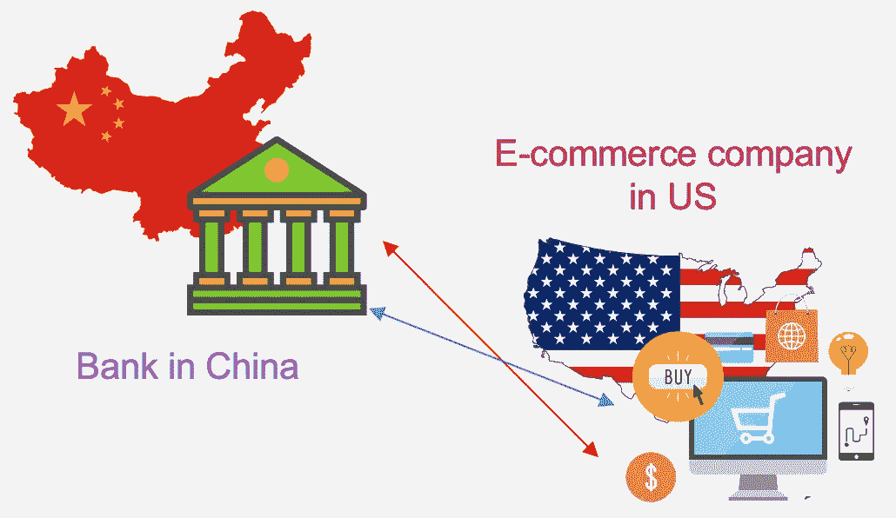
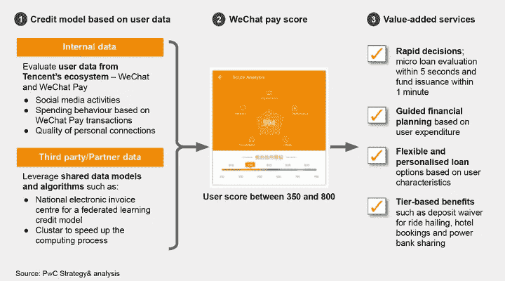

# 联邦学习:介绍与应用

> 原文：<https://medium.com/analytics-vidhya/federated-leaning-concept-and-application-e123589b1097?source=collection_archive---------18----------------------->

## 分散数据上的机器学习

# **当今人工智能建模的问题**

人工智能模型目前还不完善，要建立一个满足公司需求的综合模型有几个困难:

1.  数据质量不佳
2.  缺少标记数据
3.  数据和信息孤岛
4.  数据保密

要克服以上问题，建立一个真正有帮助的模型，并不容易。有几个关于最大的技术公司在建立人工智能模型方面失败的新闻，例如[微软的 Twitter 人工智能聊天机器人 Tay](https://www.theverge.com/2016/3/24/11297050/tay-microsoft-chatbot-racist),[IBM Watson on Health Care](https://spectrum.ieee.org/biomedical/diagnostics/how-ibm-watson-overpromised-and-underdelivered-on-ai-health-care)。

推特不到一天就把微软的 AI 聊天机器人教成了种族主义混蛋

# **什么是联合学习？**

那么，联合学习实际上能有什么帮助呢？首先，让我们理解联邦学习的概念。

联邦学习的基本架构

联合学习允许不同的公司在不暴露数据隐私的情况下一起构建模型。这是一种新的做法，数据科学家可以通过共享模型参数而不是原始数据，在本地数据上训练模型，从而克服隐私要求。

根据 GDPR 和世界各地的数据隐私政策，数据不容易在不同方之间交换。联合学习使用多种加密和安全方法来确保联盟中的参与者可以在不暴露任何客户信息的情况下建立和改进人工智能模型。

# 联邦学习的分类

1.  **横向联邦学习**

考虑数据集共享相同特征但样本不同的场景。

例如，2 个区域银行可能具有来自其各自区域的非常不同的用户群，并且其用户的交集非常小。然而，他们的业务非常相似。在这种情况下，我们使用水平联合学习。这也是做外语最常见的方法。

水平联合学习

**2。垂直联合学习**

这次有 2 个数据集共享相同的样本 ID 空间，但在特征空间上不同。

例如:一家银行和一家电子商务公司的用户在同一个居民区。银行记录用户的收入、支出行为和信用等级。电子商务保留了用户的浏览和购买历史。
他们的特征空间差别很大。借助垂直 FL，我们可以基于用户和产品信息构建产品购买预测模型。

垂直联邦学习

**3。联合迁移学习**

两个数据集不仅在样本上不同，而且在特征空间上也不同。

考虑 2 家机构:一家位于**中国**的银行和一家位于**美国**的电子商务公司。由于业务不同，双方的特征空间只有一小部分重叠。在这种情况下，可以应用联合迁移学习技术来为联合下的整个样本和特征空间提供解决方案。

该架构类似于垂直联合学习。

联合迁移学习的用例

# **激励机制**

将不同组织间的联合学习完全商业化。需要一个公平的平台和**激励机制**。模型建立后，模型的性能将在实际应用中表现出来。

表演可以被记录在永久数据记录机制(例如区块链)中。模型的有效性可能取决于数据提供商对系统的贡献，提供更多数据的公司会更好。这种方法也可以激励更多的组织加入数据联盟。

# 用例

## **谷歌**

> 最先进的机器学习，无需集中数据，默认带隐私。(谷歌)

联合学习最早是由 Google 提出的。Google 用这种方法改进了它的移动键盘模型——Gboard。

手机键盘的打字输入是用户最重要的隐私。谷歌使用联邦机器学习在用户的手机上训练搜索查询预测模型，而不必将单个搜索发送回谷歌。

TensorFlow Federated (TFF)是谷歌的一个开源框架，用于机器学习和其他对分散数据的计算。开发 TFF 是为了促进开放式研究和试验[联合学习(FL)](https://ai.googleblog.com/2017/04/federated-learning-collaborative.html) 。

## **腾讯—微众银行**

随着监管机构加强隐私和安全规则，中国成立的第一家数字银行微众银行正在开发联合学习人工智能模型。

他们建立了一个模型，利用了微众银行自己的数据，以及保存在发票中心服务器上的加密发票数据。为了提高信用风险模型的性能，微众银行安全地从电子发票(也称为“电子发票”)上捕获的加密数据中学习。共同开发的模型严格限于衡量小型和微型企业的信贷风险。

这些电子发票由中国的组织集中共享，以改进中小企业的 KYC 评估和信用风险测量。在与银行共享之前，来自发票中心的原始数据会被加密和聚合，然后银行可以使用这些数据作为训练变量来改进他们的模型，而数据本身仍然是加密的。

来自普华永道战略与分析

微众银行已经在全国电子发票中心**试用了上述用例的联合学习技术，并于 2019 年 4 月开发了首个信用评级联合学习模型。**

# 结论

联邦学习用新的机器学习方法翻开了人工智能之旅的一页。然而，仍然有很多缺失的部分，例如如何最小化每个算法的加密数据的准确性损失。

# 参考

1.  杨强，，，陈，童永新。[联邦机器学习:概念与应用。](https://arxiv.org/pdf/1902.04885.pdf) *ACM 智能系统与技术汇刊 10(2):1–19，2019。*
2.  [https://ai . Google blog . com/2017/04/federated-learning-collaborative . html](https://ai.googleblog.com/2017/04/federated-learning-collaborative.html)
3.  [https://www.fedai.org/](https://www.fedai.org/)
4.  [https://www.digfingroup.com/webank-clustar/](https://www.digfingroup.com/webank-clustar/)